## 1.概述

### 1.数据并行

数据并行是最常见的并行形式，因为它很简单。在数据并行训练中，数据集被分割成几个碎片，每个碎片被分配到一个设备上。这相当于**沿批次（Batch）维度对训练过程进行并行化**。每个设备将持有一个完整的模型副本，并在分配的数据集碎片上进行训练。在反向传播之后，模型的梯度将被全部减少，以便在不同设备上的模型参数能够保持同步。典型的数据并行实现：PyTorch DDP。


### 2.模型并行

在数据并行训练中，一个明显的特点是每个 GPU 持有整个模型权重的副本。这就带来了冗余问题。另一种并行模式是**模型并行，即模型被分割并分布在一个设备阵列上**。

通常有两种类型的模型并行：**张量并行**和**流水线并行**。

-   **张量并行是在一个操作中进行并行计算**，如：矩阵-矩阵乘法。
-   **流水线并行是在各层之间进行并行计算**。

因此，从另一个角度来看，张量并行可以被看作是层内并行，流水线并行可以被看作是层间并行。

#### 2.1 张量并行

张量并行训练是**将一个张量沿特定维度分成 N 块，每个设备只持有整个张量的 1/N，同时不影响计算图的正确性**。这需要额外的通信来确保结果的正确性。

以一般的矩阵乘法为例，假设我们有 `C = AB`。我们可以将B沿着列分割成 `[B0 B1 B2 ... Bn]`，每个设备持有一列。然后我们将 A 与每个设备上 B 中的每一列相乘，我们将得到 `[AB0 AB1 AB2 ... ABn] `。此刻，每个设备仍然持有一部分的结果，例如，设备(rank=0)持有 AB0。为了确保结果的正确性，我们需要收集全部的结果，并沿列维串联张量。通过这种方式，我们能够将张量分布在设备上，同时确保计算流程保持正确。


典型的张量并行实现：Megatron-LM（1D）、Colossal-AI（2D、2.5D、3D）。

#### 2.2 流水线并行

流水线并行的核心思想是，**模型按层分割成若干块，每块都交给一个设备**。

-   在前向传播过程中，每个设备将中间的激活传递给下一个阶段。
-   在后向传播过程中，每个设备将输入张量的梯度传回给前一个流水线阶段。

这允许设备同时进行计算，从而增加训练的吞吐量。


流水线并行训练的一个明显**缺点是训练设备容易出现空闲状态**（因为后一个阶段需要等待前一个阶段执行完毕），导致计算资源的浪费，加速效率没有数据并行高。

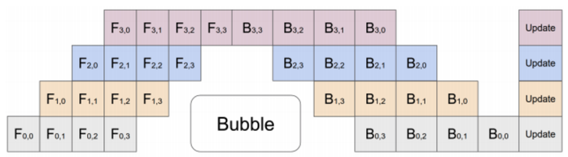

典型的流水线并行实现：GPipe、PipeDream、PipeDream-2BW、PipeDream Flush（1F1B）。

### 3.优化器相关的并行

目前随着模型越来越大，**单个GPU的显存目前通常无法装下那么大的模型了**。那么就要想办法对占显存的地方进行优化。

通常来说，模型训练的过程中，GPU上需要进行存储的参数包括了模型本身的参数、优化器状态、激活函数的输出值、梯度以及一些零时的Buffer。各种数据的占比如下图所示：


可以看到模型参数仅占模型训练过程中所有数据的一部分，当进行混合精度运算时，其中模型状态参数(优化器状态 + 梯度+ 模型参数）占到了一大半以上。因此，我们**需要想办法去除模型训练过程中的冗余数据。**

而优化器相关的并行就是一种去除冗余数据的并行方案，目前这种并行最流行的方法是 **ZeRO**（即零冗余优化器）。针对模型状态的存储优化（去除冗余），**ZeRO使用的方法是分片，即每张卡只存 1/N 的模型状态量，这样系统内只维护一份模型状态**。ZeRO有三个不同级别，对模型状态进行不同程度的分片：

-   ZeRO-1 : 对优化器状态分片（Optimizer States Sharding）
-   ZeRO-2 : 对优化器状态和梯度分片（Optimizer States & Gradients Sharding）
-   ZeRO-3 : 对优化器状态、梯度分片以及模型权重参数分片（Optimizer States & Gradients & Parameters Sharding）


### 4.异构系统并行

上述的方法中，通常需要大量的 GPU 来训练一个大型模型。然而，人们常常忽略一点，与 GPU 相比，CPU 的内存要大得多。在一个典型的服务器上，CPU 可以轻松拥有几百GB甚至上TB的内存，而每张 GPU 卡通常只有 48 或 80 GB的内存。这促使人们思考为什么 CPU 内存没有被用于分布式训练。

而最近的进展是依靠 CPU 甚至是 NVMe 磁盘来训练大型模型。主要的想法是，**在不使用张量时，将其卸载回 CPU 内存或 NVMe 磁盘**。

通过使用异构系统架构，有可能在一台机器上容纳一个巨大的模型。


### 5.多维混合并行

多维混合并行指将数据并行、模型并行和流水线并行等多种并行技术结合起来进行分布式训练。


通常，在进行超大规模模型的预训练和全参数微调时，都需要用到多维混合并行。


为了充分利用带宽，通常情况下，张量并行所需的通信量最大，而数据并行与流水线并行所需的通信量相对来说较小。因此，同一个服务器内使用张量并行，而服务器之间使用数据并行与流水线并行。


### 6.自动并行

上面提到的数据并行、张量并行、流水线并行等多维混合并行需要把模型切分到多张AI加速卡上面，如果让用户手动实现，对开发者来说难度非常大，需要考虑性能、内存、通信、训练效果等问题，要是能够将模型按算子或者按层自动切分到不同的加速卡上，可以大大的降低开发者的使用难度。因此，自动并行应运而生。

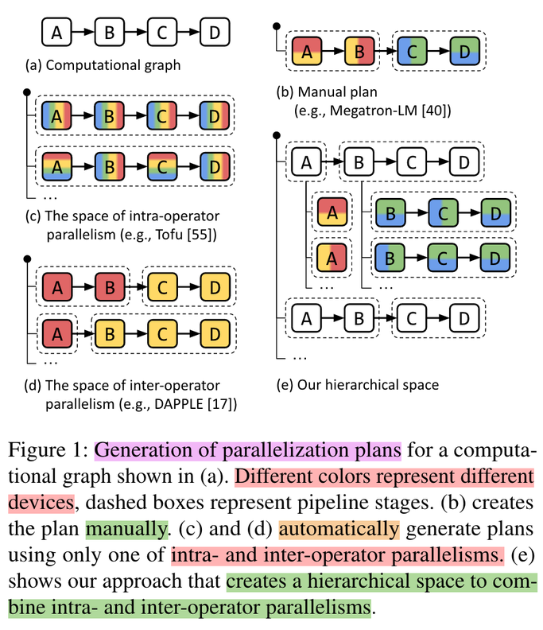

### 7.MOE并行/专家并行

通常来讲，模型规模的扩展会导致训练成本显著增加，计算资源的限制成为了大规模密集模型训练的瓶颈。为了解决这个问题，一种基于稀疏 MoE 层的深度学习模型架构被提出，即**将大模型拆分成多个小模型(专家，****`expert`****)， 每轮迭代根据样本决定激活一部分专家用于计算，达到了节省计算资源的效果**； 并引入可训练并确保稀疏性的门( `gate` )机制，以保证计算能力的优化。

使用 MoE 结构，可以在计算成本次线性增加的同时实现超大规模模型训练，为恒定的计算资源预算带来巨大增益。而 **MOE 并行，本质上也是一种模型并行方法**。下图展示了一个有六个专家网络的模型被两路专家并行地训练。其中，专家1-3被放置在第一个计算单元上，而专家4-6被放置在第二个计算单元上。


# 2.数据并行

## 1.简述

所谓数据并行，就是由于训练数据集太大；因此，**将数据集分为N份，每一份分别装载到N个GPU节点中，同时，每个GPU节点持有一个完整的模型副本**，分别基于每个GPU中的数据去进行梯度求导。然后，在GPU0上对每个GPU中的梯度进行累加，最后，再将GPU0聚合后的结果广播到其他GPU节点。

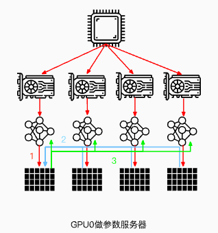

注意：这里是以GPU0作为参数服务器，除此之外，还可以使用CPU作为参数服务器。但是这种场景的训练速度通常会慢于使用GPU0作为参数服务器（通常情况下，GPU与CPU之间通信使用PCIe，而GPU与GPU之间通信使用Nvlink）。


当然，还可以将参数服务器分布在所有GPU节点上面，每个GPU只更新其中一部分梯度。


当然，数据并行不仅仅指对训练的数据并行操作，还可以对网络模型梯度、权重参数、优化器状态等数据进行并行。


下面主要以PyTorch中数据并行的发展为主线讲述现有一些数据并行方法。

## 2.数据并行（PyTorch DP）

数据并行(`torch.nn.DataParallel`)，这是Pytorch最早提供的一种数据并行方式，它基于单进程多线程进行实现的，它使用**一个进程来计算模型权重**，在每个批处理期间将数据分发到每个GPU。

DataParallel 的计算过程如下所示：

-   将 inputs 从主 GPU 分发到所有 GPU 上。
-   将 model 从主 GPU 分发到所有 GPU 上。
-   每个 GPU 分别独立进行前向传播，得到 outputs。
-   将每个 GPU 的 outputs 发回主 GPU。
-   在主 GPU 上，通过 loss function 计算出 loss，对 loss function 求导，求出损失梯度。
-   计算得到的梯度分发到所有 GPU 上。
-   反向传播计算参数梯度。
-   将所有梯度回传到主 GPU，通过梯度更新模型权重。
-   不断重复上面的过程。


它使用非常简单，仅需一行代码即可实现。

```python
net = torch.nn.DataParallel(model, device_ids=[0, 1, 2])
output = net(input_var)  # input_var can be on any device, including CPU
```

但是它的缺点也很明显：

-   **单进程多线程带来的问题**：DataParallel使用单进程多线程进行实现的，方便了信息的交换，但受困于 GIL，会带来性能开销，速度很慢。而且，只能在单台服务器（单机多卡）上使用（不支持分布式）。同时，不能使用 Apex 进行混合精度训练。
-   **效率问题，主卡性能和通信开销容易成为瓶颈，GPU 利用率通常很低**：数据集需要先拷贝到主进程，然后再分片（split）到每个设备上；权重参数只在主卡（GPU0）上更新，需要每次迭代前向所有设备做一次同步；每次迭代的网络输出需要聚集到主卡（GPU0）上。因此，通信很快成为一个瓶颈。除此之外，这将导致主卡和其他卡之间，**GPU利用率严重不均衡**（比如：主卡使用了10G显存，而其他卡只使用了2G显存，batch size稍微设置大一点主卡的显存就OOM了）。
-   **不支持模型并行**，由于其本身的局限性，没办法与模型并行组合使用。

当然，目前PyTorch官方建议使用DistributedDataParallel，而不是DataParallel类来进行多 GPU 训练，即使在单机多卡的情况下。那么下面我们来看看PyTorch DDP。

## 3.分布式数据并行 **（PyTorch DDP）**

分布式数据并行(`torch.nn.DistributedDataParallel`)，基于多进程进行实现的，每个进程都有独立的优化器，执行自己的更新过程。每个进程都执行相同的任务，并且每个进程都与所有其他进程通信。进程（GPU）之间只传递梯度，这样网络通信就不再是瓶颈。


具体流程如下：

-   首先将 rank=0 进程中的模型参数广播到进程组中的其他进程；
-   然后，每个 DDP 进程都会创建一个 **local Reducer** 来负责梯度同步。
-   在训练过程中，每个进程从磁盘加载 batch 数据，并将它们传递到其 GPU。每个 GPU 都有自己的前向过程，完成前向传播后，**梯度在各个 GPUs 间进行 All-Reduce**，每个 GPU 都收到其他 GPU 的梯度，从而可以独自进行反向传播和参数更新。
-   同时，每一层的梯度不依赖于前一层，所以**梯度的 All-Reduce 和后向过程同时计算**，以进一步缓解网络瓶颈。
-   在后向过程的最后，每个节点都得到了平均梯度，这样各个 GPU 中的模型参数保持同步 。


而**DataParallel** 是将梯度 reduce 到主卡，在主卡上更新参数，再将参数 broadcast 给其他 GPU，这样**无论是主卡的负载还是通信开销都比 DDP 大很多**)，相比于DataParallel，DistributedDataParallel方式可以更好地进行多机多卡运算，更好的进行负载均衡，运行效率也更高，虽然使用起来较为麻烦，但对于追求性能来讲是一个更好的选择。

以下为DistributedDataParallel的简单示例，使用 `torch.nn.Linear `作为本地模型，用 DDP 对其进行包装，然后在 DDP 模型上运行一次前向传播、一次反向传播和更新优化器参数步骤。 之后，本地模型上的参数将被更新，并且不同进程上的所有模型完全相同。

```python
import torch
import t dist
import torch.multiprocessing as mp
import torch.nn as nn
import torch.optim as optim
from torch.nn.parallel import DistributedDataParallel as DDP


def example(rank, world_size):
    # create default process group
    dist.init_process_group("gloo", rank=rank, world_size=world_size)
    # create local model
    model = nn.Linear(10, 10).to(rank)
    # construct DDP model
    ddp_model = DDP(model, device_ids=[rank])
    # define loss function and optimizer
    loss_fn = nn.MSELoss()
    optimizer = optim.SGD(ddp_model.parameters(), lr=0.001)

    # forward pass
    outputs = ddp_model(torch.randn(20, 10).to(rank))
    labels = torch.randn(20, 10).to(rank)
    # backward pass
    loss_fn(outputs, labels).backward()
    # update parameters
    optimizer.step()

def main():
    world_size = 2
    mp.spawn(example,
        args=(world_size,),
        nprocs=world_size,
        join=True)

if __name__=="__main__":
    # Environment variables which need to be
    # set when using c10d's default "env"
    # initialization mode.
    os.environ["MASTER_ADDR"] = "localhost"
    os.environ["MASTER_PORT"] = "29500"
    main()
```

### 3.1 DP和DDP的区别

DP 和 DDP 的主要差异有以下几点：

-   DP 是基于单进程多线程的实现，只用于单机情况，而 DDP 是多进程实现的，每个 GPU 对应一个进程，适用于单机和多机情况，真正实现分布式训练，并且因为每个进程都是独立的 Python 解释器，DDP 避免了 GIL 带来的性能开销。
-   参数更新的方式不同。DDP在各进程梯度计算完成之后，各进程需要将梯度进行汇总平均，然后再由 rank=0 的进程，将其广播到所有进程后，各进程用该梯度来独立的更新参数（而 DP是梯度汇总到 GPU0，反向传播更新参数，再广播参数给其他剩余的 GPU）。由于DDP各进程中的模型，初始参数一致 (初始时刻进行一次广播)，而每次用于更新参数的梯度也一致；因此，各进程的模型参数始终保持一致（而在DP中，全程维护一个 optimizer，对各个GPU上梯度进行求平均，而在主卡进行参数更新，之后再将模型参数广播到其他GPU）。相较于DP，DDP传输的数据量更少，训练更高效，不存在 DP 中负载不均衡的问题。目前，基本上 DP 已经被弃用。
-   DDP 支持模型并行，而 DP 并不支持，这意味如果模型太大单卡显存不足时，只能使用DDP。

### 3.2 补充说明

DP数据传输过程：

1.  前向传播得到的输出结果gather到主cuda计算loss
2.  scatter上述loss到各个cuda
3.  各个cuda反向传播计算得到梯度后gather到主cuda后，主cuda的模型参数被更新。
4.  主cuda将模型参数broadcast到其它cuda设备上，至此，完成权重参数值的同步。

综上，DP大概是有4次输出传输。

DDP数据传输过程：

1.  前向传播的输出和loss的计算都是在每个cuda独立计算的，梯度all-reduce到所有的CUDA(传输梯度)，这样初始参数相同，para.grad也相同，反向传播后参数就还是保持一致的，其他没有数据传输了。

## 4.完全分片数据并行 **(PyTorch FSDP)**

由于 PyTorch FSDP 受 DeepSpeed ZeRO 启发而获得灵感，因此，下面先简要介绍下 ZeRO。

### 4.1 补充说明：ZeRO

通常来说，在模型训练的过程中，GPU上需要进行存储的参数包括了模型本身的参数、优化器状态、激活函数的输出值、梯度以及一些零时的Buffer。各种数据的占比如下图所示：


可以看到模型参数仅占模型训练过程中所有数据的一部分，当进行混合精度运算时，其中模型状态参数(优化器状态 + 梯度+ 模型参数）占到了一大半以上。因此，我们需要想办法去除模型训练过程中的冗余数据。

针对模型状态的存储优化（去除冗余），DeepSpeed 提出了 **ZeRO**，**ZeRO 使用的方法是分片，即每张卡只存 1/N 的模型状态量，这样系统内只维护一份模型状态参数**。

ZeRO对 模型状态（Model States）参数进行不同程度的分割，主要有三个不同级别：

-   \*\*ZeRO-1 \*\*: 对优化器状态分片（Optimizer States Sharding）
-   **ZeRO-2** : 对优化器状态和梯度分片（Optimizer States & Gradients Sharding）
-   **ZeRO-3** : 对优化器状态、梯度分片以及模型权重参数分片（Optimizer States & Gradients & Parameters Sharding）


**ZeRO-1**：

ZeRO-1没有将模型本身进行分片，也**没有将Gradient进行分片，而是只将优化器进行分片**。训练过程与DDP类似。

1.  forward过程由每个rank的GPU独自完整的完成，然后进行backward过程。在backward过程中，梯度通过allReduce进行同步。
2.  Optimizer state 使用贪心策略基于参数量进行分片，以此确保每个rank几乎拥有相同大小的优化器内存。
3.  每个rank只负责更新当前优化器分片的部分，由于每个rank只有分片的优化器state，所以当前rank忽略其余的state。
4.  在更新过后，通过广播或者allGather的方式确保所有的rank都收到最新更新过后的模型参数。

ZeRO-1 **非常适合使用类似Adam进行优化的模型训练**，因为Adam拥有额外的参数m（momentum）与v（variance），特别是FP16混合精度训练。ZeRO-1 不适合使用SGD类似的优化器进行模型训练，因为SGD只有较少的参数内存，并且由于需要更新模型参数，导致额外的通讯成本。ZeRO-1只是解决了Optimizer state的冗余。

**ZeRO-2**：

相比于ZeRO-1，**ZeRO-2除了对optimizer state进行切分，还对Gradient进行了切分**。

像ZeRO-1一样将optimizer的参数进行分片，并安排在不同的rank上。在backward过程中，**gradients被reduce操作到对应的rank上，取代了all-reduce**，以此减少了通讯开销。 每个rank独自更新各自负责的参数。在更新操作之后，广播或allGather保证所有的ranks接收到更新后的参数。

**ZeRO-3**：

为了进一步节省更多的内存，**ZeRO-3提出进行模型参数的分片**。类似以上两种分片方式，ranks负责模型参数的切片。可以进行参数切片的原因主要有以下两点：

1.  All-Reduce操作可以被拆分为Reduce与allgather操作的结合。
2.  模型的每一层拥有该层的完整参数，并且整个层能够直接被一个GPU装下。所以计算前向的时候，除了当前rank需要的层之外，其余的层的参数可以抛弃。从这个层面上来说，Zero相当于数据并行+模型并行。

### 4.2 FSDP

完全分片数据并行(`torch.distributed.fsdp.FullyShardedDataParallel`)，是Pytorch最新的数据并行方案，在1.11版本引入的新特性，目的主要是用于训练大模型。我们都知道Pytorch DDP用起来简单方便，但是要求整个模型加载到一个GPU上，这使得大模型的训练需要使用额外复杂的设置进行模型分片。因此，为了打破模型分片的障碍（**包括模型参数，梯度，优化器状态**）；同时，仍然保持了数据并行的简单性，该新特性应运而生。

FSDP 是一种新型数据并行训练方法，但与传统的数据并行不同，传统的数据并行维护模型参数、梯度和优化器状态的每个 GPU 副本，而 **FSDP 将所有这些状态跨数据并行工作线程进行分片，并且可以选择将模型参数分片卸载到 CPU**。

下图显示了 FSDP 如何在 2 个数据并行进程中工作流程：


通常，模型层以嵌套方式用 FSDP 包装，因此，只有**单个 FSDP 实例**中的层需要在前向或后向计算期间将完整参数收集到**单个设备**。 计算完成后，收集到的完整参数将立即释放，释放的内存可用于下一层的计算。 通过这种方式，可以节省峰值 GPU 内存，从而可以扩展训练以使用更大的模型大小或更大的批量大小。 为了进一步最大化内存效率，当实例在计算中不活动时，FSDP 可以将参数、梯度和优化器状态卸载到 CPU。

解锁ZeRO/FSDP的关键是我们可以把DDP之中的All-Reduce操作分解为独立的 Reduce-Scatter 和 All-Gather 操作。


All-Reduce 是 Reduce-Scatter 和 All-Gather 的组合。聚合梯度的标准 All-Reduce 操作可以分解为两个单独的阶段。

-   Reduce-Scatter 阶段，在每个GPU上，会基于 rank 索引对 rank 之间相等的块进行求和。
-   All-Gather 阶段，每个GPU上的聚合梯度分片可供所有GPU使用。

通过重新整理 Reduce-Scatter 和 All-Gather，每个 DDP worker只需要存储一个参数分片和优化器状态。

在 PyTorch 中使用 FSDP 包装模型有两种方法。

-   自动包装（Auto Wrapping）是 DDP 的直接替代品；
-   手动包装（Manual Wrapping）需要对模型定义代码进行少量的更改，并且能够探索复杂的分片策略。

**自动包装（Auto Wrapping）**

模型层应以嵌套方式包装在 FSDP 中，以节省峰值内存并实现通信和计算重叠。 最简单的方法是自动包装，它可以作为 DDP 的直接替代品，而无需更改其余代码。

`fsdp_auto_wrap_policy`参数允许指定可调用函数以使用 FSDP 递归地包裹层。 PyTorch FSDP提供的`default_auto_wrap_policy`函数递归地包裹参数数量大于100M的层。当然，您也可以根据需要提供自己的包装策略。

此外，可以选择配置 `cpu_offload`，以便在计算中不使用包装参数时将这些参数卸载到 CPU。 这可以进一步提高内存效率，但代价是主机和设备之间的数据传输开销。

下面的示例展示了如何使用自动包装（Auto Wrapping）来包装 FSDP。

```python
from torch.distributed.fsdp import (
   FullyShardedDataParallel,
   CPUOffload,
)
from torch.distributed.fsdp.wrap import (
   default_auto_wrap_policy,
)
import torch.nn as nn
 
class model(nn.Module):
   def __init__(self):
       super().__init__()
       self.layer1 = nn.Linear(8, 4)
       self.layer2 = nn.Linear(4, 16)
       self.layer3 = nn.Linear(16, 4)
 
model = DistributedDataParallel(model())
fsdp_model = FullyShardedDataParallel(
   model(),
   fsdp_auto_wrap_policy=default_auto_wrap_policy,
   cpu_offload=CPUOffload(offload_params=True),
)
```

**手动包装（Manual Wrapping）**

通过有选择地对模型的某些部分应用包装，手动包装对于探索复杂的分片策略非常有用。 总体设置可以传递给enable\_wrap()上下文管理器。

```python
from torch.distributed.fsdp import (
   FullyShardedDataParallel,
   CPUOffload,
)
from torch.distributed.fsdp.wrap import (
   enable_wrap,
   wrap,
)
import torch.nn as nn
from typing import Dict
 
 
class model(nn.Module):
   def __init__(self):
       super().__init__()
       self.layer1 = wrap(nn.Linear(8, 4))
       self.layer2 = nn.Linear(4, 16)
       self.layer3 = wrap(nn.Linear(16, 4))
 
wrapper_kwargs = Dict(cpu_offload=CPUOffload(offload_params=True))
with enable_wrap(wrapper_cls=FullyShardedDataParallel, **wrapper_kwargs):
   fsdp_model = wrap(model())
```

使用上述两种方法之一，用 FSDP 包装模型后，可以采用与本地训练类似的方式训练模型，具体如下所示：

```python
optim = torch.optim.Adam(fsdp_model.parameters(), lr=0.0001)
for sample, label in next_batch():
  out = fsdp_model(input)
  loss = criterion(out, label)
  loss.backward()
  optim.step()
```

### 4.3 DDP和FSDP的区别

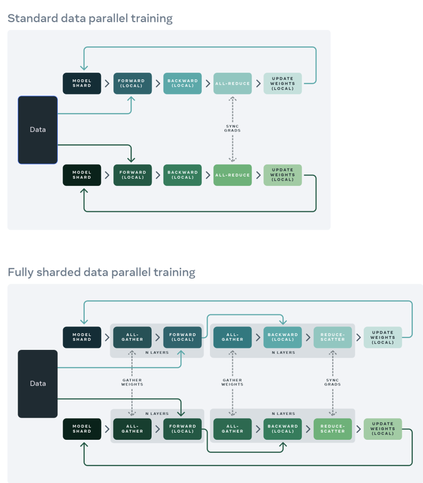

在标准的数据并行（DistributedDataParallel）训练方法中，**每个GPU上都有一个模型副本，向前和向后传递的序列只在自己的数据分片上进行运行**。在这些局部计算之后，每个局部过程的参数和优化器与其他GPU共享，以便计算全局权重更新。

而在FullyShardedDataParallel训练方法中：

-   **Model shard**：每个GPU上仅存在**模型的分片**。
-   **All-gather**：每个GPU通过all-gather从其他GPU收集所有**权重**，以在本地计算前向传播。
-   **Forward（local）**：在本地进行前向操作。前向计算和后向计算都是利用完整模型。
-   **All-gather**：然后在后向传播之前再次执行此**权重**收集。
-   **Backward（local）**：本地进行后向操作。前向计算和后向计算都是利用完整模型，此时每个GPU上也都是**全部梯度**。
-   **Reduce-Scatter**：在向后传播之后，局部**梯度**被聚合并且通过 Reduce-Scatter 在各个GPU上分片，每个分片上的梯度是聚合之后本分片对应的那部分。
-   **Update Weight（local）**：每个GPU更新其局部**权重**分片。

同时，为了最大限度地提高内存效率，我们可以在每层前向传播后丢弃全部权重，为后续层节省内存。这可以通过将 FSDP 包装应用于网络中的每一层来实现（通过设置`reshard_after_forward=True`）。

## 5.总结

本文主要讲解了大模型分布式训练并行技术的数据并行，并以Pytorch为主线讲解了DP、DDP、FSDP三种不同的数据并行方案。

DP 主要存在如下问题：

1.  单进程多线程模式，由于锁的机制导致线程间同步存在瓶颈。
2.  使用普通的All-Reduce机制，所有的卡需要将梯度同步给0号节点，并由0号节点平均梯度后反向传播，再分发给所有其他节点，意味着0号节点负载很重。
3.  由于第二点的原因，导致0号GPU通讯成本是随着GPU数量的上升而线性上升的。
4.  不支持多机多卡。

目前，由于性能问题，DP基本不用了。

而 DDP 是多进程实现的，每个 GPU 对应一个进程，适用于单机和多机情况，真正实现分布式训练，并且因为每个进程都是独立的 Python 解释器，DDP 避免了 GIL 带来的性能开销。

DDP在各进程梯度计算完成之后，各进程需要将梯度进行汇总平均，然后再由 rank=0 的进程，将其广播到所有进程后，各进程用该梯度来独立的更新参数。由于DDP各进程中的模型，初始参数一致 (初始时刻进行一次广播)，而每次用于更新参数的梯度也一致；因此，各进程的模型参数始终保持一致。相较于DP，DDP传输的数据量更少，训练更高效，不存在 DP 中负载不均衡的问题。

虽然Pytorch DDP实现了真正的分布式训练，同时，避免了DP 中负载不均衡的问题，但是，要求整个模型加载到一个GPU上，这使得大模型的训练需要使用额外复杂的设置进行模型分片。因此，为了打破模型分片的障碍（**包括模型参数，梯度，优化器状态**），同时仍然保持了数据并行的简单性，FSDP应运而生。

FSDP 是一种新型数据并行训练方法，但与传统的数据并行不同，传统的数据并行维护模型参数、梯度和优化器状态的每个 GPU 副本，而 FSDP 将所有这些状态跨数据并行工作线程进行分片，并且可以选择将模型参数分片卸载到 CPU。


# 3.流水线并行

在数据并行训练中，一个明显的特点是每个 GPU 持有整个模型权重的副本，这就带来了冗余问题，虽然，FSDP 可以缓解冗余的问题，但是对于超大规模模型来说，仅使用数据并行进行分布式训练没办法使模型的参数规模进一步提升。因此，另一种并行技术是**模型并行**，即**模型被分割并分布在一个设备阵列上，每一个设备只保存模型的一部分参数**。

模型并行分为张量并行和流水线并行，张量并行为层内并行，对模型 Transformer 层内进行分割、流水线为层间并行，对模型不同的 Transformer 层间进行分割。

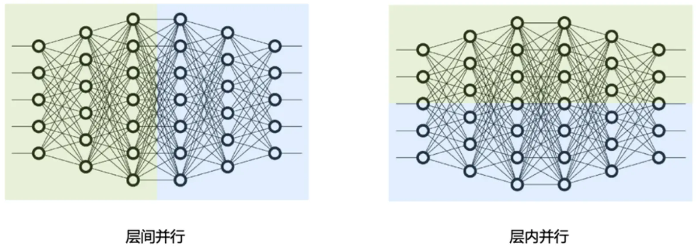

## 1.简介

所谓流水线并行，就是由于模型太大，无法将整个模型放置到单张GPU卡中；因此，将**模型的不同层放置到不同的计算设备**，降低单个计算设备的显存消耗，从而实现超大规模模型训练。
如下图所示，模型共包含四个模型层（如：Transformer层），被切分为三个部分，分别放置到三个不同的计算设备。即第 1 层放置到设备 0，第 2 层和第三 3 层放置到设备 1，第 4 层放置到设备 2。


相邻设备间通过通信链路传输数据。具体地讲，前向计算过程中，输入数据首先在设备 0 上通过第 1 层的计算得到中间结果，并将中间结果传输到设备 1，然后在设备 1 上计算得到第 2 层和第 3 层的输出，并将模型第 3 层的输出结果传输到设备 2，在设备 2 上经由最后一层的计算得到前向计算结果。反向传播过程类似。最后，各个设备上的网络层会使用反向传播过程计算得到的梯度更新参数。由于各个设备间传输的仅是相邻设备间的输出张量，而不是梯度信息，因此通信量较小。

## 2.朴素流水线并行

朴素流水线并行是实现流水线并行训练的最直接的方法。我们将模型按照层间切分成多个部分（Stage），并将每个部分（Stage）分配给一个 GPU。然后，我们对小批量数据进行常规的训练，在模型切分成多个部分的边界处进行通信。

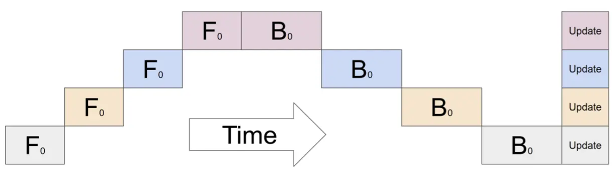

下面以 4 层顺序模型为例：

```bash
output=L4(L3(L2(L1(input))))

```

将计算分配给两个 GPU，如下所示：

-   GPU1 computes: `intermediate=L2(L1(input))`
-   GPU2 computes: `output=L4(L3(intermediate))`

为了完成前向传播，我们在 GPU1 上计算中间值并将结果张量传输到 GPU2。 然后， GPU2 计算模型的输出并开始进行反向传播。 对于反向传播，我们从 GPU2 到 GPU1 的中间发送梯度。 然后， GPU1 根据发送的梯度完成反向传播。 这样，流水线并行训练会产生与单节点训练相同的输出和梯度。 朴素流水线并行训练相当于顺序训练，这使得调试变得更加容易。

下面说明了朴素流水线并行执行流程。 GPU1 执行前向传播并缓存激活（红色）。 然后，它使用 MPI 将 L2 的输出发送到 GPU2。 GPU2 完成前向传播，并使用目标值计算损失，完成之后开始反向传播。 一旦 GPU2 完成，梯度的输出被发送到 GPU1，从而完成反向传播。

请注意，这里仅使用了点到点通信（MPI.Send 和 MPI.Recv），并且不需要任何集体通信原语（因此，不需要 MPI.AllReduce）。


**朴素流水线并行存在的问题**：

那么该方法为什么被称为朴素流水线并行呢，它又有什么缺陷呢？

主要是因为该方案在任意给定时刻，除了一个 GPU 之外的其他所有 GPU 都是空闲的。因此，如果使用 4 个 GPU，则几乎等同于将单个 GPU 的内存量增加四倍，而其他资源 (如计算) 相当于没用上。所以，朴素流水线存在很多的Bubble。朴素流水线的 Bubble 的时间为 $O(\frac{K-1}{K})$，**当K越大，即GPU的数量越多时，空置的比例接近1，即GPU的资源都被浪费掉了**，因此，朴素的流水线并行将会导致**GPU使用率过低**。

另外，还需要加上在**设备之间复制数据的通信开销**；所以， 4 张使用朴素流水线并行的 6GB 卡将能够容纳 1 张 24GB 卡相同大小的模型，而后者训练得更快；因为，它没有数据传输开销。

还有**通信和计算没有交错**的问题：当我们通过网络发送中间输出 (FWD) 和梯度 (BWD) 时，没有 GPU 执行任何操作。

除此之外，还存在**高内存需求**的问题：先执行前向传播的GPU（如：GPU1）将保留整个小批量缓存的所有激活，直到最后。如果批量大小很大，可能会产生内存问题。

## 3.微批次流水线并行

微批次（MicroBatch）流水线并行与朴素流水线几乎相同，但它通过将传入的小批次（minibatch）分块为微批次（microbatch），并人为创建流水线来解决 GPU 空闲问题，从而允许不同的 GPU 同时参与计算过程，可以显著提升流水线并行设备利用率，减小设备空闲状态的时间。目前业界常见的流水线并行方法 GPipe 和 PipeDream 都采用微批次流水线并行方案。


## 4.GPipe

GPipe（Easy Scaling with Micro-Batch Pipeline Parallelism），由谷歌提出的一种流水线并行方案。最早，谷歌在Lingvo框架下开源了GPipe，基于 TensorFlow 库进行实现的。后来，Kakao Brain的工程师用 PyTorch 来实现了 GPipe，并开源出来，也就是 torchgpipe。之后，Facebook的FairScale库将torchgpipe集成到项目中。再后来，Facebook又将FairScale库中关于torchgpipe的部分代码集成到了PyTorch 1.8.0 之后的版本中。torchgpipe 的这部分代码被合并到 `torch/distributed/pipeline/sync` 目录下。

以下代码是基于PyTorch使用包含两个 FC 层的模型跨 GPU0 和 GPU1 进行流水线并行的示例：

```python
# Need to initialize RPC framework first.
os.environ['MASTER_ADDR'] = 'localhost'
os.environ['MASTER_PORT'] = '29500'
torch.distributed.rpc.init_rpc('worker', rank=0, world_size=1)

# 构建模型
fc1 = nn.Linear(16, 8).cuda(0)
fc2 = nn.Linear(8, 4).cuda(1)
model = nn.Sequential(fc1, fc2)

from torch.distributed.pipeline.sync import Pipe

# chunks表示micro-batches的大小，默认值为1
model = Pipe(model, chunks=8)
input = torch.rand(16, 16).cuda(0)
output_rref = model(input)

```

Gpipe 流水线并行主要用来解决这两个问题：

第一，**提高模型训练的并行度**。Gpipe 在朴素流水线并行的基础上，**利用数据并行的思想，将 mini-batch 细分为多个更小的 micro-batch，送入GPU进行训练**，来提高并行程度。


上图即为朴素流水线并行与 GPipe 微批次流水线并行对比，通过 GPipe 可以有效降低流水线并行bubble 空间的比例。其中，F的第一个下标表示 GPU 编号，F的第二个下标表示 micro-batch 编号。假设我们将 mini-batch 划分为 M 个，则 GPipe 流水线并行下， GPipe 流水线 Bubble 时间为： $O(\frac{K−1}{K+M-1})$。其中，K为设备，M为将mini-batch切成多少个micro-batch。当M>>K的时候，这个时间可以忽略不计。

但这样做也有一个坏处，那就是把 batch 拆小了之后，对于那些需要统计量的层（如：Batch Normalization），就会导致计算变得麻烦，需要重新实现。在Gpipe中的方法是，在训练时计算和运用的是micro-batch里的均值和方差，同时持续追踪全部mini-batch的移动平均和方差，以便在测试阶段进行使用。这样 Layer Normalization 则不受影响。

第二，**通过重计算（Re-materialization）降低显存消耗**。在模型训练过程中的前向传播时，会记录每一个算子的计算结果，用于反向传播时的梯度计算。


而 Re-materialization 可以不用保存中间层输出的激活值，在计算梯度的时候会重新计算出来这些激活值从而可以计算梯度。在 GPipe 中，应用了这个技术后，如果一个设备上有多层，那么就可以只保存多层中的最后一层的输出值。这样就降低了每个设备上内存占用峰值，同样的模型尺寸需要的显存就少了。

**Re-materialization并非是不需要中间结果，而是有办法在求导过程中实时的计算出之前被舍弃掉的中间结果**。

简而言之，GPipe 通过纵向对模型进行切分解决了单个设备无法训练大模型的问题；同时，又通过微批量流水线增加了多设备上的并行程度，除此之外，还使用re-materialization降低了单设备上的显存峰值。

上面讲述了 GPipe 流水线并行方案，接下来讲述一下 PipeDream 。讲述 PipeDream之前，我们先来看看流水线并行策略。

## 5.流水线并行策略

流水线并行根据执行的策略，可以分为 F-then-B 和 1F1B 两种模式。之前讲述的朴素流水线并行以及GPipe都是F-then-B模型，而后续讲述的 PipeDream 则是 1F1B 模式。

### 5.1 F-then-B策略

F-then-B 模式，**先进行前向计算，再进行反向计算**。

F-then-B 模式由于缓存了多个 micro-batch 的中间变量和梯度，显存的实际利用率并不高。

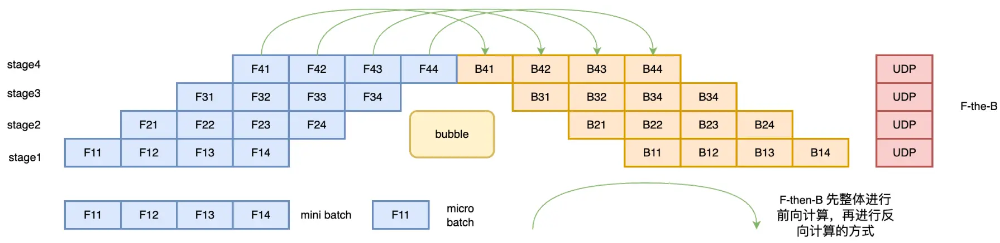

### 5.2 1F1B策略

1F1B（One Forward pass followed by One Backward pass）模式，**一种前向计算和反向计算交叉进行的方式**。在 1F1B 模式下，前向计算和反向计算交叉进行，可以及时释放不必要的中间变量。

1F1B 示例如下图所示，以 stage4 的 F42（**stage4 的第 2 个 micro-batch 的前向计算**）为例，F42 在计算前，F41 的反向 B41（stage4 的第 1 个 micro-batch 的反向计算）已经计算结束，即可释放 F41 的中间变量，从而 F42 可以**复用** F41 中间变量的显存。


研究表明，1F1B 方式相比于 F-then-B 方式，峰值显存可以节省 37.5%，对比朴素流水线并行峰值显存明显下降，设备资源利用率显著提升。

## 6.PipeDream（非交错式1F1B）-DeepSpeed

Gpipe 的流水线有以下几个问题：

-   将 mini-batch 切分成 m 份 micro-batch 后，将带来更频繁的流水线刷新（Pipeline flush），这降低了硬件效率，导致空闲时间的增加。


-   将 mini-batch 切分成 m 份 micro-batch 后， 需要缓存 m 份 activation，这将导致内存增加。原因是每个 micro-batch 前向计算的中间结果activation 都要被其后向计算所使用，所以需要在内存中缓存。即使使用了重计算技术，前向计算的 activation 也需要等到对应的后向计算完成之后才能释放。

而微软 DeepSpeed 提出的 PipeDream ，针对这些问题的改进方法就是 1F1B 策略。这种改进策略可以解决缓存 activation 的份数问题，使得 activation 的缓存数量只跟 stage 数相关，从而进一步节省显存，训练更大的模型。其解决思路就是努力减少每个 activation 的保存时间，即这就需要每个微批次数据尽可能早的完成后向计算，从而让每个 activation 尽可能早释放。


注意：**微批次在 GPipe 中叫 micro-batch，而在 PipeDream 叫 mini-batch**。为了避免干扰，本文统一使用 micro-batch。

PipeDream 具体方案如下：

-   一个阶段（stage）在做完一次 micro-batch 的前向传播之后，就立即进行 micro-batch 的后向传播，然后释放资源，那么就可以让其他 stage 尽可能早的开始计算，这就是 1F1B 策略。有点类似于把整体同步变成了众多小数据块上的异步，而且众多小数据块都是大家独立更新。
-   在 1F1B 的稳定状态（steady state,）下，会在每台机器上严格交替的进行前向计算/后向计算，这样使得每个GPU上都会有一个 micro-batch 数据正在处理，从而保证资源的高利用率（整个流水线比较均衡，没有流水线刷新（Pipeline Flush），这样就能确保以固定周期执行每个阶段上的参数更新。
-   面对流水线带来的异步性，**1F1B 使用不同版本的权重来确保训练的有效性**。


-   此外，PipeDream 还扩展了 1F1B，对于使用数据并行的 stage，采用轮询（round-robin）的调度模式将任务分配在同一个 stage 的各个设备上，保证了一个小批次的数据的前向传播计算和后向传播计算发生在同一台机器上，这就是 1F1B-RR（one-forward-noe-backward-round-robin）。

相比 GPipe，表面上看 PipeDream 在Bubble率上并没有优化，PipeDrea 流水线 Bubble 时间仍然为：$  O(\frac{K−1}{K+M-1}) $。但节省了显存之后，在设备显存一定的情况下，就可以通过增大 M 的值（增大micro-batch的个数）来降低Bubble率了。

## 7.PipeDream-2BW

在之前的流水线方案GPipe和PipeDream存在如下问题：

-   **GPipe 维护模型权重的单一版本，输入的小批次被分成更小的微批次**。权重梯度是累积的，不会立即应用，流水线会定期刷新，以确保不需要维护多个权重版本。 GPipe 提供类似于数据并行的权重更新语义，但是定期的流水线刷新可能会很昂贵，从而限制了吞吐量。减轻这种开销的一种方法是在流水线内执行额外的累积，但这并不总是实用的。
-   PipeDream 使用权重存储方案来确保相同输入的前向和后向传播中使用相同的权重版本。 在最坏的情况下，隐藏的权重版本总数为 d，其中， d 是流水线深度，这对于大模型来说太高了。 而且使用 PipeDream 默认的权重更新语义，每个阶段（state）的权重更新都有不同的延迟项；同时，流水线内不会执行累积。


基于此，作者提出了PipeDream-2BW。PipeDream-2BW 在流水线之中只维护了**两个版本的模型权重，2BW 是双缓冲权重**（double-buffered weights）。

PipeDream-2BW 会为每 m 个微批次生成一个新的权重版本（m>=d），其中，d为流水线深度，但是因为有些剩余后向传递仍然依赖于旧版本模型，所以新的模型版本无法立即取代旧版本，因此，新生成的权重版本需要缓冲以供将来使用。 然而，需要维护的权重版本总数最多为2，因为用于生成新权重版本的权重版本可以立即被丢弃（通过该阶段的后续的输入不再使用旧的权重版本），同时，由于只保存了两个版本，这极大的降低了内存的占用。

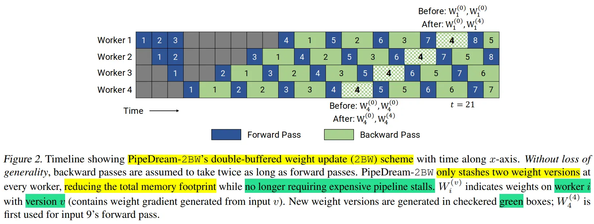

## 8.PipeDream-Flush（1F1B）

在 PipeDream 2BW 论文（Memory-Efficient Pipeline-Parallel DNN Training）中，还提到了一种变体 PipeDream-Flush， 使用 Flush 更新权重。它的内存占用量低于 PipeDream 2BW，但代价是吞吐量较低。该调度重用了微软的 PipeDream 中的 1F1B 调度策略；但是，同GPipe一样，**只维护单个权重版本并引入定期流水线刷新**（pipeline flush），以确保权重更新期间的权重版本保持一致，通过这种方式以执行性能为代价降低了峰值内存。下图显示了具有 2 个流水线阶段的 PipeDream-Flush 和 GPipe 的时间线。


下图展示了GPipe、PipeDream-Flush、PipeDream 2BW 流水线并行方法的吞吐量对比。


下图展示了GPipe、PipeDream-Flush、PipeDream 2BW 流水线并行方法的内存对比。


## 9.1F1B 调度（schedule）模式

上面讲述了 PipeDream，在使用 1F1B 策略时，存在两种调度模式：非交错调度和交错式调度。具体如下图所示，上面的部分显示了默认的非交错式调度（non-interleaved schedule），底部显示的是交错式调度（interleaved schedule）。


### 9.1 非交错式调度

非交错式调度可分为三个阶段。第一阶段是热身阶段，处理器进行不同数量的前向计算。在接下来的阶段，处理器进行一次前向计算，然后是一次后向计算。最后一个阶段处理器完成后向计算。

上面的讲到微软的 PipeDream 就是使用非交错式 1F1B 调度。虽然，这种调度模式比 GPipe 更节省内存。然而，它需要和 GPipe 一样的时间来完成一轮计算。

### 9.2 交错式调度

在交错式调度中，每个设备可以对多个层的子集（称为模型块）进行计算，而不是一个连续层的集合。

具体来看，在之前非交错式调度中，设备1拥有层1-4，设备2拥有层5-8，以此类推；但在交错式调度中，设备1有层1,2,9,10，设备2有层3,4,11,12，以此类推。在交错式调度模式下，流水线上的每个设备都被分配到多个流水线阶段（虚拟阶段，virtual stages），每个流水线阶段的计算量较少。

这种模式既节省内存又节省时间。但这个调度模式要求 micro-batch 的数量是流水线阶段（Stage）的整数倍。

英伟达 Megatron-LM 的流水线并行相关的论文（Efficient Large-Scale Language Model Training on GPU Clusters Using Megatron-LM）中采用了非交错式 1F1B 调度。

## 10.PipeDream（交错式1F1B）-Megatron-LM

Megatron-LM 基于 PipeDream-Flush 提出了一个小的Trick：交错式 1F1B 调度，而交错式 1F1B 调度也是 Megatron-LM 论文（Efficient Large-Scale Language Model Training on GPU Clusters Using Megatron-LM），virtual pipeline）中最主要的一个创新点。

传统的流水线并行通常会在一个设备（Device）上放置几个连续的模型层（如：Transformer层）。但 Megatron 这篇论文采用虚拟流水线（virtual pipeline），进行交错式1F1B并行。在设备数量不变的情况下，分出更多的流水线阶段（pipeline stage），以更多的通信量，换取流水线Bubble比率降低。

例如，之前如果每个设备有 4 层（即设备 1 有 1 – 4 层，设备 2 有 5 – 8 层，依此类推），现在我们可以让每个设备对两个模型块执行计算（每个模型块有 2 层） ，即设备 1 有第 1、2、9、10 层； 设备 2 有第 3、4、11、12 层，依此类推。 通过这种方案，流水线中的每个设备都被分配多个流水线阶段（与以前相比，每个流水线阶段的计算量更少）。


此外，该方案要求一个小批次中的微批次数量是管道并行大小（流水线中的设备数量）的整数倍。 例如，对于 4 个设备，一个小批次中的微批次数量必须是 4 的倍数。

那虚拟流水线（virtual pipeline）是怎么做到的呢？

对照上面示例图举例说明，若网络共16层（编号 0-15），4 个 Device，前述谷歌的 GPipe 和微软的 PipeDream 是分成 4 个 stage， 按编号 0-3 层放 Device1，4-7层放 Device2 ，以此类推。

英伟达的 virtual pipeline 则是按照文中提出的 virtual\_pipeline\_stage 概念减小切分粒度，以 virtaul\_pipeline\_stage=2 为例，将 0-1 层放 Device1, 2-3 层放在 Device2，...，6-7 层放到 Device4，8-9 层继续放在 Device1，10-11 层放在 Device2，...，14-15 层放在 Device4。

按照这种方式，Device之间的点对点通信次数(量)直接翻了virtual\_pipeline\_stage 倍，但空泡比率降低了，若定义每个 Device 上有 v 个 virtual stages，或者论文中也叫做 model chunks，在这个例子中 v=2，这样一来，空泡比率为：

$$
Bubble~ time~ fraction ~(pipeline~ bubble ~size) =\frac{t_{p b}^{\text {int. }}}{t_{i d}}=\frac{1}{v_{0}} \cdot \frac{p-1}{m_{\text {柆 }}}
$$

从上面公式可以看出空泡比率和 v 成反比，降低了 v 倍。当然，流水线气泡比率的降低并不是没有成本的：这个交错式调度需要额外的通信。 从数量上来说，通讯量也增加了 v 倍。 当然我们可以通过在多 GPU 服务器（例如： DGX A100 节点）中可以通过高速的网络带宽来减少这种额外通信的影响。英伟达论文中也探讨了使用 8 个 InfiniBand 网卡来减少这种额外通信的影响。

## 11.分布式训练框架流水线并行方案

上面讲述了目前主流的一些流水线并行（PP）方案，总的来说，PP可以细分为同步流水线并行(Sync-PP)和异步流水线并行(Async-PP)。

-   Sync-PP的代表有GPipe，PipeDream-flush等；
-   Async-PP的代表有PipeDream，PipeDream-2BW等。

同步方法与数据并行具有相同的权值更新语意，但是需要引入流水线bubble（空闲等待时间），会降低训练吞吐。而异步方法彻底消除的训练timeline中的bubble，但是需要引入不同的权值版本来解决权值过期的问题。

下面我们来看看几个知名的分布式训练框架中采用的流水线并行方案：

-   在 PyTorch 中，采用的是GPipe方案。使用的是F-then-B调度策略。
-   在 DeepSpeed 中，采用的是PipeDream-Flush，使用的是非交错式1F1B调度策略。使用这个调度方案，是为了促进最大规模的模型进行训练，在模型训练过程中中，存储多个权重缓冲可能会令人望而却步，我们的首要目标希望是一个“精确”的方法，而不需要收敛权衡。当然，DeepSpeed 引擎组件抽象出了流水线调度，你也可以自行实现其他的流水线调度方案。
-   在 Megatron-LM 中，基于PipeDream-Flush进行了改进，提供了一种交错式1F1B方案。
-   在 Colossal-AI 中，基于Megatron-LM的交错式1F1B方案，提供了非交错(`PipelineSchedule`) 和交错(`InterleavedPipelineSchedule`) 调度策略。

## 12.总结

本文首先讲述了朴素流水线并行，但是朴素的流水线并行在一个流水线并行组内，每一时刻只有一个GPU运行，这样将会导致GPU使用率极低。因此，谷歌提出了 Gpipe。

Gpipe 利用数据并行的思想，将 mini-batch 细分为多个更小的 micro-batch，送入GPU进行训练，来提高并行程度。将 mini-batch 拆分为 M个 micro-batch 后，导致更频繁的流水线刷新，降低硬件效率，同时，拆分为 M 个微批次之后，每个微批次反向传播过程中都会只用之前的激活值，因此，将导致内存占用更大。基于此，GPipe中使用重计算进行解决，前提是重计算出来的结果和之前得一样，并且前向的时间不能太长，否则流水线会被拉长太多。

后面提到了 F-then-B 和 1F1B 这两种流水线并行策略，F-then-B 可能会导致内存占用很高。而微软提出的 PipeDream 通过合理安排前向和反向过程的顺序（1F1B策略）来解决内存过高的问题。

相对于 GPipe，虽然 PipeDream 降低了内存的使用，但是其空泡（Bubble）率并没有降低。Megatron-LM的流水线并行方案中提出了交错式1F1B调度策略。进一步降低空泡（Bubble）率。但是，带来了额外的通信成本。其论文中提到了使用 IB 网络来缓解额外的通信影响。

说句题外话，在本文讲述的几种流水线并行方案中，除了 GPipe 之外，PipeDream及其变体的相关论文都有 Deepak Narayanan 的参与，真高产。


# 4.张量并行

和流水线并行类似，张量并行也是将模型分解放置到不同的GPU上，以解决单块GPU无法储存整个模型的问题。和流水线并行不同的地方在于，**张量并行是针对模型中的张量进行拆分，将其放置到不同的GPU上**。

## 1.简述

模型并行是不同设备负责单个计算图不同部分的计算。而将计算图中的层内的参数（张量）切分到不同设备（即层内并行），每个设备只拥有模型的一部分，以减少内存负荷，我们称之为张量模型并行。


张量并行从数学原理上来看就是对于`linear`层就是把矩阵分块进行计算，然后把结果合并；对于非`linear`层，则不做额外设计。

## 2.张量并行方式

张量切分方式分为按行进行切分和按列进行切分，分别对应**行并行（Row Parallelism）**与**列并行（Column Parallelism）**。

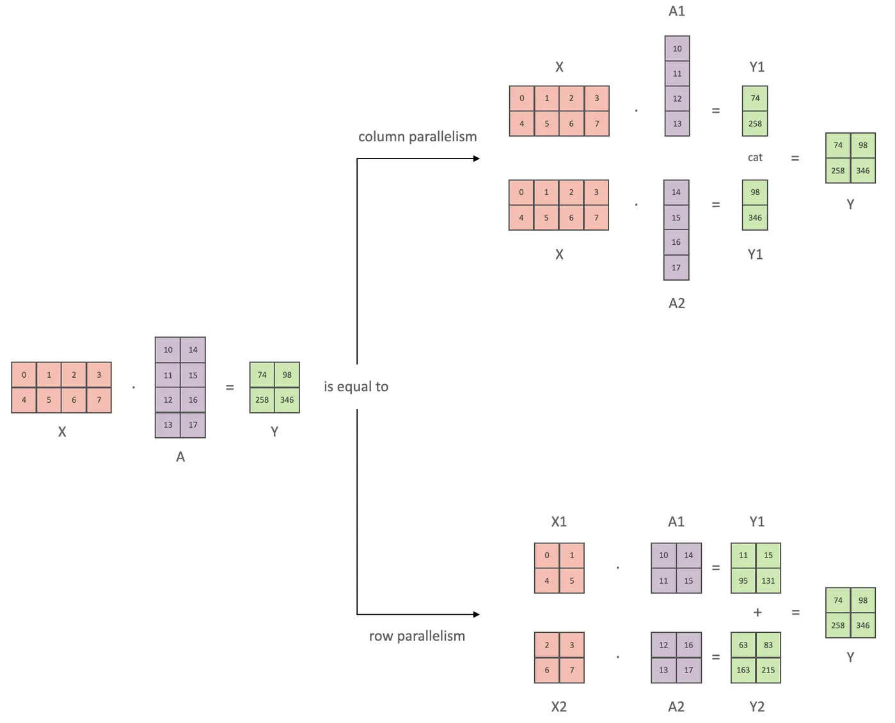

下面用通用矩阵的矩阵乘法（GEMM）来进行示例，看看线性层如何进行模型并行。假设 Y = XA ，对于模型来说，X 是输入，A是权重，Y是输出。


### 2.1 行并行

行并行就是把权重 A 按照行分割成两部分。为了保证运算，同时我们也把 X 按照列来分割为两部分，具体如下所示：

$$
X A=\left[\begin{array}{ll}X 1 & X 2\end{array}\right]\left[\begin{array}{l}A 1 \\ A 2\end{array}\right]=X 1 A 1+X 2 A 2=Y 1+Y 2=Y
$$

这样，X1 和 A1 就可以放到 GPU0 之上计算得出 Y1，，X2 和 A2 可以放到第二个 GPU1 之上计算得出 Y2，然后，把Y1和Y2结果相加，得到最终的输出Y。

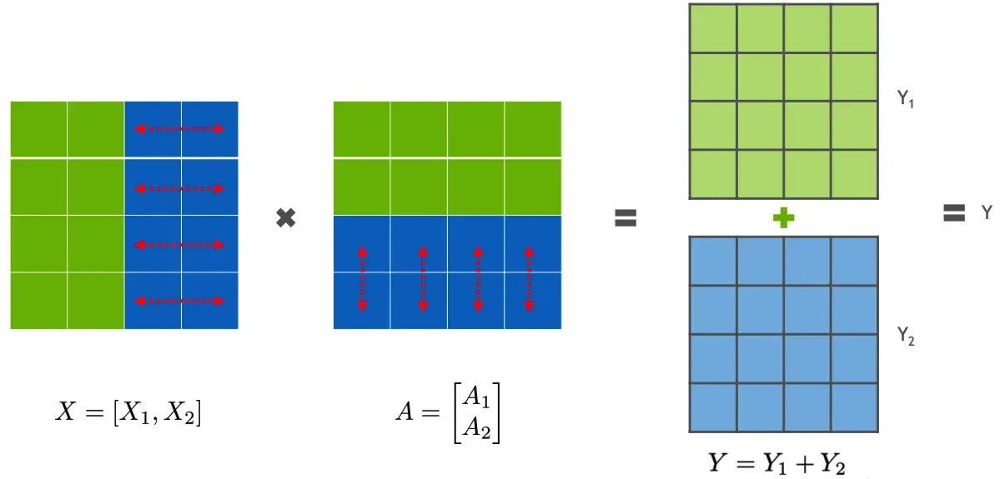

## 2.2 列并行

列并行就是把 A按照列来分割，具体示例如下：

$$
X A=[X]\left[\begin{array}{ll}A 1 & A 2\end{array}\right]=\left[\begin{array}{ll}X A 1 & X A 2\end{array}\right]=\left[\begin{array}{ll}Y 1 & Y 2\end{array}\right]=Y
$$

这样，将 X 分别放置在GPU0 和GPU1，将 A1 放置在 GPU0，将 A2 放置在 GPU1，然后分别进行矩阵运行，最终将2个GPU上面的矩阵拼接在一起，得到最终的输出Y。


## 3. 1维（1D）张量并行（Megatron-LM）

张量并行则涉及到不同的分片 (sharding)方法，现在最常用的都是 1D 分片，即**将张量按照某一个维度进行划分（横着切或者竖着切）**。

目前，在基于Transformer架构为基础的大模型中，最常见的张量并行方案由[Megatron-LM](https://link.juejin.cn?target=https://deepakn94.github.io/assets/papers/megatron-sc21.pdf "Megatron-LM")提出，它是一种高效的一维（1D）张量并行实现。它**采用的则是非常直接的张量并行方式，对权重进行划分后放至不同GPU上进行计算**。

如下图所示，对于一个基于 Transformer 结构的模型来说，主要由一个 N 层 Transformer 块组成，除此之外还有输入和输出 Embedding 层。


而一个 Transformer 层里面主要由由自注意力（Self-Attention）和 MLP 组成。因此，本方案主要针对多头注意力（MHA）块和MLP块进行切分进行模型并行。

对于 MLP 层切分相对来说比较简单，该层主要由一个GELU是激活函数，以及 A 和 B 两个线性层组成。其中，`f` 和 `g` 分别表示两个算子，每个算子都包含一组forward + backward 操作。f 和 g 是共轭的。

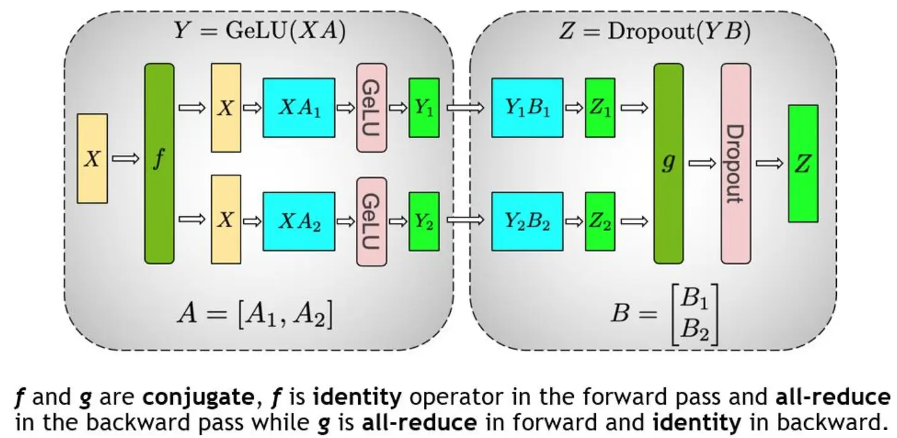

在MLP层中，**先对A采用“列切割”，然后对B采用“行切割”** 。

-   `f` 的 forward 计算：把输入X拷贝到两块GPU上，每块GPU即可独立做forward计算。
-   `g` 的 forward 计算：每块GPU上的forward的计算完毕，取得Z1和Z2后，GPU间做一次**AllReduce**，相加结果产生Z。
-   `g` 的 backward 计算：只需要把$\frac{\partial L}{\partial Z}$拷贝到两块GPU上，两块GPU就能各自独立做梯度计算。
-   `f` 的 backward 计算：当前层的梯度计算完毕，需要传递到下一层继续做梯度计算时，我们需要求得 $\frac{\partial L}{\partial X}$。则此时两块GPU做一次**AllReduce**，把各自的梯度 $\frac{\partial L}{\partial X_1}$和 $ \frac{\partial L}{\partial X_2}  $相加即可。

对于 MHA 层进行切分稍微会复杂一点。一个MHA层由多个自注意力块组成。每个自注意力头都可以独立计算，最后，再将结果拼接（concat）起来。也就是说，**可以把每个头的参数放到一块GPU上**。


在 MHA 层，对三个参数矩阵Q，K，V，**按照“列切割”** ，每个头放到一块GPU上，做并行计算。对线性层B，**按照“行切割”** 。切割的方式和 MLP 层基本一致，其forward与backward原理也一致，这里不再赘述。


最后，在实际应用中，**并不一定按照一个head占用一块GPU来切割权重，我们也可以一个多个head占用一块GPU，这依然不会改变单块GPU上独立计算的目的。所以实际设计时，我们尽量保证head总数能被GPU个数整除****。** ​

现在，将 MLP 与 MHA 块放置在一起，一个 Transformer 层的张量模型并行如下所示：

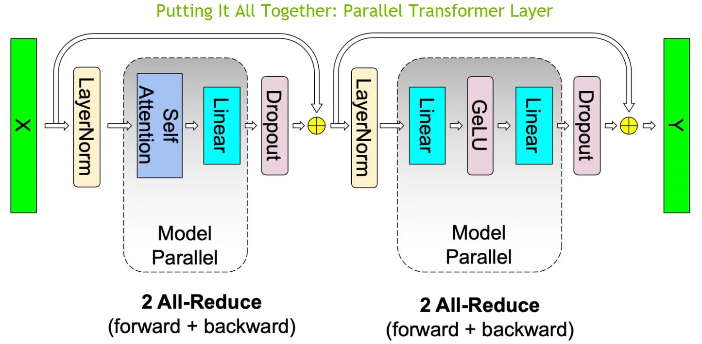

可以看到，一个 Transformer 层的正向和反向传播中总共有 4 个 All-Reduce 通信操作。

上面提到了对于一个 Transformer 结构的模型来说，通常，还有一个输入Embeding和一个输出Embeding层，其维数为 (v, h)，其中，h表示隐藏大小，v表示词汇量大小。

由于现代语言模型的词汇量约为数万个（例如，GPT-2使用的词汇量为50257），因此，将 Embeding 层 GEMM 进行并行化是非常有益的。然而，在Transformer语言模型中，为了节约内存，通常输出 Embeding 层与输入 Embeding 层共享权重，因此，需要对两者进行修改。

在Embbedding层，按照词的维度切分，即每张卡只存储部分词向量表，然后，通过 All Gather 汇总各个设备上的部分词向量结果，从而得到完整的词向量结果

在 Megatron-LM 中，通过如下方法来初始化张量并行、流水线并行以及数据并行组。

```python
from megatron.core import mpu, tensor_parallel

mpu.initialize_model_parallel(args.tensor_model_parallel_size,
                  args.pipeline_model_parallel_size,
                  args.virtual_pipeline_model_parallel_size,
                  args.pipeline_model_parallel_split_rank)

```

在给定 P 个处理器的情况下，下面为理论上的计算和内存成本，以及基于环形（ring）算法的1D 张量并行的前向和后向的通信成本。

| 计算     | 内存 (参数) | 内存 (activations) | 通信 (带宽)     | 通信 (时延)   |
| ------ | ------- | ---------------- | ----------- | --------- |
| O(1/P) | O(1/P)  | O(1)             | O(2(P−1)/P) | O(2(P−1)) |

## 4.多维张量并行

英伟达Megatron-LM的张量并行本质上使用的是 1 维矩阵划分，这种方法虽然将参数划分到多个处理器上，但每个处理器仍需要存储整个中间激活，在处理大模型时会浪费大量显存空间。此外，由于仅采用1维矩阵划分，**在每次计算中，每个处理器都需要与其他所有处理器进行通信**，因此，通信成本会随并行度增高而激增。

显然，1 维张量并行已无法满足当前超大AI模型的需求。对此，Colossal-AI 提供多维张量并行，即以 2/2.5/3 维方式进行张量并行。


### 4.1 2D张量并行

Megatron中的 1D 张量并行方案并没有对激活（activations）进行划分，对于大模型而言，这也会消耗大量的内存。


为了平均分配计算和内存负荷，在 SUMMA 算法（一种可扩展的通用矩阵乘法算法，并行实现矩阵乘法）的基础上， [2D 张量并行](https://link.juejin.cn/?target=https://arxiv.org/pdf/2104.05343.pdf "2D 张量并行") 被引入。它**把 input 和 weight 都沿着两个维度均匀切分**。


这里还是以线性层 $Y=XA$为例。给定$P=q \times q$个处理器（必要条件），如果$q=2$，我们把输入$X$和权重$A$都划分为：

$$
\left[\begin{array}{ll}X_{00} & X_{01} \\ X_{10} & X_{11}\end{array}\right] 和 \left[\begin{array}{ll}A_{00} & A_{01} \\ A_{10} & A_{11}\end{array}\right]
$$

该计算包括$q$步。

当$t=1$时，即第一步，$X_{i0}$ (即: $\left[\begin{array}{l}X_{00} \\ X_{10}\end{array}\right]$)在其行中被广播，而$A_{0j}$（即：$\left[\begin{array}{ll}A_{00} & A_{01}\end{array}\right]$）在其列中被广播。因此，我们有

$$
\left[\begin{array}{ll}X_{00}, A_{00} & X_{00}, A_{01} \\ X_{10}, A_{00} & X_{10}, A_{01}\end{array}\right]
$$

然后，我们在每个处理器$(i,j)$上将 $X_{i0}$和$A_{0j}$相乘为

$$
\left[\begin{array}{ll}X_{00} A_{00} & X_{00} A_{01} \\ X_{10} A_{00} & X_{10} A_{01}\end{array}\right] (1).
$$

同样，当$t=2$时，$X_{i1}$在其行中被广播，$A_{1j}$在其列中被广播，我们将他们相乘为

$$
\left[\begin{array}{ll}X_{01} A_{10} & X_{01} A_{11} \\ X_{11} A_{10} & X_{11} A_{11}\end{array}\right] (2).
$$

之后，通过将(1)和(2)相加，我们有

$$
Y=X A=\left[\begin{array}{ll}X_{00} A_{00}+X_{01} A_{10} & X_{00} A_{01}+X_{01} A_{11} \\ X_{10} A_{00}+X_{11} A_{10} & X_{10} A_{01}+X_{11} A_{11}\end{array}\right]
$$

虽然，(1)和 (2)两个矩阵的结果仍然需要串行的计算。但是，单个矩阵（X 和 A）中的 4 个子矩阵可以使用 2×2 的处理器来并行计算。

在给定$  P=q×q $ 个处理器, 下面为理论上的计算和内存成本，以及基于环形算法的2D张量并行的前向和后向的通信成本。

| 计算         | 内存 (参数)    | 内存 (activations) | 通信 (带宽)       | 通信 (时延)     |
| ---------- | ---------- | ---------------- | ------------- | ----------- |
| $O(1/q^2)$ | $O(1/q^2)$ | $O(1/q^2)$       | $O(6(q−1)/q)$ | $O(6(q−1))$ |

通过 2D 并行，可以大大降低 Activation 的大小，因此，BatchSize可以大幅提升。

在 Colossal-AI 中，2D 张量并行示例如下所示：

```python
import colossalai  
import colossalai.nn as col_nn  
import torch  
from colossalai.utils import print_rank_0
from colossalai.context import ParallelMode
from colossalai.core import global_context as gpc
from colossalai.utils import get_current_device

# 并行设置
CONFIG = dict(parallel=dict(
    data=1,
    pipeline=1,
    tensor=dict(size=4, mode='2d'),
))

parser = colossalai.get_default_parser()  
    colossalai.launch(config=CONFIG,  
    rank=args.rank,  
    world_size=args.world_size,  
    local_rank=args.local_rank,  
    host=args.host,  
    port=args.port)  
  
class MLP(torch.nn.Module):  
    def __init__(self, dim: int = 256):  
        super().__init__()  
        intermediate_dim = dim * 4  
        self.dense_1 = col_nn.Linear(dim, intermediate_dim)  
        print_rank_0(f'Weight of the first linear layer: {self.dense_1.weight.shape}')  
        self.activation = torch.nn.GELU()  
        self.dense_2 = col_nn.Linear(intermediate_dim, dim)  
        print_rank_0(f'Weight of the second linear layer: {self.dense_2.weight.shape}')  
        self.dropout = col_nn.Dropout(0.1)  

    def forward(self, x):  
        x = self.dense_1(x)  
        print_rank_0(f'Output of the first linear layer: {x.shape}')  
        x = self.activation(x)  
        x = self.dense_2(x)  
        print_rank_0(f'Output of the second linear layer: {x.shape}')  
        x = self.dropout(x)  
        return x

# 创建模型
m = MLP()

# 随机输入一些数据来运行这个模型
x = torch.randn((16, 256), device=get_current_device())

# partition input
torch.distributed.broadcast(x, src=0)
x = torch.chunk(x, 2, dim=0)[gpc.get_local_rank(ParallelMode.PARALLEL_2D_COL)]
x = torch.chunk(x, 2, dim=-1)[gpc.get_local_rank(ParallelMode.PARALLEL_2D_ROW)]
print_rank_0(f'Input: {x.shape}')

x = m(x)
```

### 4.2 2.5D张量并行

与一维张量并行相比，二维并行降低了内存成本，但可能引入更多的通信。因此，[2.5D张量并行](https://link.juejin.cn/?target=https://arxiv.org/pdf/2105.14500.pdf "2.5D张量并行") 在 2D SUMMA 的基础上被提出，它通过使用更多的设备($ P=q×q×d  $个处理器)来减少通信。


这里还是以线性层 $Y=XA$为例。给定$P=q \times q \times d$个处理器（必要条件），如果$q=d=2$.

首先，我们把输入$X$划分为 $d\times q$行和q列：

$$
\left[\begin{array}{ll}X_{00} & X_{01} \\ X_{10} & X_{11} \\ X_{20} & X_{21} \\ X_{30} & X_{31}\end{array}\right]
$$

它可以被重塑为 $d$ 层

$$
\left[\begin{array}{ll}X_{00} & X_{01} \\ X_{10} & X_{11}\end{array}\right] 和 \left[\begin{array}{ll}X_{20} & X_{21} \\ X_{30} & X_{31}\end{array}\right]
$$

另外，权重A被分割为

$$
\left[\begin{array}{ll}A_{00} & A_{01} \\ A_{10} & A_{11}\end{array}\right]
$$

对于X相关的每一层，我们使用SUMMA算法将X与A相乘。然后，我们得到输出

$$
\begin{array}{c}{\left[\begin{array}{ll}Y_{00}=X_{00} A_{00}+X_{01} A_{10} & Y_{01}=X_{00} A_{01}+X_{01} A_{11} \\ Y_{10}=X_{10} A_{00}+X_{11} A_{10} & Y_{11}=X_{10} A_{01}+X_{11} A_{11}\end{array}\right] \text { 和 }} \\ {\left[\begin{array}{ll}Y_{20}=X_{20} A_{00}+X_{21} A_{10} & Y_{21}=X_{20} A_{01}+X_{21} A_{11} \\ Y_{30}=X_{30} A_{00}+X_{31} A_{10} & Y_{31}=X_{30} A_{01}+X_{31} A_{11}\end{array}\right] .}\end{array}
$$

最后，将两个矩阵的垂直拼接操作，结果如下所示：

$$
\left[\begin{array}{ll}Y_{00} & X_{01} \\ Y_{10} & Y_{11} \\ Y_{20} & Y_{21} \\ Y_{30} & Y_{31}\end{array}\right]
$$

基于上面的推导，可以发现被拼接的两个矩阵天然可以并行计算。**看到这里，应该就可以发现这两个矩阵乘法就是上面的 2D 张量并行的形式。**

这里，我们总计有 2×2×2=8 个处理器，每 2×2=4 个处理器使用 2D 张量并行来处理对应的矩阵乘法。最后，将两个 2D 张量并行的结果进行拼接即可。


在给定 P=q×q×d 个处理器的情况下, 下面为理论上的计算和内存成本，以及基于环形算法的2.5D张量并行的前向和后向的通信成本。

| 计算          | 内存 (参数)    | 内存 (activations) | 通信 (带宽)             | 通信 (时延)     |
| ----------- | ---------- | ---------------- | ------------------- | ----------- |
| $O(1/dq^2)$ | $O(1/q^2)$ | $O(1/dq^2)$      | $O(3(q−1)(d+1)/dq)$ | $O(6(q−1))$ |

在 Colossal-AI 中，2.5D 张量并行示例如下所示：

```python
# 并行设置
CONFIG = dict(parallel=dict(  
    data=1,  
    pipeline=1,  
    tensor=dict(size=8, mode='2.5d', depth=2),  
))

...
  
# 创建模型
m = MLP()

# 随机输入一些数据来运行这个模型
x = torch.randn((16, 256), device=get_current_device())

# partition input  
torch.distributed.broadcast(x, src=0)  
x = torch.chunk(x, 2, dim=0)[gpc.get_local_rank(ParallelMode.PARALLEL_2P5D_DEP)]  
x = torch.chunk(x, 2, dim=0)[gpc.get_local_rank(ParallelMode.PARALLEL_2P5D_COL)]  
x = torch.chunk(x, 2, dim=-1)[gpc.get_local_rank(ParallelMode.PARALLEL_2P5D_ROW)]  
print_rank_0(f'Input: {x.shape}')  
  
x = m(x)

```

之所以叫 2.5D 张量并行是因为在 d = 1 时，这种并行模式可以退化成 2D 张量并行；在 d = q 时，它就变成了3D 张量并行。下面我们来看看 3D 张量并行。

### 4.3 3D张量并行

之前的 3D 并行矩阵乘法对矩阵做了广播，造成了很大的内存冗余。


为了去除掉这种冗余性，Colossal-AI 把模型的矩阵进一步做了一个细粒度的划分。


Colossal-AI 的 3D 张量并行是一种将神经网络模型的计算并行化，以期望获得最佳通信成本优化的方法。与现有的 1D 和 2D 张量并行相比，具有更少的内存和网络通信开销。


论文中在64卡V100上面实验，3D张量并行相比1D张量和2D张量来说，训练速度更快。


这里还是以线性层 $Y=XA$为例。给定$P=q \times q \times q$个处理器（必要条件），如果$q=2$,我们把输入X和权重A分别划分为.

$$
\left[\begin{array}{ll}X_{000} & X_{001} \\ X_{010} & X_{011} \\ X_{100} & X_{101} \\ X_{110} & X_{111}\end{array}\right] 和 \left[\begin{array}{llll}A_{000} & A_{001} & A_{010} & A_{011} \\ A_{100} & A_{101} & A_{110} & A_{111}\end{array}\right],
$$

其中，每个$X_{ijl}$和$A_{lji}$都被存储在处理器$(i,j,l)$上，如下图所示


然后，我们在$(i, 0...q, l)$上收集$X_{ijl}$，以及在$(i, 0...q, l)$上收集$A_{lji}$

因此，我们在每个处理器 $(i,j,l)$ 上都有$  X_{il}  $和 $A_{lj}$以获得 $X_{il}A_{lj}$。 最后，我们在 $(i, j, 0...q)$对结果进行 reduce-scatter 得到 $Y_{ijl}$, 形成了

$$
Y=\left[\begin{array}{ll}Y_{000} & Y_{001} \\ Y_{010} & Y_{011} \\ Y_{100} & Y_{101} \\ Y_{110} & Y_{111}\end{array}\right]
$$

还需要注意的是，在后向传播中, 我们需要 all-gather 梯度 $\dot{Y_{ijl}}$；然后， reduce-scatter 梯度 $\dot{X_{il}}=\dot{Y_{ij}}A_{lj}^T$ 和 $\dot{A_{lj}}=X_{il}^T\dot{Y_{ij}}$。

在给定$ P=q×q×q$ 个处理器的情况下, 下面为理论上的计算和内存成本，以及基于环形算法的3D张量并行的前向和后向的通信成本。

| 计算         | 内存 (参数)    | 内存 (activations) | 通信 (带宽)         | 通信 (时延)     |
| ---------- | ---------- | ---------------- | --------------- | ----------- |
| $O(1/q^3)$ | $O(1/q^3)$ | $O(1/q^3)$       | $O(6(q−1)/q^3)$ | $O(6(q−1))$ |

在 Colossal-AI 中，3D 张量并行示例如下所示：

```python
# 并行设置
CONFIG = dict(parallel=dict(  
    data=1,  
    pipeline=1,  
    tensor=dict(size=8, mode='3d'),  
))

...
  
# 创建模型
m = MLP()

# 随机输入一些数据来运行这个模型
x = torch.randn((16, 256), device=get_current_device())

# partition input  
torch.distributed.broadcast(x, src=0)  
x = torch.chunk(x, 2, dim=0)[gpc.get_local_rank(ParallelMode.PARALLEL_3D_WEIGHT)]  
x = torch.chunk(x, 2, dim=0)[gpc.get_local_rank(ParallelMode.PARALLEL_3D_INPUT)]  
x = torch.chunk(x, 2, dim=-1)[gpc.get_local_rank(ParallelMode.PARALLEL_3D_OUTPUT)]  
print_rank_0(f'Input: {x.shape}')  
  
x = m(x)
```

## 5.Pytorch中的张量并行

当训练非常大的模型时，用户希望一起使用数据并行、张量并行、流水线并行，而现有解决方案的互操作性不是很好并且通常难以使用。最大的原因之一是没有通用的抽象来在不同的并行策略之间架起桥梁。

与此同时，无论是 Megatron-LM 还是 Colossal-AI 中的张量并行，都是基于 Transformer 架构模型提供的张量并行解决方案，不具备通用性。而 PyTorch 作为一个深度学习框架，肯定需要从更加通用的层面来进行设计，而不是仅针对某一类模型。

受 GSPMD、Oneflow 和 TF DTensor 的启发，PyTorch 从 2.0.0 开始引入 DTensor 作为下一代 ShardedTensor，为分布式存储和计算提供基本抽象。它作为分布式程序翻译和描述分布式训练程序的布局的基本构建块之一。通过DTensor抽象，我们可以无缝构建张量并行、DDP和FSDP等并行策略

PyTorch DTensor 主要用途：

-   提供在 checkpointing 期间保存/加载 state\_dict 的统一方法，即使存在复杂的张量存储分配策略，例如：将张量并行与 FSDP 中的参数分片相结合。
-   在 eager 模式下启用张量并行。 与 ShardedTensor 相比，DistributedTensor 允许更灵活地混合分片和复制。
-   充当 SPMD 编程模型的入口点和基于编译器的分布式训练的基础构建块。

PyTorch 中张量并行具体示例如下所示：

```python
from torch.distributed._tensor import DeviceMesh
from torch.distributed.tensor.parallel import PairwiseParallel, parallelize_module

# 通过设备网格根据给定的 world_size 创建分片计划
device_mesh = DeviceMesh("cuda", torch.arange(0, args.world_size))

# 创建模型并移动到GPU
model = ToyModel().cuda(rank)

# 为并行化模块创建优化器
LR = 0.25
optimizer = torch.optim.SGD(model.parameters(), lr=LR)

# 根据给定的并行风格并行化模块，
# 这里指定为PairwiseParallel，将 colwise 和 rowwise 样式串联为固定对，就像 [Megatron-LM](https://arxiv.org/abs/1909.08053) 所做的那样。
model = parallelize_module(model, device_mesh, PairwiseParallel())

# 对分片模块执行多次前向/后向传播和优化器对参数进行更新。
for i in range(args.iter_nums):
    # 对于 TP，所有 TP rank 的输入需要相同。
    # 设置随机种子是为了模仿数据加载器的行为。
    if rank==0:
        print(f"-----------{i}--------------")
    torch.manual_seed(i)
    inp = torch.rand(20, 10).cuda(rank)
    if rank==0:
        print(f"rank: {rank} , input shape: {inp.shape}")
    output = model(inp)
    if rank==0:
        print(f"rank: {rank} , input shape: {output.shape}")
    output.sum().backward()
    optimizer.step()

```

## 6.总结

本文主要针对 Megatron-LM 和 Colossal-AI 的张量并行方案进行了讲解。其中，Megatron-LM 提出了一种高效的一维（1D）张量并行化实现。这种方法虽然将参数划分到多个处理器上，但每个处理器仍需要存储整个中间激活，在处理大模型时会消耗大量的显存空间。此外，由于仅采用1维矩阵划分，在每次计算中，每个处理器都需要与其他所有处理器进行通信；因此，通信成本会随并行度增高而激增。显然，1维张量并行已无法满足当前超大AI模型的需求。对此，Colossal-AI提供多维张量并行，即以2/2.5/3维方式进行张量并行。

无论是 Megatron-LM 还是 Colossal-AI，都是基于 Transformer 架构模型提供的张量并行解决方案，不具备通用性。因此，本文还简要介绍了 PyTorch 中的张量并行解决方案。


# 5.序列并行

## 1.序列并行（Colossal-AI）

> Colossal-AI 发表的论文：Sequence Parallelism: Long Sequence Training from System Perspective， 主要是**解决模型的输入长度(sequence length)限制**。

Colossal-AI 序列并行诞生的背景是 self-attention 的内存需求是输入长度（sequence length）的2次方。其复杂度为 $O(n^2)$，其中，n 是序列长度。换言之，**长序列数据将增加中间activation内存使用量，从而限制设备的训练能力**。

而现有的工作侧重于从算法的角度降低时间和空间复杂度。因此，作者提出了序列并行，这是一种内存高效的并行方法，可以帮助我们**打破输入序列长度限制，并在 GPU 上有效地训练更长的序列**；同时，该方法与大多数现有的并行技术兼容（例如：数据并行、流水线并行和张量并行）。

更重要的是，不再需要单个设备来保存整个序列。 即在稀疏注意力的情况下，我们的序列并行使我们能够训练具有无限长序列的 Transformer。


具体来说，**将输入序列分割成多个块，并将每个块输入到其相应的设备（即 GPU）中**。为了计算注意力输出，我们将环状通信与自注意力计算相结合，并提出了环自注意力（RSA）如下图所示。


实验表明，当按批量大小和序列长度进行缩放时，序列并行表现良好。


当扩展到 64 个 NVIDIA P100 GPU 时，与张量并相比，该法分别实现了 13.7 倍和 3.0 倍的最大批量大小和序列长度。

通过稀疏注意力，序列可以处理具有超过 114K 个 Token 的序列，这比现有的在单个设备上保存整个序列的稀疏注意力运行长度超过 27 倍。

除此之外，与张量并行和流水线并行不同，序列并行不受超参数（例如： 注意力头数、层数）限制。 因此，只要序列长度能被序列并行大小整除，我们的序列并行就可以使用。

## 2.序列并行

> Megatron-LM 发表的论文：Reducing Activation Recomputation in Large Transformer Models， 主要是**减少模型显存**。

Megatron-LM 的初衷是**考虑通过其他方式分摊张量并行中无法分摊的显存**，因此提出了序列并行的方法。

虽然 Megatron-LM 引用了 Colossal-AI 的序列并行的这篇文章，但是这两者其实并不是一个东西。

Megatron-LM 只是借用了 Colossal-AI 把 Sequence 这个维度进行平均划分的思想。在 张量的基础上，将 Transformer 层中的 LayerNorm 以及 Dropout 的输入按输入长度（Sequence Length）维度进行了切分，使得各个设备上面只需要做一部分的 Dropout 和 LayerNorm 即可。

这样做的好处有：

1.  LayerNorm 和 Dropout 的计算被平摊到了各个设备上，减少了计算资源的浪费；
2.  LayerNorm 和 Dropout 所产生的激活值也被平摊到了各个设备上，进一步降低了显存开销。

在 Megatron-LM 序列并行的这篇论文中，首先分析了 Transformer 模型运行时的显存占用情况。


假设输入长度为 s ，batch size为 b ，hidden dim为 h ，attention head数量为 a ，则每一层 Transformer（上图的灰色区域）的显存占用：

$$
Activations~memory~per~layer =s b h\left(34+5 \frac{a s}{h}\right)
$$

当我们开启了张量并行之后，上述Transformer层中的部分模块的显存可以被分摊到不同的设备之间。如下图所示，不能被分摊的部分主要是两个 LayerNorm 块的输入和输出： 4bsh ；两个 dropout mask 块：2bsh ；一共是 10bsh。


假设张量并行大小为t，因此，每个设备每一层 Transformer 的显存占用为：

$$
Activations~memory~per~layer =\operatorname{sbh}\left(10+\frac{24}{t}+5 \frac{a s}{h t}\right).
$$

下面开启张量并行以及序列并行，Transformer 层中的 LayerNorm 和 Dropout 块也会被切分，对 Tensor 在 Sequence 维度进行切分，切分数量等于张量并行大小。


每个设备每一层 Transformer 的显存占用为：

$$
Activations~memory~per~layer =\operatorname{sbh}\left(\frac{10}{t}+\frac{24}{t}+5 \frac{a s}{h t}\right)=\frac{s b h}{t}\left(34+5 \frac{a s}{h}\right).
$$

当然，做了额外的切分就会带来通信方式的改变。

Transformer 层的张量并行通信是由正向传播两个All-Reduce以及反向传播两个All-Reduce组成。

而序列并行由于对 Sequence 维度进行了划分，All-Reduce在这里已经不合适了。

为了收集在各个设备上进行序列并行所产生的结果，需要插入All-Gather算子；而为了使得张量并行所产生的结果可以传入序列并行层，需要插入Reduce-Scatter算子。

在下图中， g 所代表的就是前向传播的 All-Gather，反向传播的 Reduce-Scatter，$ \overline{g}  $则是相反的操作。


因此，我们可以清楚地看到，在 Megatron-LM 同时开启序列并行和模型并行时，每一个 Transformer 层完成一次前向传播和反向传播一共有 4 个 All-Gather 和 4 个 Reduce-Scatter 算子。乍一看，通信的操作比 Megatron-LM 仅开启张量并行多，但其实不然。因为，一个All-Reduce就相当于一个 Reduce-Scatter 和一个 All-Gather ，所以他们的总通信量是一样的。

通过添加序列并行并没有增加额外的通信开销，反而在后向传播代码的实现上，还把 Reduce-Scatter 和权重梯度的计算做了重叠，进一步减少了通信所占用的时间，使得提高设备的FLOPs Utilization成为了可能。

通过对Transformer层中所有Activation的消耗进行计算，发现在Transformer层里有一些操作是产生的激活值大，但计算量小。因此，就考虑干掉这一部分的激活值，通过选择性的进行激活重新计算（Selective Activation Recomputation）来进一步降低显存。与此同时，其他的激活值就通通保存，以节省重计算量。

通过对激活值的占比分析，序列并行降低了4成左右的激活值开销。选择性激活重新计算（selective activation recompute）也降低了4成左右的激活值开销。当两个特性都打开的时候，总共可以降低8成左右的激活值开销，尽管比全部激活值重计算的结果要稍高，但是在吞吐率上的提升还是非常的明显的。


## 3.Pytorch中的序列并行

上一篇张量并行的文章中提到 Pytorch 从 2.0.0 开始已经开始支持张量并行了。参考 Megatron-LM 的序列并行，目前在 Pytorch 中，也已经支持序列并行了，不过还没有 Release，具体示例如下所示：

```python
# 通过设备网格根据给定的 world_size 创建分片计划
device_mesh = DeviceMesh("cuda", torch.arange(0, args.world_size))

# 创建模型并移动到GPU
model = ToyModel().cuda(rank)

# 为并行化模块创建优化器
LR = 0.25
optimizer = torch.optim.SGD(model.parameters(), lr=LR)

# 根据给定的并行风格并行化模块，这里指定为序列并行
model = parallelize_module(model, device_mesh, SequenceParallel())

# 对分片模块执行多次前向/后向传播和优化器对参数进行更新。
for _ in range(args.iter_nums):
    # 对于 SP，所有rank的输入可以不同。
    inp = torch.rand(20, 10).cuda(rank)
    output = model(inp)
    output.sum().backward()
    optimizer.step()
```

## 4.总结

总的来说，Colossal-AI 的序列并行是为了打破单设备上序列长度的限制。而 Megatron-LM 的序列并行是在显存上面下了功夫，可以用更少的设备去运行大模型。除此之外，从文章细节里面可以看到，部分的计算的冗余被消除了，且重叠了一部分的通信，使得设备可以花更多的时间用于计算上面。虽然，Colossal-AI 和 Megatron-LM 都有序列并行，但是两者解决的问题、方法都不一样。除此之外，在Pytorch中，也已经支持序列并行了。


# 6.多维度混合并行

## 1.常见的分布式并行技术组合

### 1.1 DP + PP

下图演示了如何将 DP 与 PP 结合起来使用。


这里重要的是要了解 DP rank 0 是看不见 GPU2 的， 同理，DP rank 1 是看不到 GPU3 的。对于 DP 而言，只有 GPU 0 和 1，并向它们供给数据。GPU0 使用 PP 将它的一些负载转移到 GPU2。同样地， GPU1 也会将它的一些负载转移到 GPU3 。

由于每个维度至少需要 2 个 GPU；因此，这儿至少需要 4 个 GPU。


### 1.2 3D并行（DP + PP + TP）

而为了更高效地训练，可以将 PP、TP 和 DP 相结合，被业界称为 3D 并行，如下图所示。

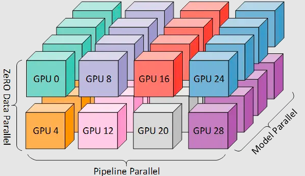

由于每个维度至少需要 2 个 GPU，因此在这里你至少需要 8 个 GPU 才能实现完整的 3D 并行。

### 1.3 ZeRO-DP + PP + TP

ZeRO，作为 DeepSpeed 的主要功能之一，它是 DP 的超级可伸缩增强版，并启发了 PyTorch FSDP 的诞生。通常它是一个独立的功能，不需要 PP 或 TP。但它也可以与 PP、TP 结合使用。

当 ZeRO-DP 与 PP 和 TP 结合使用时，通常只启用 ZeRO 阶段 1（**只对优化器状态进行分片**）。


而 ZeRO 阶段 2 还会**对梯度进行分片**，ZeRO 阶段 3 还会**对模型权重进行分片**。虽然理论上可以将 ZeRO 阶段 2 与 流水线并行一起使用，但它会对性能产生不良影响。**每个 micro batch 都需要一个额外的 reduce-scatter 通信来在分片之前聚合梯度**，这会增加潜在的显著通信开销。根据流水线并行的性质，我们会使用小的 micro batch ，并把重点放在算术强度 (micro batch size) 与最小化流水线气泡 (micro batch 的数量) 两者间折衷。因此，增加的通信开销会损害流水线并行。

此外，由于 PP，层数已经比正常情况下少，因此并不会节省很多内存。PP 已经将梯度大小减少了 `1/PP`，因此在此基础之上的梯度分片和纯 DP 相比节省不了多少内存。

除此之外，我们也可以采用 DP + TP 进行组合、也可以使用 PP + TP 进行组合，还可以使用 ZeRO3 代替 DP + PP + TP，ZeRO3 本质上是DP+MP的组合，并且无需对模型进行过多改造，使用更方便。

## 2.业界大模型混合并行策略

### 2.1 CodeGeeX（13B）

CodeGeeX 是一个具有 130 亿参数的多编程语言代码生成预训练模型。CodeGeeX 采用华为 MindSpore 框架实现，在鹏城实验室"鹏城云脑II"中的192个节点（共1536个国产昇腾910 AI处理器）上训练而成。CodeGeeX 历时两个月在20多种编程语言的代码语料库（> 8500 亿 Token）上预训练得到。

CodeGeeX 使用纯解码器的GPT架构，并使用自回归语言建模。CodeGeeX 的核心架构是39层的Transformer解码器。在每个Transformer层包含：多头自注意力模块、MLP模块、LayerNorm和残差连接。使用类GELU的FaastGELU激活，其在Ascend 910 AI处理器上更加高效，整个模型架构如下图所示：

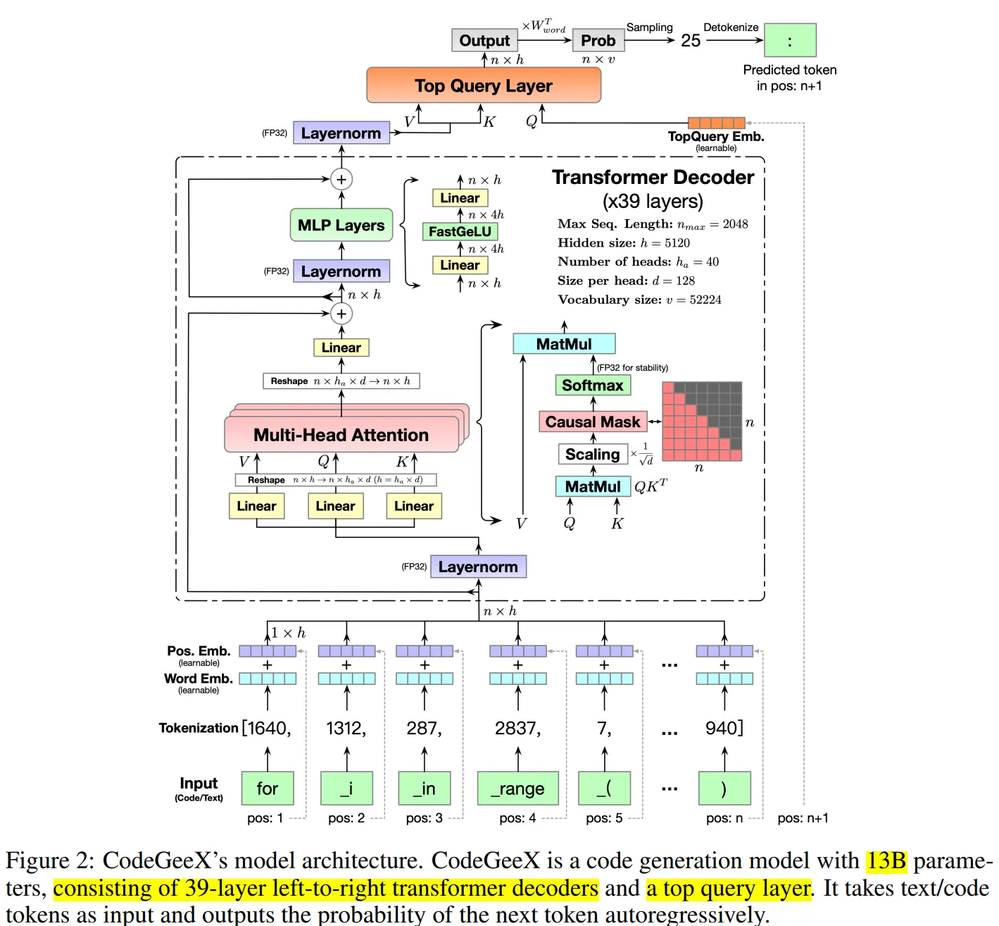

为了提高训练效率，CodeGeeX采用**8路模型并行组和192路数据并行组进行混合并行训练**；同时，启用 **ZeRO-2** 来进一步减少优化器状态的内存消耗。

### 2.2 GPT-NeoX（20B）

GPT-NeoX-20B 是一个具有 200 亿参数通用的自回归密集型预训练语言模型。在12 台 Supermicro AS-4124GO-NART 服务器上进行训练；其中，每台服务器配备 8 个 NVIDIA A100-SXM4-40GB GPU，并配置了两个 AMD EPYC 7532 CPU。 所有 GPU 都可以通过用于 GPUDirect RDMA 的四个 ConnectX-6 HCA 之一直接访问 InfiniBand 交换结构（switched fabric）。两台 NVIDIA MQM8700-HS2R 交换机（通过 16 个链路连接）构成了该 InfiniBand 网络的主干，每个节点的 CPU 插槽有一个链路连接到每个交换机。每个训练节点的架构图如下所示：


GPT-NeoX-20B 采用了数据并行、流水线并行和张量并行相结合的方式进行训练。

同时，作者发现，在给定硬件设置的情况下，最有效方法是将张量并行大小设置为 2，将流水线并行大小设置为 4。这允许最通信密集的进程，张量和流水线并行发生在节点内，数据并行通信发生在节点边界之间。

### 2.3 GLM（130B）

GLM-130B 是一个由清华开源的双语（中文和英文）双向稠密模型，拥有 1300 亿参数，模型架构采用通用语言模型（GLM）。在超过 4000 亿个文本标识符上预训练完成。GLM-130B 利用自回归空白填充作为其主要的预训练目标，以下图中的句子为例，它掩盖了随机的连续文本区间（例如，“complete unkown”），并对其进行自回归预测。


在实际训练中，GLM-130B 使用两种不同的掩码标识符（`[MASK]` 和 `[gMASK]`），分别用于短文和长文的生成。此外，它还采用了最近提出的旋转位置编码（RoPE）、DeepNorm 层规范化和高斯误差 GLU（GeGLU）技术。所有这些设计和技术都对 GLM-130B 大规模语言模型的稳定训练和高精度性能有所帮助。具体来说，GLM-130B 模型含有 70 层 Transformer，隐层维度 12,288，最大序列长度 2,048，以及一个基于 [icetk](https://link.juejin.cn?target=https://github.com/THUDM/icetk "icetk") 的 150,000 个标识符的双语分词器。

它的预训练目标由两部分组成：第一部分（95%）是自监督的预训练，即在公开的大规模语料库以及其他一些较小的中文语料库上的自回归空白填充。第二部分（5%）是在 T0++ 和 DeepStruct 中 70 个不同数据集的抽样子集上进行多任务指令预训练，格式为基于指令的多任务多提示序列到序列的生成。这种设计使 GLM-130B 可以在其他数据集上进行了零样本学习，以及从英文到中文的零样本迁移。

GLM-130B 的预训练持续了 60 天，使用 96 个 DGX-A100（40G）节点，共 768 张 GPU 卡。采用了**流水线模型并行与张量并行、数据并行策略相结合的方式**，形成 3D并行策略。

为了进一步减少流水线引入的气泡，利用 DeepSpeed 的 PipeDream-Flush 实现来训练具有相对较大的全局批量大小 (4,224) 的 GLM-130B，以减少时间和 GPU 内存浪费。 通过数值和实证检验，采用4路张量并行组和8路流水线并行组，达到每张 GPU（40G）135 TFLOP/s。

### 2.4 OPT（175B）

OPT-175B 是 Meta AI 开源的一个拥有 1750 亿参数的语言模型，利用**完全分片数据并行（FSDP）与 Megatron-LM 张量并行（8路组）** 在 992 个 80GB A100 GPU 上训练了 OPT-175B。训练数据包含180B个token，对应800GB的数据，持续训练了约33天。

每个 GPU 的利用率高达 147 TFLOP/s。 OPT-175B 将 Adam 状态使用 FP32，并将其分片到所有主机上；而模型权重则使用 FP16。为了避免下溢，使用了动态损失缩放。

### 2.5 Bloom（176B）

Bloom-176B 是一个拥有 1760 亿参数自回归大语言模型 (LLM)，它是迄今为止开源的最大的多语言（含46种自然语言和13种编程语言）大模型，整个模型架构如下图所示：


Bloom-176B 进行预训练时，在 384 张 NVIDIA A100 80GB GPU (48 个节点) 上使用了 3D 并行（数据并行、流水线并行、张量并行 ）策略，针对 350B 个Token 训练了大约 3.5 个月。


### 2.6 Megatron-Turing NLG（530B）

Megatron-Turing NLG-530B 是微软和英伟达联合推出的一个包含 5300 亿参数的自回归大语言模型。使用了 Transformer 解码器的架构，其中：Transformer层数、隐藏层维度、注意力头分别为 105、20480 和 128。 序列长度为2048，全局批量大小为1920。

在训练时，每个模型副本跨越 280 个 NVIDIA A100 GPU，节点内采用Megatron-LM 的 8 路张量并行组，节点间采用 35 路流水线并行组。整个训练过程一共使用了 4480 块英伟达 A100 GPU， 在 2700 亿个 Token 上面训练。

## 3.总结

本文主要讲解了常见的大模型分布式并行技术的组合策略，同时，也讲述了目前业界的一些大模型所使用的并行策略，具体如下表所示。

| 模型                       | DP  | TP | PP | ZeRO Stage | FSDP（ZeRO Stage 3） | GPUs                    | FP16/BF16 |
| ------------------------ | --- | -- | -- | ---------- | ------------------ | ----------------------- | --------- |
| Bloom-176B               | 8   | 4  | 12 | ZeRO-1     | -                  | 384 张 A100 80GB         | BF16      |
| CodeGeeX-13B             | 192 | 8  | -  | ZeRO-2     | -                  | 1,536 张 Ascend 910 32GB | FP16      |
| GLM-130B                 | 24  | 4  | 8  | ZeRO-1     | -                  | 768 张 A100 40G          | FP16      |
| OPT-175B                 | 124 | 8  | -  | -          | ✅                  | 992 张 80GB A100         | FP16      |
| Megatron-Turing NLG-530B | 16  | 8  | 35 | N/A        | -                  | 4480 张 A100 80G         | BF16      |
| GPT-NeoX-20B             | 12  | 2  | 4  | ZeRO-1     | -                  | 96 张 A100 40G           | FP16      |


# 7.自动并行

## 1.**简述**

自动并行的目标就是**用户给定一个模型和所使用的机器资源后，能够自动地帮用户选择一个比较好或者最优的并行策略来高效执行**。可以说，自动并行是分布式并行的终极目标，它能够解放工程师去手动设置分布式并行策略。

而自动并行可以分为**全自动并行**和**半自动并行**模式。

-   **半自动模式**下用户可以根据自己需要指定某些tensor和operator的切分方式。如：Mesh-TensorFlow、GShard、GSPMD 等提到的自动并行切分方案。
-   **全自动模式**下所有 tensor 和 operator 都由框架自适应选择最优切分策略。如：OptCNN、Flexflow、Unity、Alpa 等提到的全自动并行切分方案。

目前，很多的通用AI框架（如：PaddlePaddle、OneFlow、PyTorch、MindSpore、TensorFlow、JAX等）都对自动并行(全自动或半自动)进行了实现。

下面将分享一些典型的分布式训练自动并行方案。

## 2.**Mesh-TensorFlow**

### 2.1 **背景**

在深度学习中，由于数据量和计算量的庞大，往往会使用到分布式计算。而最常用的分布式模式是SPMD(Single-Program-Multiple-Data)，即数据并行，这种模式相当于在数据的batch维去做拆分；然后，进行并行。Mesh-Tensorflow对这种模式做了泛化，即**除了batch维外的其他维度也可做并行**。

### 2.2 **SPMD 的 batch 切分**

首先，回顾下之前的数据并行，每个设备上都有全部模型参数的备份，在每一次迭代中，数据首先被切分分发到各个设备上；然后，各个设备分别进行计算，得到的梯度再通过AllReduce进行聚合，然后再更新参数。

### 2.3 **Mesh-tensorflow 的切分**

分布式依赖的是数据分发和聚合，这点上面讲解的batch切分也是，但 Mesh-tensorflow 做了更泛化的抽象。

-   让Tensor的每一个维度都有名字。比如：如果每个样本都是一个向量，那么每次训练的输入x的维度就是`[batch, d_io]`。
-   类似的，**把处理器集群也表示成一个矩阵**，比如：一个二维的结构，表示成`[rows, cols]`。
-   定义一个computation layout，这个layout是从tensor维度到集群维度的一个二分图映射。例如，上面的batch切分可以表达为`[("batch", "all_processors")]`。

### 2.4 **Mesh-tensorflow 实现**

每个操作都通过并行计算和 collective communication 来完成，这里，我们介绍几个 Mesh-Tensorflow 中比较重要的操作。

-   **Component-wise Operations**: 所谓的component-wise，就是指输入和输出的维度相同。这一类的操作可以直接分布式的进行。
-   **Reduction(reduce\_sum, reduce\_max, etc)**: Reduction操作是指会消减维度的操作，这一类操作可以先在每个切片上操作，然后用MPI-allreduce来聚合。
-   **Einstin Summation(max multiplication, etc)**: Einstin操作是一组矩阵计算的统称，在 TensorFlow 中被实现成了一个可以配置的API，配置的方式就是用维度的名字来表达计算，这点其实和 Mesh-Tensorflow 异曲同工，所以可以很方便的实现。同样的，实现的方式就是先本地计算，然后再 MPI-AllReduce 。
-   **Reshape**: Reshape虽然简单，但是在分布式环境下却需要网络通信才能完成，不同的reshape需要的操作不同，涉及到的MPI通信包括MPI-allgather，MPI-alltoall等。

### 2.5 **小结**

Mesh-Tensorflow 定义了一套DSL语法，用于描述模型的维度和布局，你用它重写你的整个Model后，它自动帮你把模型和数据分割到多个TPU上。

另外，Mesh-Tensorflow 没有实现并行的卷积操作，因此，只适合 Language Model 这个领域。

除此之外，需要用 Mesh-Tensorflow 的语法重写你的整个模型，仔细思考维度，不仅工作量大，同时对代码侵入性强。

不同的 layout 会带来不同的性能，因此，可以考虑自动搜索最优的layout，但 Mesh-Tensorflow不支持。

## 3.**GSPMD**

通过扩大模型可以提高模型精度，扩展模型的应用范围。但这些模型往往需要在多个device上训练，产生了一些并行训练需求，如：数据并行（分割训练数据）、流水线并行（分割计算图），张量模型并行（分割每个模型层的权重和计算）。而 GSPMD 提出了一种基于 **tensor sharding annotations** 的系统，以一种统一的方法去表示不同的并行策略，包括上面提到的方法以及一些新的并行方法，如： image spatial partitioning（一种沿空间维度分割图像输入数据的技术，它有助于在内存容量有限的设备上拟合大型图像数据）和 weight-update/optimizer-state sharding（对数据并行的一种增强）。

### 3.1 **GSPMD 简介**

上面提到 GSPMD 基于 **tensor sharding annotations** 的系统，以一种统一的方法去表示不同的并行策略。

尽管流水线并行对图进行了划分，而不是对单个运算符/张量进行了划分，但 GSPMD 仍然可以在一个简单的包装库的帮助下实现，该包装库将流水线划分简化为一个张量/运算符划分问题。

GSPMD 有足够的灵活性来表达这些方法的组合，例如：不同的层可以用不同的方法进行分区，不同的方法可以在同一层中进行组合。

GSPMD 分离了机器学习模型编程和并行的问题。它允许用户用巨大的张量编写程序，就像有一个单一的巨大设备一样。然后，用户可以在一些地方插入注解，指定张量如何在设备间分布；GSPMD将在编译器pass执行，在整个计算图上完成分片规范，并将其转化为数学上等价的并行计算，在每个设备上运行。

这使得用户可以专注于模型的建立，而不是分片的实现，并且可以轻松地将现有的单设备程序移植到更大的规模上运行。为了实验不同的分片策略，只需注解重新配置即可。

GSPMD 解决了将自动分区应用于生产模型时的几个实际问题：

-   为每个分区生成一个程序会大大增加编译时间，所以 GSPMD 为所有分区生成一个程序。这一特性被称为单程序多数据(SPMD)，对于扩展到数以千计的分区至关重要。
-   GSPMD 支持不均匀分割的维度，使任何张量都可以在任意设备网格上进行分割。为了方便开发，加速器在编译时要求静态已知的形状，这通常是一个实际的限制。尽管支持不均匀的分片，GSPMD 与这种约束是兼容的。
-   GSPMD 作为 Production ML 编译器 XLA 的一个扩展来实现。该实现涵盖了 XLA 中的全部运算符，包括那些具有复杂语义的运算符，如卷积。XLA 是对多个框架(TensorFlow，Jax，Pytorch和Julia)和硬件平台(CPU，GPU和TPU)的统一抽象，使 GSPMD 可以重复使用。
-   GSPMD支持嵌套的并行模式；在per-operator层面，这意味着不同类型的维度可以在正交的device mesh中进行划分。GSPMD 已经为这种嵌套模式开发了一种递归方法，最大限度地提高了 GSPMD 的通用性，而不需要过多的手写分片规则.

### 3.2 **GSPMD 张量分片和自动完成**

GSPMD 为张量分片定义了一套直观且通用的表示。遵循分离设计的理念，GSPMD 有两个独立的编译器转换：sharding completion 和 per-operator partitioning。

GSPMD 具有一种机制，允许高级用户通过在子图中输入手动分区模式来精确控制子图的分区方式。 在这个子图中，用户用分片大小的形状编写程序； 在子图之外，程序仍然由编译器自动分区，并且有专门的转换节点在模式之间进行切换。

为了让 GSPMD 仍然可以对其他维度进行分区以实现数据或层内模型并行，GSPMD 扩展了手动模式以支持类似于部分复制的子组，即子组内的设备手动分区，而子组之间的设备自动分区。 在这种情况下，用作流水线阶段（stages）的设备组是手动子组。

GSPMD 根据有限的用户注解自动完成每个张量的分片。它是作为 XLA 中的编译器pass实现的。

### 3.3 **GSPMD SPMD 分片**

在实现 Partitioner 时有两个选项：

-   为每个Partitioner创建自定义程序（多个程序多份数据，MPMD）
-   创建一个程序适用于所有Partitioner（单个程序多份数据，SPMD）

GSPMD 选择 SPMD 是因为我们的目标是扩展到数千个 Partitioner，而在 MPMD 中，编译程序会变得非常慢。编译时间是一个重要的可用性问题，因为现代ML框架通常包括JIT优化和编译，特别是对于那些针对自定义加速器的框架。并行化编译可能不简单，因为不同程序中的操作符可能需要全局调度以维护正确的通信顺序。

但在 SPMD 中实现Partitioner同样会给生产ML编译器带来了独特的挑战。因此，GSPMD针对SPMD分区所面临的挑战提出了一系列解决这些问题的技术。

### 3.4 **小结**

总之，GSPMD 提出了一种基于编译器的、自动的、通用机器学习并行系统。它是一种半自动并行，用户手动配置部分的并行操作，然后它会对并行策略进行传播得到完成的并行策略。

## 4.**Flexflow**

### 4.1 **背景**

现有的深度神经网络训练通常需要使用数据并行或模型并行。但是这些策略在并行程度上通常无法达到最优。因此，本文定义了**一个 DNN 并行策略搜索空间（SOAP）**，其中，包括在Sample、Operator、Attribute和Parameter维度中并行 DNN 的策略；同时，本文还提出了 FlexFlow，这是一种深度学习框架，它使用 SOAP 空间的引导随机搜索来寻找针对特定的并行机器的快速的并行策略。

为了加速这种搜索，FlexFlow 引入了一种新颖的执行模拟器（execution simulator），它可以准确预测并行策略的性能，并且比之前直接执行每个策略的方法快三个数量级。

### 4.2 **SOAP 搜索空间**

下面来看看 DNN 并行策略的 SOAP 搜索空间。为了跨设备并行化 DNN 算子，我们要求每个设备计算operation输出张量的不相交子集。 因此，我们通过定义 oi 的输出张量如何分区来对 operation oi 的并行进行建模。

下图展示了一些算子样例的并行维度：

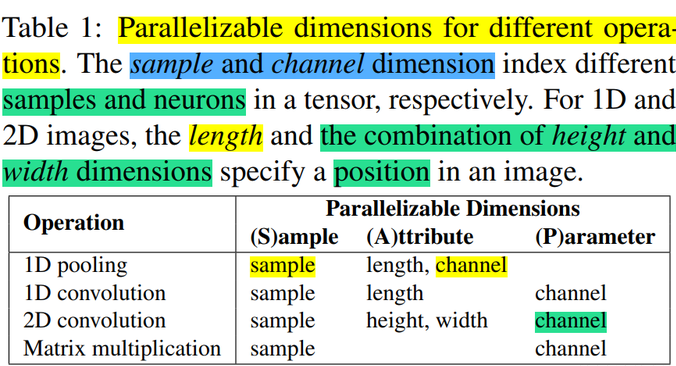

下图展示了一个矩阵乘法运算的并行配置示例：


总之，SOAP 维度的切分，是针对op的output tensor来切分的，选择了output tensor的多个维度：

-   Sample：表示 input 的 batch 维。
-   Attribute：表示 tensor 的属性维，例如：height/width。
-   Parameter：表示 tensor 的 param 维，例如：in-channel/out-channel。
-   Operator：表示 op 之间的切分维度。

虽然把 tensor 分成了多个维度，实际上都是属于 tensor 本身的维度。

### 4.3 **FlexFlow 整体框架**

FlexFlow 根据计算图和设备拓扑自动寻找并行策略。与现有框架相比，FlexFlow有两个优势：

-   **可编程性**。 对于在具有深度设备拓扑的集群上运行的具有复杂计算图的 DNN 应用程序，应用程序开发人员甚至领域专家都很难手动设计高效的operation分配。 FlexFlow 负责寻找高效的并行策略，并提供更高效的编程接口。
-   **可移植性**。 针对一个集群进行微调的并行策略可能在其他集群上表现不佳。 FlexFlow 的搜索方法会自动为每个硬件配置选择有效的策略，而无需更改应用程序。

FlexFlow 的总体框架如下图所示，其中：

-   Operator Graph：计算图的描述。包括op作为node，tensor作为edge。
-   Device topology：描述实际设备的topo关系，device作为node，connection作为edge。
-   Execution Optimizer：FlexFlow的核心部件，用于搜索最优的split方案，下方是一个运行时（Distributed Runtime），用于执行split方案。

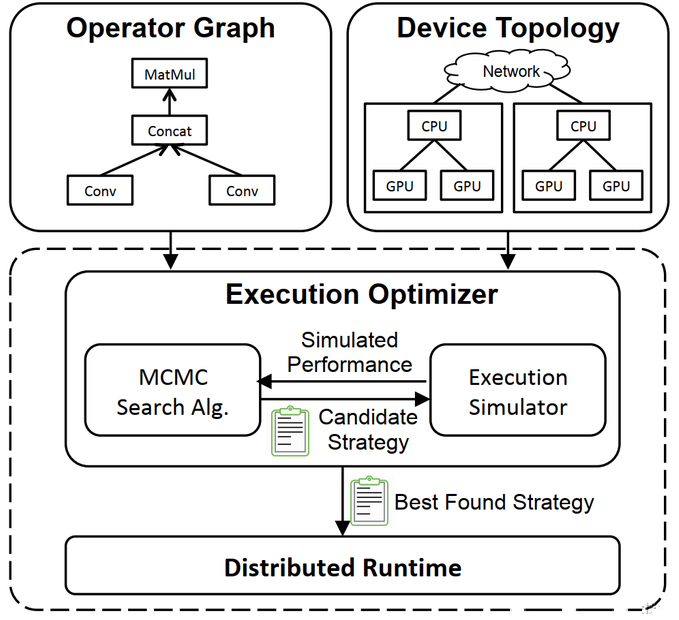

### 4.4 **执行模拟器（Execution Simulator）**

执行模拟器是FlexFLow中比较核心的部分，负责对提出的策略做评估，得到候选者的性能数据。

这里为了提高评估的速度，没有使用直接执行的方式，而是用模拟执行。还是正常去构建执行timelines，但是需要在device上执行时，直接从上一次执行相同input-size的数据中取得执行时间，这样降低了总体的执行时间。这里是假设op针对相同input-size的执行时间基本不变，而且跟input-data无关。在大多数模型中，这个假设都是成立的。

-   输入：算子计算图G，设备拓扑结构D，并行策略S
-   输出：执行时间
-   simulator的重要假设：
-   1）每个task的执行时间都是可预测的，波动小，与input tensor的内容无关。
-   2）不同设备之间传输数据的时间为**数据大小/带宽**。
-   3）每个设备按照FIFO的顺序执行任务（GPU就是这样的）。
-   4）每个设备在完成一个任务后，只要下一个任务的数据准备就绪就立刻开始执行下一个任务，overhead可忽略不计。

为了模拟一次执行，模拟器首先建立一个Task Graph，然后运行模拟算法。

**任务图（Task Graph）：**

构建任务图时，每个op对应的split都会变成一个normal task。task之间的数据通信作为communication task。

graph的edge表示的是task之间的依赖关系，即计算先后关系，而不是数据流方向。

在构建任务图的时候，就把每个task的execTime填入了。normal task 的 execTime 是在 device 上多次执行的平均耗时，这里 cache 之后，会一直使用。communication task 的 execTime 是用 tensor size / bandwidth 得到。

**模拟算法类型：**

-   全模拟算法 ：首先用 Dijkstra 算法遍历，所有任务都被放到一个队列里，出队列的顺序是按照ready time 的增序。该算法最终返回所有任务中最慢的一个执行完所需时间。
-   Delta 模拟算法：使用一种 MCMC 搜索算法，每次只改变一个 op 的划分方式。这种情况下，前后两个策略的时间通常没有改变。Delta 模拟算法只重新模拟改变最终结果的 op。

对于同样的任务图，full和delta的模拟算法会给出同样的结果。

### 4.5 **执行优化器（Execution Optimizer）**

执行优化器以运算符图和设备拓扑作为输入，并自动找到有效的并行化策略。

-   输入：算子计算图G，设备拓扑结构D
-   输出：最有效的并行策略

问题抽象为最小化总执行时间，这个方法避免了平衡执行时间和通信时间二者的问题。

FlexFlow 使用模拟器作为预言机，将并行优化问题转化为cost最小化问题，即最小化预测执行时间。 这种方法的主要优点是，它避免了显式地编码相互依赖的优化之间的权衡（例如：减少数据传输与平衡工作负载分布），而只是专注于最小化应用程序的整体执行时间。

通过从最小整体执行时间找到最佳并行化策略是 NP-hard 问题。 可能的策略数量与运算符图中的op数量成指数关系，这使得穷举搜索空间变得困难。

为了找到低成本策略，FlexFlow 使用成本最小化搜索程序来启发式探索空间并返回发现的最佳策略。

### 4.6 **FlexFlow 运行时环境**

现有的深度学习系统（例如 TensorFlow 、PyTorch 、Caffe2 和 MXNet ）仅支持通过数据并行在batch维度中并行操作，在这些系统中，并行其他维度或多个维度组合的操作并非易事。

为了支持使用并行空间中定义的任何策略并行 DNN 模型，本文在 Legion（论文：**Legion: Expressing locality and independence with logical regions**） 中实现了 FlexFlow 分布式运行时，这是一种用于分布式异构架构的高性能并行运行时，并使用 cuDNN 和 cuBLAS 作为处理 DNN 算子的底层库。

本文使用 Legion 高维分区接口来支持可并行维度的任意组合的并行操作，并使用 Legion 的细粒度控制机制来控制每个算子粒度的并行。

FlexFlow 运行时与现有系统之间的主要区别在于，FlexFlow 支持以可并行维度的任意组合并行算子，并以单个算子的粒度控制并行。

### 4.7 **小结**

总之，FlexFlow 最核心工作就是提出了 execution simulator 来完善 cost model 。

## 5.**Alpa**

### 5.1 **背景**

现有的一些方案要么被限制在单个并行方法 (PipeDream)，要么依赖于对模型和集群规格的强假设 (DAPPLE，Tofu)。同时，自动混合并行的搜索空间较复杂，多并行策略的实现不够灵活。除此之外，不同的并行技术是有不同的带宽要求的。

因此，Alpa采用在不同的系统层次使用不同的并行技术，提出了的算子间和算子内并行自动并行方案。

### 5.2 **Alpa 技术原理**

Alpa提出的算子间、算子内并行划分方法，通过"是否切分了tensor的维度"来区分不同的并行。

-   算子内并行（intra-op）：切分了tensor维度的并行方式，包括数据并行和算子并行（即张量模型并行）。
-   算子间并行（inter-op ）：不切分tensor，只是把子图进行不同的摆放分布，包括流水线并行。

算子内并行可充分利用带宽，切分带来的通信基本属于高效的集合通信。而算子间并行若切点寻找的合适，则通信较小，但同步版本的策略无可避免的会引来 Bubble。所以，可以利用集群的非对称特性，将算子内并行映射到高带宽互联的Devices上；将算子间并行映射到低带宽互联的Devices上。如此组合，就能释放更大的算力，Alpa会自动探索这些策略及组合情况。

Alpa 先通过动态规划（DP）来决定模型怎么切分成 stage，每个 stage 能分到哪些卡。然后在每个 stage 内部，再通过整数线性规划（ILP）的方式来决定每个 op 是如何切分到这个 stage 的多个卡上，这是一个自动优化的过程。


自动分配流水线并行的具体示例如下所示：

```python
alpa.init(cluster="ray")

# 定义并行方法
# `alpa.AutoLayerOption(layer_num=2)` means we use the auto layer construcion
# algorithm to cluster primitive operators into two layers.
# `stage_option="auto"` means we enable the auto stage construction algorithm.
method = alpa.PipeshardParallel(num_micro_batches=16,
                                layer_option=alpa.AutoLayerOption(layer_num=2),
                                stage_option="auto")

# 定义训练Step
@alpa.parallelize(method=method)
def auto_pipeline_train_step(state, batch):

    def loss_func(params):
        out = state.apply_fn(params, batch["x"])
        loss = jnp.mean((out - batch["y"])**2)
        return loss

    # Again, we use `alpa.grad` here to separate the apply gradient stage with
    # the forward/backward stages in the pipeline.
    grads = alpa.grad(loss_func)(state.params)
    new_state = state.apply_gradients(grads=grads)
    return new_state

# 在第一次调用中，alpa 触发编译。编译首先分析成本（cost）并解决优化问题以获得最佳流水线分配。
auto_pipeline_actual_state = auto_pipeline_train_step(state, batch)
assert_allclose(expected_state.params,
                auto_pipeline_actual_state.params,
                atol=5e-3)

alpa.shutdown()
```

在 Alpa 开源仓库中，也提供了基于 OPT 大模型进行自动并行的微调\*\*[案例](https://link.zhihu.com/?target=https://github.com/alpa-projects/alpa/tree/main/examples/opt_finetune "案例")\*\*。

### 5.3 **Alpa 的执行过程**

Alpa 高度依赖 JAX，它魔改了 XLA （JAX 底层通过 XLA 执行）中的 GSPMD，拿到 XLA 的计算图后，自动对 op 进行切分，生成对应的程序，在每个 worker 上执行。

### 5.4 **Alpa 的创新之处**

旧有的方案往往焦点在 inter-op，intra-op 和自动并行策略搜索的一个或者两个点，而 Alpa 兼顾了所有；比如：在 GShard 中提出了 intra-op 的方式，GPipe 提出 inter-op 的方式，Megatron-LM v2 则通过结合 inter-op 和 intra-op 的方式，通过人工指定的并行策略来支持分布式训练 GPT 模型。微软 DeepSpeed 提出的 ZeRO 技术试图通过自动的策略，通过多个层级步骤，来优化数据并行中的显存使用。而 Alpa 首先做 inter-op 的自动切分，然后用 intra-op 的层级调度方式，从而达到兼顾所有的优化策略。可以说，Alpa 是当今为止自动并行的集大成者，后续工作要想突破它相当困难。


# 8.moe并行

## 1.MOE

通常来讲，模型规模的扩展会导致训练成本显著增加，计算资源的限制成为了大规模密集模型训练的瓶颈。为了解决这个问题，一种基于稀疏 MoE 层的深度学习模型架构被提出，即**将大模型拆分成多个小模型(专家，****`expert`****)， 每轮迭代根据样本决定激活一部分专家用于计算，达到了节省计算资源的效果；** 并引入可训练并确保稀疏性的门( `gate` )机制，以保证计算能力的优化。

与密集模型不同，MoE 将模型的某一层扩展为多个具有相同结构的专家网络( `expert` )，并由门( `gate` )网络决定激活哪些 `expert` 用于计算，从而实现超大规模稀疏模型的训练。

以下图为例，模型包含 3 个模型层，如(a)到(b)所示，将中间层扩展为具有 `n` 个 `expert` 的 MoE 结构，并引入 `Gating network` 和 `Top_k` 机制，MoE 细节如下图(c)所示。


计算过程如下述公式。

$$
M o E(x)=\sum_{i=1}^{n}\left(G(x)_{i} E_{i}(x)\right) ~~~~~~~~~~~~~~~~(1)
$$

$$
G(x)=\operatorname{Top} K\left(\operatorname{softmax}\left(W_{g}(x)+\epsilon\right)\right) ~~~~~~(2)
$$

上述第 1 个公式表示了包含 `n` 个专家的 MoE 层的计算过程。具体来讲，首先对样本 `x` 进行门控计算， `W` 表示权重矩阵；然后，由 `Softmax` 处理后获得样本 `x` 被分配到各个 `expert` 的权重； 然后，只取前 `k` (通常取 1 或者 2）个最大权重；最终，整个 `MoE Layer` 的计算结果就是选中的 `k` 个专家网络输出的加权和。

## 2.MOE分布式并行策略

上面讲述了 MOE 整体结构，下面来讲述含MOE架构的模型的分布式并行策略。


### 2.1 MOE + 数据并行

该策略是在数据并行模式下包含MOE架构，门网络(gate)和专家网络都被复制地放置在各个运算单元上。下图展示了一个有三个专家的两路数据并行MoE模型进行前向计算的方式。


该方式通常来说，对于现有的代码侵入性较小。但该方式唯一的问题是，专家的数量受到单个计算单元(如：GPU)的内存大小限制。

### 2.2 MOE + 模型并行

该策略门网络依然是复制地被放置在每个计算单元上， 但是专家网络被独立地分别放置在各个计算单元上。因此，需引入额外的通信操作，该策略可以允许更多的专家网络们同时被训练，而其数量限制与计算单元的数量(如：GPU数量)是正相关的。

下图展示了一个有六个专家网络的模型被两路专家并行地训练。注意：专家1-3被放置在第一个计算单元上，而专家4-6被放置在第二个计算单元上。


该模式针对不同的模型和设备拓扑需要专门的并行策略，同时会引入额外的通信，因此，相较于数据并行+MOE策略，侵入性更强。

除了上述两种MOE并行方案之外，还可以**MOE+数据并行+模型并行**、**MOE+ZeRO增强的数据并行**等。

## 3.业界大模型的MOE并行方案

### 3.1 GShard

GShard 是第一个将 MoE 的思想拓展到 Transformer 上的工作。具体的做法就是把 **Transformer 的 encoder 和 decoder 中每隔一个（every other）的FFN层，替换成 position-wise 的 MoE 层，使用的都是 Top-2 gating network**。


此处之外，GShard还加入了很多其他设计：

-   **Expert capacity balancing**：强制每个expert处理的tokens数量在一定范围内。
-   **Local group dispatching**：通过把一个batch内所有的tokens分组，来实现并行化计算。
-   **Auxiliary loss**：为了缓解“赢者通吃”问题，尽可能把token均分给各个专家。
-   **Random routing**：在Top-2 gating的设计下，两个expert如何更高效地进行routing。

### 3.2 Switch-Transformer

Switch-Transformer 是在T5模型的基础上加入了 MoE 设计，并在C4数据集上预训练，得到了一个“又快又好”的预训练大模型。

Swith Transformer 简化了MoE的routing算法，从而大大提高了计算效率，具体如下图所示：


Swith Transformer 其设计的指导原则是以一种简单高效的实现方式**尽可能地把Transformer模型的参数量做大**。跟其他MoE模型的一个显著不同就是，**Switch Transformer 的 gating network 每次只 route 到 1 个 expert**，而其他的模型都是至少2个。这样就是最稀疏的MoE了，因此单单从MoE layer的计算效率上讲是最高的了。

### 3.3 GLaM

这是 Google 在2021年底推出的一个超大模型，完整的 GLaM 总共有 1.2T 参数，每个 MoE 包含 64 个专家，总共 32 个 MoE 层，但在推理期间，模型只会激活 97B 的参数，占总参数的 8%。

GLaM 的体系架构，**每个输入 token 都被动态路由到从 64 个专家网络中选择的两个专家网络中进行预测**，如下图所示。


GLaM比GPT-3大7倍，但是由于使用了Sparse MoE的设计，训练成本却只有GPT-3的1/3，并且推理过程中的计算量减少了约一半；同时，在29个NLP任务上超越了GPT-3。


## 4.AI训练框架中的MOE并行训练

从 Google 发布的很多的论文和超大参数规模模型（千/万亿参数）可以看到，其基本都使用了 MOE 架构。除此之外，业界很多的AI训练框架中也继承了 MOE 并行，比如：PaddlePaddle、DeepSpeed、ColossalAI等。

### 4.1 PaddlePaddle 中的 MOE 并行

下面是一个在动态图模式下使用 PaddlePaddle 框架进行 MoE 架构的适配和训练示例。

```python
# 导入需要的包
import paddle
from paddle.nn import Layer, LayerList, Linear, Dropout
from paddle.incubate.distributed.models.moe import MoELayer
from paddle.distributed.collective import Group
from paddle.distributed import fleet
import numpy as np

# 专家数
num_experts = 8

d_model = 512
d_hidden = 2048


# 封装专家层
class ExpertLayer(Layer):
    def __init__(self, d_model, d_hidden, name=None):
        super().__init__()
        self.htoh4 = Linear(d_model, d_hidden)
        self.h4toh = Linear(d_hidden, d_model)

    def forward(self, x):
        x = self.htoh4(x)
        x = self.h4toh(x)
        return x


# 初始化分布式环境，并构建 expert 通信组 moe_group
fleet.init(is_collective=True)
moe_group = paddle.distributed.new_group(list(range(fleet.worker_num())))


gate_config = {
    "type": "gshard",
    "top_k": 2,
}


experts_list = LayerList()
for expi in range(num_experts):
    exp_layer = ExpertLayer(d_model, d_hidden)
    experts_list.append(exp_layer)


# 调用 MoELayer API 封装并创建出 MoE 模型
class Model(Layer):
  def __init__(self, d_model, d_hidden, name=None):
      super().__init__()
      self.linear1 = Linear(d_model, d_model)
      self.moe_layer = MoELayer(d_model = d_model,
                              experts=experts_list,
                              gate=gate_config,
                              moe_group=moe_group,
                              recompute_interval=0)

      self.linear2 = Linear(d_model, d_model)
      self.dropout = Dropout(p=0.1)

  def forward(self, x):
      x = self.linear1(x)
      x = self.moe_layer(x)
      x = self.linear2(x)
      x = self.dropout(x)
      return x


model = Model(d_model, d_hidden)
optim = paddle.optimizer.SGD(parameters=model.parameters())

# 创建数据集，开始训练
for step in range(1, 100):
    x = paddle.rand([4, 256, d_model])

    y = model(x)
    loss = y.mean()
    loss.backward()
    optim.step()

    optim.clear_grad()

    print("=== step : {}, loss : {}".format(step, loss.numpy()))

```

### 4.2 DeepSpeed 中的 MOE 并行

DeepSpeed中也提供了对 MOE 并行的支持。目前，DeepSpeed MoE 支持五种不同的并行形式，可以同时利用GPU和CPU内存，具体如下表所示。

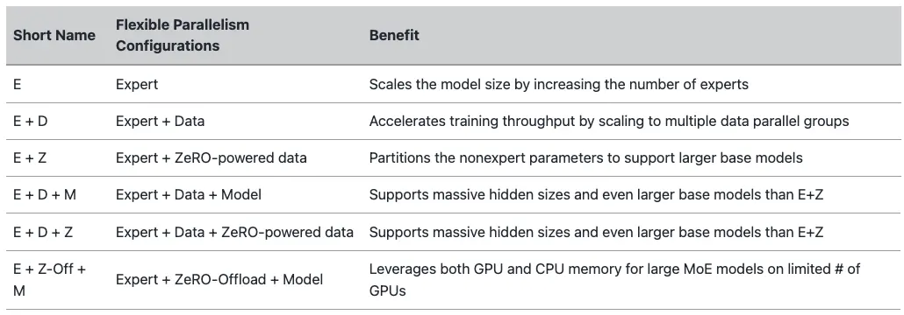

下面是使用 ZeRO-Offload (stage 2) 和 DeepSpeed MOE组合的样例：

```python
# MOE 模型架构
class Net(nn.Module):
    def __init__(self):
        super(Net, self).__init__()
        self.conv1 = nn.Conv2d(3, 6, 5)
        self.pool = nn.MaxPool2d(2, 2)
        self.conv2 = nn.Conv2d(6, 16, 5)
        self.fc1 = nn.Linear(16 * 5 * 5, 120)
        self.fc2 = nn.Linear(120, 84)
        if args.moe:
            # MoE 层
            fc3 = nn.Linear(84, 84)
            self.moe_layer_list = []
            for n_e in args.num_experts:
                # 基于专家数创建 MOE 层
                self.moe_layer_list.append(
                    deepspeed.moe.layer.MoE(
                        hidden_size=84,
                        expert=fc3,
                        num_experts=n_e,
                        ep_size=args.ep_world_size,
                        use_residual=args.mlp_type == 'residual',
                        k=args.top_k,
                        min_capacity=args.min_capacity,
                        noisy_gate_policy=args.noisy_gate_policy))
            self.moe_layer_list = nn.ModuleList(self.moe_layer_list)
            self.fc4 = nn.Linear(84, 10)
        else:
            # 原始模型层
            self.fc3 = nn.Linear(84, 10)

    def forward(self, x):
        x = self.pool(F.relu(self.conv1(x)))
        x = self.pool(F.relu(self.conv2(x)))
        x = x.view(-1, 16 * 5 * 5)
        x = F.relu(self.fc1(x))
        x = F.relu(self.fc2(x))
        if args.moe:
            # 将原始 FFN 层替换成 MoE 层
            for layer in self.moe_layer_list:
                x, _, _ = layer(x)
            x = self.fc4(x)
        else:
            x = self.fc3(x)
        return x


net = Net()


# 组合 ZeRO-Offload (stage 2) 和 DeepSpeed MOE
def create_moe_param_groups(model):
    from deepspeed.moe.utils import split_params_into_different_moe_groups_for_optimizer

    parameters = {
        'params': [p for p in model.parameters()],
        'name': 'parameters'
    }

    return split_params_into_different_moe_groups_for_optimizer(parameters)


parameters = filter(lambda p: p.requires_grad, net.parameters())
if args.moe_param_group:
    parameters = create_moe_param_groups(net)


ds_config = {
  "train_batch_size": 16,
  "steps_per_print": 2000,
  "optimizer": {
    "type": "Adam",
    "params": {
      "lr": 0.001,
      "betas": [
        0.8,
        0.999
      ],
      "eps": 1e-8,
      "weight_decay": 3e-7
    }
  },
  "scheduler": {
    "type": "WarmupLR",
    "params": {
      "warmup_min_lr": 0,
      "warmup_max_lr": 0.001,
      "warmup_num_steps": 1000
    }
  },
  "gradient_clipping": 1.0,
  "prescale_gradients": False,
  "bf16": {
      "enabled": args.dtype == "bf16"
  },
  "fp16": {
      "enabled": args.dtype == "fp16",
      "fp16_master_weights_and_grads": False,
      "loss_scale": 0,
      "loss_scale_window": 500,
      "hysteresis": 2,
      "min_loss_scale": 1,
      "initial_scale_power": 15
  },
  "wall_clock_breakdown": False,
  "zero_optimization": {
      "stage": args.stage,
      "allgather_partitions": True,
      "reduce_scatter": True,
      "allgather_bucket_size": 50000000,
      "reduce_bucket_size": 50000000,
      "overlap_comm": True,
      "contiguous_gradients": True,
      "cpu_offload": True
  }
}

# 初始化
model_engine, optimizer, trainloader, __ = deepspeed.initialize(
    args=args, model=net, model_parameters=parameters, training_data=trainset, config=ds_config)
...
```

## 5.总结

本文简要介绍了目前业界的一些 MOE 并行方案。如果说Transformer结构使得模型突破到上亿参数量，那么稀疏 MoE 结构可以在不显著增加计算成本的情况下，使模型参数量进一步突破，达到上千亿、万亿规模。虽然，1990年左右 MOE 的概念就已经出现了；但是可以预见，MOE 将在通往AGI的道路上扮演越来越重要的角色。


# 9.总结

## 1.数据并行

数据并行，由于其原理相对比较简单，是目前使用最广泛的分布式并行技术。**数据并行不仅仅指对训练的数据并行操作，还可以对网络模型梯度、权重参数、优化器状态等数据进行并行**。


我们首先以PyTorch 数据并行的发展（DataParallel、DistributedDataParallel、FullyShardedDataParallel）为主线进行讲述了数据并行的技术原理。同时，也简述了 DeepSpeed 中的增强版数据并行ZeRO。

## 2.流水线并行

所谓流水线并行，就是由于模型太大，无法将整个模型放置到单张GPU卡中；因此，**将模型的不同层放置到不同的计算设备，降低单个计算设备的显存消耗，从而实现超大规模模型训练**，也被称为**层间模型并行**。

我们首先讲述了朴素流水线并行，但是，朴素流水线并行存在的Bubble太大，导致GPU的利用率很低。为了减少Bubble率，后面又讲述了微批次流水线并行方案GPipe，虽然，GPipe可以显著提高GPU的利用率，但是GPipe采用的是F-then-B 模式（先进行前向计算，再进行反向计算），由于缓存了多个 micro-batch 的中间变量和梯度，因此，显存的实际利用率并不高。后来，我们又讲述了采用1F1B模式（前向计算和反向计算交叉进行，可以及时释放不必要的中间变量）的PipeDream及其变体（PipeDream-2BW、PipeDream-Flush等）来进一步节省显存，训练更大的模型。同时，还提到了常见的AI训练框架中采用的流水线并行方案。

## 3.张量并行

**将计算图中的层内的参数（张量）切分到不同设备（即层内并行），每个设备只拥有模型的一部分，以减少内存负荷**，我们称之为张量模型并行。按照行或者列的切分方式，可将张量并行切分为对应的行并行或者列并行。我们首先介绍了由Megatron-LM提出的仅对权重进行划分的1D张量并行。为了应对超大规模的AI模型，后来又介绍了由 Colossal-AI 提出的多维（2/2.5/3 维）张量并行。2D张量并行提出了针对激活进行切分。该并行方式降低了内存成本，但是却引入更多的通信成本。而2.5D张量通过增加更多的设备来减少通信的开销。而为了进一步减少内存冗余和通信开销，后续有提出了3D张量并行。除此之外，我们还谈到了PyTorch2.0中，开始对张量并行进行支持。

## 4.序列并行

序列并行，目前并没有一个统一的定义。我们主要介绍了两篇关于序列并行的工作。

-   第一篇是 Colossal-AI 发表的论文：Sequence Parallelism: Long Sequence Training from System Perspective
-   第二篇是 Megatron-LM 发表的论文：Reducing Activation Recomputation in Large Transformer Models

虽然两者都叫序列并行（Sequence Parallelism），但是实际上解决的问题、方法都不一样。前者主要是解决模型的输入长度(sequence length)限制，而后者是主要是减少模型显存的。

同时，还谈到了在PyTorch2.0的版本中提供了对序列并行的支持，不过目前还没有realease。

## 5.多维混合并行

前面讲述了数据并行、张量并行、流水线并行等多种并行技术，但在进行上百亿/千亿级以上参数规模的超大模型预训练时，我们通常会组合多种并行技术一起使用。

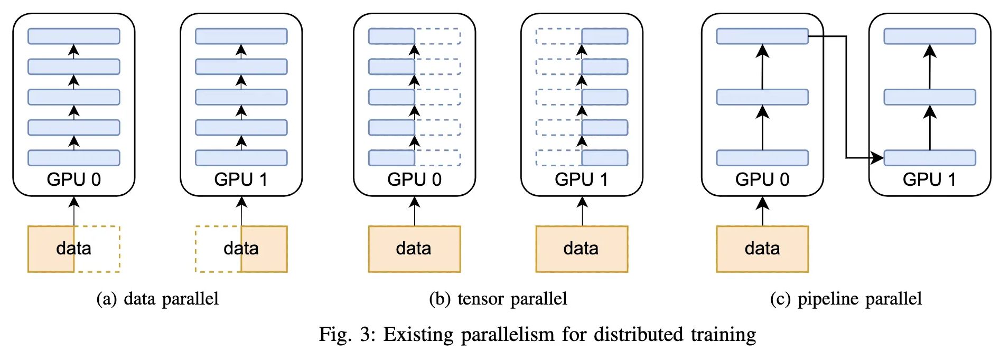

我们对目前常见的分布式并行技术组合策略进行了探讨，同时，还讲述了目前业界知名大模型中所采用的多维混合并行方案。


## 6.自动并行

大模型的分布式训练是一个非常复杂的问题，目前的绝大多数的分布式训练系统，都依赖用户人工反复尝试以及系统专家经验来进行部署，造成严重的资源利用效率低下的问题。因此，我们讲述了自动并行技术。主要针对目前一些经典的半自动（Mesh-tensorflow、GSPMD）或全自动（FlexFlow、Alpa）并行方案进行了相应的探讨。但目前自动并行方案在工业界落地的应用比较少。

## 7.MOE并行

现在的模型越来越大，训练样本越来越多，每个样本都需要经过模型的全部计算，这就导致了训练成本的平方级增长。而当我们希望在牺牲极少的计算效率的情况下，把模型规模提升上百倍、千倍，通常就需要使用 **MOE并行**。我们对带MOE结构的分布式并行策略进行了讲解，同时，也讲述了业界的一些超大模型（Switch-Transformer、GLaM）的MOE并行方案。


## 8.分布式训练并行策略选择

上面讲述了各种分布式并行策略，以下是进行分布式训练时针对不同的服务器资源类型（单机多卡、多机多卡），如何选择并行策略非常粗略的概述。

### 8.1 单机单卡场景

当你的模型可以在单张 GPU 卡进行训练时，正常使用。

当你的模型不能在单张 GPU 卡进行训练时，

-   ZeRO + Offload CPU 和 NVMe（可选的）。
-   启用以**内存为中心的平铺** 。

如果最大层无法放置在单张GPU，则使用 ZeRO - 启用以**内存为中心的平铺** (MCT)。 它允许您通过自动分割层并按顺序执行来运行任意大的层。 MCT 减少了 GPU 上实时参数的数量，但不影响激活内存。

### 8.2 单机多卡场景

当你的模型可以在单张 GPU 卡进行训练时，可以选择 DDP 或 ZeRO：

-   DDP：分布式 DP。
-   ZeRO：可能会更快，也可能不会更快，具体取决于所使用的情况和配置。

当你的模型不能在单张 GPU 卡进行训练时，可以选择 PP、ZeRO、TP：

-   PP
-   ZeRO
-   TP

如果使用 NVLINK 或 NVSwitch 进行节点内通信，这三者应该基本处于同等水平。

如果没有这些， PP 将比 TP 或 ZeRO 更快。 TP 的大小也可能产生影响，最好在您特定设置上进行试验以找到最优的方式。

注意： TP 几乎总是在单个节点内进行使用。 即：TP 大小 <= 每个节点的 GPU 数。

### 8.3 多机多卡场景

当服务器节点间网络通信速度较快时，可以选择 ZeRO、PP+TP+DP：

-   ZeRO - 因为它几乎不需要对模型进行任何修改。
-   PP+TP+DP - 通信较少，但需要对模型进行大量更改。

当您服务器节点间网络通信速度较慢，并且 GPU 内存仍然不足时，可以选择 DP+PP+TP+ZeRO-1。

这里采用 PP 与 ZeRO-1 进行混合并行，**那么 PP 能与 DeepSpeed ZeRO 2/3一起训练吗**？

答：PP + ZeRO 2/3 不推荐一起训练。 PP 需要累积梯度（accumulate gradients），但 ZeRO2 需要对梯度进行分块（chunk）。 即使能够实现，也没有真正的性能提升。

将两者结合使用来提高效率并不容易，PP + ZeRO 2 实际上比 ZeRO2（无 PP）更慢且内存效率低。如果用户内存不足，用户可以使用 ZeRO3 代替 ZeRO2 + PP。而正因为如此，在 DeepSpeed 中， PP + ZeRO 2/3 之间不兼容。但可以将 PP 与 ZeRO 1 进行组合使用。

这里多说一点：即使该方法效率不高，但是 ColossalAI 为了支持更多的并行训练方法。ColossalAI 还是提供了 ZeRO 3 + PP + TP 一起组合的方案。

参考：

-   [Details about pipeline parallelism implementation in DeepSpeed · Issue #1110 ·](https://github.com/microsoft/DeepSpeed/issues/1110 "Details about pipeline parallelism implementation in DeepSpeed · Issue #1110 ·")
-   [DeepSpeed/deepspeed/runtime/pipe/engine.py ](https://github.com/microsoft/DeepSpeed/blob/master/deepspeed/runtime/pipe/engine.py "DeepSpeed/deepspeed/runtime/pipe/engine.py ")
-   [How PP and ZeRO stage 2+ work together? · Issue #682](https://github.com/hpcaitech/ColossalAI/issues/682 "How PP and ZeRO stage 2+ work together? · Issue #682")
-   [\[zero\] ZeRO supports pipeline parallel by ver217 · Pull Request #477 ](https://github.com/hpcaitech/ColossalAI/pull/477 "\[zero] ZeRO supports pipeline parallel by ver217 · Pull Request #477 ")

## 9.大模型混合进度训练FP16 与 BF16 的对比

目前，进行大模型训练的时候，为了节约显存，混合精度训练基本上已经成为了标配。而FP16混合精度已经成为主流大规模模型训练框架的默认选项，用于训练十亿到百亿规模的模型。但是用 FP16 训练巨型 LLM 模型却是一个禁忌，它将面临更多的稳定性挑战。

FP16 会经常溢出，导致数值不稳定、模型不收敛的情况！


为了避免溢出，这意味着你的权重必须保持很小。一种称为**损失缩放 (loss scaling) 的技术**有助于缓解这个问题，但是当模型变得非常大时，FP16 较小的数值范围仍然是一个问题。因此，你需要采用一些训练策略来稳定巨型模型的训练。

作为补救措施，NVIDIA Ampere GPU 提供了BF16浮点格式来缓解FP16的问题。但目前，但目前，**BF16在一些平台上不被支持（因此，它的使用的可能广泛性会被限制）**。当使用 BF16 时，BF16 为指数保留了 8 位 (与 FP32 相同)，为小数保留了 7 位。这意味着使用 BF16 我们可以保留与 FP32 相同的动态范围。但代价就是它的精度非常差（相对于 FP16，损失了 3 位精度）。但是在训练时，采用的随机梯度下降法及其变体，该方法有点像蹒跚而行，如果你这步没有找到完美的方向其实没关系，你会在接下来的步骤中纠正自己。无论使用 BF16 还是 FP16，都有一个权重副本始终在 FP32 中 —— 这是由优化器更新的内容。 16 位格式仅用于计算，**优化器以全精度更新 FP32 权重**，然后将它们转换为 16 位格式以用于下一次迭代。因此，不会发生精度损失。


虽然，之前有一些巨型大模型使用了 FP16 进行混合进行训练，但是从OPT-175、Bloom-176B、GLM130B的训练报告来看，BF16 是更佳的一个解决方案，可以规避很多不必要的烦恼。

