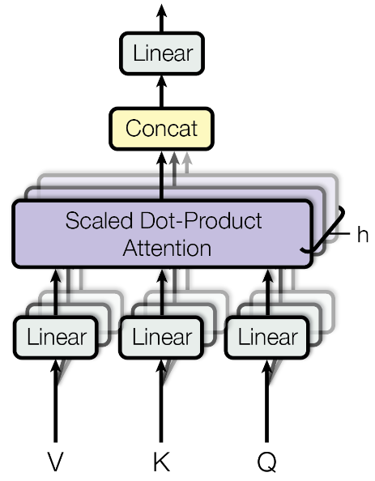
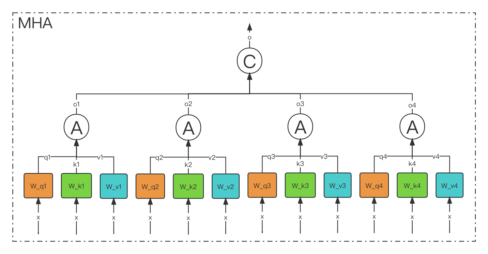
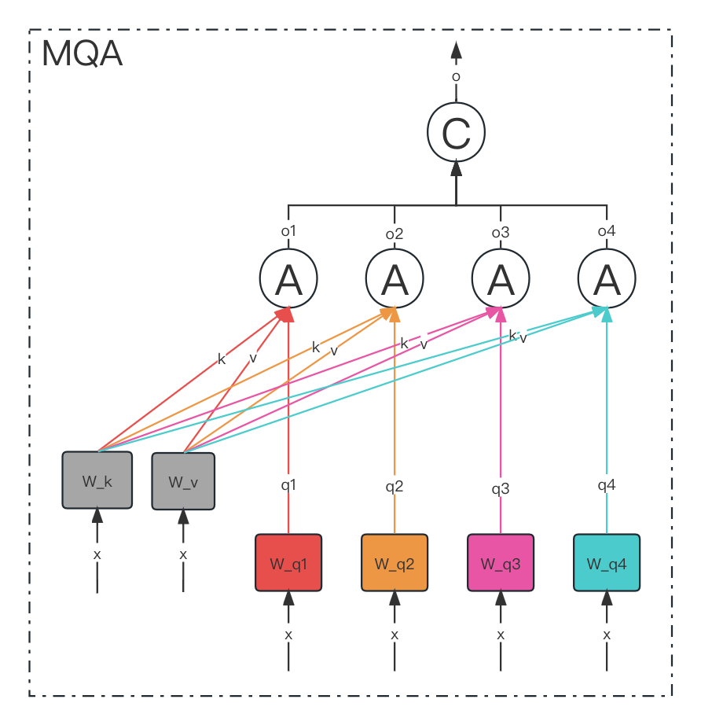
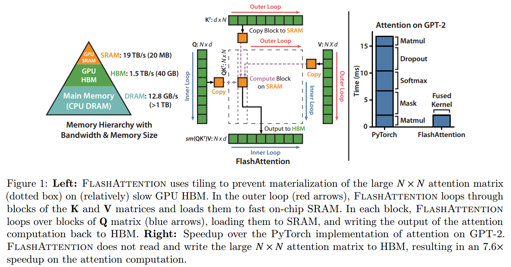
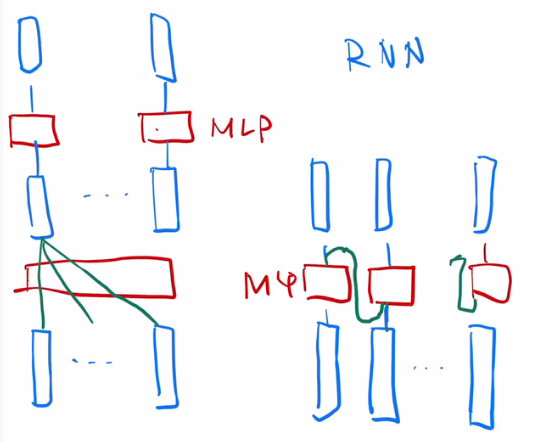

[toc]

# 1.attention

### 1.Attention

#### **1.1 讲讲对Attention的理解？**

Attention机制是一种在处理时序相关问题的时候常用的技术，主要用于处理序列数据。

核心思想是在处理序列数据时，网络应该更关注输入中的重要部分，而忽略不重要的部分，它通过学习不同部分的权重，将输入的序列中的重要部分显式地加权，从而使得模型可以更好地关注与输出有关的信息。

在序列建模任务中，比如机器翻译、文本摘要、语言理解等，输入序列的不同部分可能具有不同的重要性。传统的循环神经网络（RNN）或卷积神经网络（CNN）在处理整个序列时，难以捕捉到序列中不同位置的重要程度，可能导致信息传递不够高效，特别是在处理长序列时表现更明显。

Attention机制的关键是引入一种机制来动态地计算输入序列中各个位置的权重，从而在每个时间步上，对输入序列的不同部分进行加权求和，得到当前时间步的输出。这样就实现了模型对输入中不同部分的关注度的自适应调整。

**1.2 Attention的计算步骤是什么？**

具体的计算步骤如下：

- **计算查询（Query）**：查询是当前时间步的输入，用于和序列中其他位置的信息进行比较。
- **计算键（Key）和值（Value）**：键表示序列中其他位置的信息，值是对应位置的表示。键和值用来和查询进行比较。
- **计算注意力权重**：通过将查询和键进行内积运算，然后应用softmax函数，得到注意力权重。这些权重表示了在当前时间步，模型应该关注序列中其他位置的重要程度。
- **加权求和**：根据注意力权重将值进行加权求和，得到当前时间步的输出。

在Transformer中，Self-Attention 被称为"Scaled Dot-Product Attention"，其计算过程如下：

1. 对于输入序列中的每个位置，通过计算其与所有其他位置之间的相似度得分（通常通过点积计算）。
2. 对得分进行缩放处理，以防止梯度爆炸。
3. 将得分用softmax函数转换为注意力权重，以便计算每个位置的加权和。
4. 使用注意力权重对输入序列中的所有位置进行加权求和，得到每个位置的自注意输出。

$$
Attention(Q,K,V)=softmax(\frac{QK^T}{\sqrt{d_k}})V
$$

#### **1.3 Attention机制和传统的Seq2Seq模型有什么区别？**

Seq2Seq模型是一种基于编码器-解码器结构的模型，主要用于处理序列到序列的任务，例如机器翻译、语音识别等。

传统的Seq2Seq模型只使用编码器来捕捉输入序列的信息，而解码器只从编码器的最后状态中获取信息，并将其用于生成输出序列。

而Attention机制则允许解码器在生成每个输出时，根据输入序列的不同部分给予不同的注意力，从而使得模型更好地关注到输入序列中的重要信息。

#### **1.4 self-attention 和 target-attention的区别？**

self-attention是指在序列数据中，**将当前位置与其他位置之间的关系建模**。它通过计算每个位置与其他所有位置之间的相关性得分，从而为每个位置分配一个权重。这使得模型能够根据输入序列的不同部分的重要性，自适应地选择要关注的信息。

target-attention则是指将**注意力机制应用于目标（或查询）和一组相关对象之间的关系**。它用于将目标与其他相关对象进行比较，并将注意力分配给与目标最相关的对象。这种类型的注意力通常用于任务如机器翻译中的编码-解码模型，其中需要将源语言的信息对齐到目标语言。

因此，**自注意力主要关注序列内部的关系，而目标注意力则关注目标与其他对象之间的关系**。这两种注意力机制在不同的上下文中起着重要的作用，帮助模型有效地处理序列数据和相关任务。

#### **1.5 在常规attention中，一般有k=v，那self-attention 可以吗?**

self-attention实际只是attention中的一种特殊情况，因此k=v是没有问题的，也即K，V参数矩阵相同。实际上，在Transformer模型中，Self-Attention的典型实现就是k等于v的情况。Transformer中的Self-Attention被称为"Scaled Dot-Product Attention"，其中通过将词向量进行线性变换来得到Q、K、V，并且这三者是相等的。

#### **1.6 目前主流的attention方法有哪些？**

讲自己熟悉的就可：

- **Scaled Dot-Product Attention**: 这是Transformer模型中最常用的Attention机制，用于计算查询向量（Q）与键向量（K）之间的相似度得分，然后使用注意力权重对值向量（V）进行加权求和。
- **Multi-Head Attention**: 这是Transformer中的一个改进，通过同时使用多组独立的注意力头（多个QKV三元组），并在输出时将它们拼接在一起。这样的做法允许模型在不同的表示空间上学习不同类型的注意力模式。
- **Relative Positional Encoding**: 传统的Self-Attention机制在处理序列时并未直接考虑位置信息，而相对位置编码引入了位置信息，使得模型能够更好地处理序列中不同位置之间的关系。
- **Transformer-XL**: 一种改进的Transformer模型，通过使用循环机制来扩展Self-Attention的上下文窗口，从而处理更长的序列依赖性。

#### **1.7 self-attention 在计算的过程中，如何对padding位做mask？**

在 Attention 机制中，同样需要忽略 padding 部分的影响，这里以transformer encoder中的self-attention为例：self-attention中，Q和K在点积之后，需要先经过mask再进行softmax，因此，**对于要屏蔽的部分，mask之后的输出需要为负无穷**，这样softmax之后输出才为0。

#### **1.8 深度学习中attention与全连接层的区别何在？**

这是个非常有意思的问题，要回答这个问题，我们必须重新定义一下Attention。

Transformer Paper里重新用QKV定义了Attention。所谓的QKV就是Query，Key，Value。如果我们用这个机制来研究传统的RNN attention，就会发现这个过程其实是这样的：RNN最后一步的output是Q，这个Q query了每一个中间步骤的K。Q和K共同产生了Attention Score，最后Attention Score乘以V加权求和得到context。那如果我们不用Attention，单纯用全连接层呢？很简单，全链接层可没有什么Query和Key的概念，只有一个Value，也就是说给每个V加一个权重再加到一起（如果是Self Attention，加权这个过程都免了，因为V就直接是从raw input加权得到的。）

**可见Attention和全连接最大的区别就是Query和Key**，而这两者也恰好产生了Attention Score这个Attention中最核心的机制。**而在Query和Key中，我认为Query又相对更重要，因为Query是一个锚点，Attention Score便是从过计算与这个锚点的距离算出来的**。任何Attention based algorithm里都会有Query这个概念，但全连接显然没有。

最后来一个比较形象的比喻吧。如果一个神经网络的任务是从一堆白色小球中找到一个略微发灰的，那么全连接就是在里面随便乱抓然后凭记忆和感觉找，而attention则是左手拿一个白色小球，右手从袋子里一个一个抓出来，两两对比颜色，你左手抓的那个白色小球就是Query。

#### **1.9 self-attention mask 是如何进行的？**

Self-Attention Masked只发生在Decoder操作中，在Decoder中，我们的预测是一个一个进行的，即输入一个token，输出下一个token

### 2.Transformer

**2.1 transformer中multi-head attention中每个head为什么要进行降维？**

在Transformer的Multi-Head Attention中，对每个head进行降维是**为了增加模型的表达能力和效率。**

每个head是独立的注意力机制，它们可以学习不同类型的特征和关系。通过使用多个注意力头，Transformer可以并行地学习多种不同的特征表示，从而增强了模型的表示能力。

然而，在使用多个注意力头的同时，注意力机制的计算复杂度也会增加。原始的Scaled Dot-Product Attention的计算复杂度为$O(d^2)$，其中d是输入向量的维度。如果使用h个注意力头，计算复杂度将增加到$O(hd^2)$。这可能会导致Transformer在处理大规模输入时变得非常耗时。

为了缓解计算复杂度的问题，Transformer中在每个head上进行降维。在每个注意力头中，输入向量通过线性变换被映射到一个较低维度的空间。这个降维过程使用两个矩阵：一个是查询（Q）和键（K）的降维矩阵$W_q$和$W_k$，另一个是值（V）的降维矩阵$W_v$。

通过降低每个head的维度，Transformer可以在**保持较高的表达能力的同时，大大减少计算复杂度**。降维后的计算复杂度为$(h\hat d ^ 2)$，其中$\hat d$是降维后的维度。通常情况下，$\hat d$会远小于原始维度d，这样就可以显著提高模型的计算效率。

**2.2 transformer在哪里做了权重共享，为什么可以做权重共享？**

Transformer在Encoder和Decoder中都进行了权重共享。

在Transformer中，Encoder和Decoder是由多层的Self-Attention Layer和前馈神经网络层交叉堆叠而成。**权重共享是指在这些堆叠的层中，相同位置的层共用相同的参数**。

在Encoder中，所有的自注意力层和前馈神经网络层都共享相同的参数。这意味着每一层的自注意力机制和前馈神经网络都使用相同的权重矩阵来进行计算。这种共享保证了每一层都执行相同的计算过程，使得模型能够更好地捕捉输入序列的不同位置之间的关联性。

在Decoder中，除了和Encoder相同的权重共享方式外，还存在另一种特殊的权重共享：**Decoder的自注意力层和Encoder的自注意力层之间也进行了共享**。这种共享方式被称为"masked self-attention"，因为在解码过程中，当前位置的注意力不能关注到未来的位置（后续位置），以避免信息泄漏。通过这种共享方式，Decoder可以利用Encoder的表示来理解输入序列并生成输出序列。权重共享的好处是大大减少了模型的参数数量，使得Transformer可以更有效地训练，并且更容易进行推理。此外，共享参数还有助于加快训练速度和提高模型的泛化能力，因为模型可以在不同位置共享并学习通用的特征表示。

#### **2.3 transformer的点积模型做缩放的原因是什么？**

使用缩放的原因是为了控制注意力权重的尺度，以避免在计算过程中出现梯度爆炸的问题。

Attention的计算是在内积之后进行softmax，主要涉及的运算是$e^{q \cdot k}$，可以大致认为内积之后、softmax之前的数值在$-3\sqrt{d}$到$3\sqrt{d}$这个范围内，由于d通常都至少是64，所以$e^{3\sqrt{d}}$比较大而 $e^{-3\sqrt{d}}$比较小，因此经过softmax之后，Attention的分布非常接近一个one hot分布了，这带来严重的梯度消失问题，导致训练效果差。（例如y=softmax(x)在|x|较大时进入了饱和区，x继续变化y值也几乎不变，即饱和区梯度消失）

相应地，解决方法就有两个:

1. 像NTK参数化那样，在内积之后除以 $\sqrt{d}$，使q⋅k的方差变为1，对应$e^3,e^{−3}$都不至于过大过小，这样softmax之后也不至于变成one hot而梯度消失了，这也是常规的Transformer如BERT里边的Self Attention的做法
2. 另外就是不除以 $\sqrt{d}$，但是初始化q,k的全连接层的时候，其初始化方差要多除以一个d，这同样能使得使q⋅k的初始方差变为1，T5采用了这样的做法。

### 3.BERT

#### **3.1 BERT用字粒度和词粒度的优缺点有哪些？**

BERT可以使用字粒度（character-level）和词粒度（word-level）两种方式来进行文本表示，它们各自有优缺点：

字粒度（Character-level）：

- **优点**：处理未登录词（Out-of-Vocabulary，OOV）：字粒度可以处理任意字符串，包括未登录词，不需要像词粒度那样遇到未登录词就忽略或使用特殊标记。对于少见词和低频词，字粒度可以学习更丰富的字符级别表示，使得模型能够更好地捕捉词汇的细粒度信息。
- **缺点**：计算复杂度高：使用字粒度会导致输入序列的长度大大增加，进而增加模型的计算复杂度和内存消耗。需要更多的训练数据：字粒度模型对于少见词和低频词需要更多的训练数据来学习有效的字符级别表示，否则可能会导致过拟合。

词粒度（Word-level）：

- **优点**：计算效率高：使用词粒度可以大大减少输入序列的长度，从而降低模型的计算复杂度和内存消耗。学习到更加稳定的词级别表示：词粒度模型可以学习到更加稳定的词级别表示，特别是对于高频词和常见词，有更好的表示能力。
- **缺点**：处理未登录词（OOV）：词粒度模型无法处理未登录词，遇到未登录词时需要采用特殊处理（如使用未登录词的特殊标记或直接忽略）。对于多音字等形态复杂的词汇，可能无法准确捕捉其细粒度的信息。

#### **3.2 BERT的Encoder与Decoder掩码有什么区别？**

Encoder主要使用自注意力掩码和填充掩码，而Decoder除了自注意力掩码外，还需要使用编码器-解码器注意力掩码来避免未来位置信息的泄露。这些掩码操作保证了Transformer在处理自然语言序列时能够准确、有效地进行计算，从而获得更好的表现。

#### **3.3 BERT用的是transformer里面的encoder还是decoder？**

BERT使用的是Transformer中的**Encoder部分**，而不是Decoder部分。

Transformer模型由Encoder和Decoder两个部分组成。Encoder用于将输入序列编码为一系列高级表示，而Decoder用于基于这些表示生成输出序列。

在BERT模型中，只使用了Transformer的Encoder部分，并且对其进行了一些修改和自定义的预训练任务，而没有使用Transformer的Decoder部分。

#### **3.4 为什么BERT选择mask掉15%这个比例的词，可以是其他的比例吗？**

BERT选择mask掉15%的词是一种经验性的选择，是原论文中的一种选择，并没有一个固定的理论依据，实际中当然可以尝试不同的比例，15%的比例是由BERT的作者在原始论文中提出，并在实验中发现对于BERT的训练效果是有效的。

#### **3.5 为什么BERT在第一句前会加一个\[CLS] 标志?**

BERT在第一句前会加一个 \[CLS] 标志，**最后一层该位对应向量可以作为整句话的语义表示，从而用于下游的分类任务等**。为什么选它？因为与文本中已有的其它词相比，这个无明显语义信息的符号会更“公平”地融合文本中各个词的语义信息，从而更好的表示整句话的语义。

具体来说，self-attention是用文本中的其它词来增强目标词的语义表示，但是目标词本身的语义还是会占主要部分的，因此，经过BERT的12层，每次词的embedding融合了所有词的信息，可以去更好的表示自己的语义。而 \[CLS] 位本身没有语义，经过12层，得到的是attention后所有词的加权平均，相比其他正常词，可以更好的表征句子语义。

#### **3.6 BERT非线性的来源在哪里？**

主要来自两个地方：**前馈层的gelu激活函数**和**self-attention**。

**前馈神经网络层**：在BERT的Encoder中，每个自注意力层之后都跟着一个前馈神经网络层。前馈神经网络层是全连接的神经网络，通常包括一个线性变换和一个非线性的激活函数，如gelu。这样的非线性激活函数引入了非线性变换，使得模型能够学习更加复杂的特征表示。

**self-attention layer**：在自注意力层中，查询（Query）、键（Key）、值（Value）之间的点积得分会经过softmax操作，形成注意力权重，然后将这些权重与值向量相乘得到每个位置的自注意输出。这个过程中涉及了softmax操作，使得模型的计算是非线性的。

#### **3.7 BERT训练时使用的学习率 warm-up 策略是怎样的？为什么要这么做？**

在BERT的训练中，使用了学习率warm-up策略，这是**为了在训练的早期阶段增加学习率，以提高训练的稳定性和加快模型收敛**。

学习率warm-up策略的具体做法是，在训练开始的若干个步骤（通常是一小部分训练数据的迭代次数）内，**将学习率逐渐从一个较小的初始值增加到预定的最大学习率**。在这个过程中，学习率的变化是线性的，即学习率在warm-up阶段的每个步骤按固定的步幅逐渐增加。学习率warm-up的目的是为了解决BERT在训练初期的两个问题：

- **不稳定性**：在训练初期，由于模型参数的随机初始化以及模型的复杂性，模型可能处于一个较不稳定的状态。此时使用较大的学习率可能导致模型的参数变动太大，使得模型很难收敛，学习率warm-up可以在这个阶段将学习率保持较小，提高模型训练的稳定性。
- **避免过拟合**：BERT模型往往需要较长的训练时间来获得高质量的表示。如果在训练的早期阶段就使用较大的学习率，可能会导致模型在训练初期就过度拟合训练数据，降低模型的泛化能力。通过学习率warm-up，在训练初期使用较小的学习率，可以避免过度拟合，等模型逐渐稳定后再使用较大的学习率进行更快的收敛。

#### **3.8 在BERT应用中，如何解决长文本问题？**

在BERT应用中，处理长文本问题有以下几种常见的解决方案：

- **截断与填充**：将长文本截断为固定长度或者进行填充。BERT模型的输入是一个固定长度的序列，因此当输入的文本长度超过模型的最大输入长度时，需要进行截断或者填充。通常，可以根据任务的要求，选择适当的最大长度，并对文本进行截断或者填充，使其满足模型输入的要求。
- **Sliding Window**：将长文本分成多个短文本，然后分别输入BERT模型。这种方法被称为Sliding Window技术。具体来说，将长文本按照固定的步长切分成多个片段，然后分别输入BERT模型进行处理。每个片段的输出可以进行进一步的汇总或者融合，得到最终的表示。
- **Hierarchical Model**：使用分层模型来处理长文本，其中底层模型用于处理短文本片段，然后将不同片段的表示进行汇总或者融合得到整个长文本的表示。这样的分层模型可以充分利用BERT模型的表示能力，同时处理长文本。
- **Longformer、BigBird等模型**：使用专门针对长文本的模型，如Longformer和BigBird。这些模型采用了不同的注意力机制，以处理超长序列，并且通常在处理长文本时具有更高的效率。
- **Document-Level Model**：将文本看作是一个整体，而不是将其拆分成句子或段落，然后输入BERT模型进行处理。这样的文档级模型可以更好地捕捉整个文档的上下文信息，但需要更多的计算资源。

### 4.MHA & MQA & MGA

#### （1）MHA

从多头注意力的结构图中，貌似这个所谓的**多个头就是指多组线性变换层**，其实并不是，只有使用了一组线性变化层，即三个变换张量对Q，K，V分别进行线性变换，**这些变换不会改变原有张量的尺寸**，因此每个变换矩阵都是方阵，得到输出结果后，多头的作用才开始显现，每个头开始从词义层面分割输出的张量，也就是每个头都想获得一组Q，K，V进行注意力机制的计算，但是句子中的每个词的表示只获得一部分，也就是只分割了最后一维的词嵌入向量。这就是所谓的多头，将每个头的获得的输入送到注意力机制中, 就形成多头注意力机制.

Multi-head attention允许模型**共同关注来自不同位置的不同表示子空间的信息**，如果只有一个attention head，它的平均值会削弱这个信息。

$$
MultiHead(Q,K,V)=Concat(head_1,...,head_h)W^O \\
where ~ head_i = Attention(QW_i^Q, KW_i^K, VW_i^V)
$$

其中映射由权重矩阵完成：$W^Q_i \in \mathbb{R}^{d_{{model}} \times d_k}
 $, $W^K_i \in \mathbb{R}^{d_{\text{model}} \times d_k}$, $W^V_i \in \mathbb{R}^{d_{\text{model}} \times d_v}$和$W^O_i \in \mathbb{R}^{hd_v \times d_{\text{model}} }$。

**多头注意力作用**

这种结构设计能**让每个注意力机制去优化每个词汇的不同特征部分**，从而均衡同一种注意力机制可能产生的偏差，让词义拥有来自更多元的表达，实验表明可以从而提升模型效果.

**为什么要做多头注意力机制呢**？

- 一个 dot product 的注意力里面，没有什么可以学的参数。具体函数就是内积，为了识别不一样的模式，希望有不一样的计算相似度的办法。加性 attention 有一个权重可学，也许能学到一些内容。
- multi-head attention 给 h 次机会去学习 不一样的投影的方法，使得在投影进去的度量空间里面能够去匹配不同模式需要的一些相似函数，然后把 h 个 heads 拼接起来，最后再做一次投影。
- 每一个头 hi 是把 Q,K,V 通过 可以学习的 Wq, Wk, Wv 投影到 dv 上，再通过注意力函数，得到 headi。&#x20;

#### （2）MQA

MQA（Multi Query Attention）最早是出现在2019年谷歌的一篇论文 《Fast Transformer Decoding: One Write-Head is All You Need》。

MQA的思想其实比较简单，MQA 与 MHA 不同的是，**MQA 让所有的头之间共享同一份 Key 和 Value 矩阵，每个头正常的只单独保留了一份 Query 参数，从而大大减少 Key 和 Value 矩阵的参数量**。

> Multi-query attention is identical except that the different heads share a single set of keys and values.

在 Multi-Query Attention 方法中只会保留一个单独的key-value头，这样**虽然可以提升推理的速度，但是会带来精度上的损失**。《Multi-Head Attention:Collaborate Instead of Concatenate 》这篇论文的第一个思路是**基于多个 MQA 的 checkpoint 进行 finetuning，来得到了一个质量更高的 MQA 模型**。这个过程也被称为 Uptraining。

具体分为两步：

1. 对多个 MQA 的 checkpoint 文件进行融合，融合的方法是: 通过对 key 和 value 的 head 头进行 mean pooling 操作，如下图。
2. 对融合后的模型使用少量数据进行 finetune 训练，重训后的模型大小跟之前一样，但是效果会更好

#### （3）GQA

Google 在 2023 年发表的一篇 [《GQA: Training Generalized Multi-Query Transformer Models from Multi-Head Checkpoints》](https://arxiv.org/pdf/2305.13245.pdf "《GQA: Training Generalized Multi-Query Transformer Models from Multi-Head Checkpoints》")的论文

如下图所示，

- 在 **MHA（Multi Head Attention）** 中，每个头有自己单独的 key-value 对；
- 在 **MQA（Multi Query Attention）** 中只会有一组 key-value 对；
- 在 **GQA（Grouped Query Attention）** 中，会对 attention 进行分组操作，query 被分为 N 组，每个组共享一个 Key 和 Value 矩阵。

GQA-N 是指具有 N 组的 Grouped Query Attention。GQA-1具有单个组，因此具有单个Key 和 Value，等效于MQA。而GQA-H具有与头数相等的组，等效于MHA。

在基于 Multi-head 多头结构变为 Grouped-query 分组结构的时候，也是采用跟上图一样的方法，对每一组的 key-value 对进行 mean pool 的操作进行参数融合。**融合后的模型能力更综合，精度比 Multi-query 好，同时速度比 Multi-head 快**。

#### （4）总结

MHA（Multi-head Attention）是标准的多头注意力机制，h个Query、Key 和 Value 矩阵。

MQA（Multi-Query Attention）是多查询注意力的一种变体，也是用于自回归解码的一种注意力机制。与MHA不同的是，**MQA 让所有的头之间共享同一份 Key 和 Value 矩阵，每个头只单独保留了一份 Query 参数，从而大大减少 Key 和 Value 矩阵的参数量**。

GQA（Grouped-Query Attention）是分组查询注意力，**GQA将查询头分成G组，每个组共享一个Key 和 Value 矩阵**。GQA-G是指具有G组的grouped-query attention。GQA-1具有单个组，因此具有单个Key 和 Value，等效于MQA。而GQA-H具有与头数相等的组，等效于MHA。

GQA介于MHA和MQA之间。GQA 综合 MHA 和 MQA ，既不损失太多性能，又能利用 MQA 的推理加速。不是所有 Q 头共享一组 KV，而是分组一定头数 Q 共享一组 KV，比如上图中就是两组 Q 共享一组 KV。

**参考链接**
[理解Attention:从起源到MHA,MQA和GQA](https://zhuanlan.zhihu.com/p/686149289)

### 5.Flash Attention&#x20;

论文名称：[FlashAttention: Fast and Memory-Efficient Exact Attention with IO-Awareness](https://arxiv.org/abs/2205.14135 "FlashAttention: Fast and Memory-Efficient Exact Attention with IO-Awareness")

Flash Attention的主要目的是加速和节省内存，主要贡献包括： &#x20;

- 计算softmax时候不需要全量input数据，可以分段计算； &#x20;
- 反向传播的时候，不存储attention matrix ($N^2$的矩阵)，而是只存储softmax归一化的系数。

#### 5.1 动机

不同硬件模块之间的带宽和存储空间有明显差异，例如下图中左边的三角图，最顶端的是GPU种的 `SRAM`，它的容量非常小但是带宽非常大，以A100 GPU为例，它有108个流式多核处理器，每个处理器上的片上SRAM大小只有192KB，因此A100总共的SRAM大小是$192KB\times 108 = 20MB$，但是其吞吐量能高达19TB/s。而A100 GPU `HBM`（High Bandwidth Memory也就是我们常说的GPU显存大小）大小在40GB\~80GB左右，但是带宽只与1.5TB/s。

下图给出了标准的注意力机制的实现流程，可以看到因为 `HBM`的大小更大，**我们平时写pytorch代码的时候最常用到的就是HBM，所以对于HBM的读写操作非常频繁，而SRAM利用率反而不高**。

FlashAttention的主要动机就是**希望把SRAM利用起来**，但是难点就在于SRAM太小了，一个普通的矩阵乘法都放不下去。FlashAttention的解决思路就是将计算模块进行分解，拆成一个个小的计算任务。

#### 5.2 Softmax Tiling

在介绍具体的计算算法前，我们首先需要了解一下Softmax Tiling。

**（1）数值稳定**

&#x20;Softmax包含指数函数，所以为了避免数值溢出问题，可以将每个元素都减去最大值，如下图示，最后计算结果和原来的Softmax是一致的。

$$
m(x):=\max _{i} ~ x_{i} \\ 
f(x):=\left[\begin{array}{llll}e^{x_{1}-m(x)} & \ldots & e^{x_{B}-m(x)}\end{array}\right] \\ 
\ell(x):=\sum_{i} f(x)_{i} \\ 
\operatorname{softmax}(x):=\frac{f(x)}{\ell(x)}
$$

**（2）分块计算softmax**

因为Softmax都是按行计算的，所以我们考虑一行切分成两部分的情况，即原本的一行数据$x \in \mathbb{R}^{2 B}=\left[x^{(1)}, x^{(2)}\right]$

可以看到计算不同块的$f(x)$值时，乘上的系数是不同的，但是最后化简后的结果都是指数函数减去了整行的最大值。以$x^{(1)}$ 为例，

$$
\begin{aligned} m^{m\left(x^{(1)}\right)-m(x)} f\left(x^{(1)}\right) & =e^{m\left(x^{(1)}\right)-m(x)}\left[e^{x_{1}^{(1)}-m\left(x^{(1)}\right)}, \ldots, e^{x_{B}^{(1)}-m\left(x^{(1)}\right)}\right] \\ & =\left[e^{x_{1}^{(1)}-m(x)}, \ldots, e^{x_{B}^{(1)}-m(x)}\right]\end{aligned}
$$

#### 5.3 算法流程

FlashAttention旨在避免从 HBM（High Bandwidth Memory）中读取和写入注意力矩阵，这需要做到：

1. 目标一：在不访问整个输入的情况下计算softmax函数的缩减；**将输入分割成块，并在输入块上进行多次传递，从而以增量方式执行softmax缩减**。
2. 目标二：在后向传播中不能存储中间注意力矩阵。标准Attention算法的实现需要将计算过程中的S、P写入到HBM中，而这些中间矩阵的大小与输入的序列长度有关且为二次型，因此**Flash Attention就提出了不使用中间注意力矩阵，通过存储归一化因子来减少HBM内存的消耗。**

FlashAttention算法流程如下图所示：

为方便理解，下图将FlashAttention的计算流程可视化出来了，简单理解就是每一次只计算一个block的值，通过多轮的双for循环完成整个注意力的计算。

### 6.Transformer常见问题

#### 6.1 Transformer和RNN

最简单情况：没有残差连接、没有 layernorm、 attention 单头、没有投影。看和 RNN 区别

- attention 对输入做一个加权和，加权和 进入 point-wise MLP。（画了多个红色方块 MLP， 是一个权重相同的 MLP）
- point-wise MLP 对 每个输入的点 做计算，得到输出。
- attention 作用：把整个序列里面的信息抓取出来，做一次汇聚 aggregation

RNN 跟 transformer **异：如何传递序列的信**息

RNN 是把上一个时刻的信息输出传入下一个时候做输入。Transformer 通过一个 attention 层，去全局的拿到整个序列里面信息，再用 MLP 做语义的转换。

RNN 跟 transformer **同：语义空间的转换 + 关注点**

用一个线性层 or 一个 MLP 来做语义空间的转换。

**关注点**：怎么有效的去使用序列的信息。

#### 6.2 一些细节

**Transformer为何使用多头注意力机制？**（为什么不使用一个头）

- 多头保证了transformer可以注意到不同子空间的信息，捕捉到更加丰富的特征信息。可以类比CNN中同时使用**多个滤波器**的作用，直观上讲，多头的注意力**有助于网络捕捉到更丰富的特征/信息。**

我们希望多个头能够在训练中学会注意到不同的内容。例如在翻译任务里，一些attention head可以关注语法特征，另一些attention head可以关注单词特性。这样模型就可以从不同角度来分析和理解输入信息，获得更好的效果了。

**Transformer为什么Q和K使用不同的权重矩阵生成，为何不能使用同一个值进行自身的点乘？** （注意和第一个问题的区别）

- 使用Q/K/V不相同可以保证在不同空间进行投影，增强了表达能力，提高了泛化能力。
- 同时，由softmax函数的性质决定，实质做的是一个soft版本的arg max操作，得到的向量接近一个one-hot向量（接近程度根据这组数的数量级有所不同）。如果令Q=K，那么得到的模型大概率会得到一个类似单位矩阵的attention矩阵，**这样self-attention就退化成一个point-wise线性映射**。这样至少是违反了设计的初衷。

**Transformer计算attention的时候为何选择点乘而不是加法？两者计算复杂度和效果上有什么区别？**

- K和Q的点乘是为了得到一个attention score 矩阵，用来对V进行提纯。K和Q使用了不同的W\_k, W\_Q来计算，可以理解为是在不同空间上的投影。正因为有了这种不同空间的投影，增加了表达能力，这样计算得到的attention score矩阵的泛化能力更高。
- 为了计算更快。矩阵加法在加法这一块的计算量确实简单，但是作为一个整体计算attention的时候相当于一个隐层，整体计算量和点积相似。在效果上来说，从实验分析，两者的效果和dk相关，dk越大，加法的效果越显著。

**为什么在进行softmax之前需要对attention进行scaled（为什么除以dk的平方根）**，并使用公式推导进行讲解

- 这取决于softmax函数的特性，如果softmax内计算的数数量级太大，会输出近似one-hot编码的形式，导致梯度消失的问题，所以需要scale
- 那么至于为什么需要用维度开根号，假设向量q，k满足各分量独立同分布，均值为0，方差为1，那么qk点积均值为0，方差为dk，从统计学计算，若果让qk点积的方差控制在1，需要将其除以dk的平方根，是的softmax更加平滑

简单来说，就是需要压缩softmax输入值，以免输入值过大，进入了softmax的饱和区，导致梯度值太小而难以训练

苏剑林的博客中也有详细分析，并提到如果不对attention值进行scaling，也可以通过在参数初始化是将方差除以一个
 ，同样可以起到预防softmax饱和的效果。类似地，通过normalization也可以做到类似的效果。不过实现上在attention里做scaling还是比较稳定高效的。

**在计算attention score的时候如何对padding做mask操作？**

- padding位置置为负无穷(一般来说-1000就可以)，再对attention score进行相加。对于这一点，涉及到batch\_size之类的，具体的大家可以看一下实现的源代码，位置在这里：[https://github.com/huggingface/transformers/blob/aa6a29bc25b663e1311c5c4fb96b004cf8a6d2b6/src/transformers/modeling\_bert.py#L720](https://link.zhihu.com/?target=https://github.com/huggingface/transformers/blob/aa6a29bc25b663e1311c5c4fb96b004cf8a6d2b6/src/transformers/modeling_bert.py#L720 "https://github.com/huggingface/transformers/blob/aa6a29bc25b663e1311c5c4fb96b004cf8a6d2b6/src/transformers/modeling_bert.py#L720")
- padding位置置为负无穷而不是0，是因为后续在softmax时，$e^0=1$，不是0，计算会出现错误；而$e^{-\infty} = 0$，所以取负无穷

**为什么在进行多头注意力的时候需要对每个head进行降维？**（可以参考上面一个问题）

- 将原有的**高维空间转化为多个低维空间**并再最后进行拼接，形成同样维度的输出，借此丰富特性信息
  - 基本结构：Embedding + Position Embedding，Self-Attention，Add + LN，FN，Add + LN

**为何在获取输入词向量之后需要对矩阵乘以embedding size的开方？意义是什么？**

- embedding matrix的初始化方式是xavier init，这种方式的方差是1/embedding size，因此乘以embedding size的开方使得embedding matrix的方差是1，在这个scale下可能更有利于embedding matrix的收敛。

**简单介绍一下Transformer的位置编码？有什么意义和优缺点？**

- 因为self-attention是位置无关的，无论句子的顺序是什么样的，通过self-attention计算的token的hidden embedding都是一样的，这显然不符合人类的思维。因此要有一个办法能够在模型中表达出一个token的位置信息，transformer使用了固定的positional encoding来表示token在句子中的绝对位置信息。

**你还了解哪些关于位置编码的技术，各自的优缺点是什么？**（参考上一题）

- 相对位置编码（RPE）1.在计算attention score和weighted value时各加入一个可训练的表示相对位置的参数。2.在生成多头注意力时，把对key来说将绝对位置转换为相对query的位置3.复数域函数，已知一个词在某个位置的词向量表示，可以计算出它在任何位置的词向量表示。前两个方法是词向量+位置编码，属于亡羊补牢，复数域是生成词向量的时候即生成对应的位置信息。

**简单讲一下Transformer中的残差结构以及意义。**

- 就是ResNet的优点，解决梯度消失

**为什么transformer块使用LayerNorm而不是BatchNorm？LayerNorm 在Transformer的位置是哪里？**

- LN：针对每个样本序列进行Norm，没有样本间的依赖。对一个序列的不同特征维度进行Norm
- CV使用BN是认为channel维度的信息对cv方面有重要意义，如果对channel维度也归一化会造成不同通道信息一定的损失。而同理nlp领域认为句子长度不一致，并且各个batch的信息没什么关系，因此只考虑句子内信息的归一化，也就是LN。

**简答讲一下BatchNorm技术，以及它的优缺点。**

- 优点：
  - 第一个就是可以解决内部协变量偏移，简单来说训练过程中，各层分布不同，增大了学习难度，BN缓解了这个问题。当然后来也有论文证明BN有作用和这个没关系，而是可以使**损失平面更加的平滑**，从而加快的收敛速度。
  - 第二个优点就是缓解了**梯度饱和问题**（如果使用sigmoid激活函数的话），加快收敛。
- 缺点：
  - 第一个，batch\_size较小的时候，效果差。这一点很容易理解。BN的过程，使用 整个batch中样本的均值和方差来模拟全部数据的均值和方差，在batch\_size 较小的时候，效果肯定不好。
  - 第二个缺点就是 BN 在RNN中效果比较差。

**简单描述一下Transformer中的前馈神经网络？使用了什么激活函数？相关优缺点？**

- ReLU

$$
FFN(x)=max(0,~ xW_1+b_1)W_2+b_2
$$

**Encoder端和Decoder端是如何进行交互的？**（在这里可以问一下关于seq2seq的attention知识）

- Cross Self-Attention，Decoder提供Q，Encoder提供K，V

**Decoder阶段的多头自注意力和encoder的多头自注意力有什么区别？**（为什么需要decoder自注意力需要进行 sequence mask)

- 让输入序列只看到过去的信息，不能让他看到未来的信息

**Transformer的并行化提现在哪个地方？Decoder端可以做并行化吗？**

- Encoder侧：模块之间是串行的，一个模块计算的结果做为下一个模块的输入，互相之前有依赖关系。从每个模块的角度来说，注意力层和前馈神经层这两个子模块单独来看都是可以并行的，不同单词之间是没有依赖关系的。
- Decode引入sequence mask就是为了并行化训练，Decoder推理过程没有并行，只能一个一个的解码，很类似于RNN，这个时刻的输入依赖于上一个时刻的输出。

**简单描述一下wordpiece model 和 byte pair encoding，有实际应用过吗？**

- 传统词表示方法无法很好的处理未知或罕见的词汇（OOV问题），传统词tokenization方法不利于模型学习词缀之间的关系”
- BPE（字节对编码）或二元编码是一种简单的数据压缩形式，其中最常见的一对连续字节数据被替换为该数据中不存在的字节。后期使用时需要一个替换表来重建原始数据。
- 优点：可以有效地平衡词汇表大小和步数（编码句子所需的token次数）。
- 缺点：基于贪婪和确定的符号替换，不能提供带概率的多个分片结果。

**Transformer训练的时候学习率是如何设定的？Dropout是如何设定的，位置在哪里？Dropout 在测试的需要有什么需要注意的吗？**

- Dropout测试的时候记得对输入整体呈上dropout的比率

**引申一个关于bert问题，bert的mask为何不学习transformer在attention处进行屏蔽score的技巧？**

- BERT和transformer的目标不一致，bert是语言的预训练模型，需要充分考虑上下文的关系，而transformer主要考虑句子中第i个元素与前i-1个元素的关系。

### 7. Sliding Window Attention (SWA)

> 来源 Mistral 7B https://arxiv.org/pdf/2310.06825

Sliding Window Attention. SWA exploits the stacked layers of a transformer to attend information beyond the window size W. The hidden
state in position i of the layer k, hi
, attends to all hidden states from
the previous layer with positions between i − W and i. Recursively,
hi can access tokens from the input layer at a distance of up to W × k
tokens, as illustrated in Figure 1. At the last layer, using a window size
of W = 4096, we have a theoretical attention span of approximately
131K tokens. In practice, for a sequence length of 16K and W = 4096,
changes made to FlashAttention [11] and xFormers [18] yield a 2x
speed improvement over a vanilla attention baseline.

SWA实际上是一种sparse attention，而sparse attention也有许多工作做了深入探索。

**和KV Cache的配合实现**

在不使用sliding window的情况下，随着自回归推理的进行，KV Cache是只增不减的。

而在使用SWA的情况下，超出窗口长度的kv就可以不用再缓存了，因此使用一个轮转替换的策略。

比如窗口大小 W=4 ，则当第5个token需要缓存是，直接替换掉第1个token，这样就可以保持kv缓存有一个最大值（为窗口大小），而不会无限增长。

这样便于我们估计硬件设备所能支持的throughput，也不会因为少量超长的case而造成堵塞，在工程上有利于提高硬件利用率，降低成本。

**参考链接**

[稀疏注意力计算:sliding window attention](https://zhuanlan.zhihu.com/p/687349083)

### 8. Paged Attention (vllm)
> vllm paper: https://arxiv.org/abs/2309.06180

> vllm video: [Fast LLM Serving with vLLM and PagedAttention](https://www.youtube.com/watch?v=5ZlavKF_98U)

> blog: [图解大模型计算加速系列之：vLLM核心技术PagedAttention原理](https://blog.csdn.net/qq_27590277/article/details/137262274)

> A lightweight vLLM implementation built from scratch. [nano-vllm](https://github.com/GeeeekExplorer/nano-vllm) and [nano_vllm_note](https://github.com/LDLINGLINGLING/nano_vllm_note)

一、LLM推理的两阶段
一个常规的LLM推理过程通常分为两个阶段：prefill和decode。通常会使用KV cache技术加速推理。

1.1 Prefill
预填充阶段。在这个阶段中，我们把整段prompt喂给模型做forward计算。如果采用KV cache技术，在这个阶段中我们会把prompt过后得到的保存在cache_k和cache_v中。这样在对后面的token计算attention时，我们就不需要对前面的token重复计算了，可以帮助我们节省推理时间。

在上面的图例中，我们假设prompt中含有3个token，prefill阶段结束后，这三个token相关的KV值都被装进了cache。

1.2 Decode
生成response的阶段。在这个阶段中，我们根据prompt的prefill结果，一个token一个token地生成response。

同样，如果采用了KV cache，则每走完一个decode过程，我们就把对应response token的KV值存入cache中，以便能加速计算。例如对于图中的t4，它与cache中t0~t3的KV值计算完attention后，就把自己的KV值也装进cache中。对t6也是同理。

由于Decode阶段的是逐一生成token的，因此它不能像prefill阶段那样能做大段prompt的并行计算，所以在LLM推理过程中，Decode阶段的耗时一般是更大的。

从上述过程中，我们可以发现使用KV cache做推理时的一些特点：

随着prompt数量变多和序列变长，KV cache也变大，对gpu显存造成压力

由于输出的序列长度无法预先知道，所以我们很难提前为KV cache量身定制存储空间

下图展示了一个13B的模型在A100 40GB的gpu上做推理时的显存占用分配（others表示forward过程中产生的activation的大小，这些activation你可以认为是转瞬即逝的，即用完则废，因此它们占据的显存不大），从这张图中我们可以直观感受到推理中KV cache对显存的占用。因此，如何优化KV cache，节省显存，提高推理吞吐量，就成了LLM推理框架需要解决的重点问题。

二、为KV cache分配存储空间的常规方式
对于训练好的模型，一种常用的部署方式是将其打包成一个推理服务（server），它接收客户端发送来的请求（request），读取请求中的数据（prompt）来做推理。一个请求中可以只有1个prompt，也可以包含多个prompt。

在常规的推理框架中，当我们的服务接收到一条请求时，它会为这条请求中的prompts分配gpu显存空间，其中就包括对KV cache的分配。由于推理所生成的序列长度大小是无法事先预知的，所以大部分框架会按照(batch_size, max_seq_len)这样的固定尺寸，在gpu显存上预先为一条请求开辟一块连续的矩形存储空间。然而，这样的分配方法很容易引起“gpu显存利用不足”的问题，进而影响模型推理时的吞吐量。你可能觉得这个描述有点抽象，别着急，我们来具体看一个例子。

下图展示了一个常规的推理框架是如何为请求中的prompt在gpu显存上分配KV cache的。在本例中，我们假设一个请求只发送1条prompt（本例中共有3条请求）：

我们假设max_seq_len = 8，所以当第1条请求(prompt1)过来时，我们的推理框架为它安排了(1, 8)大小的连续存储空间。

当第2条请求（prompt2）过来时，同样也需要1块(1, 8)大小的存储空间。但此时prompt1所在的位置上，只剩3个空格子了，所以它只能另起一行做存储。对prompt3也是同理。

仔细观察这3条prompt的KV cache排布，你是不是隐约觉得这种排布似乎没有充分利用起gpu的显存？：

浅色块：观察图中的浅色块，它是prefill阶段prompt的KV cache，是无论如何都会被使用的空间，它不存在浪费。

中色块：观察图中的中色块，它是decode阶段的KV cache，其中`<eos>`表示序列生成的截止符。虽然这些中色块最终都会被我们用上，但是在decode阶段一个个token生成时，我们并不能预知哪些块会被最终用上。例如对于prompt2，当你生成when的时候，你无法知道下一个会生成`<eos>`，还是会生成别的词。所以这些中色块都是一种“潜在的浪费”，我们称中色块的部分为预留碎片（reservation fragment）。

深色块：观察图中的深色块，它也是decode阶段的KV cache，但直到序列生成完毕，它都没有被用上。由于这些深色块是预留的KV cache的一部分，所以我们称其为内部碎片（internal fragment）。

灰色块：观察图中的灰色块，它不是我们预留的KV cache的一部分，且最终也没有被用上，我们称这些灰色块为外部碎片（external fragment）。想象一下，此时新来了一条prompt4，它也要求显存中的8个格子作为KV cache。此时你的显存上明明有9个空格子，但因为它们是不连续的碎片，所以无法被prompt4所使用。这时prompt4的这条请求只好在队列中等待，直到gpu上有足够显存资源时再进行推理，这不就对模型推理的吞吐量造成显著影响了吗？

观察整个KV cache排布，你会发现它们的毛病在于太过“静态化”。当你无法预知序列大小时，你为什么一定要死板地为每个序列预留KV cache空间呢？为什么不能做得更动态化一些，即“用多少占多少”呢？这样我们就能减少上述这些存储碎片，使得每一时刻推理服务能处理的请求更多，提高吞吐量，这就是vLLM在做的核心事情，我们先通过一张实验图来感受下vLLM在显存利用上的改进效果（VS 其它推理框架）：

不难发现，相比于别的推理框架，vLLM几乎能做到将显存完全打满。

读到这里，你可能会有以下疑问：

问题1：vLLM是通过什么技术，动态地为请求分配KV cache显存，提升显存利用率的？

问题2: 当采用动态分配显存的办法时，虽然明面上同一时刻能处理更多的prompt了，但因为没有为每个prompt预留充足的显存空间，如果在某一时刻整个显存被打满了，而此时所有的prompt都没做完推理，那该怎么办？

在后文的第三～四章，我们将回答问题1。第五章回答问题2。

三、PagedAttention原理
在本节中，我们先来回答问题1：vLLM通过一种名为PagedAttention的技术，动态地为请求分配KV cache显存，提升显存利用率。

整体上来说，PagedAttention的设计灵感来自操作系统中虚拟内存的分页管理技术。所以本节会先通过通俗易懂的方式，和大家一起快速回顾操作系统的虚拟内存技术，在这个过程中和大家一起具象化感受PagedAttention的设计思想。然后再来详细介绍PagedAttention的运作流程。

3.1 操作系统的虚拟内存
（1）不使用虚拟内存
我们知道程序运行时，会将代码、数据等内容存放在物理内存上。在最原始的做法中（没有操作系统，例如单片机），程序直接对物理内存进行操作，决定使用它的哪些存储地址。

如果你只跑一个进程，那还好说。但如果需要运行多个进程时，麻烦就来了：由于我直接操作了物理内存地址，所以我在为自己的进程分配物理内存时，还要考虑别的进程是如何分配物理内存的（别人已经占用的我不能用）。这样不同进程间的耦合性太高了，给开发带来难度。

有没有一种办法，让各个进程间的开发能够相互独立呢？一种直觉的做法是：

给每个进程分配一个虚拟内存。每个进程在开发和运行时，可以假设这个虚拟内存上只有自己在跑，这样它就能大胆操作。

虚拟内存负责统一规划代码、数据等如何在物理内存上最终落盘。这个过程对所有进程来说都是透明的，进程无需操心

虚拟内存的核心思想可简化成下图：

（2）虚拟内存的分段管理
在分段式内存管理中，虚拟内存会尽量为每个进程在物理内存上找到一块连续的存储空间，让进程加载自己的全部代码、数据等内容。我们来看一个具体的例子：

在这个例子中，3个进程的虚拟内存各自为它们在物理内存上映射了一块连续的存储空间。在某一时刻，我释放了进程2，同时想运行进程4。这时我尴尬地发现，虽然物理内存上有640M的空间剩余，但因为是碎片化的，我的进程4无法加载进去，因此它只能等待（回想一下本文第二部分对传统KV cache显存分配的分析）。

在这个情况下，如果我硬要运行进程4，也是有办法的：我可以先把进程3从物理内存上交换（swap）到磁盘上，然后把进程4装进来，然后再把进程3从磁盘上加载回来。通过这种方法我重新整合了碎片，让进程4能够运行。

但这种办法的显著缺点是：如果进程3过大，同时内存到磁盘的带宽又不够，整个交换的过程就会非常卡顿。这就是分段式内存管理的缺陷。

这时，我自然而然会想到：我为什么要给所有进程都预分配一个固定的存储块（段）呢？假设这个进程是一个浏览器，我难道会一下就用到这个进程里所有的功能吗？就不能进程运行到哪里，或者我想用哪个具体功能时，再加载这部分相关的内容去内存，以此让整个内存分配更加动态？

（3）虚拟内存的分页管理

我们可以将进程1、进程2想成是两本书。代码分布在书的不同page上。我们希望想读哪一页，就加载哪一页，而不是一下把两本书都加载进来。同时，当我们不想读某些页的时候，我们也能根据页码将其清空。

现在，我们希望读进程1和进程2的page1，我们就将其加载到物理内存上。虚拟内存会帮我们做好映射，把来自不同进程的这两页分别加载到物理内存对应位置。

虚拟内存的分业管理技术总结起来就是：

将物理内存划分为固定大小的块，我们称每一块为页（page）。从物理内存中模拟出来的虚拟内存也按相同的方式做划分

对于1个进程，我们不需要静态加载它的全部代码、数据等内容。我们想用哪部分，或者它当前跑到哪部分，我们就动态加载这部分到虚拟内存上，然后由虚拟内存帮我们做物理内存的映射。

对于1个进程，虽然它在物理内存上的存储不连续（可能分布在不同的page中），但它在自己的虚拟内存上是连续的。通过模拟连续内存的方式，既解决了物理内存上的碎片问题，也方便了进程的开发和运行。

3.2 PagedAttention
（1）处理单个请求
现在，你已经知道虚拟内存分页管理的基本原理和优势，趁热打铁，我们马上来看以其为灵感的PagedAttention技术是如何操作的。我们还是从具体的例子讲起。

假设现在你向模型server发送一条请求，prompt为Four score and seven years ago our，你希望模型能做续写。PagedAttention的运作流程如下图：

在图中：

请求（request）可理解为操作系统中的一个进程

逻辑内存（logical KV blocks）可理解为操作系统中的虚拟内存，每个block类比于虚拟内存中的一个page。每个block的大小是固定的，在vLLM中默认大小为16，即可装16个token的K/V值

块表（block table）可理解为操作系统中的虚拟内存到物理内存的映射表

物理内存（physical KV blocks）可理解为操作系统中的物理内存，物理块在gpu显存上，每个block类比于虚拟内存中的一个page

图中带圈的序号表示操作步骤，我们就按这个顺序来看看。

(i) Prefill阶段
划分逻辑块：vLLM拿到这条prompt，先按照设定好的block大小B（本例中B=4），为prompt划分逻辑块（Logical KV blocks）。由于prompt中有7个token，所以vLLM用2个逻辑块（block 0， block 1）来装它们的KV值。其中，在逻辑块1中目前只装了"years", "ago", "hour"这3个token的KV值，有1个位置是空余的。这个位置就被称为保留位（reservation）

划分物理块：划分好逻辑块后，我们就可以将其映射到物理块中去了。物理块是实际存放KV值的地方。我们通过一张block table来记录逻辑块和物理块的映射关系，block table的主要内容包括：

逻辑块和物理块的映射关系（physical block number）：例如逻辑块0对应物理块7

每个物理块上被填满的槽位（# filled）：例如在prefill阶段，对物理块7，其4个槽位都被填满；对物理块1，其3个槽位被填满。

正常计算prompt的KV值，并通过划分好的关系填入物理块中。

（ii）Decode阶段-生成第1个词
使用KV cache计算attention，生成第1个词fathers。不难发现，当我们计算时，我们使用的是逻辑块，即形式上这些token都是连续的。与此同时，vLLM后台会通过block table这个映射关系，帮我们从物理块上获取数据做实际计算。通过这种方式，每个request都会认为自己在一个连续且充足的存储空间上操作，尽管物理上这些数据的存储并不是连续的。

基于新生成的词，更新逻辑块、物理块和block table。对于block table，vLLM将它filled字段由3更新至4。

分配新的逻辑块和物理块。当fathers更新进去后，逻辑块已装满。所以vLLM将开辟新的逻辑块2，并同时更新对应的block table和物理块。

（iii）Deocde阶段-生成第2个词
类比步骤（2）来进行。

（2）处理多个请求

有了（1）的解释，大家看懂这张图应该不难。通过多个请求（prompt）同时做推理的例子，大家可以更好感受到PagedAttention是如何通过动态存储KV cache的方式，来更充分利用gpu显存的。

四、PagedAttention在不同解码场景下的例子
通过前文的解释，我们已经基本掌握了PagedAttention的设计思想、运作流程。你可能隐隐能感受到它在显存管理上的“灵活性”，和减少碎片化显存的能力。但可能你觉得还不够具象，所以在本节中，我们通过更具体的场景，再假设一下对PagedAttention优势的理解。

我们知道，根据实际需求，大模型的解码方式也比较复杂，例如：

- Parallel Sampling：我给模型发送一个请求，希望它对prompt做续写，并给出三种不同的回答。我们管这个场景叫parallel sampling。在这个场景中，我们可以将prompt复制3次后拼接成1个batch喂给模型，让它做推理。但我们也需注意到，这种方式会产生prompt部分KV cache的重复存储。
- Beam Search：束搜索，这是LLM常用的deocde策略之一，即在每个decode阶段，我不是只产生1个token，而是产生top k个token（这里k也被称为束宽）。top k个token必然对应着此刻的top k个序列。我把这top k个序列喂给模型，假设词表的大小为|V|，那么在下一时刻，我就要在k*|V|个候选者中再选出top k，以此类推。不难想象每一时刻我把top k序列喂给模型时，它们的前置token中有大量的KV cache是重复的。
- Shared prefix：在某些大模型中，所有请求可能都会共享一个前置信息（比如system message: “假设你是一个有帮助的AI助手...."），这些前置信息没有必要重复存储KV cache

其余一般场景：在一些更通用的场景中，虽然两个prompt可能完全没有关系，但它们中某些KV cache却是可以共用的。例如两个prompt的相同位置（position）恰好出现了完全一样的序列，比如它们的结尾都是好想下班。假设这个相同序列已经存在于KV cache中，那也没有必要重复计算和存储了。

在下文里，我们会详细解释PagedAttention在Parallel Sampling和Beam Search场景上的优势。剩余两个场景读者可以自行做类比分析。

4.1 Parallel Sampling
下面说明在parallel sampling的场景下，vLLM（PagedAttention）是怎么做到节省显存的。

传统KV cache怎么做：假设模型的max_seq_len = 2048。传统KV cache可能在显存中分配两块长度是2048的空间。由于prompt一致，这两块2048的空间中存在大量重复的KV cache。

vLLM怎么做：

假定我们发给模型1个request，这个request中包含2个prompt/sample，记为Sample A1和Sample A2，这两个prompt完全一致，都为Four score and seven years ago our，我们希望模型对这两个prompt分别做续写任务。

（1）首先，Prefill阶段，vLLM拿到Sample A1和Sample A2，根据其中的文字内容，为其分配逻辑块和物理块。

分配逻辑块：对于A1，vLLM为其分配逻辑块block0和block1；对于A2，vLLM为其分配逻辑块block0和block1。需要注意的是，A1的逻辑块和A2的逻辑块是独立的（尽管它们都叫block0和block1），你可以将A1和A2视作操作系统中两个独立运行的进程。

分配物理块：对于A1和A2，虽然逻辑块独立，但因为它们的文字完全相同，所以可以在物理内存上共享相同的空间。所以A1的逻辑块block0/1分别指向物理块block7/1；A2的逻辑块block0/1分别指向物理块block7/1。我们设每个物理块下映射的逻辑块数量为ref count，所以对物理块block7/1来说，它们的ref count都为2。

（2）然后，进入decode阶段，A1和A2各自做推理，得到第一个token，分别为fathers和mothers。

将生成的token装入逻辑块：对于A1和A2来说，将其生成的token装入各自的逻辑块block1。

触发物理块copy-on-write机制：由于fathers/mothers是两个完全不同的token，因此对物理块block1触发复制机制，即在物理内存上新开辟一块空间。此时物理块block1只和A2的逻辑块block1映射，将其ref count减去1；物理块block3只和A1的逻辑块block1映射，将其ref count设为1。

总结起来，vLLM节省KV cache显存的核心思想是，对于相同数据对应的KV cache，能复用则尽量复用；无法复用时，再考虑开辟新的物理空间。

4.2 Beam Search

我们从右往左来看这张图。虚线位置表示“当前decoding时刻”，beam width = 4。图中所有的block皆为逻辑块。

因为beam width = 4，这意味着根据beam search算法，在当前阶段我们生成了top 4个概率最大的token（我们记这4个token为beam candidate 0/1/2/3），它们分别装在block5，block6，block7和block8中。

现在我们继续使用beam search算法做decoding，继续找出top 4个最可能的next token。经过我们的计算，这top 4 next token，有2个来自beam candidate 1，有2个来自beam candidate 2。因此我们在block6中引出block9和block10，用于装其中两个top 2 next token；对block7也是同理。

现在，block9/10/11/12中装的top 4 next token，就成为新的beam candidates，可以按照和上述一样的方式继续做beam search算法。而对于block5和block8，它们已经在beam search的搜索算法中被淘汰了，后续生成的token也不会和它们产生关系，所以可以清除掉这两个逻辑块，并释放它们对应的物理块的内存空间。

好，我们继续往左边来看这幅图。block3引出block5/6/7，block4引出block8，这意味着当前这4个top4 token，是上一个timestep下candidate1和candidate3相关序列生成的（candidate0和2的block没有画出，是因为它们所在的序列被beam search算法淘汰了，因此没有画出的必要）。由于block8已经被淘汰，所以block4也相继被淘汰，并释放对应的物理内存空间。

由此往左一路推，直到block0为止（block0代表着prompt，因此被beam seach中所有的序列共享）。这一路上，我们都根据最新时刻的beam search decoding结果，释放掉不再被需要的逻辑块和对应的物理内存空间，达到节省显存的目的。

五、调度和抢占
到目前为止，我们已经回答了“vLLM是如何优化KV cache显存分配”的问题，现在我们来回答另一个重要的问题：

当采用动态分配显存的办法时，虽然明面上同一时刻能处理更多的prompt了，但因为没有为每个prompt预留充足的显存空间，如果在某一时刻整个显存被打满了，而此时所有的prompt都没做完推理，那该怎么办？

5.1 总原则
当有一堆请求来到vLLM服务器上时，vLLM需要一个调度原则来安排如何执行这些请求，这个调度原则概括如下：

先来的请求先被服务（First-Come-First-Serve, FCFS）

如有抢占的需要，后来的请求先被抢占（preemption）

（1）先来的请求先被服务这个很好理解，当有一堆请求到达vLLM服务器时，vLLM肯定优先处理来得早的请求

（2）后来的请求先被抢占想象一下，当一堆请求来到vLLM服务器做推理，导致gpu显存不足时，vLLM会怎么做呢？

最直接的办法，就是暂停这堆请求中最后到达的那些请求的推理，同时将它们相关的KV cache从gpu上释放掉，以便为更早到达的请求留出足够的gpu空间，让它们完成推理任务。如果不这样做的话，各个请求间相互争夺gpu资源，最终将导致没有任何一个请求能完成推理任务。等到先来的请求做完了推理，vLLM调度器认为gpu上有足够的空间了，就能恢复那些被中断的请求的执行了。

在资源不足的情况下，暂时中断一些任务的执行，这样的举动就被称为“抢占（preemption）”。

5.2 终止和恢复被抢占的请求
对于这些因gpu资源不足而被抢占的任务，vLLM要完成两件事：

暂停它们的执行，同时将与之相关的KV cache从gpu上释放掉

等gpu资源充足时，重新恢复它们的执行

针对这两件事，vLLM分别设计了Swapping（交换策略）和Recomputation（重计算策略）来解决。我们来细看这两个策略。

（1）Swapping
对于被抢占的请求，vLLM要将其KV cache从gpu上释放掉，那么：

问题1：该释放哪些KV cache？

问题2：要把这些KV cache释放到哪里去？

先看问题1。由前文PagedAttention原理可知，一个请求可能对应多个block。我们既可以选择释放掉部分block，也可以选择释放掉全部block，或者更科学地，我们可以预测一下哪些block被使用的频率最低，然后释放掉这些低频block（但这种方式实现起来难度较大，性价比不是很高）。在vLLM中，采取的是all-or-nothing策略，即释放被抢占请求的所有block。

再来看问题2。对于这些被选中要释放的KV block，如果将它们直接丢掉，那未免过于浪费。vLLM采用的做法是将其从gpu上交换（Swap）到cpu上。这样等到gpu显存充份时，再把这些block从cpu上重载回来。

（2）Recomputation
知道了Swapping机制，重计算的过程也很好理解了：当vLLM调度器任务gpu资源充足时，对于那些被抢占的请求，它会将其卸载到cpu上的KV block重新加载进gpu中，继续完成推理任务。

（3）总结
好，到这里，我们总结一下vLLM对请求的调度处理流程：

当一堆请求来到vLLM服务器上时，按照First-Come-First-Serve（FCFS）原则，优先处理那些最早到来的请求。

当gpu资源不足时，为了让先来的请求能尽快做完推理，vLLM会对那些后到来的请求执行“抢占”，即暂时终止它们的执行。

一旦vLLM决定执行抢占操作，它会暂停处理新到来的请求。在此期间，它会将被抢占的请求相关的KV block全部交换（swap）至cpu上。等交换完成后，vLLM才会继续处理新到来的请求。

当vLLM认为gpu有足够资源时，它会将cpu上的KV block重新加载回gpu，恢复被抢占请求的执行（recomputation）

六、分布式管理
在本文的最后部分，我们再来看看分布式环境下vLLM的整体架构。本文不再对vLLM的性能实验部分做说明，感兴趣的朋友可以自行阅读。

在LLM推理实操中，某些场景下单卡是完成不了推理的，需要多卡。那么对于多gpu这种更普适性的情况，vLLM是怎么处理的呢？

上图显示了在分布式场景下，vLLM的整体运作流程：

首先，vLLM有一个中央调度器（Scheduler），它负责计算和管理每张卡上KV cache从逻辑块到物理块的映射表(block tables)

在做分布式计算时，Schedular会将映射表广播到各张卡上，每张卡上的Cache engine接收到相关信息后，负责管理各卡上的KV block

上图中给出的例子，是用张量模型并行（megatron-lm）做分布式推理时的情况，所以图中每个worker上写的是model shard。在张量并行中，各卡上的输入数据相同，只是各卡负责计算不同head的KV cache。所以这种情况下，各卡上的逻辑块-物理块的映射关系其实是相同的（用的同一张block table），只是各卡上物理块中实际存储的数据不同而已。

**参考链接**
[图解大模型计算加速系列之：vLLM核心技术PagedAttention原理](https://blog.csdn.net/qq_27590277/article/details/137262274)

### 9.多头潜在注意力机制 (MLA) （Deepseek v3）

### 10. 长上下文

小模型（比如2B、7B）可以硬刚，支持到16k或者32k长度，但是对于更大的长度（200k），或者更大的模型（34B、70B+），这么做就性价比就比较低了。

现在一般的做法是分两阶段，第一阶段用2k或者4k训练一个基础模型，等到模型把文本内容和短位置关系都学好之后，再来用相比第一阶段小的数据量优化在长上下文情况下的效果。

而第二阶段在如何用更少的训练量达到更好的效果这件事上，又有很多工作。

**小结**

较短的预训练模型（2k、4k）应用在长上下文会因为训练和推理的两个不一致导致效果下降

推理时用到了没训练过的位置编码
推理时注意力机制所处理的token数量远超训练时的数量，导致注意力机制的崩坏
这两个问题分别可以从位置编码和attention score的放缩来缓解。

线性插值PI、NTK插值、分部NTK插值都可以缓解第一个问题，logn和YaRN则把第二个问题纳入的考虑。目前这些方法在实际应用中也有很多变体，包括超参的修改，函数的重定义等

**参考链接**

[LLM长上下文的问题](https://zhuanlan.zhihu.com/p/684924585)
