# 强化学习微调

# 1. 策略梯度（pg）

## 1.0 引言

根据智能体学习的不同，可将其分为Value-based方法、Policy-based方法以及Actor-Critic方法。Q-learning、Saras和DQN都是基于价值去学习，虽然这种强化学习方法在很多领域都获得较多的应用，但是它的局限性也是比较明显。首先这类算法基本上都是**处理离散动作**，建立简单的Q表，很难对连续动作进行处理，更无法建立庞大的Q表；其次**基于价值的方法使用值函数去近似Q值**，虽然可以较高效率地解决连续状态空间的问题，但动作依然只是离散的，动作选择的策略也是不会变化的，通常是一个确定性的策略，但有些实际问题需要的最优策略并不是确定性的，而是随机策略，比如石头剪刀布，如果按照一种确定性策略出拳，那么当别人抓住规律时，你就会输。所以需要引入一个新的方法去解决以上问题，比如策略梯度的方法。

## 1.1 蒙特卡罗

在讲解策略梯度算法（Policy Gradient，简称PG）前，可以先了解一下蒙特卡罗算法，首先来看一个小故事：

在火影时代，还是下忍的鸣人为了提升自己的能力，从木叶忍者任务中心接了一个C级任务，在做任务的时候，突然被一个戴面具的人困在幻境中。类似迷宫的幻境（出口是光之门，可以理解为带光的门），鸣人怎么走都出不去，这个幻境虽然有很多出口，但只有最近的出口通过光之门才能走出幻境，其他的出口虽然有光之门，但是过不去。有可能鸣人对数学方面也颇有造诣，他用自己学习的禁术多重影分身之术，分出很多个分身（假设足够多，不要问作为下忍的鸣人查克拉够不够，在危急时刻，他可以向体内的九尾借啊），然后开始对每一个分身交代任务：

注意: 分身都从起点出发，每走一步，都会得到相应的查克拉补充或降低能量（奖励，有正有负）。且每一个分身面对分叉路口的选择都是平均选择。忽略奖励的折扣因子。

1. 你们每个人都需要找到一个出口，不论远近，且途中每走一步都需要将自己所经过的路径和得到查克拉的多少记录到卷轴上；
2. 记录走过的这条路径获得的总查克拉，原路返回到出发点；
3. 将你们每个人得到的总奖励进行平均，最终结果汇报给我，作为当前出发点的值。
4. 然后将出发点换成下一步可以选择的出发地，重复1\~3。

鸣人拿到所有路口的值后，每遇到一个分叉路口就选择值最大的那个路口，最终鸣人成功的走出了幻境。

上面的故事其实是类似蒙特卡罗算法，具体如下；

蒙特卡罗算法是基于采样的方法，**给定策略**$π$**，让智能体与环境进行交互，就会得到很多条轨迹。 每条轨迹都有对应的回报，把每条轨迹的回报进行平均，就可以知道某一个策略下面对应状态的价值**。这句话拆分开来可以对应上述故事：

1. 蒙特卡罗是基于采样的方法。（对应故事中鸣人的分身足够多）
2. 需要给定一个策略π（对应故事中每个分身遇到分叉路口都是平均选择）
3. 智能体与环境进行交互，得到很多轨迹。（对应故事中每一个分身在幻境中找出口的过程，每个分身对应一条轨迹）
4. 每条轨迹都有对应的回报。（对应故事中每个分身得到的总奖励）
5. 将每条轨迹的回报进行平均，就得到对应状态的价值了。（对应鸣人将每个分身的总奖励进行平均）

## 1.2 策略梯度算法

### 2.1 简介

在强化学习中，有三个组成部分：**演员（actor）**、**环境**和**奖励函数**。其中环境和奖励函数不是我们可以控制的，在开始学习之前就已经事先给定。演员里会有一个策略，它用来决定演员的动作。策略就是给定一个外界输入，它会输出演员现在应该要执行的动作。唯一可以做的就是调整演员里面的策略，使得演员可以得到最大的奖励。

将深度学习与强化学习相结合时，策略$π$就是一个网络，用$θ$表示$π$的参数。举上面幻境的例子，输入就是当前分身所在的分叉路口，假设可以向上，向下，向左走，经过策略网络后，输出就是三个动作可以选择的概率。然后演员就根据这个概率的分布来决定它要采取的动作，概率分布不同，演员采取的动作也不同。简单来说，策略的网络输出是一个概率分布，演员根据这个分布去做采样，决定实际上要采取的动作是哪一个。

其实**PG就是蒙特卡罗与神经网络结合的算法**，PG不再像Q-learning、DQN一样输出Q值，而是在一个连续区间内直接输出当前状态可以采用所有动作的概率。

在基于价值的方法中，使用**价值函数近似将Q表更新问题变成一个函数拟合问题**，相近的状态得到相近的输出动作，如下式，**通过更新参数**\*\*`w`****使得函数**** `f`\*\***逼近最优Q值**。

$$
Q(s,a)≈f(s,a,w)
$$

在PG算法中，因为策略是一个概率，不能直接用来迭代，所以采取类似的思路，将其转化为函数形式，如下式所示，这时的目的则是**使用带有**$θ$**参数的函数对策略进行近似，通过更新参数**$θ$**，逼近最优策略**。

$$
\pi(a \mid s) \approx \pi \theta(s, a)=P(a \mid s, \theta)
$$

现在有了策略函数，目标当然是优化它，那么该如何知道优化后的策略函数的优劣呢。大家肯定会想到需要一个可以优化的目标函数，我让这个目标函数朝着最大值的方向去优化，它的主要作用就是用来衡量策略的好坏程度。

### 2.2 算法内容

首先，可以把环境看成一个函数，这个函数一开始就先吐出一个状态，假如这个状态是游戏的画面，接下来演员看到这个游戏画面 $s_1$以后，选择了$a_1$这个动作。环境把$a_1$当作它的输入，再吐出$s_2$，也就是吐出新的游戏画面。演员看到新的游戏画面，再采取新的动作$a_2$。环境再看$a_2$，再吐出$s_3$。这个过程会一直持续到环境觉得应该要停止为止。

在一场游戏中，演员通过与环境的不断交互最终结束，根据上述的说明，可以得到一条轨迹，表示为$τ$，其中$s$表示状态，$a$表示行动，$s_1$，$a_1$表示演员在状态1的时候选择了动作1，后面的以此类推。如下式所示。

$$
\tau=\left\{s_{1}, a_{1}, s_{2}, a_{2}, \cdots, s_{t}, a_{t}\right\}
$$

那么假设当前演员的策略网络参数是$θ$，就可以计算这一条轨迹发生的概率。它取决于两部分，**环境的动作和智能体的动作**，如下式所示，它就表示一条轨迹产生后所发生的概率。

$$
\begin{aligned} p_{\theta}(\tau) & =p\left(s_{1}\right) p_{\theta}\left(a_{1} \mid s_{1}\right) p\left(s_{2} \mid s_{1}, a_{1}\right) p_{\theta}\left(a_{2} \mid s_{2}\right) p\left(s_{3} \mid s_{2}, a_{2}\right) \ldots \\ & =p\left(s_{1}\right) \prod_{t=1}^{T} p_{\theta}\left(a_{t} \mid s_{t}\right) p\left(s_{t+1} \mid s_{t}, a_{t}\right)\end{aligned}
$$

环境的动作是指环境的函数内部的参数或内部的规则长什么样子，它是无法控制的，提前已经写好，$p(s_{t+1}∣s_t,a_t)$ 代表环境。智能体的动作是指能够自己控制，$p_θ(a_t∣s_t)$代表智能体，给定一个状态$s_t$，演员要采取什么样的动作$a_t$会取决于演员的参数$θ$，所以这部分是演员可以自己控制的。随着演员的动作不同，每个同样的轨迹，它就会有不同的出现的概率。

除了环境跟演员以外，还有奖励函数。给它输入$s_1$，$a_1$，它告诉你得到$r_1$。给它 $s_2$，$a_2$，它告诉你得到$r_2$。把所有的$r$都加起来，就得到了$R(τ)$，代表某一个轨迹$τ$的奖励。

在某一场游戏里面，**会得到**$R$**。通过调整演员内部的参数**$θ$**， 使得**$R$**的值越大越好，这就是PG算法的优化目标**。但实际上奖励并不只是一个标量，奖励$R$是一个随机变量，因为演员在给定同样的状态会做什么样的动作，是具有随机性的。环境在给定同样的观测要采取什么样的动作，要产生什么样的观测，本身也是有随机性的，所以$R$是一个随机变量。那么就可以计算，在给定某一组参数$θ$的情况下，得到的$R_θ$的期望值是多少。期望值如下公式所示。

$$
\bar{R}_{\theta}=\sum_{\tau} R(\tau) p_{\theta}(\tau)=E_{\tau \sim p_{\theta}(\tau)}[R(\tau)]
$$

需要穷举所有可能的轨迹$τ$，**每一个轨迹**$τ$**都有一个概率和一个总奖励**$R$**。也可以从分布**$p_θ(τ)$**采样一个轨迹**$τ$**，计算**$R(τ)$**的期望值**，就是期望奖励。要做的事情就是**最大化期望奖励**。

如何最大化期望奖励呢，既然是最大化，那么**可以采用梯度上升的方式更新参数**，使得期望奖励最大化。对$\bar{R}$取梯度，这里面只有$p_θ(τ)$是跟$θ$有关。整个策略梯度公式如下图所示。

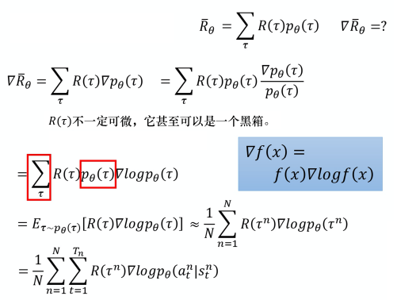

> 图1. 策略梯度公式

其中，对$∇p_θ(τ)$使用$∇f(x)=f(x)∇log⁡f(x)$，得到

$$
∇p_θ(τ)=p_θ(τ)∇log⁡~p_θ(τ)
$$

这个$∇f(x)=f(x)∇log⁡f(x)$大家可以把这个理解成一个固定的公式转换，记住即可。

如下式所示，对$τ$进行求和，把$R(τ)$和$log⁡p_θ(τ)$这两项使用$p_θ(τ)$进行加权，既然使用$p_θ(τ)$进行加权，它们就可以被写成期望的形式。也就是从$p_θ(τ)$这个分布里面采样$τ$出来，去计算$R(τ)$乘上$log⁡p_θ(τ)$，把它对所有可能的$τ$进行求和，就是这个期望的值。

$$
\begin{aligned} \nabla \bar{R}_{\theta} & =\sum_{\tau} R(\tau) \nabla p_{\theta}(\tau) \\ & =\sum_{\tau} R(\tau) p_{\theta}(\tau) \frac{\nabla p_{\theta}(\tau)}{p_{\theta}(\tau)} \\ & =\sum_{\tau} R(\tau) p_{\theta}(\tau) \nabla \log p_{\theta}(\tau) \\ & =E_{\tau \sim p_{\theta}(\tau)}\left[R(\tau) \nabla \log p_{\theta}(\tau)\right]\end{aligned}
$$

实际上这个期望值没有办法算，所以是用采样的方式来采样$N$条轨迹$τ$，去计算每一条的这些值，把它全部加起来，就可以得到梯度。就可以去更新参数，就可以去更新智能体，如下式所示。

$$
\begin{aligned} E_{\tau \sim p_{\theta}(\tau)}\left[R(\tau) \nabla \log p_{\theta}(\tau)\right] & \approx \frac{1}{N} \sum_{n=1}^{N} R\left(\tau^{n}\right) \nabla \log p_{\theta}\left(\tau^{n}\right) \\ & =\frac{1}{N} \sum_{n=1}^{N} \sum_{t=1}^{T_{n}} R\left(\tau^{n}\right) \nabla \log p_{\theta}\left(a_{t}^{n} \mid s_{t}^{n}\right)\end{aligned}
$$

$∇log⁡p_θ(τ)$ 的具体计算过程，如下式所示

$$
\begin{aligned} \nabla \log p_{\theta}(\tau) & =\nabla\left(\log p\left(s_{1}\right)+\sum_{t=1}^{T} \log p_{\theta}\left(a_{t} \mid s_{t}\right)+\sum_{t=1}^{T} \log p\left(s_{t+1} \mid s_{t}, a_{t}\right)\right) \\ & =\nabla \log p\left(s_{1}\right)+\nabla \sum_{t=1}^{T} \log p_{\theta}\left(a_{t} \mid s_{t}\right)+\nabla \sum_{t=1}^{T} \log p\left(s_{t+1} \mid s_{t}, a_{t}\right) \\ & =\nabla \sum_{t=1}^{T} \log p_{\theta}\left(a_{t} \mid s_{t}\right) \\ & =\sum_{t=1}^{T} \nabla \log p_{\theta}\left(a_{t} \mid s_{t}\right)\end{aligned}
$$

注意，$p(s_1)$和$p(s_{t+1}∣s_t,a_t)$来自于环境，$p_θ(a_t∣s_t)$是来自于智能体。$p(s_1)$和$p(s_{t+1}∣s_t,a_t)$由环境决定，所以与$θ$无关，因此

$$
\begin{array}{c}\nabla \log p\left(s_{1}\right)=0 \\ \nabla \sum_{t=1}^{T} \log p\left(s_{t+1} \mid s_{t}, a_{t}\right)=0\end{array}
$$

可以直观地来理解图1最终推导出来的公式，也就是在采样到的数据里面，采样到在某一个状态$s_t$要执行某一 个动作$a_t$，$s_t$和$a_t$它是在整个轨迹$τ$的里面的某一个状态和动作的对。 **假设在**$s_t$**执行**$a_t$**，最后发现**$τ$**的奖励是正的，就要增加这一项的概率，就要增加在**$s_t$**执行**$a_t$**的概率。反之，在**$s_t$**执行**$a_t$**会导致**$τ$\*\* 的奖励变成负的，就要减少这一项的概率。\*\* 

要计算上式，首先要先收集一大堆的 `s`跟 `a`的对（pair），还要知道这些 `s`跟 `a`在跟环境互动的时候，会得到多少的奖励。具体要拿智能体，它的参数是$θ$，去跟环境做互动，互动完以后，就会得到一大堆游戏的纪录。

就可以把采样到的数据代到梯度公式里面，把梯度算出来。也就是把采样到的数据中的每一个 `s`跟 `a`的对拿进来，算一下它的对数概率，也就是计算在某一个状态采取某一个动作的对数概率，对它取梯度，这个梯度前面会乘一个权重，权重就是这场游戏的奖励。有了这些以后，就会去更新模型。

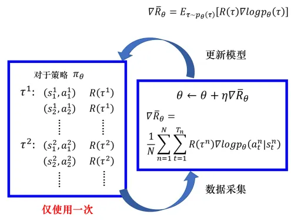

> 图2. 策略梯度算法

更新完模型以后，要重新去收集数据再更新模型。注意，一般策略梯度采样的数据就只会用一次。把这些数据采样起来，然后拿去更新参数，这些数据就丢掉了。接着再重新采样数据，才能够去更新参数。不过这也是有解决方法的，接下来会介绍如何解决。

### 2.3 技巧

#### （1）增加基线

在很多游戏中，得到的奖励总是正的，或者说最低也就是0。由于采取行动的概率和为1，当所有的reward都为正的时候，可能存在进行归一化后，R（权重）大的上升的多，R小的，归一化后它就是下降的。比如下面这种情况，假设某一状态下有三个动作，分别是a,b,c，奖励都是正的。根据公式$\nabla \bar{R}_{\theta}$，希望将这三个动作的概率以及对数概率都拉高，但是它们前面的权重R不一样，有大有小，所以权重大的，上升的多一点；权重小的，上升的少一些，又因为对数概率是一个概率，三个动作的和要为0，那么在做完归一化后，上升多的才会上升，上升的少的就是下降的。


> 图3. 添加基线

采样应该是一个期望，对所有可能的 `s`跟 `a`的对进行求和。但真正在学习时，只是采样了少量的 `s`跟 `a`的对而已。有一些动作可能从来都没有采样到。同样假设在某一个状态可以执行的动作有a,b,c，但你可能只采样到动作 `b`或者只采样到动作 `c`，没有采样到动作 `a`。 现在所有动作的奖励都是正的，根据公式$\nabla \bar{R}_{\theta}$，它的每一项概率都应上升。因为 `a`没有被采样到，其它动作的概率如果都要上升，`a`的概率就下降。但 `a`不一定是一个不好的动作，它只是没被采样到。但概率却下降了，这显然是有问题的，所以**希望奖励不要总是正的**。

为了解决奖励总是正的这一问题，可以把奖励减掉一项 `b`，如下式所示。

$$
\nabla \bar{R}_{\theta} \approx \frac{1}{N} \sum_{n=1}^{N} \sum_{t=1}^{T_{n}}\left(R\left(\tau^{n}\right)-b\right) \nabla \log p_{\theta}\left(a_{t}^{n} \mid s_{t}^{n}\right)
$$

其中，`b`叫做基线，减掉 `b`以后，就可以让$R(τn)−b$这一项有正有负。所以如果得到的总奖励$R(τn)$大于 `b`的话，就让它的概率上升。如果这个总奖励小于 `b`，就算它是正的，正的很小也是不好的，就要让这一项的概率下降。`b`通常是把$τn$的值取期望，算一下$τn$的平均值，即$b≈E[R(τ)]$。在实际训练的时候，不断地把$R(τn)$的分数记录下来，不断地计算$R(τn)$的平均值当作 `b`。

#### （2）分配合适的分数

在同一场游戏或者同一个回合中，**所有的状态跟动作的对都会使用同样的奖励项进行加权，这不公平，因为在同一场游戏中也许有些动作是好的，有些动作是不好的**。假设整场游戏的结果是好的，但不代表每一个动作都是对的，反之，也是。举个例子，假设游戏很短，在s1执行a1的奖励r1是5，在s2执行a2的奖励r2是0，在s3执行a3的奖励r3是-2。整场游戏结束，总奖励为3。但不代表在s2执行动作a2是好的，因为这个正的分数，主要来自于在s1执行了a1， 跟在s2执行a2是没有关系的，也许在s2执行a2反而是不好的，因为它导致你接下来会进入s3，执行s3被扣分，所以整场游戏得到的结果是好的，并不代表每一个动作都是对的。因此在训练的时候，每一个状态跟动作的对，都会被乘上3。

在理想的状况下，这个问题，**如果采样够多是可以被解决的**。但现在的问题是采样的次数不够多，所以计算这个 `状态-动作`对的奖励的时候，不把整场游戏得到的奖励全部加起来，只计算从这个动作执行以后所得到的奖励。因为这场游戏在执行这个动作之前发生的事情是跟执行这个动作是没有关系的，所以在执行这个动作之前得到多少奖励都不能算是这个动作的功劳。跟这个动作有关的东西，只有在执行这个动作以后发生的所有的奖励把它加起来，才是这个动作真正的贡献。如下式。

$$
\nabla \bar{R}_{\theta} \approx \frac{1}{N} \sum_{n=1}^{N} \sum_{t=1}^{T_{n}}\left(\sum_{t^{\prime}=t}^{T_{n}} \gamma^{t^{\prime}-t} r_{t^{\prime}}^{n}-b\right) \nabla \log p_{\theta}\left(a_{t}^{n} \mid s_{t}^{n}\right)
$$

对未来的奖励做了一个折扣，因为时间越久，奖励的重要性就越小，折扣因子$γ$，$γ∈[0,1]$，一般设置为0.9或0.99，如果$γ=0$，这表示只关心即时奖励；如果 $γ=1$， 这表示未来奖励等同于即时奖励。

举个例子大家就明白了，比如现在给你100块钱，和过个10年再把这个100块钱给你，你愿意选择哪一个，当然是前者啦，10年后的100块钱，有可能就相当于现在的10块钱的价值了。换句话说，60年代的1块钱和现在的1块钱的价值是一样的吗？

## 1.3 代码实现

案例：模拟登月小艇降落在月球表面时的情形。任务的目标是让登月小艇安全地降落在两个黄色旗帜间的平地上。测试环境：LunarLander-v2

- `Obs`：这个游戏环境有八个观测值，分别是水平坐标x，垂直坐标y，水平速度，垂直速度，角度，角速度，腿1触地，腿2触地；
- `Action`：agent可以采取四种离散行动，分别是什么都不做，发动左方向引擎喷射，发动主引擎向下喷射，发动右方向引擎喷射。
- `Reward`：小艇坠毁得-100分；小艇成功着陆在两个黄色旗帜之间得100\~140分；喷射主引擎向下喷火每次得-0.3分；小艇最终完全静止则再得100分；每条腿着地各得10分。

这里虽然采用的是离散的动作空间，但是整体代码是相差不大的，感兴趣的同学可以尝试下连续的动作空间。

定义网络结构：

```python
class PolicyNet(nn.Module):
    def __init__(self, n_states_num, n_actions_num, hidden_size):
        super(PolicyNet, self).__init__()
        self.data = []  # 存储轨迹
        # 输入为长度为8的向量 输出为4个动作
        self.net = nn.Sequential(
            # 两个线性层，中间使用Relu激活函数连接，最后连接softmax输出每个动作的概率
            nn.Linear(in_features=n_states_num, out_features=hidden_size, bias=False),
            nn.ReLU(),
            nn.Linear(in_features=hidden_size, out_features=n_actions_num, bias=False),
            nn.Softmax(dim=1)
        )

    def forward(self, inputs):
        # 状态输入s的shape为向量：[8]
        x = self.net(inputs)
        return x


```

定义PG类：

```python
class PolicyGradient():

    def __init__(self, n_states_num, n_actions_num, learning_rate=0.01, reward_decay=0.95 ):
        # 状态数   state是一个8维向量，分别是水平坐标x,垂直坐标y,水平速度,垂直速度,角度,角速度,腿1触地,腿2触地
        self.n_states_num = n_states_num
        # action是4维、离散，即什么都不做，发动左方向引擎，发动主机，发动右方向引擎。
        self.n_actions_num = n_actions_num
        # 学习率
        self.lr = learning_rate
        # gamma
        self.gamma = reward_decay
        # 网络
        self.pi = PolicyNet(n_states_num, n_actions_num, 128)
        # 优化器
        self.optimizer = torch.optim.Adam(self.pi.parameters(), lr=learning_rate)
        # 存储轨迹  存储方式为  （每一次的reward，动作的概率）
        self.data = []
        self.cost_his = []

    # 存储轨迹数据
    def put_data(self, item):
        # 记录r,log_P(a|s)z
        self.data.append(item)

    def train_net(self):
        # 计算梯度并更新策略网络参数。tape为梯度记录器
        R = 0  # 终结状态的初始回报为0
        policy_loss = []
        for r, log_prob in self.data[::-1]:  # 逆序取
            R = r + gamma * R  # 计算每个时间戳上的回报
            # 每个时间戳都计算一次梯度
            loss = -log_prob * R
            policy_loss.append(loss)
        self.optimizer.zero_grad()
        policy_loss = torch.cat(policy_loss).sum()  # 求和
        # print('policy_loss:', policy_loss.item())
        # 反向传播
        policy_loss.backward()
        self.optimizer.step()
        self.cost_his.append(policy_loss.item())
        # print('cost_his:', self.cost_his)
        self.data = []  # 清空轨迹

    # 将状态传入神经网络 根据概率选择动作
    def choose_action(self, state):
        # 将state转化成tensor 并且维度转化为[8]->[1,8]  
        s = torch.Tensor(state).unsqueeze(0)
        prob = self.pi(s)  # 动作分布:[0,1,2,3]
        # 从类别分布中采样1个动作, shape: [1] torch.log(prob), 1
      
        # 作用是创建以参数prob为标准的类别分布，样本是来自“0 … K-1”的整数，其中K是prob参数的长度。也就是说，按照传入的prob中给定的概率，
        # 在相应的位置处进行取样，取样返回的是该位置的整数索引。不是最大的，是按照概率采样的那个，采样到那个就是哪个的索引
        m = torch.distributions.Categorical(prob)  # 生成分布
        action = m.sample()
        return action.item(), m.log_prob(action)
      
    def plot_cost(self, avage_reward):
        import matplotlib.pyplot as plt
        plt.plot(np.arange(len(avage_reward)), avage_reward)
        plt.ylabel('Reward')
        plt.xlabel('training steps')
        plt.show()


```

训练模型：

```python
import   gym,os
import  numpy as np
import  matplotlib
# Default parameters for plots
matplotlib.rcParams['font.size'] = 18
matplotlib.rcParams['figure.titlesize'] = 18
matplotlib.rcParams['figure.figsize'] = [9, 7]
matplotlib.rcParams['font.family'] = ['KaiTi']
matplotlib.rcParams['axes.unicode_minus']=False

import torch
from torch import nn
env = gym.make('CartPole-v1')
env.seed(2333)
torch.manual_seed(2333)    # 策略梯度算法方差很大，设置seed以保证复现性
print('observation space:',env.observation_space)
print('action space:',env.action_space)

learning_rate = 0.0002
gamma         = 0.98

def main():
    policyGradient = PolicyGradient(4,2)
    running_reward = 10  # 计分
    print_interval = 20  # 打印间隔
    for n_epi in range(1000):
        state = env.reset()  # 回到游戏初始状态，返回s0
        ep_reward = 0
        for t in range(1001):  # CartPole-v1 forced to terminates at 1000 step.
            #根据状态 传入神经网络 选择动作
            action ,log_prob  = policyGradient.choose_action2(state)
            #与环境交互
            s_prime, reward, done, info = env.step(action)
            # s_prime, reward, done, info = env.step(action)
            if n_epi > 1000:
                env.render()
            # 记录动作a和动作产生的奖励r
            # prob shape:[1,2]
            policyGradient.put_data((reward, log_prob))
            state = s_prime  # 刷新状态
            ep_reward += reward
            if done:  # 当前episode终止
                break
            # episode终止后，训练一次网络
        running_reward = 0.05 * ep_reward + (1 - 0.05) * running_reward
        #交互完成后 进行学习
        policyGradient.train_net()
        if n_epi % print_interval == 0:
            print('Episode {}\tLast reward: {:.2f}\tAverage reward: {:.2f}'.format(
                n_epi, ep_reward, running_reward))
        if running_reward > env.spec.reward_threshold:  # 大于游戏的最大阈值475时，退出游戏
            print("Solved! Running reward is now {} and "
                  "the last episode runs to {} time steps!".format(running_reward, t))
            break
    policyGradient.plot_cost()

```

## 1.4 总结

策略梯度可以很好的解决具有连续动作空间的场景，可以学习到一些随机策略，有时是最优策略。可能还会有较好的收敛性，但也有可能收敛到局部最优，而不是全局最优，评价策略的过程有时也会比较低效，方差很大。不过总体还是不错的，之后我们再介绍相对更好的算法来解决这些缺点。

## 1.5 参考文献

\[1]《Reinforcement+Learning: An+Introduction》

\[2] [https://blog.csdn.net/baidu\_41871794/article/details/111057371](https://blog.csdn.net/baidu_41871794/article/details/111057371 "https://blog.csdn.net/baidu_41871794/article/details/111057371")

\[3] [李宏毅-DRL Lecture 1: Policy Gradient (Review)](https://www.youtube.com/watch?v=z95ZYgPgXOY&list=PLJV_el3uVTsODxQFgzMzPLa16h6B8kWM_&index=1)

# 2. 近端策略优化(ppo)

> 文章来源：[详解近端策略优化](https://www.cnblogs.com/xingzheai/p/15931681.html "详解近端策略优化")

## 2.0 引言

ppo其实就是策略梯度的一种变形。首先介绍一下同策略（on-policy）与异策略(off-policy)的区别。

在强化学习里面，需要学习的其实就是一个智能体。如果要学习的智能体跟和环境互动的智能体是同一个的话，称之为**同策略**。如果要学习的智能体跟和环境互动的智能体不是同一个的话，称之为**异策略**。策略梯度是同策略的算法。

## 2.1 同策略的不足之处

首先回顾一下PG的期望奖励值，公式如下。

$$
\nabla \bar{R}_{\theta}=E_{\tau \sim p_{\theta}(\tau)}\left[R(\tau) \nabla \log p_{\theta}(\tau)\right]
$$

上面更新的公式中的$E_{τ∼p_θ(τ)}$是在策略$π_θ$的情况下， 所采样出来的轨迹$τ$做期望。但是如果更新了参数，从$θ$变成$θ′$，概率$p_θ(τ)$就不对了，之前采样出来的数据就不能用了。所以PG会花很多时间去采样数据，可以说大多数时间都在采样数据，智能体去跟环境做互动以后，接下来就要更新参数，只能用这些数据更新参数一次。接下来就要重新再去收集数据，才能再次更新参数。

## 2.2 改进同策略的思路

策略梯度是同策略的算法，所以非常耗费时间，那么一个可能的改进思路是将同策略变成异策略。简单的思路就是**用另外一个策略**$π_{θ′}$**， 另外一个演员**$θ′$**去跟环境做互动。用**$θ′$**收集到的数据去训练**$θ$。假设可以用$θ′$收集到的数据去训练$θ$，意味着说可以把$θ′$收集到的数据用很多次，也就是可以执行梯度上升好几次，更新参数好几次，这都只要用同一笔数据就可以实现。因为假设$θ$有能力学习另外一 个演员$θ′$所采样出来的数据的话，那$θ′$就只要采样一次，也许采样多一点的数据，让$θ$去更新很多次， 这样就会比较有效率。

## 2.3 同策略到异策略的具体实现

那么问题来了， 怎么找到这样的一个演员$θ′$，使其收集到的数据可以用于训练$θ$，且他们之间的差异可以被忽略不计呢？

首先介绍一个名词，**重要性采样（importance sampling）**。 假设有一个函数$f(x)$，$x$需要从分布$p$中采样。应该如何怎么计算$f(x)$的期望值呢？假设分布$p$不能做积分，那么可以从分布$p$尽可能多采样更多的$x_i$。这样就会得到更多的$f(x)$，取它的平均值就可以近似$f(x)$的期望值。

现在另外一个问题也来了，假设不能在分布$p$中采样数据，只能从另外一个分布$q$中去采样数据，$q$可以是任何分布。从$q$中采样$x_i$的话就不能直接套下面的式子。

$$
E_{x \sim p}[f(x)] \approx \frac{1}{N} \sum_{i=1}^{N} f\left(x^{i}\right)
$$

因为上式是假设$x$都是从$p$采样出来的。如果想要在$q$中采样的情况下带入上式，就需要做些变换。期望值$E_{x∼p}[f(x)]$的另一种写法是$\int f(x) p(x) d x$，对其进行变换，如下式所示，

$$
\int f(x) p(x) d x=\int f(x) \frac{p(x)}{q(x)} q(x) d x=E_{x \sim q}\left[f(x) \frac{p(x)}{q(x)}\right]
$$

整理得下式，

$$
E_{x \sim p}[f(x)]=E_{x \sim q}\left[f(x) \frac{p(x)}{q(x)}\right]
$$

这样就可以对分布$q$中采样的$x$取期望值。具体来说，从$q$中采样$x$，再去计算$f(x) \frac{p(x)}{q(x)}$，最后取期望值。所以就算不能从$p$里面去采样数据，只要能够从$q$里面去采样数据，代入上式，就可以计算从分布$p$采样$x$代入$f(x)$以后所算出来的期望值。

这边是从$q$做采样，所以**从**$q$**里采样出来的每一条数据，需要乘上一个重要性权重（importance weight）**$\frac{p(x)}{q(x)}$**来修正这两个分布的差异**。$q(x)$可以是任何分布。重要性采样有一些问题。虽然可以把$p$换成任何的$q$。但是在实现上，$p$和不$q$能差太多。差太多的话，会有一些问题。两个随机变量的平均值一样，并不代表它的方差一样，这里不展开解释，感兴趣的童鞋可以带入方差公式$\operatorname{Var}[X]=E\left[X^{2}\right]-(E[X])^{2}$推导一下。

现在要做的事情就是把重要性采样用在异策略的情况，把同策略训练的算法改成异策略训练的算法。 怎么改呢，如下式所示，用另外一个策略$π_θ′$，它就是另外一个演员，与环境做互动，采样出轨迹$θ′$，计算$R(τ)∇log⁡p_θ(τ)$。

$$
\nabla \bar{R}_{\theta}=E_{\tau \sim p_{\theta^{\prime}(\tau)}}\left[\frac{p_{\theta}(\tau)}{p_{\theta^{\prime}}(\tau)} R(\tau) \nabla \log p_{\theta}(\tau)\right]
$$

$θ′$的职责是要去示范给$θ$看。它去跟环境做互动，采样数据来训练$θ$。这两个分布虽然不一样，但其实没有关系。假设本来是从$p$做采样，但发现不能从$p$做采样，可以把$p$换$q$，在后面补上一个重要性权重。同理，把$θ$换成$θ′$后，要补上一个重要性权重 $\frac{p_{\theta}(\tau)}{p_{\theta^{\prime}}(\tau)}$。**这个重要性权重就是某一个轨迹**$θ′$**用**$θ$**算出来的概率除以这个轨迹**$τ$**用**$θ′$**算出来的概率**。

实际在做策略梯度的时候，并不是给整个轨迹$θ′$都一样的分数，而是每一个 `状态-动作`的对会分开来计算。实际上更新梯度的时候，如下式所示。

$$
E_{\left(s_{t}, a_{t}\right) \sim \pi_{\theta}}\left[A^{\theta}\left(s_{t}, a_{t}\right) \nabla \log p_{\theta}\left(a_{t}^{n} \mid s_{t}^{n}\right)\right]
$$

用演员$θ$去采样出$s_t$跟 $a_t$ ，采样出状态跟动作的对，并计算这个状态跟动作对的优势$A_θ(s_t,a_t)$。$A_θ(s_t,a_t)$就是累积奖励减掉偏置项，这一项是估测出来的。它要估测的是**在状态**$s_t$**采取动作**$a_t$\*\* 是好的还是不好的\*\*。也就是说**如果**$A_θ(s_t,a_t)$**是正的，就要增加概率，如果是负的，就要减少概率**。 所以现在$s_t$、$a_t$是$θ′$跟环境互动以后所采样到的数据。但是拿来训练，要调整参数的模型是$θ$。**因为**$θ′$**跟**$θ$**是不同的模型，所以需要用重要性采样技术去做修正**。即把$s_t$、$a_t$ 用$θ$采样出来的概率除掉$s_t$、$a_t$ 用$θ′$采样出来的概率。公式如下。

$$
E_{\left(s_{t}, a_{t}\right) \sim \pi_{\theta^{\prime}}}\left[\frac{p_{\theta}\left(s_{t}, a_{t}\right)}{p_{\theta^{\prime}}\left(s_{t}, a_{t}\right)} A^{\theta}\left(s_{t}, a_{t}\right) \nabla \log p_{\theta}\left(a_{t}^{n} \mid s_{t}^{n}\right)\right]
$$

上式中的$A^θ(s_t,a_t)$有一个上标$θ$，代表说是演员$θ$跟环境互动的时候所计算出来的结果。但实际上从$θ$换到$θ′$的时候，$A^θ(st,at)$应该改成$A^{θ′}(st,at)$，为什么呢？A这一项是想要估测说在某一个状态采取某一个动作，接下来会得到累积奖励的值减掉基线。之前是$θ$在跟环境做互动，所以可以观察到的是$θ$可以得到的奖励。但是现在是$θ′$在跟环境做互动，所以得到的这个优势是根据$θ′$所估计出来的优势。但现在先不要管那么多，就假设$A^θ(s_t,a_t)$和$A^{θ′}(s_t,a_t)$可能是差不多的。

接下来，可以拆解$p_θ(s_t,a_t)$和$p_{θ′}(s_t,a_t)$，即

$$
\begin{aligned} p_{\theta}\left(s_{t}, a_{t}\right) & =p_{\theta}\left(a_{t} \mid s_{t}\right) p_{\theta}\left(s_{t}\right) \\ p_{\theta^{\prime}}\left(s_{t}, a_{t}\right) & =p_{\theta^{\prime}}\left(a_{t} \mid s_{t}\right) p_{\theta^{\prime}}\left(s_{t}\right)\end{aligned}
$$

于是可得公式

$$
E_{\left(s_{t}, a_{t}\right) \sim \pi_{\theta}}\left[\frac{p_{\theta}\left(a_{t} \mid s_{t}\right)}{p_{\theta^{\prime}}\left(a_{t} \mid s_{t}\right)} \frac{p_{\theta}\left(s_{t}\right)}{p_{\theta^{\prime}}\left(s_{t}\right)} A^{\theta^{\prime}}\left(s_{t}, a_{t}\right) \nabla \log p_{\theta}\left(a_{t}^{n} \mid s_{t}^{n}\right)\right]
$$

这里需要做一件事情，假设模型是$θ$的时候，看到$s_t$的概率，跟模型是$θ′$的时候，看到$s_t$的概率是差不多的，即$p_θ(s_t)=p_{θ′}(s_t)$。

为什么可以这样假设呢？一种直观的解释就是$p_θ(s_t)$很难算，这一项有一个参数$θ$，需要拿$θ$去跟环境做互动，算$s_t$出现的概率。 尤其是如果输入是图片的话，同样的st根本就不会出现第二次。根本没有办法估这一项，所以就直接无视这个问题。但是$p_θ(a_t∣s_t)$很好算，有$θ$这个参数，它就是个网络。就把$s_t$带进去，$s_t$就是游戏画面。 有个策略的网络，输入状态$s_t$，它会输出每一个$a_t$的概率。所以$p_θ(a_t∣s_t)$与$p_{θ′}(a_t∣s_t)$这两项，只要知道$θ$和$θ′$的参数就可以算。实际上在更新参数 的时候，就是按照下式来更新参数。公式如下。

$$
E_{\left(s_{t}, a_{t}\right) \sim \pi_{\theta^{\prime}}}\left[\frac{p_{\theta}\left(a_{t} \mid s_{t}\right)}{p_{\theta^{\prime}}\left(a_{t} \mid s_{t}\right)} A^{\theta^{\prime}}\left(s_{t}, a_{t}\right) \nabla \log p_{\theta}\left(a_{t}^{n} \mid s_{t}^{n}\right)\right]
$$

所以实际上，可以从梯度去反推原来的目标函数，可以用$∇f(x)=f(x)∇log⁡f(x)$来反推目标函数。当使用重要性采样的时候，要去优化的目标函数如下式所示，把它记$J^{θ′}(θ)$。括号里面的$θ$代表需要去优化的参数。用$θ′$去做示范采样数据，采样出$s_t$、$a_t$以后，要去计算$s_t$跟$a_t$的优势，再乘上 $\frac{p_{\theta}\left(a_{t} \mid s_{t}\right)}{p_{\theta}\left(a_{t} \mid s_{t}\right)}$)。

$$
J^{\theta^{\prime}}(\theta)=E_{\left(s_{t}, a_{t}\right) \sim \pi_{\theta^{\prime}}}\left[\frac{p_{\theta}\left(a_{t} \mid s_{t}\right)}{p_{\theta^{\prime}}\left(a_{t} \mid s_{t}\right)} A^{\theta^{\prime}}\left(s_{t}, a_{t}\right)\right]
$$

## 2.4 PPO

注意，由于在 PPO 中$θ′$是$θ_{old}$ ，即行为策略也是$π_θ$，所以 PPO 是同策略的算法。

上面通过重要性采样把同策略换成异策略，但重要性采样有一个问题：如果$p_θ(a_t∣s_t)$和$p_{θ′}(a_t∣s_t)$差太多的话，即这两个分布差太多的话，重要性采样的结果就会不好。那么怎么避免差太多呢？这就是 PPO 在做的事情。

PPO在训练的时候，**多加一个约束项**。 这个约束是$θ$跟$θ′$输出的动作的**KL散度**，简单来说，这一项的意思就是**要衡量说**$θ$**跟**$θ′$**有多像**。希望在训练的过程中，学习出来的$θ$跟$θ′$越像越好。因为如果$θ$跟$θ′$不像的话，最后的结果就会不好。所以在 PPO 里面有两项：

1. 一项是优化本来要优化的东西
2. 另一项是一个约束。这个约束就好像正则化的项一样，作用是希望最后学习出来的$θ$与$θ′$尽量不用差太多。

PPO算法公式如下。

$$
\begin{aligned} J_{\mathrm{PPO}}^{\theta^{\prime}}(\theta) & =J^{\theta^{\prime}}(\theta)-\beta \mathrm{KL}\left(\theta, \theta^{\prime}\right) \\ J^{\theta^{\prime}}(\theta) & =E_{\left(s_{t}, a_{t}\right) \sim \pi_{\theta}}\left[\frac{p_{\theta}\left(a_{t} \mid s_{t}\right)}{p_{\theta^{\prime}}\left(a_{t} \mid s_{t}\right)} A^{\theta^{\prime}}\left(s_{t}, a_{t}\right)\right]\end{aligned}
$$

### 4.1 TRPO

PPO 有一个前身：信任区域策略优化（trust region policy optimization，TRPO），TRPO 的式子如下式所示。

$$
\begin{array}{r}J_{\mathrm{TRPO}}^{\theta^{\prime}}(\theta)=E_{\left(s_{t}, a_{t}\right) \sim \pi_{\theta}}\left[\frac{p_{\theta}\left(a_{t} \mid s_{t}\right)}{p_{\theta^{\prime}}\left(a_{t} \mid s_{t}\right)} A^{\theta^{\prime}}\left(s_{t}, a_{t}\right)\right] \\ \mathrm{KL}\left(\theta, \theta^{\prime}\right)<\delta\end{array}
$$

TRPO 与 PPO 不一样的地方是约束项摆的位置不一样，**PPO 是直接把约束放到要优化的式子里，可以直接用梯度上升的方法最大化这个式子**。但**TRPO是把 KL 散度当作约束，它希望**$θ$**跟**$θ′$**的 KL 散度小于一个**$δ$。如果使用的是基于梯度的优化时，有约束是很难处理的，因为它把 KL 散度约束当做一个额外的约束，没有放目标里面。PPO 跟 TRPO 的性能差不多，**但 PPO 在实现上比 TRPO 容易的多，所以一般就用 PPO，而不用TRPO**。

### 4.2 PPO算法的两个主要变种

#### （1）近端策略优化惩罚（PPO-penalty）

首先初始化一个策略的参数$θ^0$。在每一个迭代里面，要用前一个训练的迭代得到的演员的参数$θ^k$去跟环境做互动，采样到一大堆 `状态-动作`的对。 根据$θ^k$互动的结果，估测$A^{θ^k}(s_t,a_t)$。如下式所示。

$$
J_{\mathrm{PPO}}^{\theta^{k}}(\theta)=J^{\theta^{k}}(\theta)-\beta \mathrm{KL}\left(\theta, \theta^{k}\right)
$$

上述KL散度前需要乘一个权重$β$，需要一个方法来动态调整$β$。 这个方法就是自适应KL惩罚：如果 $KL(θ, θ^k ) > KLmax$，增加$β$；如果 $KL(θ, θ^k ) < KLmin$，减少 $β$。简单来说就是**KL散度的项大于自己设置的KL散度最大值，说明后面这个惩罚的项没有发挥作用，就把**$β$**调大。同理，如果KL 散度比最小值还要小，这代表后面这一项的效果太强了，所以要减少**$β$。近端策略优化惩罚公式如下。

$$
\begin{array}{l} J_{P P O}^{\theta^{k}}(\theta)=J^{\theta^{k}}(\theta)-\beta K L\left(\theta, \theta^{k}\right) \\ J^{\theta^{k}}(\theta) \approx \sum_{\left(s_{t}, a_{t}\right)} \frac{p_{\theta}\left(a_{t} \mid s_{t}\right)}{p_{\theta^{k}}\left(a_{t} \mid s_{t}\right)} A^{\theta^{k}}\left(s_{t}, a_{t}\right)\end{array}
$$

#### （2）近端策略优化裁剪（PPO-clip）

如果你觉得算KL散度很复杂，另外一种PPO变种即近端策略优化裁剪。近端策略优化裁剪要去最大化的目标函数如下式所示，式子里面就没有 KL 散度。

$$
\begin{aligned} J_{\mathrm{PPO} 2}^{\theta^{k}}(\theta) \approx \sum_{\left(s_{t}, a_{t}\right)} \min & \left(\frac{p_{\theta}\left(a_{t} \mid s_{t}\right)}{p_{\theta^{k}}\left(a_{t} \mid s_{t}\right)} A^{\theta^{k}}\left(s_{t}, a_{t}\right)\right. \\ & \left.\operatorname{clip}\left(\frac{p_{\theta}\left(a_{t} \mid s_{t}\right)}{p_{\theta^{k}}\left(a_{t} \mid s_{t}\right)}, 1-\varepsilon, 1+\varepsilon\right) A^{\theta^{k}}\left(s_{t}, a_{t}\right)\right)\end{aligned}
$$

上式看起来很复杂，其实很简单，它想做的事情就是希望$p_θ(a_t∣s_t)$跟$p_{θ^k}(a_t∣s_t)$，也就是做示范的模型跟实际上学习的模型，在优化以后不要差距太大。

- 操作符 `min`作用是在第一项和第二项中选择最小的。
- 第二项前面有个**裁剪（clip）函数**，裁剪函数是指：在括号里有三项，如果第一项小于第二项，则输出$1 − ε$；如果第一项大于第三项的话，则输出$1 + ε$。
- $ε$ 是一个超参数，要需要调整，一般设置为0.1或0.2 。

举个栗子，假设设$ε=0.2$，如下式所示。

$$
\operatorname{clip}\left(\frac{p_{\theta}\left(a_{t} \mid s_{t}\right)}{p_{\theta^{k}}\left(a_{t} \mid s_{t}\right)}, 0.8,1.2\right)
$$

在上式中，如果$\frac{p_{\theta}\left(a_{t} \mid s_{t}\right)}{p_{\theta^{k}}\left(a_{t} \mid s_{t}\right)}$计算结果小于0.8，则clip函数值就是0.8；如果结果大于1.2，则取1.2。当然，如果介于0.8\~1.2之间，则输入等输出。

详细看看clip函数到底算的是什么。

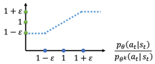

> 图1. clip函数

横轴是$\frac{p_{\theta}\left(a_{t} \mid s_{t}\right)}{p_{\theta^{k}}\left(a_{t} \mid s_{t}\right)}$，纵轴是裁剪函数的输出。

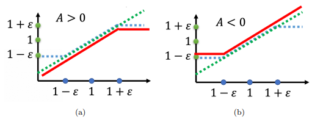

> 图2. clip函数详细图

如图 2-a 所示， $\frac{p_{\theta}\left(a_{t} \mid s_{t}\right)}{p_{\theta^{k}}\left(a_{t} \mid s_{t}\right)}$是绿色的线；$\operatorname{clip}\left(\frac{p_{\theta}\left(a_{t} \mid s_{t}\right)}{p_{\theta^{k}}\left(a_{t} \mid s_{t}\right)}, 1-\varepsilon, 1+\varepsilon\right)$是蓝色的线；在绿色的线跟蓝色的线中间，要取最小值。假设前面乘上的这个项 A，它是大于 0 的话，取最小的结果，就是红色的这一条线。如图 2-b 所示，如果 A 小于 0 的话，取最小的以后，就得到红色的这一条线。

这其实就是控制$p_θ(a_t∣s_t)$跟$p_{θ^k}(a_t∣s_t)$在优化以后不要差距太大。具体来说：

如果 $A > 0$，也就是某一个 `状态-动作`的对是好的，希望增加这个 `状态-动作`对的概率。也就是想要让$p_θ(a_t∣s_t)$越大越好，但它跟$p_{θ^k}(a_t∣s_t)$)的比值不可以超过$1+ε$。如果超过 $1 +ε$ 的话，就没有好处了。红色的线就是目标函数，希望目标越大越好，也就是希望$p_θ(a_t∣s_t)$越大越好。但是$\frac{p_{\theta}\left(a_{t} \mid s_{t}\right)}{p_{\theta^{k}}\left(a_{t} \mid s_{t}\right)}$只要大过 $1+ε$，就没有好处了。所以在训练的时候，当 $p_θ(a_t∣s_t)$ 被 训练到$\frac{p_{\theta}\left(a_{t} \mid s_{t}\right)}{p_{\theta^{k}}\left(a_{t} \mid s_{t}\right)}>1 +ε$ 时，它就会停止。

假设$p_θ(a_t∣s_t)$比$p_{θ^k}(a_t∣s_t)$还要小，并且这个优势是正的。因为这个动作是好的，希望这个动作被采取的概率越大越好，希望$p_θ(a_t∣s_t)$越大越好，那就尽量把它变大，但只要大到 $1 + ε$ 就好。

如果 $A < 0$，也就是某一个 `状态-动作`对是不好的，希望把$p_θ(a_t∣s_t)$减小。如果$p_θ(a_t∣s_t)$比$p_{θ^k}(a_t∣s_t)$还大，那就尽量把它压小，压到$\frac{p_{\theta}\left(a_{t} \mid s_{t}\right)}{p_{\theta^{k}}\left(a_{t} \mid s_{t}\right)}$是 $ 1 − ε  $的时候就停了，就不要再压得更小。这样的好处就是不会让$p_θ(a_t∣s_t)$跟$p_{θ^k}(a_t∣s_t)$差距太大，并且实现这个方法也比较简单。

## 2.5 代码实现

案例：倒立摆问题。钟摆以随机位置开始，目标是将其向上摆动，使其保持直立。 测试环境：Pendulum-v1

动作：往左转还是往右转，用力矩来衡量，即力乘以力臂。范围 `[-2,2]`：（连续空间）

状态：cos(theta), sin(theta) , thetadot。

奖励：越直立拿到的奖励越高，越偏离，奖励越低。奖励的最大值为0。

定义网络结构：

```python
class FeedForwardNN(nn.Module):

  def __init__(self, in_dim, out_dim):
  
    super(FeedForwardNN, self).__init__()

    self.layer1 = nn.Linear(in_dim, 64)
    self.layer2 = nn.Linear(64, 64)
    self.layer3 = nn.Linear(64, out_dim)

  def forward(self, obs):
  
    if isinstance(obs, np.ndarray):
      obs = torch.tensor(obs, dtype=torch.float)

    activation1 = F.relu(self.layer1(obs))
    activation2 = F.relu(self.layer2(activation1))
    output = self.layer3(activation2)

    return output

```

定义PPO类：

```python
class PPO:

  def __init__(self, policy_class, env, **hyperparameters):

    # PPO 初始化用于训练的超参数
    self._init_hyperparameters(hyperparameters)

    # 提取环境信息
    self.env = env
    self.obs_dim = env.observation_space.shape[0]
    self.act_dim = env.action_space.shape[0]
      
    # 初始化演员和评论家网络
    self.actor = policy_class(self.obs_dim, self.act_dim)                                              
    self.critic = policy_class(self.obs_dim, 1)

    # 为演员和评论家初始化优化器
    self.actor_optim = Adam(self.actor.parameters(), lr=self.lr)
    self.critic_optim = Adam(self.critic.parameters(), lr=self.lr)

    # 初始化协方差矩阵，用于查询actor网络的action
    self.cov_var = torch.full(size=(self.act_dim,), fill_value=0.5)
    self.cov_mat = torch.diag(self.cov_var)

    # 这个记录器将帮助我们打印出每个迭代的摘要
    self.logger = {
      'delta_t': time.time_ns(),
      't_so_far': 0,          # 到目前为止的时间步数
      'i_so_far': 0,          # 到目前为止的迭代次数
      'batch_lens': [],       # 批次中的episodic长度
      'batch_rews': [],       # 批次中的rews回报
      'actor_losses': [],     # 当前迭代中演员网络的损失
    }

  def learn(self, total_timesteps):

    print(f"Learning... Running {self.max_timesteps_per_episode} timesteps per episode, ", end='')
    print(f"{self.timesteps_per_batch} timesteps per batch for a total of {total_timesteps} timesteps")
    t_so_far = 0 # 到目前为止仿真的时间步数
    i_so_far = 0 # 到目前为止，已运行的迭代次数
    while t_so_far < total_timesteps:                                                                
  
      # 收集批量实验数据
      batch_obs, batch_acts, batch_log_probs, batch_rtgs, batch_lens = self.rollout()                  

      # 计算收集这一批数据的时间步数
      t_so_far += np.sum(batch_lens)

      # 增加迭代次数
      i_so_far += 1

      # 记录到目前为止的时间步数和到目前为止的迭代次数
      self.logger['t_so_far'] = t_so_far
      self.logger['i_so_far'] = i_so_far

      # 计算第k次迭代的advantage
      V, _ = self.evaluate(batch_obs, batch_acts)
      A_k = batch_rtgs - V.detach()                                                               

      # 将优势归一化 在理论上不是必须的，但在实践中，它减少了我们优势的方差，使收敛更加稳定和快速。
      # 添加这个是因为在没有这个的情况下，解决一些环境的问题太不稳定了。
      A_k = (A_k - A_k.mean()) / (A_k.std() + 1e-10)
          
      # 在其中更新我们的网络。
      for _ in range(self.n_updates_per_iteration):  
  
        V, curr_log_probs = self.evaluate(batch_obs, batch_acts)

        # 重要性采样的权重
        ratios = torch.exp(curr_log_probs - batch_log_probs)

        surr1 = ratios * A_k
        surr2 = torch.clamp(ratios, 1 - self.clip, 1 + self.clip) * A_k

        # 计算两个网络的损失。
        actor_loss = (-torch.min(surr1, surr2)).mean()
        critic_loss = nn.MSELoss()(V, batch_rtgs)

        # 计算梯度并对actor网络进行反向传播
        # 梯度清零
        self.actor_optim.zero_grad()
        # 反向传播，产生梯度
        actor_loss.backward(retain_graph=True)
        # 通过梯度下降进行优化
        self.actor_optim.step()

        # 计算梯度并对critic网络进行反向传播
        self.critic_optim.zero_grad()
        critic_loss.backward()
        self.critic_optim.step()

        self.logger['actor_losses'].append(actor_loss.detach())
              
      self._log_summary()

      if i_so_far % self.save_freq == 0:
        torch.save(self.actor.state_dict(), './ppo_actor.pth')
        torch.save(self.critic.state_dict(), './ppo_critic.pth')

  def rollout(self):
    """
      这就是我们从实验中收集一批数据的地方。由于这是一个on-policy的算法，我们需要在每次迭代行为者/批评者网络时收集一批新的数据。
    """
    batch_obs = []
    batch_acts = []
    batch_log_probs = []
    batch_rews = []
    batch_rtgs = []
    batch_lens = []

    # 一回合的数据。追踪每一回合的奖励，在回合结束的时候会被清空，开始新的回合。
    ep_rews = []

    # 追踪到目前为止这批程序我们已经运行了多少个时间段
    t = 0 

    # 继续实验，直到我们每批运行超过或等于指定的时间步数
    while t < self.timesteps_per_batch:
      ep_rews = []  每回合收集的奖励

      # 重置环境
      obs = self.env.reset()
      done = False
          
      # 运行一个回合的最大时间为max_timesteps_per_episode的时间步数
      for ep_t in range(self.max_timesteps_per_episode):
    
        if self.render and (self.logger['i_so_far'] % self.render_every_i == 0) and len(batch_lens) == 0:
          self.env.render()

        # 递增时间步数，到目前为止已经运行了这批程序
        t += 1

        #  追踪本批中的观察结果
        batch_obs.append(obs)

        # 计算action，并在env中执行一次step。
        # 注意，rew是奖励的简称。
        action, log_prob = self.get_action(obs)
        obs, rew, done, _ = self.env.step(action)

        # 追踪最近的奖励、action和action的对数概率
        ep_rews.append(rew)
        batch_acts.append(action)
        batch_log_probs.append(log_prob)

        if done:
          break
                  
      # 追踪本回合的长度和奖励
      batch_lens.append(ep_t + 1)
      batch_rews.append(ep_rews)

    # 将数据重塑为函数描述中指定形状的张量，然后返回
    batch_obs = torch.tensor(batch_obs, dtype=torch.float)
    batch_acts = torch.tensor(batch_acts, dtype=torch.float)
    batch_log_probs = torch.tensor(batch_log_probs, dtype=torch.float)
    batch_rtgs = self.compute_rtgs(batch_rews)                                                            

    # 在这批中记录回合的回报和回合的长度。
    self.logger['batch_rews'] = batch_rews
    self.logger['batch_lens'] = batch_lens

    return batch_obs, batch_acts, batch_log_probs, batch_rtgs, batch_lens

  def compute_rtgs(self, batch_rews):

    batch_rtgs = []
      
    # 遍历每一回合，一个回合有一批奖励
    for ep_rews in reversed(batch_rews):
      # 到目前为止的折扣奖励
      discounted_reward = 0

      # 遍历这一回合的所有奖励。我们向后退，以便更顺利地计算每一个折现的回报
      for rew in reversed(ep_rews):
              
        discounted_reward = rew + discounted_reward * self.gamma
        batch_rtgs.insert(0, discounted_reward)

    # 将每个回合的折扣奖励的数据转换成张量
    batch_rtgs = torch.tensor(batch_rtgs, dtype=torch.float)

    return batch_rtgs

  def get_action(self, obs):
  
    mean = self.actor(obs)

    # 用上述协方差矩阵中的平均行动和标准差创建一个分布。
    dist = MultivariateNormal(mean, self.cov_mat)
    action = dist.sample()
    log_prob = dist.log_prob(action)

    return action.detach().numpy(), log_prob.detach()

  def evaluate(self, batch_obs, batch_acts):
    """
      估算每个观察值，以及最近一批actor网络迭代中的每个action的对数prob。
    """
      
    # 为每个batch_obs查询critic网络的V值。V的形状应与batch_rtgs相同。
    V = self.critic(batch_obs).squeeze()

    # 使用最近的actor网络计算批量action的对数概率。
    mean = self.actor(batch_obs)
    dist = MultivariateNormal(mean, self.cov_mat)
    log_probs = dist.log_prob(batch_acts)

    # 返回批次中每个观察值的值向量V和批次中每个动作的对数概率log_probs
    return V, log_probs


```

最终的动画效果如下图：


训练结果如下所示：

```bash
Average Episodic Length：200
Average Episodic Return：-76.99
Average actor_loss：0.0017
Average value_loss：0.49982
Iteration：10000
```

## 2.6 总结

PPO其实就是**避免在使用重要性采样时由于在**$θ$**下的 **$p_θ(a_t∣s_t)$**与在**$θ′$** 下的**$p_{θ′}(a_t∣s_t)$**差太多，导致重要性采样结果偏差较大而采取的算法**。具体来说就是在训练的过程中增加一个限制，这个限制对应着$θ$和$θ′$输出的动作的 KL 散度，来衡量$θ$与$θ′$的相似程度。

## 2.7 参考文献

\[1]《Reinforcement+Learning: An+Introduction》

\[2] [https://medium.com/analytics-vidhya/coding-ppo-from-scratch-with-pytorch-part-1-4-613dfc1b14c8](https://medium.com/analytics-vidhya/coding-ppo-from-scratch-with-pytorch-part-1-4-613dfc1b14c8 "https://medium.com/analytics-vidhya/coding-ppo-from-scratch-with-pytorch-part-1-4-613dfc1b14c8")

\[3] [李宏毅-DRL Lecture 2: Proximal Policy Optimization (PPO)](https://www.youtube.com/watch?v=OAKAZhFmYoI&list=PLJV_el3uVTsODxQFgzMzPLa16h6B8kWM_&index=2)

# 3. 大模型RLHF：PPO原理与源码解读

> 原文链接：[图解大模型RLHF系列之：人人都能看懂的PPO原理与源码解读](https://zhuanlan.zhihu.com/p/677607581 "图解大模型RLHF系列之：人人都能看懂的PPO原理与源码解读")

**本文直接从一个RLHF开源项目源码入手（deepspeed-chat），根据源码的实现细节，给出尽可能丰富的训练流程图，并对所有的公式给出直观的解释。希望可以帮助大家更具象地感受RLHF的训练流程**。关于RLHF，各家的开源代码间都会有一些差异，同时也不止PPO一种RLHF方式。

## 3.1.强化学习概述

### 3.1.1 强化学习整体流程

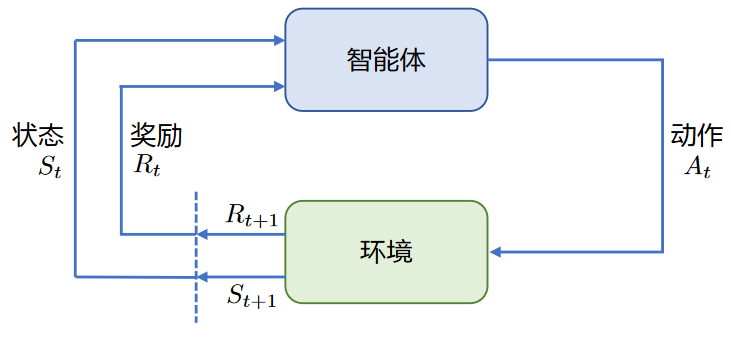

强化学习的两个实体：**智能体（Agent）**与**环境（Environment）**

强化学习中两个实体的交互：

- **状态空间S**：S即为State，指环境中所有可能状态的集合
- **动作空间A**：A即为Action，指智能体所有可能动作的集合
- **奖励R**\*\*：\*\* R即为Reward，指智能体在环境的某一状态下所获得的奖励。

以上图为例，智能体与环境的交互过程如下：

- 在 `t` 时刻，环境的状态为 $S_{t}$ ，达到这一状态所获得的奖励为 $R_{t}$
- 智能体观测到 $S_{t}$ 与 $R_{t}$ ，采取相应动作 $A_{t}$
- 智能体采取 $A_{t}$ 后，环境状态变为 $S_{t+1}$ ，得到相应的奖励 $R_{t+1}$

智能体在这个过程中学习，它的最终目标是：**找到一个策略，这个策略根据当前观测到的环境状态和奖励反馈，来选择最佳的动作。**

### 3.1.2 价值函数

在1.1中，谈到了奖励值 $R_{t}$ ，它表示环境进入状态 $S_{t}$ 下的**即时奖励**。**但如果只考虑即时奖励，目光似乎太短浅了**：当下的状态和动作会影响到未来的状态和动作，进而影响到未来的整体收益。所以，一种更好的设计方式是：**t时刻状态s的总收益 = 身处状态s能带来的即时收益 + 从状态s出发后能带来的未来收益**\*\*。\*\* 写成表达式就是：

$$
V_{t} = R_{t} + \gamma V_{t+1}
$$

其中：

- $V_{t}$ ： `t` 时刻的总收益，注意这个收益蕴涵了“即时”和“未来”的概念
- $R_{t}$ ： `t` 时刻的即时收益
- $V_{t+1}$ ： `t+1` 时刻的总收益，注意这个收益蕴涵了“即时”和“未来”的概念。而 $V_{t+1}$ 对 $V_{t}$ 来说就是“未来”。
- $\gamma$ ：折扣因子。它决定了我们在多大程度上考虑将“未来收益”纳入“当下收益”。

注：在这里，不展开讨论RL中关于价值函数的一系列假设与推导，而是直接给出一个便于理解的简化结果，方便没有RL背景的朋友能倾注更多在“PPO策略具体怎么做”及“对PPO的直觉理解”上。

## 3.2 NLP中的强化学习

在第一部分介绍了通用强化学习的流程，那么要怎么把这个流程对应到NLP任务中呢？**换句话说，NLP任务中的智能体、环境、状态、动作等等，都是指什么呢？**

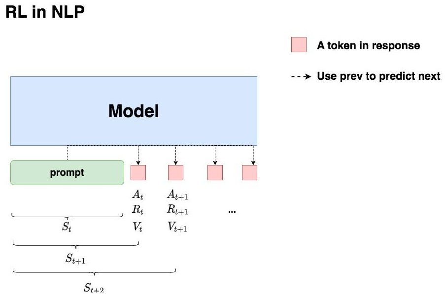

回想一下对NLP任务做强化学习（RLHF）的目的：**希望给模型一个prompt，让模型能生成符合人类喜好的response**。再回想一下GPT模型做推理的过程：**每个时刻** `t` **只产生一个token，即token是一个一个蹦出来的，先有上一个token，再有下一个token**\*\*。\*\*

复习了这两点，现在可以更好解读上面这张图了：

- 先喂给模型一个prompt，期望它能产出符合人类喜好的response
- 在 `t` 时刻，模型根据上文，产出一个token，**这个token即对应着强化学习中的动作，记为** $A_{t}$ 。因此不难理解，在NLP语境下，强化学习任务的动作空间就对应着词表。
- 在 `t` 时刻，**模型产出token** $A_{t}$ **对应着的即时收益为** $R_{t}$ **，总收益为** $V_{t}$。这个收益即可以理解为“**对人类喜好的衡量**”。此刻，**模型的状态从** $S_{t}$ **变为** $S_{t+1}$ **，也就是从“上文”变成“上文 + 新产出的token”**
- 在NLP语境下，智能体是语言模型本身，环境则对应着它产出的语料

这样，就大致解释了NLP语境下的强化学习框架，不过针对上面这张图，可能还有以下问题：

**（1）问题1：** 图中的下标是不是写得不太对？例如根据第一部分的介绍，$A_{t}$ 应该对应着 $R_{t+1}$ ， $A_{t+1}$ 应该对应着 $R_{t+2}$ ，以此类推？

> 答：说的对。但这里不用太纠结下标的问题，只需要记住在对应的response token位置，会产生相应的即时奖励和总收益即可。之所以用图中这样的下标，是更方便后续理解代码。

**（2）问题2：** 知道$A_{t}$ 肯定是由语言模型产生的，那么 $R_t$，$ V_{t}  $是怎么来的呢，也是语言模型产生的吗？

> 答：先直接说结论， $ A_{t}  $是由我们的语言模型产生的， $R_{t}$，$V_{t}$ 则分别由另外两个模型来产生，在后文中会细说。

**（3）问题3：** 语言模型的参数在什么时候更新？是观测到一个$R_{t}$, $ V_{t}  $，就更新一次参数，然后再去产生 $A_{t+1}$ 吗？

> 答：当然不是。只看到某个时刻的收益，就急着用它更新模型，这也太莽撞了。肯定是要等有足够的观测数据了（例如等模型把完整的response生成完），再去更新它的参数。

**（4）问题4：** 再谈谈$R_{t},$ $V_{t}$ 吧，在NLP的语境下我还是不太理解它们

- 首先，“收益”的含义是“对人类喜好的衡量”
- $R\_{t}$ ：即时收益，指语言模型当下产生token $A_{t}$ 带来的收益
- $V_{t}$ ： 实际期望总收益（即时+未来），指对语言模型“当下产生token $A_{t}$ ，一直到整个response生产结束”后的期收益预估。因为当下语言模型还没产出 $A_{t}$ 后的token，所以只是对它之后一系列动作的收益做了估计，因而称为“期望总收益”。

## 3.3 RLHF中的四个重要角色

本节中，在第二部分的基础上更进一步：更详细理清NLP语境下RLHF的运作流程。

从第二部分中已经知道：生成token $A_{t}$ 和对应收益 $R_{t}$, $V_{t}$ 的并不是一个模型。那么在RLHF中到底有几个模型？他们是怎么配合做训练的？而我们最终要的是哪个模型？

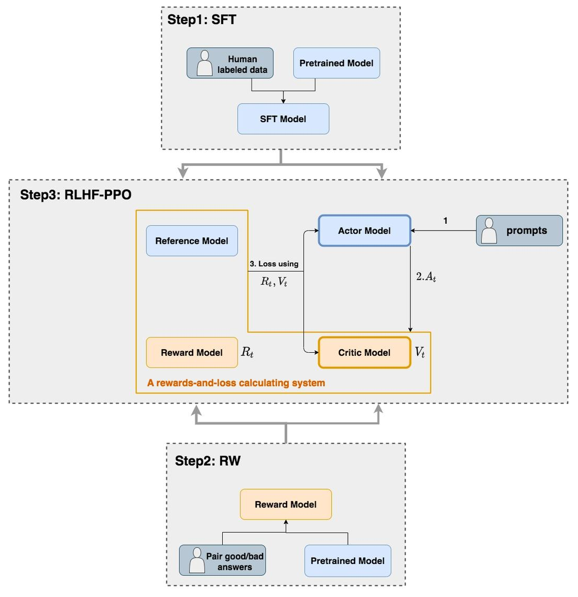

如上图，**在RLHF-PPO阶段，一共有四个主要模型**，分别是：

- **Actor Model**\*\*：演员模型\*\*，这就是**想要训练的目标语言模型**
- **Critic Model**\*\*：评论家模型\*\*，它的作用是\*\*预估总收益 \*\*$V_{t}$
- **Reward Model**\*\*：奖励模型\*\*，它的作用是\*\*计算即时收益 \*\*$R_{t}$
- **Reference Model**\*\*：参考模型\*\*，它的作用是**在RLHF阶段给语言模型增加一些“约束”，防止语言模型训歪**（朝不受控制的方向更新，效果可能越来越差）

其中:

- **Actor/Critic Model**在RLHF阶段是**需要训练**的（图中给这两个模型加了粗边，就是表示这个含义）；而**Reward/Reference Model**是**参数冻结**的。
- Critic/Reward/Reference Model共同组成了一个“奖励-loss”计算体系（自己命名的，为了方便理解），综合它们的结果计算loss，用于更新Actor和Critic Model

我们把这四个部分展开说说。

### 3.3.1 Actor Model (演员模型)

正如前文所说，**Actor就是想要训练的目标语言模型。****一般用SFT阶段产出的SFT模型来对它做初始化****。**

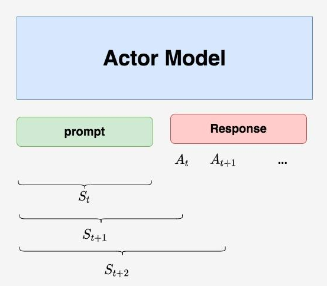

最终目的是**让Actor模型能产生符合人类喜好的response**。所以策略是，先喂给Actor一条prompt （这里假设 `batch_size = 1`，所以是1条prompt），让它生成对应的response。然后，再将“prompt + response"送入我们的“奖励-loss”计算体系中去算得最后的loss，用于更新actor。

### 3.3.2 Reference Model（参考模型）

**Reference Model（以下简称Ref模型）****一般也用SFT阶段得到的SFT模型做初始化****，****在训练过程中，它的参数是冻结的****。** Ref模型的主要作用是防止Actor“训歪”，那么它具体是怎么做到这一点的呢？

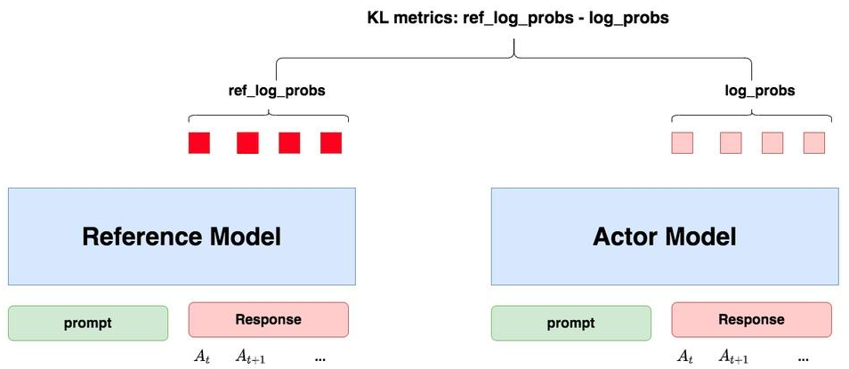

“防止模型训歪”换一个更详细的解释是：**希望训练出来的Actor模型既能达到符合人类喜好的目的，又尽量让它和SFT模型不要差异太大**。简言之，**希望两个模型的输出分布尽量相似**。那什么指标能用来衡量输出分布的相似度呢？自然而然想到了**KL散度**。

如图所示：

- **对Actor模型**，喂给它一个 `prompt`，它正常输出对应的response。那么response中每一个token肯定有它对应的log\_prob结果，把这样的结果记为\*\*`log_probs`\*\*
- **对Ref模型**，把Actor生成的 `"prompt + response"`喂给它，那么它同样能给出每个token的log\_prob结果，我们记其为\*\*`ref_log_probs`\*\*
- 那么这两个模型的输出分布相似度就可以用 `ref_log_probs - log_probs`来衡量，可以从两个方面来理解这个公式：
  - **从直觉上理解**，`ref_log_probs`越高，说明Ref模型对Actor模型输出的肯定性越大。即Ref模型也认为，对于某个 $S_{t}$ ，输出某个 $A_{t}$ 的概率也很高$ P(A_{t} | S_{t})  $）。这时可以认为Actor模型较Ref模型没有训歪。
  - **从KL散度上理解**， $ KL[Actor(X) || Ref(X)] = E_{x\sim Actor(x)}[log\frac{Actor(x)}{Ref(x)}] = log\_probs - ref\_log\_probs  $（当然这里不是严格的等于，只是KL散度的近似），这个值越小意味着两个分布的相似性越高。

注：可能已经注意到，按照KL散度的定义，这里写成 `log_probs - ref_log_probs`更合适一些。但是如果你看过一些RLHF相关的论文的话，可能记得在计算损失函数时，有一项 $R_{t} - KL$散度 （对这个有疑惑不要紧，我们马上在后文细说），即KL散度前带了负号，所以这里我写成 `ref_log_probs - log_probs`这样的形式，更方便大家从直觉上理解这个公式。

现在，已经知道**怎么利用Ref模型和KL散度来防止Actor训歪了**。**KL散度将在后续被用于loss的计算**。

### 3.3.3 Critic Model（评论家模型）

**Critic Model用于****预测期望总收益 \*\*$V_{t}$ \*\*，和Actor模型一样，它需要****做参数更新**。实践中，Critic Model的设计和初始化方式也有很多种，例如和Actor共享部分参数、从RW阶段的Reward Model初始化而来等等。我们讲解时，和deepspeed-chat的实现保持一致：从RW阶段的Reward Model初始化而来。

**你可能想问：训练Actor模型我能理解，但我还是不明白，为什么要单独训练一个Critic模型用于预测收益呢？**

> 这是因为，当我们在前文讨论总收益 $V_{t}$ （即时 + 未来）时，我们是站在上帝视角的，也就是这个 $V_{t}$ 就是客观存在的、真正的总收益。但是在训练模型时，就没有这个上帝视角加成了，**也就是在** `t` **时刻，给不出客观存在的总收益** $V_{t}$ **，只能训练一个模型去预测它**\*\*。\*\*

**所以总结来说，在RLHF中，不仅要训练模型生成符合人类喜好的内容的能力（Actor），也要提升模型对人类喜好量化判断的能力（Critic）**。这就是Critic模型存在的意义。来看看它的大致架构：

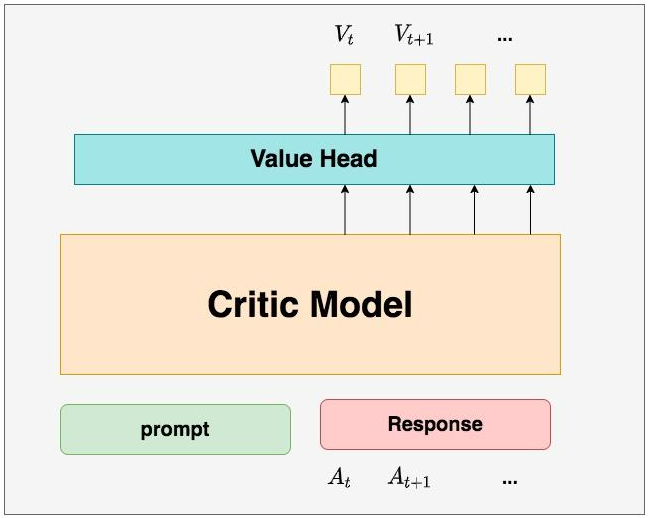

deepspeed-chat采用了**Reward模型作为它的初始化**，所以这里也按Reward模型的架构来简单画画它。你可以简单理解成，Reward/Critic模型和Actor模型的架构是很相似的（毕竟输入都一样），同时，它在最后一层增加了一个Value Head层，该层是个简单的线形层，用于将原始输出结果映射成单一的 $V\_{t}$ 值。

在图中， $V\_{t}$ 表示Critic模型对 `t` 时刻及未来（response完成）的收益预估。

### 3.3.4 Reward Model（奖励模型）

Reward Model用于**计算生成token **$A_{t}$** 的即时收益**，它就是RW阶段所训练的奖励模型，在RLHF过程中，它的**参数是冻结的**。

**你可能想问：为什么Critic模型要参与训练，而同样是和收益相关的Reward模型的参数就可以冻结呢？** 这是因为，Reward模型是站在上帝视角的。这个上帝视角有两层含义：

- 第一点，Reward模型是经过和“估算收益”相关的训练的，因此在RLHF阶段它可以直接被当作一个能产生客观值的模型。
- 第二点，Reward模型代表的含义就是“**即时收益**”，你的token $A_{t}$ 已经产生，因此即时收益自然可以立刻算出。

**你还可能想问：已经用Critic预测出** $V_{t}$ **了，而这个** $V_{t}$ **包含了“即时”和“未来”的概念，那还需要代表“即时”的** $R_{t}$ **做什么呢？直接用** $V_{t}$ **不就好了吗？**

为了解答这个问题，先回顾下1.2部分中给出的价值函数： $ V_{t} = R_{t} + \gamma V_{t+1}  $

这个函数告诉我们，当前可以用两个结果来表示 `t` 时刻的总收益：

- 结果1：Critic模型预测的 $V_{t}$
- 结果2：Reward模型预测的 $R_{t}$ 和critic模型预测的 $V_{t+1}$

那么哪一个结果更靠近上帝视角给出的客观值呢？当然是结果2，因为结果1全靠预测，而结果2中的 $R_{t}$ 是事实数据。我们知道Critic模型也是参与参数更新的，可以用 `MSE(上帝视角的客观收益-Critic模型预测的收益)`来衡量它的loss。**但是上帝视角的客观收益是不知道的，只能用已知事实数据去逼近它，所以我们就用** $ R_{t} + \gamma * V_{t+1}  $**来做近似。** 这就是 $ R_{t}, V_{t}  $同时存在的意义。

Reward模型和critic模型非常相似，这里就只给出架构图，不再做过多的说明。关于Reward模型的训练过程，后续有时间也会出个原理和代码解析。

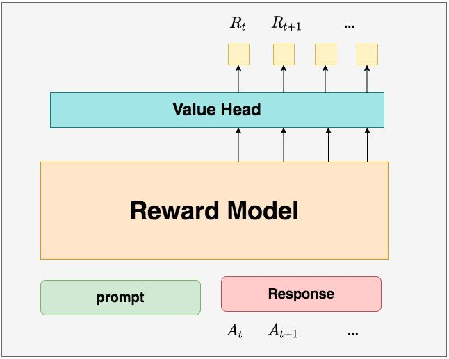

## 3.4 RLHF中的loss计算

到目前为止，已经基本了解了RLHF的训练框架，以及其中的四个重要角色（训练一个RLHF，有4个模型在硬件上跑，可想而知对存储的压力）。在本节中，一起来解读RLHF的loss计算方式。在解读中，会再一次理一遍RLHF的整体训练过程，填补相关细节。在这之后，就可以来看代码解析了。

在第三部分的讲解中，我们知道**Actor和Critic模型都会做参数更新**，所以loss也分成2个：

- **Actor loss：** 用于**评估Actor是否产生了符合人类喜好的结果**，将作用于Actor的BWD上。
- **Critic loss**\*\*：\*\* 用于**评估Critic是否正确预测了人类的喜好**，将作用于Critic的BWD上。

### 3.4.1 Actor loss

#### （1）直观设计

先来看一个直观的loss设计方式：

- Actor接收到当前上文 $S_{t}$ ，产出token $A_{t}$ （ $P(A_{t} | S_{t})$ ）
- Critic根据 $S_{t}$, $A_{t}$ ，产出对总收益的预测 $V_{t}$
- 那么Actor loss可以设计为： $actor\_loss =- \sum_{t \in { response\_timestep }} V_{t} \log P (A_{t} | S_{t})$

求和符号表示只考虑response部分所有token的loss，为了表达简便，先把这个求和符号略去（下文也是同理），也就是说：

$$
actor\_loss =-V_{t} \log P\left(A_{t} \mid S_{t}\right)
$$

我们希望minimize这个 `actor_loss`。

**这个设计的直观解释是：**

- 当 $V_{t}>0$ 时，意味着Critic对Actor当前采取的动作给了正向反馈，因此就需要在训练迭代中提高 $ P(A_{t} | S_{t})  $，这样就能达到减小loss的作用。
- 当 $V_{t} < 0$ 时，意味着Critic对Actor当前采取的动作给了负向反馈，因此就需要在训练迭代中降低 $P(A_{t} | S_{t})$ ，这样就能到达到减小loss的作用。

**一句话总结：这个loss设计的含义是，****对上文** $S_{t}$ **而言，如果token** $A_{t}$ **产生的收益较高，那就增大它出现的概率，否则降低它出现的概率****。**

#### （2）引入优势（Advantage）

在开始讲解之前，举个小例子：假设在王者中，中路想支援发育路，这时中路有两种选择：1. 走自家野区。2. 走大龙路。中路选择走大龙路，当做出这个决定后，Critic告诉她可以收1个人头。结果，此刻对面打野正在自家采灵芝，对面也没有什么苟草英雄，中路一路直上，最终收割2个人头。因为实际收割的人头比预期要多1个，中路尝到了甜头，所以增大了“支援发育路走大龙路”的概率。**这个多出来的“甜头”，就叫做“优势”(Advantage)。**

**对NLP任务来说，如果Critic对** $A_{t}$ **的总收益预测为** $V_{t}$ **，但实际执行** $A_{t}$ **后的总收益是** $R_{t} + \gamma * V_{t+1}$ **，我们就定义****优势****为：**

$$
Adv_{t} = R_{t} + \gamma * V_{t+1} - V_{t}
$$

用 $Adv_{t}$ 替换掉 $ V_{t}  $，则此刻 `actor_loss`变为：
$actor\_loss = -Adv_{t}log P(A_{t}|S_{t})$

#### （3）重新设计 $R_{t}$

总结一下，到目前为止，我们的 `actor_loss`形式为：

$$
actor\_loss = -Adv_{t}log P(A_{t}|S_{t})
$$

其中， $ Adv_{t} = R_{t} + \gamma * V_{t+1} - V_{t}   $

同时注意，这个 `actor_loss`应该是response的所有token loss的sum或者avg。这里为了表达方便，公式略去了求和或求平均的符号。

按照这个理解， $R_{t}$ 应该表示每个Actor产出token $A_{t}$ 带来的即时收益，正如下图所示（其中 `T` 表示最后一个时刻）：

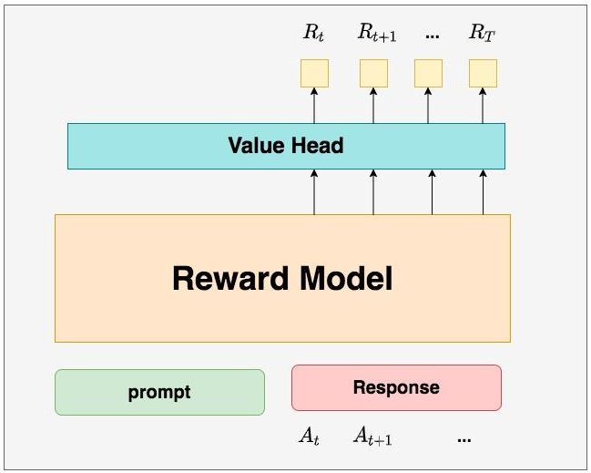

但在deepspeed-chat的RLHF实践中，对 $R_{t}$ 做了另一种设计：

$$
\left\{\begin{array}{l}R_{t}=-k l \_c t l *\left(\log \frac{P\left(A_{t} \mid S_{t}\right)}{P_{\text {ref }}\left(A_{t} \mid S_{t}\right)}\right), t \neq T \\ R_{t}=-k l \_c t l *\left(\log \frac{P\left(A_{t} \mid S_{t}\right)}{P_{\text {ref }}\left(A_{t} \mid S_{t}\right)}\right)+R_{t}, t=T\end{array}\right.
$$

- `kl_ctl`：常量，可以理解成是一个控制比例的缩放因子，在deepspeed-chat中默认设为0.1
- $ -log\frac{P(A_{t}|S_{t})}{P_{ref}(A_{t}|S_{t})}  $：这一项是不是非常眼熟，这就是在3.2部分介绍的Actor和Ref模型间的KL散度，写成更容易理解的形式，就是 `ref_log_probs - log_probs`。在3.2中说过，为了防止模型训歪，需要把这个KL散度加入loss计算中，所以这里我们就在做这件事

**基于这些，上面这个对** $R_{t}$ **的设计可理解成：**

- **当** $t \neq T$ **时，更加关心Actor是否有在Ref的约束下生产token** $A_{t}$
- **当**$t =T$ **时，不仅关心Actor是否遵从了Ref的约束，也关心真正的即时收益** $R_{t}$

为什么只有最后一个时刻的 $R_{t}$ 被纳入了考量呢？这是因为在Reward模型训练的时候，就是用这个位置的 $R_{t}$ 来表示对完整的prompt + response的奖励预测（但你依然可以理解成是执行完 $A_{T}$ 的即时奖励）。所以到了RLHF的场景下，其余时刻的即时奖励，就用“Actor是否遵循了Ref的约束”来进行评价。

需要注意的是， $R_{t}$ 的设计并不只有这一种。deepspeed在自己的代码注释中也有提过，可以尝试把最后一个时刻的 $R_{T}$ 替换成所有token的即时奖励的平均值（因为在Reward模型中，每一个token位置照样会有对应的奖励值输出，只是它们不像最后一个位置那样用对应的真值经过了训练，这个真值就是指人标注的对整个prompt + response的奖励真值）。如果站在这个角度理解的话，同样也可以尝试在每一个位置的奖励衡量上引入 $R_{t}$ 。

代码实践如下：

```python
def compute_rewards(self, prompts, log_probs, ref_log_probs, reward_score,
                        action_mask):
        """
        reward_function：计算最终的reward分数
        复习一下几个相关参数的默认值：
        self.kl_ctl = 0.1
        self.clip_reward_value = 5
      
        对于batch中的某个prompt来说，它最终的reward分数为：
        (1) 先计算actor和ref_model的logit相似度： -self.kl_ctl * (log_probs - ref_log_probs)
            其实写成self.kl_ctl * (ref_log_probs - log_probs)更好理解些
            这个值越大，说明ref_model对actor生成的结果的认可度越高（即表明rlhf没有训歪），
            没有训歪的情况下我们也应该给模型一些奖励，这个奖励就是self.kl_ctl * (ref_log_probs - log_probs)
          
        （2）由于我们只取最后一个token对应位置的分数作为reward_score，因此我们只需要：
            self.kl_ctl * (ref_log_probs - log_probs)的最后一位 + reward_score
       
         (3) 同时我们对reward_score也做了大小限制，最大不超过self.clip_reward_value（超过统一给成self.clip_reward_value），
             最小不低于-self.clip_reward_value（低于统一给成-self.clip_reward_value）
      
         (4) 最后返回的rewards大小为：（batch_size, 各条数据的长度），对batch中的每条数据来说：
             - response的最后一位：self.kl_ctl * (ref_log_probs - log_probs)的最后一位 + reward_score
             - response的其余位置：self.kl_ctl * (ref_log_probs - log_probs)
      
        """

        kl_divergence_estimate = -self.kl_ctl * (log_probs - ref_log_probs)
        rewards = kl_divergence_estimate
        # ---------------------------------------------------------------------------------------------------
        # response开始的位置
        # （因为我们对prompt做过padding处理，因此batch中每个prompt长度一致，也就意味着每个response开始的位置一致）
        # （所以这里start是不加s的，只是一个int）
        # ---------------------------------------------------------------------------------------------------
        start = prompts.shape[1] - 1
        # ---------------------------------------------------------------------------------------------------
        # response结束的位置
        # （因为一个batch中，每个response的长度不一样，所以response的结束位置也不一样）
        # （所以这里end是加s的，ends的尺寸是(batch_size,)
        # ---------------------------------------------------------------------------------------------------
        ends = start + action_mask[:, start:].sum(1) + 1
        # ---------------------------------------------------------------------------------------------------
        # 对rewards_score做限制
        # ---------------------------------------------------------------------------------------------------
        reward_clip = torch.clamp(reward_score, -self.clip_reward_value,
                                  self.clip_reward_value)
        batch_size = log_probs.shape[0]
        for j in range(batch_size):
            rewards[j, start:ends[j]][-1] += reward_clip[j] # 

        return rewards
```

#### （4）重新设计优势

好，再总结一下，目前为止的 `actor_loss`为：

$$
actor_loss =-A d v_{t} \log P\left(A_{t} \mid S_{t}\right)
$$

其中， $ Adv_{t} = R_{t} + \gamma * V_{t+1} - V_{t}   $

同时，对 $R_{t}$ 进行来改造，使其能够衡量Actor模型是否遵从了Ref模型的约束。

现在把改造焦点放在 $Adv_{t}$ 上，回想一下，**既然对于收益而言，分为即时和未来，那么对于优势而言，是不是也能引入对未来优势的考量呢**？这样，就可以把 $Adv_{t}$ 改写成如下形式：

$$
A d v_{t}=\left(R_{t}+\gamma * V_{t+1}-V_{t}\right)+\gamma * \lambda * A d v_{t+1}
$$

（熟悉强化学习的朋友应该能一眼看出这是GAE，这里不打算做复杂的介绍，一切都站在直觉的角度理解）**其中，新引入的** $\lambda$ **也是一个常量，可将其理解为权衡因子，直觉上看它控制了在计算当前优势时对未来优势的考量。（从强化学习的角度上，它控制了优势估计的方差和偏差）**

**看到这里，你可能想问：这个代表未来优势的** $ Adv_{t+1}  $**，那要怎么算呢？** 注意到，对于最后一个时刻 `t` ，它的未来收益（$V_{T+1}$ ）和未来优势（$Adv_{T+1}$ ）都是0，也就是 $Adv_{T} = R_{T} - V_{T}$ ，这是可以直接算出来的。**而有了** $Adv_{T}$ **，不就能从后往前，通过动态规划的方法，把所有时刻的优势都依次算出来了吗？**

代码实践如下（其中返回值中的returns表示实际收益，将被用于计算Critic模型的loss，可以参见4.2，其余细节都在代码注释中）：

```python
def get_advantages_and_returns(self, values, rewards, start):
       """
       Adopted from https://github.com/CarperAI/trlx/blob/main/trlx/models/modeling_ppo.py#L134
   
       没有引入GAE前的t时刻的优势值·：
       detal_t = r_t + gamma * V_t+1 - V_t
       其中：
           - r_t表示t时刻的即时收益
           - V_t+1表示未来时刻的预期收益
           - r_t + gamma * V_t+1可理解成t时刻的实际预期收益
           - V_t可理解成t时刻的预估预期收益（是模型，例如critic model自己估算出来的）
     
       引入GAE后的t时刻的优势值：
       A_t = delta_t + gamma * lambda * A_t+1
       粗暴理解为在t时刻时，不仅考虑当下优势，还考虑了未来的优势
       为了知道A_t, 我们得知道A_t+1，所以在本算法中采取了从后往前做动态规划求解的方法，也即：
       假设T是最后一个时刻，则有A_T+1 = 0, 所以有: A_T = delta_T
       知道了A_T, 就可以依次往前倒推，把A_t-1, A_t-2之类都算出来了
     
       引入GAE后t时刻的实际预期收益
       returns_t = A_t + V_t
                 = delta_t + gamma * lambda * A_t+1 + V_t
                 = r_t + gamma * V_t+1 - V_t + gamma * lambda * A_t+1 + V_t
                 = r_t + gamma * (V_t+1 + lambda * A_t+1)
     
       注意，这里不管是advantages还是returns，都只算response的部分
       """
     
       # Adopted from https://github.com/CarperAI/trlx/blob/main/trlx/models/modeling_ppo.py#L134
       lastgaelam = 0
       advantages_reversed = []
       length = rewards.size()[-1]
       # 注意这里用了reversed，是采取从后往前倒推计算的方式
       for t in reversed(range(start, length)):
           nextvalues = values[:, t + 1] if t < length - 1 else 0.0
           delta = rewards[:, t] + self.gamma * nextvalues - values[:, t]
           lastgaelam = delta + self.gamma * self.lam * lastgaelam
           advantages_reversed.append(lastgaelam)
       advantages = torch.stack(advantages_reversed[::-1], dim=1) # 优势
       returns = advantages + values[:, start:] # 实际收益
       # values: 预期收益
       return advantages.detach(), returns
```

#### （5）PPO-epoch: 引入新约束

总结一下，目前为止的 `actor_loss`为：

$$
actor\_loss = -Adv_{t}log P(A_{t}|S_{t})
$$

其中， $ Adv_{t} = (R_{t} + \gamma * V_{t+1} - V_{t}) + \gamma * \lambda * Adv_{t+1}   $

同时

- **已经对** $R_{t}$ **进行来改造，使其能够衡量Actor模型是否遵从了Ref模型的约束。**
- **已经对**$Adv_{t}$ **进行改造，使其不仅考虑了当前时刻的优势，还考虑了未来的优势**

基于这些改造，重新理一遍**RLHF-PPO**的训练过程。

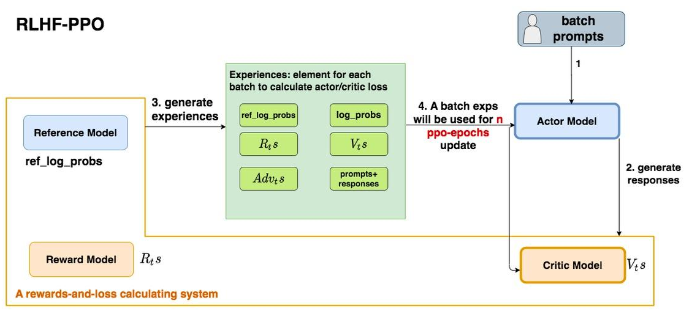

- 第一步，准备一个batch的prompts
- 第二步，将这个batch的prompts喂给Actor模型，让它生成对应的responses
- 第三步，把prompt+responses喂给我们的Critic/Reward/Reference模型，让它生成用于计算actor/critic loss的数据，按照强化学习的术语，称这些数据为经验（experiences）。critic loss我们将在后文做详细讲解，目前只把目光聚焦到actor loss上
- 第四步，根据这些经验，实际计算出actor/critic loss，然后更新Actor和Critic模型

这些步骤都很符合直觉，但是细心的你肯定发现了，**文字描述中的第四步和图例中的第四步有差异：图中说，这一个batch的经验值将被用于n次模型更新，这是什么意思呢？**

**在强化学习中，收集一个batch的经验是非常耗时的。对应到RLHF的例子中，收集一次经验，它要等四个模型做完推理才可以**，正是因此，一个batch的经验，只用于计算1次loss，更新1次Actor和Critic模型，好像有点太浪费了。

所以，自然而然想到，**1个batch的经验，能不能用来计算ppo-epochs次loss，更新ppo-epochs次Actor和Critic模型？** 简单写一下伪代码，我们想要：

```python
# --------------------------------------------------------------
# 初始化RLHF中的四个模型
# --------------------------------------------------------------
actor, critic, reward, ref = initialize_models()

# --------------------------------------------------------------
# 训练
# --------------------------------------------------------------
# 对于每一个batch的数据
for i in steps: 
    # 先收集经验值
    exps = generate_experience(prompts, actor, critic, reward, ref)
    # 一个batch的经验值将被用于计算ppo_epochs次loss，更新ppo_epochs次模型
    # 这也意味着，当你计算一次新loss时，你用的是更新后的模型
    for j in ppo_epochs:
        actor_loss = cal_actor_loss(exps, actor)
        critic_loss = cal_critic_loss(exps, critic)
      
        actor.backward(actor_loss)
        actor.step()
      
        critc.backward(critic_loss)
        critic.step()
```

**而如果想让一个batch的经验值被重复使用ppo\_epochs次，等价于想要Actor在这个过程中，模拟和环境交互**\*\*`ppo_epochs`\*\***次。** 举个例子：

- 如果1个batch的经验值只使用1次，那么在本次更新完后，Actor就吃新的batch，正常和环境交互，产出新的经验值
- 但如果1个batch的经验值被使用 `ppo_epochs`次，在这 `ppo_epochs`中，Actor是不吃任何新数据，不做任何交互的，所以只能让Actor“模拟”一下和环境交互的过程，吐出一些新数据出来。

那怎么让Actor模拟呢？很简单，让它观察一下之前的数据长什么样，让它依葫芦画瓢，不就行了吗？**假设最开始吃batch，吐出经验的actor叫**$Actor_{old}$ **，而在伪代码中，每次做完**\*\*`ppo_epochs`\*\***而更新的actor叫** $Actor_{new}$ **，那么只要尽量保证每次更新后的** $Actor_{new}$ **能模仿最开始的那个** $Actor_{old}$ **，不就行了吗？**

诶！是不是很眼熟！**两个分布**，通过什么方法让它们相近！**那当然是KL散度**！所以，再回到我们的 `actor_loss`上来，它现在就可被改进成：$actor\_loss = -Adv_{t}log \frac{P(A_{t}|S_{t})}{P_{old}(A_{t}|S_{t})}$

再稍作一些改动将log去掉（这个其实不是“稍作改动去掉log”的事，是涉及到PPO中重要性采样的相关内容，大家有兴趣可以参考[这篇](https://link.zhihu.com/?target=https%3A//www.cnblogs.com/xingzheai/p/15931681.html "这篇")）：$actor\_loss = -Adv_{t} * \frac{P(A_{t}|S_{t})}{P_{old}(A_{t}|S_{t})}$

其中，$P_{old}$ 表示真正吃了batch，产出经验值的Actor；P表示 `ppo_epochs`中实时迭代更新的Actor，它在模仿 $ P_{old}  $的行为。**所以这个公式从直觉上也可以理解成：****在Actor想通过模拟交互的方式，使用一个batch的经验值更新自己时，它需要收到真正吃到batch的那个时刻的Actor的约束，这样才能在有效利用batch，提升训练速度的基础上，保持训练的稳定****。**

但是，此时又有新的担心了：**虽然在更新Actor的过程中用** $Actor_{old}$ **做了约束，但如果** $Actor_{old}$ **的约束能力不够，比如说** $ \frac{P(A_{t} | S_{t})}{P_{old}(A_{t} | S_{t})}  $**还是超出了可接受的范围，那怎么办？**

很简单，那就**剪裁（clip）** 它吧！

我们给 $\frac{P(A_{t} | S_{t})}{P_{old}(A_{t} | S_{t})}$ 设置一个范围，例如 `(0.8 ,1.2)`，也就是如果这个值一旦超过1.2，那就统一变成1.2；一旦小于0.8，那就统一变成0.8。这样就能保证 $ Actor  $和$Actor_{old}$ 的分布相似性在我们的掌控之内了。此时 `actor_loss`变为：

$$
actor_loss =-\min \left(\operatorname{Adv} v_{t} * \frac{P\left(A_{t} \mid S_{t}\right)}{P_{\text {old }}\left(A_{t} \mid S_{t}\right)}, \operatorname{Adv} v_{t} * \operatorname{clip}\left(\frac{P\left(A_{t} \mid S_{t}\right)}{P_{\text {old }}\left(A_{t} \mid S_{t}\right)}, 0.8,1.2\right)\right)
$$

这时要注意，如果超过变化范围，将 $\frac{P(A_{t} | S_{t})}{P_{old}(A_{t} | S_{t})}$ 强制设定为一个常数后，就说明这一部分的loss和Actor模型无关了，而 $Adv_{t}$ 这项本身也与Actor无关。**所以相当于，在超过约束范围时，我们停止对Actor模型进行更新。**

整体代码如下：

```python
def actor_loss_fn(self, logprobs, old_logprobs, advantages, mask):
    """
    logprobs: 实时计算的，response部分的prob（只有这个是随着actor实时更新而改变的）
    old_logprobs：老策略中，response部分的prob （这个是固定的，不随actor实时更新而改变）
    advantages： 老策略中，response部分每个token对应的优势（这个是固定的，不随actor实时更新而改变）
    mask：老策略中，response部分对应的mask情况这个是固定的，不随actor实时更新而改变）
  
    之所以要引入logprobs计算actor_loss，是因为我们不希望策略每次更新的幅度太大，防止模型训歪
  
    self.cliprange: 默认值是0.2
    """
    ## policy gradient loss
    # -------------------------------------------------------------------------------------
    # 计算新旧策略间的KL散度
    # -------------------------------------------------------------------------------------
    log_ratio = (logprobs - old_logprobs) * mask
    ratio = torch.exp(log_ratio)
    # -------------------------------------------------------------------------------------
    # 计算原始loss和截断loss
    # -------------------------------------------------------------------------------------
    pg_loss1 = -advantages * ratio
    pg_loss2 = -advantages * torch.clamp(ratio, 1.0 - self.cliprange, 1.0 + self.cliprange)
    pg_loss = torch.sum(torch.max(pg_loss1, pg_loss2) * mask) / mask.sum() # 最后是取每个非mask的response token的平均loss作为最终loss
    return pg_loss
```

#### （6）Actor loss小结

（1）～（5）中我们一步步树立了 `actor_loss`的改进过程，这里就做一个总结吧：

$$
actor\_loss =-\min \left(\operatorname{Adv} v_{t} * \frac{P\left(A_{t} \mid S_{t}\right)}{P_{\text {old }}\left(A_{t} \mid S_{t}\right)}, \operatorname{Adv} v_{t} * \operatorname{clip}\left(\frac{P\left(A_{t} \mid S_{t}\right)}{P_{\text {old }}\left(A_{t} \mid S_{t}\right)}, 0.8,1.2\right)\right.
$$

其中：

- $A d v_{t}=\left(R_{t}+\gamma * V_{t+1}-V_{t}\right)+\gamma * \lambda * A d v_{t+1}$
- **已经对** $R_{t}$ **进行来改造，使其能够衡量Actor模型是否遵从了Ref模型的约束**
- **已经对** $ Adv_{t}  $**进行改造，使其不仅考虑了当前时刻的优势，还考虑了未来的优势**
- **重复利用了1个batch的数据，使本来只能被用来做1次模型更新的它现在能被用来做**\*\*`ppo_epochs`****次模型更新。使用真正吃了batch，产出经验值的那个时刻的Actor分布来约束**** `ppo_epochs`\*\***中更新的Actor分布**
- **考虑了****剪裁机制（clip****），在**\*\*`ppo_epochs`次更新中，一旦Actor的更新幅度超过我们的控制范围，则不对它进行参数更新。\*\*

### 3.4.2 Critic loss

我们知道，1个batch产出的经验值，不仅被用来更新Actor，还被用来更新Critic。对于Critic loss，不再像Actor loss一样给出一个“演变过程”的解读，直接来看它最后的设计。

首先，在之前的解说中，你可能有这样一个印象：

- $ V_{t}  $：Critic对 `t`时刻的总收益的预估，这个总收益包含即时和未来的概念（预估收益）
- $ R_{t} + \gamma * V_{t+1}  $：Reward计算出的即时收益 $R_{t}$ ，Critic预测出的 `t+1` 及之后时候的收益的折现，这是比 $V_{t}$ 更接近 `t`时刻真值总收益的一个值（实际收益）

所以，我们的第一想法是：$Critic\_loss =\left(R_{t}+\gamma * V_{t+1}-V_{t}\right)^{2}$

现在，对“实际收益”和“预估收益”都做一些优化。

#### （1）实际收益优化

原始的实际收益为 $ R_{t} + \gamma * V_{t+1}  $，但是当在 `actor_loss`中引入“优势”的概念时，“优势”中刻画了更为丰富的实时收益信息，所以，将实际收益优化为： $Adv_{t} + V_{t}$

#### （2）预估收益优化

原始的预估收益为 $ V_{t}  $。  类比于Actor，Critic模型在 `ppo_epochs`的过程中也是不断更新的。所以这个 $V_{t}$ 可以理解成是 $Critic_{old}$ ，也就是真正吃了batch，参与产出经验的那个时候的Critic产出的收益预测结果。

同样想用旧模型去约束新模型，但对于Critic采用的约束策略就比较简单了，直接看代码，从中可以看出，用老 $V_{t}$ 设计了了一个变动范围，然后用这个变动范围去约束新 $V_{t}$

```python
# self.cliprange_value是一个常量
# old_values: 老critic的预测结果
# values：新critic的预测结果
values_clipped = torch.clamp(
            values,
            old_values - self.cliprange_value,
            old_values + self.cliprange_value,
        )
```

那么最终就取实际收益和预估收益的MSE做为loss就好，这里注意，计算实际收益时 $Adv_{t}$, $V_{t}$ 都是老Critic（真正吃了batch的那个）产出的结果，而预估收益是随着 `ppo_epochs`而变动的。

代码如下：

```python
def critic_loss_fn(self, values, old_values, returns, mask):
        """
        values: 实时critic跑出来的预估预期收益（是变动的，随着ppo epoch迭代而改变）
        old_values：老critic跑出来的预估预期收益（是固定值）
        returns：实际预期收益
        mask：response部分的mask
      
        self.cliprange_value = 0.2
        """
        ## value loss
        # 用旧的value去约束新的value
        values_clipped = torch.clamp(
            values,
            old_values - self.cliprange_value,
            old_values + self.cliprange_value,
        )
        if self.compute_fp32_loss:
            values = values.float()
            values_clipped = values_clipped.float()
      
        # critic模型的loss定义为（预估预期收益-实际预期收益）**2
        vf_loss1 = (values - returns)**2
        vf_loss2 = (values_clipped - returns)**2
        vf_loss = 0.5 * torch.sum(
            torch.max(vf_loss1, vf_loss2) * mask) / mask.sum() # 同样，最后也是把critic loss平均到每个token上
        return vf_loss
```

# 4. DPO

Direct Preference Optimization: Your Language Model is Secretly a Reward Model

- Paper: [https://arxiv.org/abs/2305.18290](https://arxiv.org/abs/2305.18290 "https://arxiv.org/abs/2305.18290")
- Code: [https://github.com/eric-mitchell/direct-preference-optimization](https://github.com/eric-mitchell/direct-preference-optimization "https://github.com/eric-mitchell/direct-preference-optimization")

## 4.1 简介

基于 **人类反馈的强化学习（RLHF）** 是一个复杂且不稳定的过程，拟合一个反映人类偏好的奖励模型，然后使用强化学习对大语言模型进行微调，以最大限度地提高估计奖励，同时又不能偏离原始模型太远。这涉及训练多个 LM，并在训练循环中从 LM 采样，从而产生大量的计算成本。

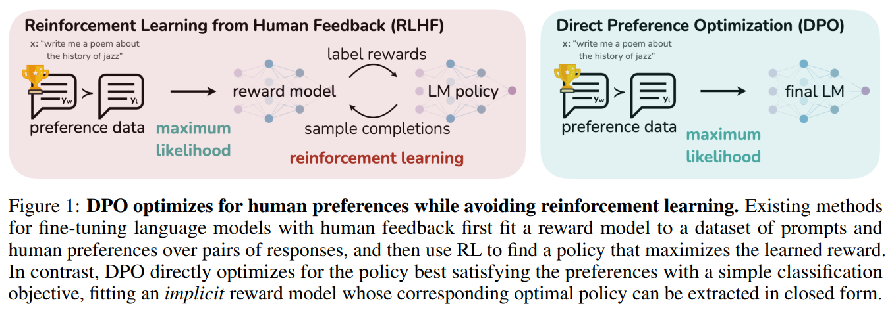

本文作者提出了 **直接偏好优化（DPO）** 算法，它稳定、高效且计算量轻，**无需拟合奖励模型，也无需在微调期间从LM采样或执行显著的超参数调整**。

实验表明，DPO 可以微调 LMs，使其与人类偏好保持一致，与现有方法一样或更好。值得注意的是，DPO 在情绪控制的能力上超越了 RLHF，提高了总结和单轮对话的响应质量，同时大大简化了实现和训练。

## 4.2 RLHF pipeline

RLHF通常由3个阶段组成：

1. **监督微调 (SFT)**：高质量数据集上通过监督学习
2. **偏好采样和奖励学习 (RM)**：标注排序的判别式标注成本远远低于生成答案的生成式标注。
3. **强化学习微调 (PPO)**：在对SFT模型进行微调时生成的答案分布也会发生变化，会导致RM模型的评分会有偏差，需要用到强化学习.

### 4.2.1 SFT 阶段

RLHF 通常从一个通用的预训练 LM 开始，该 LM 在高质量数据集上通过监督学习（最大似然）对感兴趣的下游任务（如对话、指令跟随、总结等）进行微调，以获得模型 $\pi^{SFT}$。

### 4.2.2 Reward 建模阶段

在第二阶段，用 $x$ 提示 $\pi^{SFT}$ 产生一对答案 $  (y_1, y_2) \sim \pi^{SFT} $。通过人类标注，得到偏好标签 $y_w \succ y_l$ ，其中 $y_w$  表示首选prompt， $y_l$ 表示非首选prompt。

通过静态数据集 $D=\left\{x^{i}, y_{w}^{i}, y_{l}^{i}\right\}_{i=1}^{N}$，可以将奖励模型  $ r_{\phi}(x,y)  $参数化，并通过极大似然估计参数。将问题定义为二元分类，有负对数似然损失：

$$
\mathcal{L}_{R}\left(r_{\phi}, \mathcal{D}\right)=-\mathbb{E}_{\left(x, y_{w}, y_{l}\right) \sim \mathcal{D}}\left[\log \sigma\left(r_{\phi}\left(x, y_{w}\right)-r_{\phi}\left(x, y_{l}\right)\right)\right]
$$

其中 $\sigma$ 是 `sigmoid`  函数。奖励模型  $r_{\phi}(x,y)$通常由$ \pi^{SFT}  $进行初始化，并在最后一个 Transformer 层之后添加线性层，该层为奖励值生成单个标量预测。

### 4.2.3 RL 微调阶段

在 RL 阶段，使用学习到的奖励函数来对语言模型进行打分。特别是，制定了以下优化问题：

$$
\max _{\pi_{\theta}} \mathbb{E}_{x \sim \mathcal{D}, y \sim \pi_{\theta}(y \mid x)}\left[r_{\phi}(x, y)\right]-\beta \mathbb{D}_{\mathrm{KL}}\left[\pi_{\theta}(y \mid x) \| \pi_{\text {ref }}(y \mid x)\right]
$$

其中 $\beta$ 是控制 $\pi_{\theta}$  偏离基本参考策略 $\pi_{ref}$的参数。在实践中，语言模型策略 $\pi_{\theta}$ 也被初始化为 $\pi_{ref}$。\*\*添加的 \*\*$ \beta  $**约束很重要，因为它可以防止模型偏离奖励模型准确的分布太远**，以及保持生成多样性和防止模式崩溃为单个高奖励答案。

由于语言生成的离散性，这个目标是不可微的，并且通常使用强化学习进行优化。标准方法是构造奖励函数$r(x, y)=r_{\phi}(x, y)-\beta\left(\log \pi_{\theta}(y \mid x)-\log \pi_{r e f}(y \mid x)\right)$，并利用 PPO 最大化。

## 4.3.直接偏好优化（DPO）

与之前的 RLHF 方法不同，**DPO 绕过了奖励建模步骤，并使用偏好数据直接优化语言模型**。

### 4.3.1 PPO算法总览

1. 对一个问题，有两个回答 choice 和 reject，不是一个一定正确，一个一定不正确；而是训练出的语言模型，更加prefer哪一种，即希望语言模型以哪一种方式来回答。
2. 准备两个模型 model\_gen 和 model\_gen\_ref，其实是一摸一样的模型，只不过在训练过程中，只会训练其中一个，另外一个是不训练的。
3. 把两两份数据，分别输入到两个模型中计算，可以得到4份概率；
4. 4份数据中，其中有2份是想要的，2份是不想要的；2份想要的做差，得到 `pro_log_diff`，2份不想要的做差 `pro_log_diff_ref`
5. 拿2份做差的数据，计算KL散度；惩罚policy模型对正样本概率的下降和负样本概率的上升
6. 以KL散度计算Loss

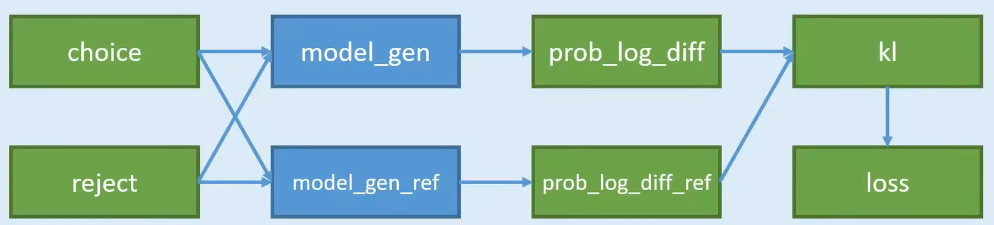

### 4.3.1 DPO 目标函数

类似于奖励建模方法，策略目标变为：（推导过程详见[原论文](https://arxiv.org/abs/2305.18290 "原论文")）

$$
\mathcal{L}_{\mathrm{DPO}}\left(\pi_{\theta} ; \pi_{\mathrm{ref}}\right)=-\mathbb{E}_{\left(x, y_{w}, y_{l}\right) \sim \mathcal{D}}\left[\log \sigma\left(\beta \log \frac{\pi_{\theta}\left(y_{w} \mid x\right)}{\pi_{\text {ref }}\left(y_{w} \mid x\right)}-\beta \log \frac{\pi_{\theta}\left(y_{l} \mid x\right)}{\pi_{\text {ref }}\left(y_{l} \mid x\right)}\right)\right]
$$

通过这种方式，绕过了显式奖励建模步骤，同时也避免了执行强化学习优化的需要。

逐步分析这个优化目标：首先， $\sigma$ 函数里面的值越大，  $L\_{DPO}$  越小。即最大化 $y_w$ 和 $y_l$的奖励函数：

$$
r_{w}=\log \frac{\pi_{\theta}\left(y_{w} \mid x\right)}{\pi_{\text {ref }}\left(y_{w} \mid x\right)}
$$

$$
r_{l}=\log \frac{\pi_{\text {ref }}\left(y_{l} \mid x\right)}{\pi_{\theta}\left(y_{l} \mid x\right)}
$$

- 对于人类偏好结果$y_w$ ，我们期望 $\pi_{\theta}(y_w \mid x)$ 越大越好；
- 对于人类非偏好结果 $y_l$，我们期望 $\pi_{\theta}(y_l \mid x)$ 越小越好。
- 如果$\pi_{\mathrm{ref}}\left(y_w \mid x\right)$ 比较小，说明参考模型 $\pi^{\mathrm{ref}}$  没有正确分类该偏好响应$y_w$ ，此时 $r_w$ 的奖励系数很大。
- 如果$\pi_{\mathrm{ref}}\left(y_l \mid x\right)$比较大，说明参考模型$\pi^{\mathrm{ref}}$ 没有正确分类该非偏好响应$y_l$，此时$r_l$ 的奖励系数很大

### 4.3.2 DPO outline

1. 对于每个prompt  $x$，从参考策略中采样补全$\left(y_{1}, y_{2}\right) \sim \pi_{\mathrm{ref}}(\cdot \mid x)$，用人类偏好进行标记以构建离线偏好数据集 $D=\left\{x^{i}, y_{w}^{i}, y_{l}^{i}\right\}_{i=1}^{N}$ 。
2. 对于给定的$  \pi_{\mathrm{ref}} $、 $D$ 和 $\beta$ ，优化语言模型 $\pi_{\theta}$ 以最小化 $L_{\mathrm{DPO}}$。

由于偏好数据集使用 $\pi^{SFT}$ 进行采样，因此只要可用，就会初始化 $\pi_{\mathrm{ref}} = \pi^{SFT}$ 。在实践中，人们更愿意重用公开的偏好数据集，而不是生成样本并收集人类偏好。这时我们通过最大化首选prompt $(x,y_w)$的似然来初始化$  \pi_{\mathrm{ref}} $，即

$$
\pi_{\mathrm{ref}}=\arg \max _{\pi} \mathbb{E}_{x, y_{w} \sim \mathcal{D}}\left[\log \pi\left(y_{w} \mid x\right)\right]
$$

该过程有助于缓解真实 \pi \_{\mathrm{ref}}与 DPO 使用的$\pi_{\mathrm{ref}}$ 之间的分布偏移。

## 4.4.实验

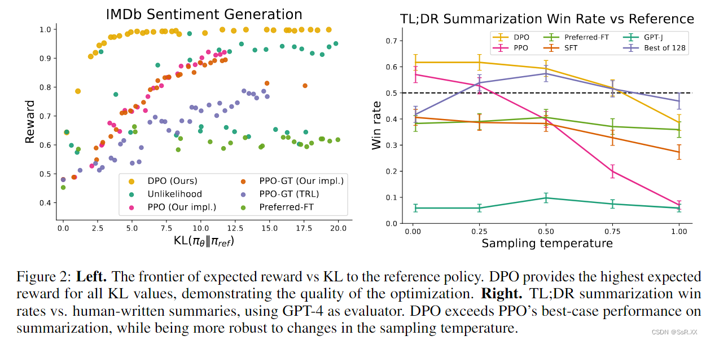

- **最大化奖励的同时最小化 KL 散度**。可以看到 DPO 在保持较小 KL 散度时，也能够达到最大奖励。而 PPO 随着奖励的增大，KL 散度也在增大。
- **对不同采样温度的鲁棒性**。DPO 在不同的采样温度下全面优于 PPO，同时在 Best of N 基线的最佳温度下也更胜一筹。

## 4.5.结论

基于人类反馈的强化学习（RLHF）是一个复杂且不稳定的过程，首先拟合一个反映人类偏好的奖励模型，然后使用强化学习对大语言模型进行微调，以最大限度地提高估计奖励，同时又不能偏离原始模型太远。这涉及训练多个 LM，并在训练循环中从 LM 采样，从而产生大量的计算成本。本文作者提出了直接偏好优化（DPO）算法，它稳定、高效且计算量轻，无需拟合奖励模型，也无需在微调期间从LM采样或执行显著的超参数调整。实验表明，DPO 可以微调 LMs，使其与人类偏好保持一致，与现有方法一样或更好。值得注意的是，DPO 在情绪控制的能力上超越了 RLHF，提高了总结和单轮对话的响应质量，同时大大简化了实现和训练。

# 5. 相关问题

## 5.1 rlhf相关

### 1.简单介绍强化学习？

强化学习（Reinforcement Learning，RL）研究的问题是**智能体（Agent）**与**环境（Environment）** 交互的问题，其目标是使智能体在复杂且不确定的环境中最大化奖励（Reward）。

强化学习基本框 架如图所示，主要由两部分组成：智能体和环境。在强化学习过程中，智能体与环境不断交互。 智能体在环境中获取某个状态后，会根据该状态输出一个动作（Action），也称为决策（Decision）。 动作会在环境中执行，环境会根据智能体采取的动作，给出下一个状态以及当前动作所带来的奖 励。智能体的目标就是尽可能多地从环境中获取奖励。本节中将介绍强化学习的基本概念、强化 学习与有监督学习的区别，以及在大语言模型中基于人类反馈的强化学习流程。


强化学习在大语言模型上的重要作用可以概括为以下几个方面：

1. **强化学习比有监督学习更可以考虑整体影响**：有监督学习针对单个词元进行反馈，其目 标是要求模型针对给定的输入给出的确切答案。而强化学习是针对整个输出文本进行反馈，并不 针对特定的词元。
2. **强化学习更容易解决幻觉问题**：有监督学习算法非常容易使得求 知型查询产生幻觉。在模型并不包含或者知道答案的情况下，有监督训练仍然会促使模型给出答 案。而使用强化学习方法，则可以通过定制奖励函数，将正确答案赋予非常高的分数，放弃回答 的答案赋予中低分数，不正确的答案赋予非常高的负分，使得模型学会依赖内部知识选择放弃回 答，从而在一定程度上缓解模型幻觉问题。
3. **强化学习可以更好的解决多轮对话奖励累积问题**：使用强化学习方法，可以通过构建奖励函数，将当前输出考虑整个对话的 背景和连贯性

### 2.简单介绍一下 RLHF？

RLHF就是基于人类反馈（Human Feedback）对语言模型进行强化学习（Reinforcement Learning），一般分为以下三个步骤：

1. **预训练语言模型**（收集样本数据，有监督微调）：在人类标注的数据上微调出来的模型叫做 有监督的微调（supervised fine-tuning），这是训练出来的第一个模型

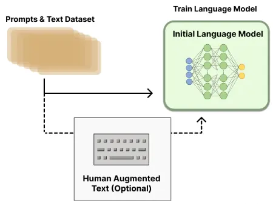

1. **训练奖励模型**（收集排序数据，训练奖励模型）：
   - 给定一个问题，让上一步训练好的**预训练模型 SFT 生成答案**
   - GPT 每一次预测一个词的概率，可以根据这个概率采样出很多答案，通常来说可以用 beam search
   - 这里生成了四个答案，然后把这四个答案的好坏进行人工标注，进行排序标注
   - 有了这些排序之后，再**训练一个奖励模型（Reward Model，RM）**，这个模型是说给定 prompt 得到输出，然后对这个输出生成一个分数，可以认为这个分数是一个奖励或者是打分，使得对答案的分数能够满足人工排序的关系（大小关系保持一致），一旦这个模型生成好之后，就能够对生成的答案进行打分


1. **用强化学习微调**（使用RM模型优化SFT模型）：继续微调之前训练好的 SFT模型，使得它生成的答案能够尽量得到一个比较高的分数，即每一次将它生成的答案放进 RM 中打分，然后优化 SFT 的参数使得它生成的答案在 RM 中获得更高的分数。

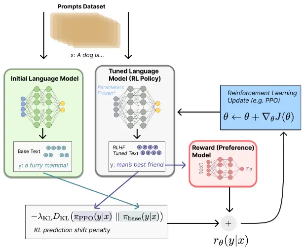

备注：两次对模型的微调：GPT3模型 → SFT模型 → RL模型，其实这里始终都是同一个模型，只是不同过程中名称不同。

- **需要SFT模型的原因**： GPT3模型不一定能够保证根据人的指示、有帮助的、安全的生成答案需要人工标注数据进行微调。
- **需要RM模型的原因**：标注排序的判别式标注成本远远低于生成答案的生成式标注。
- **需要RL模型的原因**：在对SFT模型进行微调时生成的答案分布也会发生变化，会导致RM模型的评分会有偏差，需要用到强化学习.

### 3.奖励模型需要和基础模型一致吗？

奖励模型和基础模型在训练过程中可以是一致的，也可以是不同的。这取决于你的任务需求和优化目标。

如果你希望优化一个包含多个子任务的复杂任务，那么你可能需要为每个子任务定义一个奖励模型，然后将这些奖励模型整合到一个统一的奖励函数中。这样，你可以根据任务的具体情况调整每个子任务的权重，以实现更好的性能。

另一方面，如果你的任务是单任务的，那么你可能只需要一个基础模型和一个对应的奖励模型，这两个模型可以共享相同的参数。在这种情况下，你可以通过调整奖励模型的权重来控制任务的优化方向。

总之，**奖励模型和基础模型的一致性取决于你的任务需求和优化目标**。在实践中，你可能需要尝试不同的模型结构和奖励函数，以找到最适合你任务的解决方案。

### 4.RLHF 在实践过程中存在哪些不足？

RLHF（Reinforcement Learning from Human Feedback）是一种通过人类反馈进行增强学习的方法，尽管具有一定的优势，但在实践过程中仍然存在以下几个不足之处：

1. **人类反馈的代价高昂**：获取高质量的人类反馈通常需要大量的人力和时间成本。人类专家需要花费时间来评估模型的行为并提供准确的反馈，这可能限制了RLHF方法的可扩展性和应用范围。
2. **人类反馈的主观性**：人类反馈往往是主观的，不同的专家可能会有不同的意见和判断。这可能导致模型在不同专家之间的反馈上存在差异，从而影响模型的训练和性能。
3. **反馈延迟和稀疏性**：获取人类反馈可能存在延迟和稀疏性的问题。人类专家不可能实时监控和评估模型的每一个动作，因此模型可能需要等待一段时间才能收到反馈，这可能会导致训练的效率和效果下降。
4. **错误反馈的影响**：人类反馈可能存在错误或误导性的情况，这可能会对模型的训练产生负面影响。如果模型在错误的反馈指导下进行训练，可能会导致模型产生错误的行为策略。
5. **缺乏探索与利用的平衡**：在RLHF中，人类反馈通常用于指导模型的行为，但可能会导致模型过于依赖人类反馈而缺乏探索的能力。这可能限制了模型发现新策略和优化性能的能力。

针对这些不足，研究人员正在探索改进RLHF方法，如设计更高效的人类反馈收集机制、开发更准确的反馈评估方法、结合自适应探索策略等，以提高RLHF方法的实用性和性能。

### 5.如何解决 人工产生的偏好数据集成本较高，很难量产问题？

解决人工产生偏好数据集成本高、难以量产的问题，可以考虑以下几种方法：

1. **引入模拟数据**：使用模拟数据来代替或辅助人工产生的数据。模拟数据可以通过模拟环境或模型生成，以模拟人类用户的行为和反馈。这样可以降低数据收集的成本和难度，并且可以大规模生成数据。
2. **主动学习**：采用主动学习的方法来优化数据收集过程。主动学习是一种主动选择样本的方法，通过选择那些对模型训练最有帮助的样本进行标注，从而减少标注的工作量。可以使用一些算法，如不确定性采样、多样性采样等，来选择最有价值的样本进行人工标注。
3. **在线学习**：采用在线学习的方法进行模型训练。在线学习是一种增量学习的方法，可以在模型运行的同时进行训练和优化。这样可以利用实际用户的交互数据来不断改进模型，减少对人工标注数据的依赖。
4. **众包和协作**：利用众包平台或协作机制来收集人工产生的偏好数据。通过将任务分发给多个人参与，可以降低每个人的负担，并且可以通过众包平台的规模效应来提高数据收集的效率。
5. **数据增强和迁移学习**：通过数据增强技术，如数据合成、数据扩增等，来扩充有限的人工产生数据集。此外，可以利用迁移学习的方法，将从其他相关任务或领域收集的数据应用于当前任务，以减少对人工产生数据的需求。

综合运用上述方法，可以有效降低人工产生偏好数据的成本，提高数据的量产能力，并且保证数据的质量和多样性。

### 6.  如何解决三个阶段的训练（SFT->RM->PPO）过程较长，更新迭代较慢问题？

要解决三个阶段训练过程较长、更新迭代较慢的问题，可以考虑以下几种方法：

1. **并行化训练**：利用多个计算资源进行并行化训练，可以加速整个训练过程。可以通过使用多个CPU核心或GPU来并行处理不同的训练任务，从而提高训练的效率和速度。
2. **分布式训练**：将训练任务分发到多台机器或多个节点上进行分布式训练。通过将模型和数据分布在多个节点上，并进行并行计算和通信，可以加快训练的速度和更新的迭代。
3. **优化算法改进**：针对每个阶段的训练过程，可以考虑改进优化算法来加速更新迭代。例如，在SFT（Supervised Fine-Tuning）阶段，可以使用更高效的优化算法，如自适应学习率方法（Adaptive Learning Rate）或者剪枝技术来减少模型参数；在RM（Reward Modeling）阶段，可以使用更快速的模型训练算法，如快速梯度法（Fast Gradient Method）等；在PPO（Proximal Policy Optimization）阶段，可以考虑使用更高效的采样和优化方法，如并行采样、多步采样等。
4. **迁移学习和预训练**：利用迁移学习和预训练技术，可以利用已有的模型或数据进行初始化或预训练，从而加速训练过程。通过将已有模型的参数或特征迁移到目标模型中，可以减少目标模型的训练时间和样本需求。
5. **参数调优和超参数搜索**：对于每个阶段的训练过程，可以进行参数调优和超参数搜索，以找到更好的参数设置和配置。通过系统地尝试不同的参数组合和算法设定，可以找到更快速和高效的训练方式。

综合运用上述方法，可以加速三个阶段训练过程，提高更新迭代的速度和效率，从而减少训练时间和资源消耗。

### 7.  如何解决 PPO 的训练过程同时存在4个模型（2训练，2推理），对计算资源的要求较高 问题？

可以采用 **RRHF**(**R**ank **R**esponse from **H**uman **F**eedback)的训练模式，RRHF 不需要强化学习，可以利用不同语言模型生成的回复，包括 ChatGPT、GPT-4 或当前的训练模型。RRHF通过对回复进行评分，并通过排名损失来使回复与人类偏好对齐。RRHF 通过通过排名损失使评分与人类的偏好（或者代理的奖励模型）对齐。RRHF 训练好的模型可以同时作为生成语言模型和奖励模型使用。

RRHF算法可以有效地将语言模型输出概率与人类偏好对齐，其训练思路非常简单，训练完成的模型有几个特点：

- 仅需要1到2个模型，而PPO需要4个模型，因此RRHF算法更加简单高效。
- 监督微调（SFT）可以被看作是RRHF算法的一种特殊形式。
- RRHF 算法可以同时被用作语言模型和奖励模型。
- RRHF 算法可以在较低的训练难度下拟合奖励模型的偏好，达到PPO算法的效果，并且避免了PPO算法中的复杂性和不稳定性问题。

### 8.基于人类反馈的强化学习流程

基于人类反馈的强化学习主要分为奖励模型训练和近端策略优化两个步骤。

- **奖励模型**通过由 人类反馈标注的偏好数据来学习人类的偏好，判断模型回复的有用性以及保证内容的无害性。
- **近端策略优化**可以根据奖励模型获得的反馈 优化模型，通过不断的迭代，让模型探索和发现更符合人类偏好的回复策略。


近端策略优化涉及到四个模型：

1. **策略模型（Policy Model）**，生成模型回复。
2. **奖励模型（Reward Model）**，输出奖励分数来评估回复质量的好坏。
3. **评论模型（Critic Model）**，来预 测回复的好坏，可以在训练过程中实时调整模型，选择对未来累积收益最大的行为。
4. **参考模型（Reference Model）** 提供了一个 SFT 模型的备份，帮助模型不会出现过于极端的变化。

近端策 略优化的实施流程如下：

1. **环境采样**：策略模型基于给定输入生成一系列的回复，奖励模型则对这些回复进行打分获得奖励。
2. **优势估计**：利用评论模型预测生成回复的未来累积奖励，并借助广义优势估计（Generalized Advantage Estimation，GAE）算法来估计优势函数，能够有助于更准确地评估每次行动的 好处。
3. **优化调整**：使用优势函数来优化和调整策略模型，同时利用参考模型确保更新的策略不会有 太大的变化，从而维持模型的稳定性。

### 9. 什么是 LLM Agent?

LLM Agent 是一种人工智能系统，它**利用大型语言模型 (LLM) 作为其核心计算引擎**，展示文本生成之外的功能，包括进行对话、完成任务、推理，并可以展示一定程度的**自主行为**。

LLM Agent 根据设计阶段授予的功能，Agent 从纯粹的被动到高度主动的自主行为。同时利用大模型的推理能力，让 Agent 可以在人工监督下管理相对独立的工作流程：分析目标，项目规划，执行，回顾过去的工作，迭代细化。

### 10. LLM Agent 有什么关键能力？

1. Agent利用LLM的语言能力理解指令、上下文和目标。可以根据人类提示**自主和半自主操作**。
2. 可以**利用工具套件**（计算器、API、搜索引擎）来收集信息并采取行动来完成分配的任务。它们不仅仅局限于语言处理。
3. 可以做**逻辑推理**类型的任务。例如，chain-of-thought , tree-of-thought。
4. 可以量身**定制文本**，例如邮件，报告，市场材料。
5. 可以自动或半自动的**响应用户的需求**。
6. Agent可以和不同类型的AI系统对接，例如LLM+image generators。

### 11. 怎样构建基于 LLM 的 Agents？

`Agent = LLM + Prompt Recipe + Tools + Interface + Knowledge + Memory`

1. Prompt Recipe：特定的内容要求、目标受众、所需的语气、输出长度、创造力水平等。
2. Tools：工具集成允许通过API和外部服务完成任务。Agents 能够理解自然语言、推理提示、积累记忆并采取明智的行动。但是，Agents 的表现和一致性取决于他们收到的提示的质量。
3. Knowledge：知识适用于所有用户的一般专业知识。知识扩展了LLM的内容。一般分为专业知识、常识知识和程序知识。
4. Memory：单个用户或单个任务的上下文和记录细节。分为短期记忆和长期记忆。记忆服务与特定用户，在时间维度的体验。使特定用户的上下文对话个性化同时保持多步骤任务的一致性。记忆侧重暂时的用户和任务细节。

### 12. LLM Agents 有哪些类型？

一般来说 LLM Agents 分为**会话型 Agents **和**任务型 Agents**，两者在目标、行为和prompt方法都有重要区别。 会话型专注于提供引人入胜的个性化讨论，任务型致力于完成明确定义的目标。

**Conversational Agents**：模拟人类对话，能够在讨论中反映人类的倾向。允许细致入微的上下文交互，会考虑语气、说话风格、领域知识、观点和个性怪癖等因素。agent的开发者可以持续增强记忆、知识整合提高响应能力，持续优化应用。

**Task-Oriented Agents**：实现目标驱动，利用模型的能力分析prompt、提取关键参数、指定计划、调用API、通过集成tools执行操作，并生成结果回复。Prompt 工程把目标型Agents拆分成如下环节：制定战略任务、串联思路、反思过去的工作以及迭代改进的方法。

### 13. 是什么让Agent有了自制的能力？

通常有自制能力的系统，至少有两类agent组成。**一个用于生成的agent，一个用于监督的agent**。生成agent根据提示生成回复。监督agent在必要时审查和重新提示或指示生成agent继续工作，同时提供交互反馈。自主技能是通过持续提示培养出来的。专门的监督agent提供方向、纠正和不断提高挑战，持续的提示释放了推理、效能和自主决策能力的增长。

### 14.如何给LLM注入领域知识？

给LLM（低层次模型，如BERT、GPT等）注入领域知识的方法有很多。以下是一些建议：

1. 数据增强：在训练过程中，可以通过添加领域相关的数据来增强模型的训练数据。这可以包括从领域相关的文本中提取示例、对现有数据进行扩充或生成新的数据。
2. 迁移学习：使用预训练的LLM模型作为基础，然后在特定领域的数据上进行微调。这样可以利用预训练模型学到的通用知识，同时使其适应新领域。
3. 领域专家标注：与领域专家合作，对模型的输出进行监督式标注。这可以帮助模型学习到更准确的领域知识。
4. 知识图谱：将领域知识表示为知识图谱，然后让LLM模型通过学习知识图谱中的实体和关系来理解领域知识。
5. 规则和启发式方法：编写领域特定的规则和启发式方法，以指导模型的学习过程。这些方法可以是基于规则的、基于案例的或基于实例的。
6. 模型融合：将多个LLM模型的预测结果结合起来，以提高模型在特定领域的性能。这可以通过投票、加权平均或其他集成方法来实现。
7. 元学习：训练一个元模型，使其能够在少量领域特定数据上快速适应新领域。这可以通过在线学习、模型蒸馏或其他元学习方法来实现。
8. 模型解释性：使用模型解释工具（如LIME、SHAP等）来理解模型在特定领域的预测原因，从而发现潜在的知识缺失并加以补充。
9. 持续学习：在模型部署后，持续收集领域特定数据并更新模型，以保持其在新数据上的性能。
10. 多任务学习：通过同时训练模型在多个相关任务上的表现，可以提高模型在特定领域的泛化能力。

## 5.2.强化学习

### 5.2.1 RL基础

#### **1-1** QA: 用一句话谈一下你对于强化学习的认识吗？

强化学习包含环境、动作和奖励3部分，其本质是智能体通过与环境的交互，使其做出的动作对应的决策得到的总奖励最大，或者说是期望最大。

#### **1-2** QA: 请问，你认为强化学习、监督学习和无监督学习三者有什么区别呢？

首先强化学习和无监督学习是不需要有标签样本的，而监督学习需要许多有标签样本来进行模型的构建和训练。

其次对于强化学习与无监督学习，无监督学习直接基于给定的数据进行建模，寻找数据或特征中隐藏的结构，一般对应聚类问题；强化学习需要**通过延迟奖励学习策略来得到模型与目标的距离**，这个距离可以通过奖励函数进行定量判断，这里我们可以将奖励函数视为正确目标的一个稀疏、延迟形式。

另外，强化学习处理的**多是序列数据，样本之间通常具有强相关性**，但其很难像监督学习的样本一样满足独立同分布条件。

#### **1-3** QA: 根据你的理解，你认为强化学习的使用场景有哪些呢？

7个字总结就是“**多序列决策问题**”，或者说是对应的模型未知，需要通过学习逐渐逼近真实模型的问题。并且当前的动作会影响环境的状态，即具有马尔可夫性的问题。同时应满足所有状态是可重复到达的条件，即满足可学习条件。

#### **1-4** QA: 请问强化学习中所谓的损失函数与深度学习中的损失函数有什么区别呢？

深度学习中的损失函数的目的是使预测值和真实值之间的差距尽可能小，而强化学习中的损失函数的目的是**使总奖励的期望尽可能大**。

#### **1-5** QA: 你了解有模型和免模型吗？两者具体有什么区别呢？

我认为两者的区别主要在于**是否需要对真实的环境进行建模**，免模型方法不需要对环境进行建模，直接与真实环境进行交互即可，所以其通常需要较多的数据或者采样工作来优化策略，这也使其对于真实环境具有更好的泛化性能；而有模型方法需要对环境进行建模，同时在真实环境与虚拟环境中进行学习，如果建模的环境与真实环境的差异较大，那么会限制其泛化性能。现在通常使用有模型方法进行模型的构建工作。

### 5.2.2 马尔可夫决策过程

#### **2-1** QA：请问马尔可夫过程是什么？马尔可夫决策过程又是什么？其中马尔可夫最重要的性质是什么呢？

马尔可夫过程是一个二元组 $<S,P>$ ， $S$ 为状态集合， $P$ 为状态转移函数；

马尔可夫决策过程是一个五元组 $<S,P,A,R,\gamma>$， 其中 $R$ 表示从 $S$ 到 $S'$ 能够获得的奖励期望， $\gamma$ 为折扣因子， $A$ 为动作集合；

马尔可夫最重要的性质是**下一个状态只与当前状态有关，与之前的状态无关**，也就是 $p(s_{t+1} | s_t)= p(s_{t+1}|s_1,s_2,...,s_t)$。

#### **2-2** QA：请问我们一般怎么求解马尔可夫决策过程？

求解马尔可夫决策过程时，可以直接求解**贝尔曼方程或动态规划方程**：

$$
V(s)=R(S)+ \gamma \sum_{s' \in S}p(s'|s)V(s')
$$

特别地，其矩阵形式为 $\mathrm{V}=\mathrm{R}+\gamma \mathrm{PV}$。但是贝尔曼方程很难求解且计算复杂度较高，所以可以使用动**态规划、蒙特卡洛以及时序差分**等方法求解。

#### **2-3** QA：请问如果数据流不具备马尔可夫性质怎么办？应该如何处理？

如果不具备马尔可夫性，即下一个状态与之前的状态也有关，若仅用当前的状态来求解决策过程，势必导致决策的泛化能力变差。为了解决这个问题，可以**利用循环神经网络对历史信息建模，获得包含历史信息的状态表征**，表征过程也可以使用注意力机制等手段，最后在表征状态空间求解马尔可夫决策过程问题。

#### **2-4** QA：请分别写出基于状态价值函数的贝尔曼方程以及基于动作价值函数的贝尔曼方程。

贝尔曼方程：定义了当前状态与未来状态的迭代关系，表示当前状态的价值函数可以通过下个状态的价值函数来计算。贝尔曼方程即 $V(s)=R(s)+ \gamma \sum_{s' \in S}P(s'|s)V(s')$

1. 基于状态价值函数的贝尔曼方程：$V_{\pi}(s) = \sum_{a}{\pi(a|s)}\sum_{s',r}{p(s',r|s,a)[r(s,a)+\gamma V_{\pi}(s')]}$；
2. 基于动作价值函数的贝尔曼方程：$Q_{\pi}(s,a)=\sum_{s',r}p(s',r|s,a)[r(s',a)+\gamma V_{\pi}(s')]$。

#### **2-5** 计算贝尔曼方程的常见方法有哪些，它们有什么区别？

1. **动态规划方法**（DP）：可用来计算价值函数的值。当**模型完全已知**时，使用贝尔曼方程，**迭代来计算**价值函数，并进行策略的改进。$v\left(S_{t}\right) \leftarrow \mathbb{E}_{\pi}\left[R_{t+1}+\gamma v\left(S_{t+1}\right)\right]$ 。举例：如果任务时预测从上海开车到北京所需的时间，动态规划是寻找几个**有经验的老司机（模型已知）**，在还没有出发时，统计每个老司机的预计到达时间，求平均值即可作为任务的估计值。
2. **蒙特卡洛方法**（MC）：可用来计算价值函数的值。**无模型**方法，通过计算**所观察到样本的平均值**作为实际期望收益的近似。$v\left(S_{t}\right) \leftarrow v\left(S_{t}\right)+\alpha\left(G_{t}-v\left(S_{t}\right)\right)$。以开车举例，现在找几个新司机，让他们开车从上海到北京，在北京，统计到北京所用的时间，取平均值作为任务的估计值。
3. **时差学习**（TD）：为动态规划方法和蒙特卡洛方法的结合。**无模型**方法，它从每轮的经验数据中学习。TD学习可以从**不完整**的一轮数据中学习。$T D(0): v\left(S_{t}\right) \leftarrow v\left(S_{t}\right)+\alpha\left(R_{t+1}+\gamma v\left(s_{t+1}\right)-v\left(S_{t}\right)\right)$。以开车举例，在出发时有个预估时间如20小时，现在新司机从上海出发，到达南京已经花费5个小时，南京到北京的预估时间为13小时，则上海到北京的预测时间可以使用13+5=18小时代替，即一部分真实值，一部分预测值。

#### **2-6** 马尔可夫奖励过程与马尔可夫决策过程的区别是什么？

**相对于马尔可夫奖励过程，马尔可夫决策过程多了一个决策过程**，其他的定义与马尔可夫奖励过程是类似的。由于多了一个决策，多了一个动作，因此状态转移也多了一个条件，即执行一个动作，导致未来状态的变化，其不仅依赖于当前的状态，也依赖于在当前状态下智能体采取的动作决定的状态变化。对于价值函数，它也多了一个条件，多了一个当前的动作，即当前状态以及采取的动作会决定当前可能得到的奖励的多少。

另外，**两者之间是有转换关系**的。具体来说，已知一个马尔可夫决策过程以及一个策略 $\pi$ 时，可以把马尔可夫决策过程转换成马尔可夫奖励过程。在马尔可夫决策过程中，状态的转移函数 $P(s'|s,a)$ 是基于它的当前状态和当前动作的，因为现在已知策略函数，即在每一个状态，知道其采取每一个动作的概率，所以我们就可以直接把这个动作进行加和，就可以得到对于马尔可夫奖励过程的一个转移概率。同样地，对于奖励，我们可以把动作去掉，这样就会得到一个类似于马尔可夫奖励过程的奖励。

#### **2-7** QA：请问最佳价值函数 $V^*$ 和最佳策略 $\pi^**$ 为什么等价呢？

最佳价值函数的定义为$V^* (s)=\max_{\pi} V_{\pi}(s)$，即我们搜索一种策略 $\pi$ 来让每个状态的价值最大。

$V^*$ 就是到达每一个状态其的最大价值，同时我们得到的策略就可以说是最佳策略，即 $\pi^{*}(s)=\underset{\pi}{\arg \max }~ V_{\pi}(s)$ 。最佳策略使得每个状态的价值函数都取得最大值。所以如果可以得到一个最佳价值函数，就可以说某一个马尔可夫决策过程的环境被解。在这种情况下，其最佳价值函数是一致的，即其达到的上限的值是一致的，但这里可能有多个最佳策略对应于相同的最佳价值。

#### **2-8** QA：能不能手写一下第n步的价值函数更新公式呀？另外，当 n越来越大时，价值函数的期望和方差是分别变大还是变小呢？

*n* 越大，方差越大，期望偏差越小。价值函数的更新公式如下：

$$
Q\left(S, A\right) \leftarrow Q\left(S, A\right)+\alpha\left[\sum_{i=1}^{n} \gamma^{i-1} r_{t+i}+\gamma^{n} \max _{a} Q\left(S',a\right)-Q\left(S, A\right)\right]
$$

### 5.2.3表格型方法

#### **3-1** QA：同学，能否简述同策略和异策略的区别呢？

同策略和异策略的根本区别**在于生成样本的策略和参数更新时的策略是否相同**。

- 对于同策略，行为策略和要优化的策略是同一策略，更新了策略后，就用该策略的最新版本对数据进行采样；
- 对于异策略，其使用任意行为策略来对数据进行采样，并利用其更新目标策略。

例如，**Q学习**在计算下一状态的预期奖励时使用了最大化操作，直接选择最优动作，而当前策略并不一定能选择到最优的动作，因此这里生成样本的策略和学习时的策略不同，所以Q学习算法是**异策略算法**；相对应的**Sarsa**算法则是基于当前的策略直接执行一次动作选择，然后用动作和对应的状态更新当前的策略，因此生成样本的策略和学习时的策略相同，所以Sarsa算法为**同策略算法**。

#### **3-2** QA：能否细致地讲一下Q学习算法，最好可以写出其 $Q(s,a)$ 的更新公式。另外，它是同策略还是异策略，原因是什么呢？

Q学习是通过**计算最优动作价值函数来求策略的一种时序差分的学习方法**，其更新公式为

$$
Q(s, a) \leftarrow Q(s, a) + \alpha [r(s,a) + \gamma \max_{a'} Q(s', a') - Q(s, a)]
$$

其是**异策略的**，由于Q更新使用了下一个时刻的最大值，因此其只关心哪个动作使得 $Q(s_{t+1}, a)$ 取得最大值，而实际上到底采取了哪个动作（行为策略），Q学习并不关心。这表明优化策略并没有用到行为策略的数据，所以说它是异策略的。

#### **3-3** QA：能否讲一下与Q学习算法类似的Sarsa算法呢，最好也可以写出其对应的 $Q(s,a)$ 更新公式。另外，它是同策略还是异策略，为什么？

Sarsa算法可以算是Q学习算法的改进，其更新公式为

$$
Q(s, a) \leftarrow Q(s, a) + \alpha [r(s,a) + \gamma  Q(s', a') - Q(s, a)]
$$

其为**同策略的**，Sarsa算法必须执行两次动作得到 $(s,a,r,s',a')$ 才可以更新一次；而且 $a'$ 是在特定策略 $\pi$ 的指导下执行的动作，因此估计出来的 $Q(s,a)$ 是在该策略 $\pi$ 下的Q值，样本生成用的 $\pi$ 和估计的 $\pi$ 是同一个，因此是同策略。

#### **3-4** QA：请问基于价值的方法和基于策略的方法的区别是什么？

1. **生成策略上的差异，前者确定，后者随机**。基于价值的方法中动作-价值对的估计值最终会收敛（通常是不同的数，可以转化为0～1的概率），因此通常会获得一个确定的策略；基于策略的方法不会收敛到一个确定的值，另外他们会趋向于生成最佳随机策略。如果最佳策略是确定的，那么最优动作对应的值函数的值将远大于次优动作对应的值函数的值，值函数的大小代表概率的大小。
2. **动作空间是否连续，前者离散，后者连续**。基于价值的方法，对于连续动作空间问题，虽然可以将动作空间离散化处理，但离散间距的选取不易确定。过大的离散间距会导致算法取不到最优动作，会在最优动作附近徘徊；过小的离散间距会使得动作的维度增大，会和高维度动作空间一样导致维度灾难，影响算法的速度。而基于策略的方法适用于连续的动作空间，在连续的动作空间中，可以不用计算每个动作的概率，而是通过正态分布选择动作。
3. 基于价值的方法，例如Q学习算法，是通过求解最优价值函数而间接地求解最优策略；基于策略的方法，例如REINFORCE等算法直接将策略参数化，通过策略搜索、策略梯度或者进化方法来更新参数以最大化回报。基于价值的方法不易扩展到连续动作空间，并且当同时采用非线性近似、自举等策略时会有收敛问题。策略梯度具有良好的收敛性。
4. 另外，对于价值迭代和策略迭代，策略迭代有两个循环，一个是在策略估计的时候，为了求当前策略的价值函数需要迭代很多次；另一个是外面的大循环，即策略评估、策略提升。价值迭代算法则是一步到位，直接估计最优价值函数，因此没有策略提升环节。

#### **3-5** QA：请简述一下时序差分方法。

时序差分算法是使用广义策略迭代来更新Q函数的方法，核心是使用自举，即**价值函数的更新使用下一个状态的价值函数来估计当前状态的价值**。也就是使用下一步的Q值 $Q(s_{t+1},a_{t+1})$ 来更新当前步的Q值 $Q(s_t,a_t)$。完整的计算公式如下：

$$
Q(s_t,a_t) \leftarrow   Q(s_t,a_t) + \alpha [r_{t+1}+\gamma Q(s_{t+1},a_{t+1})]
$$

#### **3-6** QA：请问蒙特卡洛方法和时序差分方法是无偏估计吗？另外谁的方差更大呢？为什么？

**蒙特卡洛方法是无偏估计，时序差分方法是有偏估计**；**蒙特卡洛方法的方差较大，时序差分方法的方差较小**，原因在于时序差分方法中使用了自举，实现了基于平滑的效果，导致估计的价值函数的方差更小。

#### **3-7** QA：能否简单说一下动态规划方法、蒙特卡洛方法和时序差分方法的异同点？

**相同点**：都用于进行价值函数的描述与更新，并且所有方法都基于对未来事件的展望计算一个回溯值。

**不同点**：蒙特卡洛方法和时序差分方法属于免模型方法，而动态规划属于有模型方法；时序差分方法和蒙特卡洛方法，因为都是免模型的方法，所以对于后续状态的获知也都是基于试验的方法；时序差分方法和动态规划方法的策略评估，都能基于当前状态的下一步预测情况来得到对于当前状态的价值函数的更新。

另外，时序差分方法不需要等到试验结束后才能进行当前状态的价值函数的计算与更新，而蒙特卡洛方法需要与环境交互，产生一整条马尔可夫链并直到最终状态才能进行更新。时序差分方法和动态规划方法的策略评估不同之处为免模型和有模型，动态规划方法可以凭借已知转移概率推断出后续的状态情况，而时序差分方法借助试验才能知道。

蒙特卡洛方法和时序差分方法的不同在于，蒙特卡洛方法进行了完整的采样来获取长期的回报值，因而在价值估计上会有更小的偏差，但是也正因为收集了完整的信息，所以价值的方差会更大，原因在于其基于试验的采样得到，和真实的分布有差距，不充足的交互导致较大方差。而时序差分方法则相反，因为它只考虑了前一步的回报值，其他都是基于之前的估计值，因而其价值估计相对来说具有偏差大方差小的特点。

三者的联系：对于TD($\lambda$)方法，如果 $\lambda = 0$ ，那么此时等价于时序差分方法，即只考虑下一个状态；如果 $\lambda = 1$ ，等价于蒙特卡洛方法，即考虑 $T-1$ 个后续状态直到整个试验结束。

### 5.2.4.DQN

#### **4-1** QA：请问深度Q网络是什么？其两个关键性的技巧分别是什么？

深度Q网络是基于深度学习的Q学习算法，其结合了**价值函数近似与神经网络技术**，并采用了**目标网络**和**经验回放技巧**进行网络的训练。

**Q函数（Q-function）**： 其也被称为动作价值函数（action-value function）。其输入是一个状态-动作对，即在某一具体的状态采取对应的动作，假设我们都使用某个策略 $\pi$ ，得到的累积奖励的期望值有多大。

#### **4-2** QA：深度Q网络中的两个技巧————目标网络和经验回放，其具体作用是什么呢？

在深度Q网络中某个动作价值函数的更新依赖于其他动作价值函数。**如果一直更新价值网络的参数，会导致更新目标不断变化，也就是在追逐一个不断变化的目标，这样势必会不太稳定**。为了解决基于时序差分的网络中，优化目标 $Q_{\pi}\left(s_{t}, a_{t}\right) =r_{t}+Q_{\pi}\left(s_{t+1}, \pi\left(s_{t+1}\right)\right)$ 左右两侧会同时变化使得训练过程不稳定，从而增大回归难度的问题，目标网络选择将优化目标的右边即 $r_{t}+Q_{\pi}\left(s_{t+1}, \pi\left(s_{t+1}\right)\right)$ 固定，通过改变优化目标左边的网络参数进行回归。固定目标网络参数；梯度下降只更新策略网络参数；更新多次策略网络后，将策略网络参数复制到目标网络；

对于经验回放，其会构建一个回放缓冲区，用来保存许多数据，每一个数据的内容包括：状态 $s_t$、采取的动作 $a_t$、得到的奖励 $r_t$、下一个状态 $s_{t+1}$。使用 $\pi$ 与环境交互多次，把收集到的数据都放到回放缓冲区中。当回放缓冲区“装满”后，就会自动删去最早进入缓冲区的数据。在训练时，对于每一轮迭代都有相对应的批量（与我们训练普通网络一样，通过采样得到），然后用这个批量中的数据去更新Q函数。即Q函数**在采样和训练的时候会用到过去的经验数据，也可以消除样本之间的相关性**。

#### **4-3** QA：深度Q网络和Q学习有什么异同点？

整体来说，从名称就可以看出，两者的目标价值以及价值的更新方式基本相同。但有如下不同点：

1. 首先，深度Q网络将Q学习与深度学习结合，用深度网络来近似动作价值函数，而Q学习则是采用表格进行存储。
2. 深度Q网络采用了经验回放的技巧，从历史数据中随机采样，而Q学习直接采用下一个状态的数据进行学习。

#### **4-4** QA：请问，随机性策略和确定性策略有什么区别吗？

随机性策略表示为某个状态下动作取值的分布，确定性策略在每个状态只有一个确定的动作可以选。从熵的角度来说，确定性策略的熵为0，没有任何随机性。随机性策略有利于我们进行适度的探索，确定性策略不利于进行探索。

#### **4-5** QA：请问不打破数据相关性，神经网络的训练效果为什么就不好？

在神经网络中通常使用随机梯度下降法。随机的意思是随机选择一些样本来增量式地估计梯度，比如常用的批量训练方法。如果样本是相关的，就意味着前后两个批量很可能也是相关的，那么估计的梯度也会呈现出某种相关性。但是在极端条件下，后面的梯度估计可能会抵消掉前面的梯度估计量，从而使得训练难以收敛。

#### **4-6** QA：深度Q网络都有哪些变种？引入状态奖励的是哪种？

深度Q网络有5个经典的变种：双深度Q网络、竞争深度Q网络、优先级双深度Q网络、噪声网络、分布式Q函数。

1. **双深度Q网络**（Double DQN）：**将动作选择和价值估计分开，避免Q值被过高估计**。在双深度Q网络中存在两个Q网络，第一个Q网络决定哪一个动作的Q值最大，从而决定对应的动作。另一方面，Q值是用 $Q'$ 计算得到的，这样就可以避免过度估计的问题。
2. **竞争深度Q网络**（Dueing Network）：**将Q值分解为状态价值和优势函数，得到更多有用信息**。将原来的深度Q网络的计算过程分为两步。第一步计算一个与输入有关的标量 $\mathrm{V(s)}$；第二步计算一个向量 $\mathrm{A(s,a)}$ 对应每一个动作。最后的网络将两步的结果相加，得到我们最终需要的Q值。用一个公式表示就是 $\mathrm{Q(s,a)=V(s)+A(s,a)}$ 。
3. **优先级双深度Q网络**（PER）：**将经验池中的经验按照优先级进行采样**。在使用经验回放时，均匀地取出回放缓冲区（reply buffer）中的采样数据，这里并没有考虑数据间的权重大小。但是应该将那些训练效果不好的数据对应的权重加大，即其应该有更大的概率被采样到。
4. **噪声网络**（Noisy Net）：**Q函数中加入高斯噪声**。其在每一个回合开始的时候，即智能体要和环境交互的时候，在原来的Q函数的每一个参数上加上一个高斯噪声（Gaussian noise），把原来的Q函数变成 $\tilde{Q}$ ，即噪声Q函数。同样，我们把每一个网络的权重等参数都加上一个高斯噪声，就得到一个新的网络 $\tilde{Q}$ 。我们会使用这个新的网络与环境交互直到结束。
5. **分布式Q函数**（Distribution Q-function）：对深度Q网络进行模型分布，将最终网络的输出的每一类别的动作再进行分布操作。Q函数代表累计期望，输出是一个期望，代表奖励，可能会丢失一些信息，分布式Q函数直接输出分布。
6. **彩虹（rainbow）**：将7个技巧/算法综合起来的方法，7个技巧分别是——深度Q网络、双深度Q网络、优先级经验回放的双深度Q网络、竞争深度Q网络、异步优势演员-评论员算法（A3C）、分布式Q函数、噪声网络

#### **4-7** QA：请简述双深度Q网络原理。

深度Q网络由于**总是选择当前最优的动作价值函数来更新当前的动作价值函数，因此存在过估计问题**（估计的价值函数值大于真实的价值函数值）。为了解耦这两个过程，双深度Q网络使用两个价值网络，一个网络用来执行动作选择，然后用另一个网络的价值函数对应的动作值更新当前网络。

#### **4-8** QA：请问竞争深度Q网络模型有什么优势呢？

对于 $\boldsymbol{Q}(s,a)$ ，其对应的状态由于为表格的形式，因此是离散的，而实际的状态大多不是离散的。对于Q值 $\boldsymbol{Q}(s,a)=V(s)+\boldsymbol{A}(s,a)$ 。其中的 $V(s)$ 是对于不同的状态都有值， $\boldsymbol{A}(s,a)$ 对于不同的状态都有不同的动作对应的值。所以本质上，最终的矩阵 $\boldsymbol{Q}(s,a)$ 是将每一个 $V(s)$ 加到矩阵 $\boldsymbol{A}(s,a)$ 中得到的。但是有时我们更新时不一定会将 $V(s)$ 和 $\boldsymbol{Q}(s,a)$ 都更新。将其分成两个部分后，就不需要将所有的状态-动作对都采样一遍，可以使用更高效的估计Q值的方法将最终的 $\boldsymbol{Q}(s,a)$ 计算出来。

### 5.2.5 策略梯度

#### **5-1** QA：如何理解策略梯度的公式呢？

策略梯度的公式如下：

$$
\begin{aligned}
E_{\tau \sim p_{\theta}(\tau)}\left[R(\tau) \nabla \log p_{\theta}(\tau)\right] &\approx \frac{1}{N} \sum_{n=1}^{N} R\left(\tau^{n}\right) \nabla \log p_{\theta}\left(\tau^{n}\right) \\
&=\frac{1}{N} \sum_{n=1}^{N} \sum_{t=1}^{T_{n}} R\left(\tau^{n}\right) \nabla \log p_{\theta}\left(a_{t}^{n} \mid s_{t}^{n}\right)
\end{aligned}
$$

$p_{\theta}(\tau)$ 里面有两项，$p(s_{t+1}|s_t,a_t)$ 来自环境，$p_\theta(a_t|s_t)$ 来自智能体。 $p(s_{t+1}|s_t,a_t)$ 由环境决定，从而与 $\theta$ 无关，因此 $\nabla \log p(s_{t+1}|s_t,a_t) =0$ ， $\nabla p_{\theta}(\tau)=\nabla \log p_{\theta}\left(a_{t}^{n} | s_{t}^{n}\right)$。

具体来说：

（1）假设在状态 $s_t$ 时执行动作 $a_t$，最后发现轨迹 $\tau$ 的奖励是正的，那我们就要增大这一项的概率，即增大在状态 $s_t$ 时执行动作 $a_t$ 的概率；

（2）反之，在状态 $s_t$ 时执行动作 $a_t$ 会导致轨迹 $\tau$ 的奖励变成负的，我们就要减小这一项的概率。

#### **5-2** QA：同学来吧，给我手动推导一下策略梯度公式的计算过程。

首先我们的目的是最大化奖励函数，即调整 $\theta$ ，使得期望回报最大，可以用公式表示如下：

$$
J(\theta)=E_{\tau \sim p_{\theta(\tau)}}\left[\sum_tr(s_t,a_t)\right]
$$

其中 $\tau$ 表示从开始到结束的一条完整轨迹。通常对于最大化问题，我们可以使用梯度上升算法找到最大值，即

$$
\theta^* = \theta + \alpha\nabla J({\theta})
$$

所以仅仅需要计算并更新 $\nabla J({\theta})$ ，也就是计算奖励函数 $J({\theta})$ 关于 $\theta$ 的梯度，也就是策略梯度，计算方法如下：

$$
\nabla_{\theta}J(\theta) = \int {\nabla}_{\theta}p_{\theta}(\tau)r(\tau) \mathrm{d}{\tau}=\int p_{\theta}{\nabla}_{\theta} \mathrm{log}p_{\theta}(\tau)r(\tau)\mathrm{d}{\tau}=E_{\tau \sim p_{\theta}(\tau)}[{\nabla}_{\theta}\mathrm{log}p_{\theta}(\tau)r(\tau)]
$$

接着我们继续展开，对于 $p_{\theta}(\tau)$ ，即 $p_{\theta}(\tau|{\theta})$ ：

$$
p_{\theta}(\tau|{\theta}) = p(s_1)\prod_{t=1}^T \pi_{\theta}(a_t|s_t)p(s_{t+1}|s_t,a_t)
$$

取对数后为：

$$
\mathrm{log}p_{\theta}(\tau|{\theta}) = \mathrm{log}p(s_1)+\sum_{t=1}^T \mathrm{log}\pi_{\theta}(a_t|s_t)p(s_{t+1}|s_t,a_t)
$$

继续求导：

$$
\nabla \mathrm{log}p_{\theta}(\tau|{\theta}) = \sum_{t=1}^T \nabla_{\theta}\mathrm{log} \pi_{\theta}(a_t|s_t)
$$

代入第3个式子，可以将其化简为：

$$
\begin{aligned}
    \nabla_{\theta}J(\theta) 
    &= E_{\tau \sim p_{\theta}(\tau)}[{\nabla}_{\theta}\mathrm{log}p_{\theta}(\tau)r(\tau)] \\
    &= E_{\tau \sim p_{\theta}}[(\nabla_{\theta}\mathrm{log}\pi_{\theta}(a_t|s_t))(\sum_{t=1}^Tr(s_t,a_t))] \\
    &= \frac{1}{N}\sum_{i=1}^N[(\sum_{t=1}^T\nabla_{\theta}\mathrm{log} \pi_{\theta}(a_{i,t}|s_{i,t}))(\sum_{t=1}^Nr(s_{i,t},a_{i,t}))]  
\end{aligned}
$$

#### **5-3** QA：可以说一下你所了解的基于策略梯度优化的技巧吗？

（1）**增加基线**：为了防止所有奖励都为正，从而导致每一个状态和动作的变换，都会使得每一个变换的概率上升，把奖励减去一项 $b$，称 $b$ 为基线。当减去 $b$ 以后，就可以让奖励 $R(\tau^n)-b$ 有正有负。如果得到的总奖励 $R(\tau^n)$ 大于 $b$ ，就让它的概率上升。如果总奖励小于 $b$，就算它是正的，值很小也是不好的，就需要让它的概率下降。如果总奖励小于 $b$ ，就要让采取这个动作的奖励下降，这样也符合常理。但是使用基线会让本来奖励很大的“动作”的奖励变小，降低更新速率。

（2）**指派合适的分数**：首先，原始权重是整个回合的总奖励。现在改成从某个时间点 $t$ 开始，假设这个动作是在时间点 $t$ 被执行的，那么从时间点 $t$ ，一直到游戏结束所有奖励的总和，才真的代表这个动作是好的还是不好的；接下来我们再进一步，把未来的奖励打一个折扣，这里我们称由此得到的奖励的和为折扣回报。

（3）综合以上两种技巧，将其统称为**优势函数**，用 $A$ 来代表优势函数。优势函数取决于状态和动作，即我们需计算的是在某一个状态 $s$ 采取某一个动作 $a$ 的时候，优势函数有多大。

#### **5-4** QA：请详细描述REINFORCE算法的计算过程。

首先需要根据一个确定好的策略模型来输出每一个可能动作的概率，对于所有动作的概率，使用采样方法（或者是随机的方法）选择一个动作与环境进行交互，同时环境会给我们反馈整个回合的数据。将此回合数据输入学习函数中，并根据回合数据进行损失函数的构造，通过Adam等优化器的优化，再更新策略模型。

### 5.2.6 演员-评论家算法

#### **6-1** QA：请简述一下异步优势演员-评论员算法（A3C），另外A3C是同策略还是异策略的模型呀？

A3C是异步优势演员-评论员算法，其中，\*\*评论员学习价值函数，同时有多个演员并行训练并且不时与全局参数同步。A3C旨在并行训练，是同策略算法。 \*\*

#### **6-2** QA：请问演员-评论员算法有何优点呢？

1. 相比以价值函数为中心的算法，**演员-评论员算法应用了策略梯度的技巧**，这能让它在连续动作或者高维动作空间中选取合适的动作，而Q学习做这件事会很困难。
2. 相比单纯策略梯度，**演员-评论员算法应用了Q学习或其他策略评估的做法**，使得演员-评论员算法能进行单步更新而不是回合更新，比单纯的策略梯度的效率要高。

#### **6-3** QA：请问异步优势演员-评论员算法具体是如何异步更新的？

下面是异步优势演员-评论员算法的大纲，由于其为异步多线程算法，只对其中某一单线程进行分析。

（1）定义全局参数 $\theta$ 和 $w$ 以及特定线程参数 $\theta'$ 和 $w'$。

（2）初始化时间步 $t=1$。

（3）当 $T \leqslant T_{\mathrm{max}}$:

- 重置梯度：$\mathrm{d} \theta = 0$ 并且 $\mathrm{d}w = 0$。
- 将特定于线程的参数与全局参数同步：$\theta' = \theta$ 以及 $w'=w$。
- 令 $t_{\mathrm{start}} =t$ 并且随机采样一个初始状态 $s_t$。
- 当 （$s_t!=$ 终止状态）并且$t−t_{\mathrm{start}} \leqslant t_{\mathrm{max}}$。
  - 根据当前线程的策略选择当前执行的动作 $a_t\sim\pi_{\theta'}(a_t|s_t)$，执行动作后接收奖励 $r_t$ 然后转移到下一个状态 $s_{t+1}$。
  - 更新 $t$ 以及 $T$：$t=t+1$ 并且 $T=T+1$。
- 初始化保存累积奖励估计值的变量。
- 对于 $i=t_1, \dots ,t_{\mathrm{start}}$:
  - $r \gets \gamma r+r_i$；这里的 $r$ 是 $G_i$ 的蒙特卡洛估计。
  - 累积关于参数 $\theta'$ 的梯度：$\mathrm{d} \theta \gets \mathrm{d}\theta + \nabla_{\theta'} \mathrm{log} \pi_{\theta'}(a_i|s_i)(r−V_{w'}(s_i))$。
  - 累积关于参数 $w'$ 的梯度：$\mathrm{d}w \gets \mathrm{d}w+ \mathrm{\partial} (r-V_{w'}(s_i))^2 / \mathrm{\partial} w'$。
- 分别使用 $\mathrm{d}\theta$ 以及 $\mathrm{d}w$ 异步更新 $\theta$ 以及 $w$。

#### **6-4** QA：演员-评论员算法中，演员和评论员两者的区别是什么？

演员是策略模块，输出动作；

评论员是判别器，用来计算价值函数。

#### **6-5** QA：演员-评论员算法框架中的评论员起了什么作用？

**评论员衡量当前决策的好坏**。结合策略模块，当评论员判别某个动作的选择是有益的时候，策略就更新参数以增大该动作出现的概率，反之减小该动作出现的概率。

#### **6-6** QA：简述异步优势演员-评论员算法的优势函数。

优势函数的计算公式为 $A(s,a)=Q(s,a)-V(s)=r+\gamma V(s')-V(s)$ ，其可以定量地表示选择动作 $a$ 的优势。即当动作 $a$ 低于价值函数的平均值的时候，优势函数为负值；反之为正值。其是一个标量，具体来说：

- 如果 $A(s,a)>0$ ，梯度被推向正方向；
- 如果 $A(s,a)<0$ ，即我们的动作比该状态下的平均值还差，则梯度被推向反方向。

这样就需要两个价值函数，所以可以使用时序差分方法做误差估计：$A(s,a)=r+\gamma V(s')-V(s)$ 。

### 5.2.7 DDPG算法

#### **7-1** QA：请简述一下深度确定性策略梯度算法。

在连续控制领域经典的强化学习算法，是深度Q网络在处理连续动作空间的一个扩充方法。

深度确定性策略梯度算法使用**演员-评论员结构**，但是输出的不是动作的概率，而是具体动作，其可以用于连续动作的预测。优化的目的是将深度Q网络扩展到连续的动作空间。另外，其含义如其名：

（1）深度是因为用了深度神经网络；

（2）确定性表示其输出的是一个确定的动作，可以用于连续动作的环境；

（3）策略梯度代表的是它用到的是策略网络。强化算法每个回合就会更新一次网络，但是深度确定性策略梯度算法每个步骤都会更新一次策略网络，它是一个单步更新的策略网络。

#### **7-2** QA：请问深度确定性策略梯度算法是同策略算法还是异策略算法？请说明具体原因并分析。

异策略算法。

1. 深度确定性策略梯度算法是优化的深度Q网络，其使用了经验回放，所以为异策略算法。
2. 因为深度确定性策略梯度算法为了保证一定的探索，对输出动作加了一定的噪声，行为策略不再是优化的策略。

#### **7-3** QA：你是否了解过分布的分布式深度确定性策略梯度算法（distributed distributional deep deterministic policy gradient，D4PG）呢？请描述一下吧。

分布的分布式深度确定性策略梯度算法（distributed distributional deep deterministic policy gradient，D4PG)，相对于深度确定性策略梯度算法，其优化部分如下。

（1）分布式评论员：不再只估计Q值的期望值，而是估计期望Q值的分布，即将期望Q值作为一个随机变量来估计。

（2）$N$步累计回报：计算时序差分误差时，D4PG计算的是$N$步的时序差分目标值而不仅仅只有一步，这样就可以考虑未来更多步骤的回报。

（3）多个分布式并行演员：D4PG使用$K$个独立的演员并行收集训练数据并存储到同一个回放缓冲区中。

（4）优先经验回放（prioritized experience replay，PER）：使用一个非均匀概率从回放缓冲区中进行数据采样。

### 5.2.8 PPO算法

#### **8-1** QA：请问什么是重要性采样呀？

使用另外一种分布，来逼近所求分布的一种方法，算是一种期望修正的方法，公式如下：

$$
\int f(x) p(x) \mathrm{d} x=\int f(x) \frac{p(x)}{q(x)} q(x) \mathrm{d} x=E_{x \sim q}[f(x){\frac{p(x)}{q(x)}}]=E_{x \sim p}[f(x)]
$$

在已知 $q$ 的分布后，可以使用上式计算出从 $p$ 分布的期望值。也就可以使用 $q$ 来对 $p$ 进行采样了，即重要性采样。

#### **8-2** QA：请问同策略和异策略的区别是什么？

可以用一句话概括两者的区别，即**生成样本的策略（价值函数）和网络参数更新时的策略（价值函数）是否相同**。

- **同策略（on-policy）**：要学习的智能体和与环境交互的智能体是同一个时对应的策略。
- **异策略（off-policy）**：要学习的智能体和与环境交互的智能体不是同一个时对应的策略。

#### 8.3 QA：近端策略优化（proximal policy optimization，PPO）

避免在使用重要性采样时由于在 $\theta$ 下的 $p_{\theta}\left(a_{t} | s_{t}\right)$ 与在  $\theta '$ 下的 $p_{\theta'}\left(a_{t} | s_{t}\right)$ 相差太多，导致重要性采样结果偏差较大而采取的算法。具体来说就是在训练的过程中增加一个限制，这个限制对应 $\theta$ 和 $\theta'$ 输出的动作的KL散度，来衡量 $\theta$ 与 $\theta'$ 的相似程度。

#### **8-4** QA：请简述一下近端策略优化算法。其与信任区域策略优化算法有何关系呢？

近端策略优化算法借鉴了信任区域策略优化算法，通过采用一阶优化，在采样效率、算法表现以及实现和调试的复杂度之间取得了新的平衡。这是因为近端策略优化算法会在每一次迭代中尝试计算新的策略，让损失函数最小化，并且保证每一次新计算出的策略能够和原策略相差不大。换句话说，其为在避免使用重要性采样时由于在 $\theta$ 下的 $p_{\theta}\left(a_{t} | s_{t}\right)$ 与在 $\theta'$ 下的 $p_{\theta'}\left(a_{t} | s_{t}\right)$ 差太多，导致重要性采样结果偏差较大而采取的算法。

### 5.2.9 稀疏奖励

#### **9-1** QA：解决稀疏奖励的方法有哪些？

- **设计奖励（reward shaping）**：当智能体与环境进行交互时，人为设计一些奖励，从而“指挥”智能体，告诉其采取哪一个动作是最优的。需要注意的是，这个奖励区别于环境的奖励。其可以提高我们估算Q函数时的准确性。
- **内在好奇心模块（intrinsic curiosity module，ICM）**：其代表好奇心驱动这个技术中的增加新的奖励函数以后的奖励函数。
- **课程学习（curriculum learning）**：一种广义的用在强化学习中训练智能体的方法，其在输入训练数据的时候，采取由易到难的顺序进行输入，也可以人为设计它的学习过程。这个方法在机器学习和强化学习中普遍使用。
- **逆课程学习（reverse curriculum learning）**：相较于课程学习，逆课程学习为更广义的方法。其从最终最理想的状态 \[我们称之为黄金状态（gold state）] 开始，依次去寻找距离黄金状态最近的状态作为想让智能体达到的阶段性的“理想”状态。当然，会在此过程中有意地去掉一些极端的状态，即太简单、太难的状态。综上，逆课程学习是从黄金状态反推的方法。
- **分层强化学习（hierarchical reinforcement learning）**：将一个大型的任务，横向或者纵向地拆解成由多个智能体去执行的子任务。其中，有一些智能体负责比较高层次的任务，如负责定目标，定完目标后，再将目标分配给其他的智能体执行。

#### **9-2** QA：设计奖励存在什么主要问题？

主要的问题是**人为设计的奖励需要领域知识**，需要自己设计出让环境与智能体更好地交互的奖励，这需要不少的经验知识，并且需要我们根据实际的效果进行调整。

#### **9-3** QA：内在好奇心模块是什么？我们应该如何设计内在好奇心模块？

内在好奇心模块代表好奇心驱动技术中增加新的奖励函数以后的奖励函数。具体来说，其在更新计算时会考虑3个新的部分，分别是状态 $s_1$、动作 $a_1$ 和状态 $s_2$。根据 $s_1$ 、$a_1$、$a_2$，它会输出另外一个新的奖励 $r_1^i$。所以在内在好奇心模块中，我们的总奖励并不是只有 $r$ 而已，还有 $r^i$。它不是只把所有的 $r$ 相加，还把所有 $r^i$ 相加一并当作总奖励。所以，基于内在好奇心模块的智能体在与环境交互的时候，不是只希望 $r$ 越大越好，还同时希望 $r^i$ 越大越好，希望从内在好奇心模块里面得到的总奖励越大越好。

对于如何设计内在好奇心模块，其输入就像前面所说的一样，包括3部分，即现在的状态 $s_1$、在这个状态采取的动作 $a_1$、下一个状态 $s_{t+1}$，对应的输出就是奖励 $r_1^i$。输入、输出的映射是通过网络构建的，其使用状态 $s_1$ 和动作 $a_1$ 去预测下一个状态 $\hat{s}_{t+1}$ ，然后继续评判预测的状态 $\hat{s}_{t+1}$ 和真实状态 $s_{t+1}$ 的相似性，越不相似得到的奖励就越大。通俗来说这个奖励就是，如果未来的状态越难被预测，那么得到的奖励就越大。这就是好奇心机制，其倾向于让智能体做一些风险比较大的动作，从而提高其探索的能力。

同时，为了进一步增强网络的表达能力，我们通常将内在好奇心模块的输入优化为特征提取，特征提取器的输入就是状态，输出是一个特征向量，其可以表示这个状态最主要和最重要的特征，把没有意义的事物过滤。

### 5.2.10 模仿学习

#### **10-1** QA：具体的模仿学习方法有哪些？

行为克隆、逆强化学习或者称为逆最优控制。

- **行为克隆（behavior cloning）**：类似于机器学习中的监督学习，通过收集专家的状态与动作等对应信息，来训练我们的网络。在使用时，输入状态就可以输出对应的动作。
- **数据集聚合（dataset aggregation）**：用来应对在行为克隆中专家提供不到数据的情况，其希望收集专家在各种极端状态下的动作。
- **逆强化学习（inverse reinforcement learning，IRL）**：逆强化学习先找出奖励函数，再用强化学习找出最优演员。这么做是因为我们没有环境中的奖励，但是有专家的示范，使用逆强化学习，我们可以推断专家是因为何种奖励函数才会采取这些动作。有了奖励函数以后就可以使用一般的强化学习方法找出最优演员。

#### **10-2** QA：行为克隆存在哪些问题呢？对应的解决方法有哪些？

（1）首先，如果只收集专家的示范（看到某一个状态输出的动作），那么**所有的结果会是非常有限的**。所以要收集专家在各种极端状态下的动作或者说要收集更多、更复杂的数据，可以使用数据集聚合方法。

（2）另外，使用传统意义上的行为克隆，**智能体会完全复制专家的行为，不管专家的行为是否合理**，智能体都会硬把它记下来。智能体是一个网络，网络的容量是有限的。就算给网络足够的训练数据，它在训练数据集上得到的正确率往往也不是100\\%。所以这个时候，什么该学、什么不该学就变得很重要。实际上，极少数专家的行为是没有意义的，但是使用它们的示范至少不会产生较坏的影响。

（3）还有，**在进行行为克隆的时候，训练数据和测试数据往往是不匹配的**。可以用数据集聚合来缓解这个问题。具体来说，在训练和测试的时候，数据分布是不同的。因为在强化学习中，动作会影响到接下来的状态。我们先有状态 $s_1$ ，然后采取动作 $a_1$ ，动作 $a_1$ 会决定接下来的状态 $s_2$ 。如果 $\pi^*$ 与 $\hat{\pi}$ 一模一样，那么我们训练时看到的状态与测试时看到的状态会是一样的，这样模型的泛化性能就会变得比较差。而且， $\pi^*$ 和 $\hat{\pi}$ 可能有一点儿误差，虽然这个误差在监督学习中，由于每一个样本都是独立的，因此影响不大，但对强化学习来说，可能在某个地方，也许智能体无法完全复制专家的行为，最后得到的结果就会差很多。所以行为克隆并不能够完全解决模仿学习的问题，我们可以使用另外一个比较好的方法，即逆强化学习。

#### **10-3** QA：逆强化学习是怎么运行的呢？

首先，有一个专家，其策略为 $\hat{\pi}$，这个专家负责与环境交互，给我们 $\hat{\tau_1}$ ～ $\hat{\tau_n}$，需要将其中的状态-动作序列都记录下来。然后对于演员，其策略为$\pi$，也需要进行一样的交互和序列的记录。接着需要指定一个奖励函数，并且保证专家对应的分数一定要比演员的要高，用这个奖励函数继续学习并更新我们的训练，同时套用一般条件下的强化学习方法进行演员网络的更新。在这个过程中，也要同时进行一开始指定的奖励函数的更新，使得演员得分越来越高，但是不超过专家的得分。最终的奖励函数应该让专家和演员对应的奖励函数都达到比较高的分数，并且从最终的奖励函数中无法分辨出两者。

#### **10-4** QA：逆强化学习方法与生成对抗网络在图像生成中有什么异曲同工之处？

在生成对抗网络中，有一些比较好的图片数据集，也有一个生成器，一开始其不知道要生成什么样的图片，只能随机生成。另外，我们有一个判别器，其用来给生成的图片打分，专家生成的图片得分高，生成器生成的图片得分低。有了判别器以后，生成器会想办法去“骗”判别器。生成器希望判别器也给它生成的图片打高分。整个过程与逆强化学习的过程是类似的。

（1）生成的图片就是专家的判别结果，生成器就是演员，生成器会生成很多的图片并让演员与环境进行交互，从而产生很多轨迹。这些轨迹与环境交互的记录等价于生成对抗网络中的生成图片。

（2）逆强化学习中的奖励函数就是判别器。奖励函数给专家的实例打高分，给演员的交互结果打低分。

（3）考虑两者的过程，在逆强化学习中，演员会想办法从已经学习到的奖励函数中获得高分，然后迭代地循环。这个过程其实是与生成对抗网络的训练过程一致的。

# 6. GRPO

# 7. DAPO

# 8. GSPO

# 9. DCPO

# 10. 参考链接

[一文详细对比PPO、GRPO、DAPO、GSPO、DCPO的核心差异](https://zhuanlan.zhihu.com/p/1888311680880080185)

[](https://www.zhihu.com/people/8-4-14-88-1/posts)
