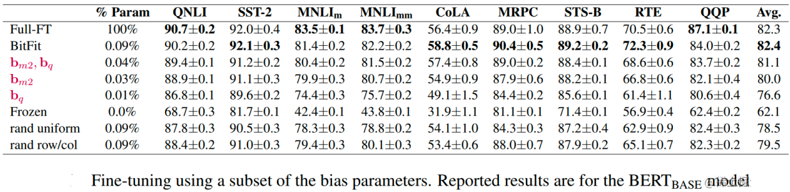
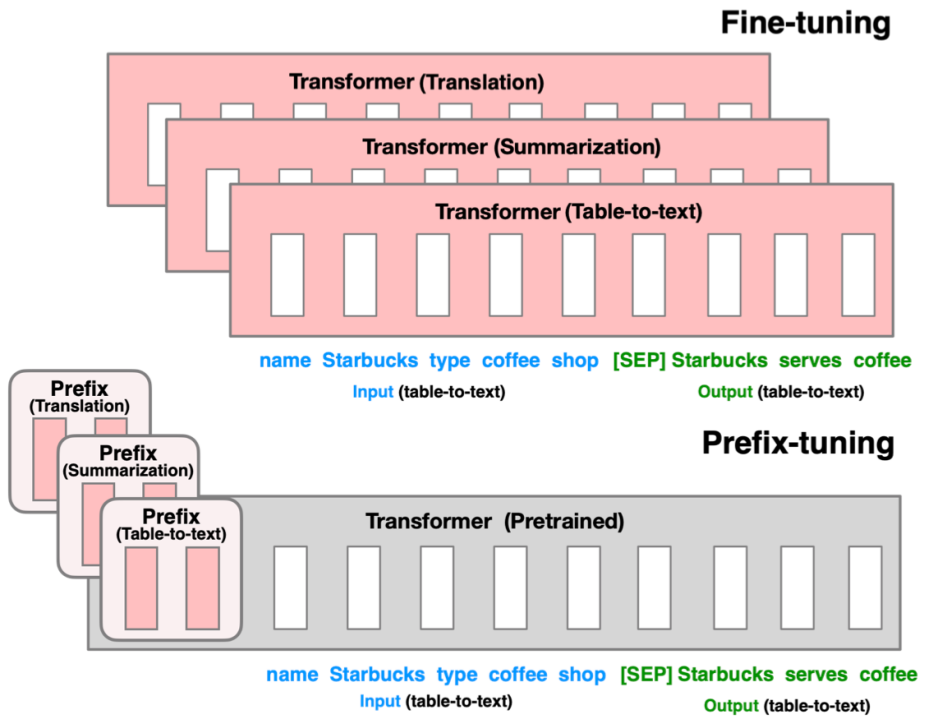
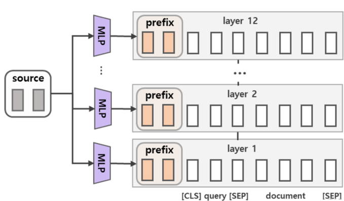
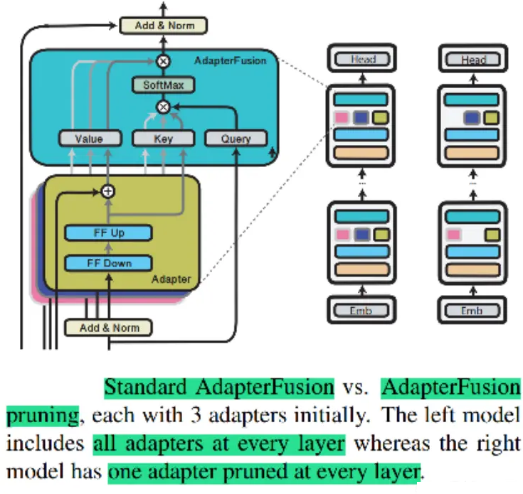
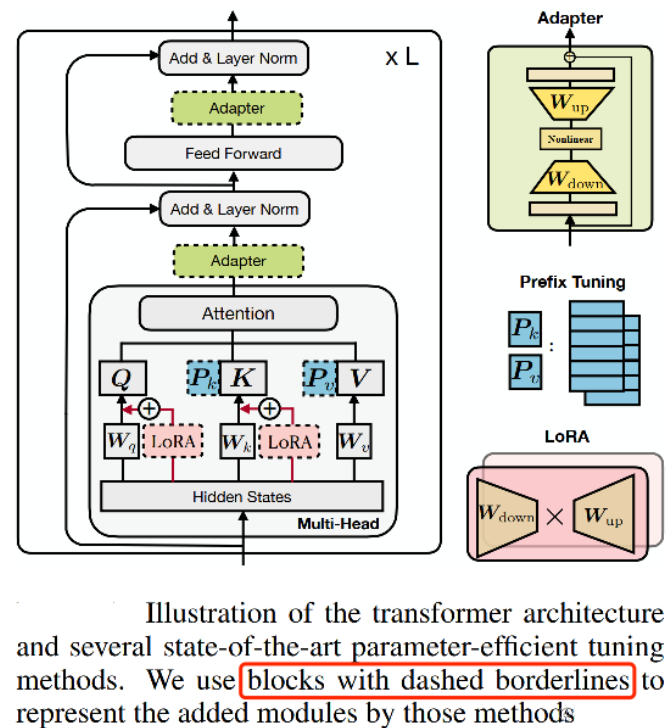
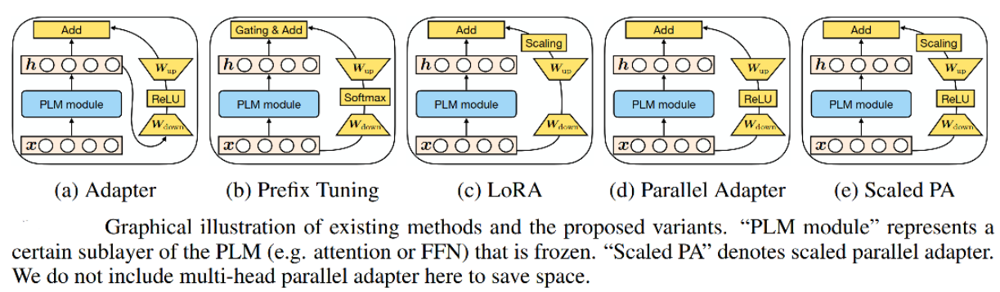
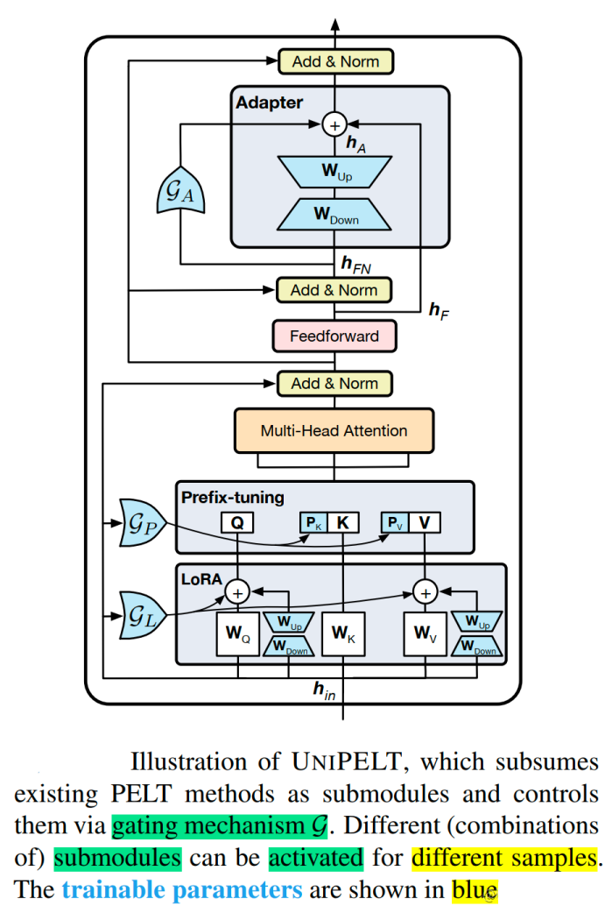
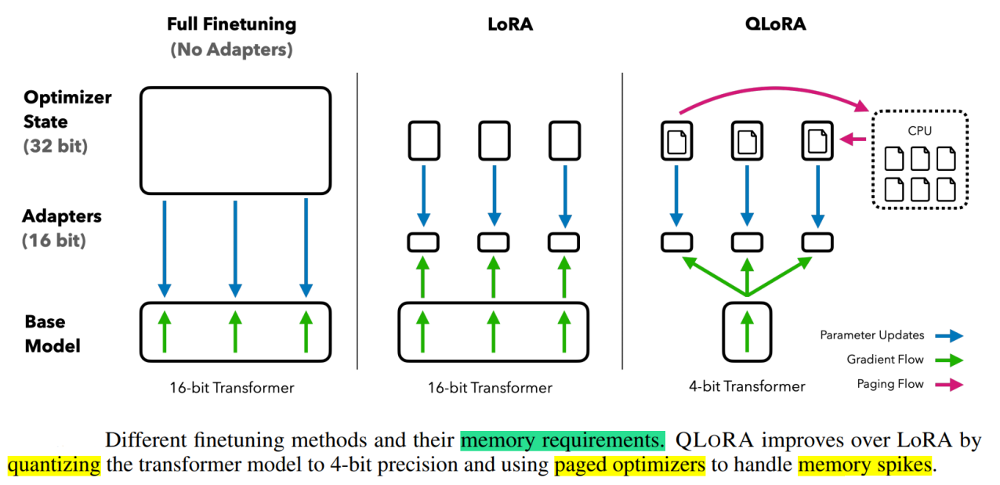

# 1.有监督微调基本概念

## 1.预训练

### 1.1 为什么要增量预训练？

**预训练学知识**，**指令微调学格式**，**强化学习对齐人类偏好**，所以要想大模型有领域知识，得增量预训练（靠指令微调记知识不靠谱，不是几十w条数据能做到的）。

### 1.2 进行增量预训练需要做哪些准备工作？

1.  **选取底座模型**：可以根据自己的项目需求和硬件基础来选择合适的底座模型及模型参数量的大小。
2.  **收集数据**：一般来说需要收集大量的文本数据，包含各个领域，主要从互联网上获取，一般预训练数据的大小都是 TB 级别的。
3.  **数据清洗**：所有的信息都能够在互联网信息中被找到，只是**信息密度**相比「人工精选数据集」要更低。例如「明星信息」、「如何写代码」这些信息都能在新闻网站、或是问答网站中找到，只不过「维基百科」或是「Github」则是将这些信息给「高密度」且「结构化」地进行了存储。这使得我们在使用维基百科作为训练语料的时候，模型能够更快的学习到这些高密度信息（人物的经历、年龄、性别、职业等等），而这些内容在互联网信息（如新闻）中的信息密度则较低，即很少会有一条新闻完整的介绍一个艺人的过往经历。只要我们**对互联网信息进行严格的处理**（去除冗余信息，提高有用信息的密度），就能够加快模型的学习速度。

### 1.3 增量预训练所用训练框架？

-   **超大规模训练**：选用 3D 并行，Megatron-Deepspeed拥有多个成功案例&#x20;
-   **少量节点训练**：选用张量并行，但张量并行只有在 nvlink 环境下才会起正向作用，但提升也不会太明显。&#x20;
-   **少量卡训练**：如果资源特别少，显存怎么也不够，可以使用 LoRA 进行增量预训练。

### 1.4 增量预训练数据选取思路有哪些？

垂直领域预训练有三种思路：

-   先用大规模通用语料预训练，再用小规模领域语料二次训练
-   直接进行大规模领域语料预训练
-   通用语料比例混合领域语料同时训练

### 1.5 增量预训练训练流程是怎么样？

1.  **数据预处理**：参考 LLaMA 的预训练长度，也把数据处理成2048长度（如果不够，做补全）。
2.  **分词器**：如果使用 LLaMA 可能需要添加中文词表，目前有不少人做了相关工作，当然也可以自己添加自己需要的词表。
3.  **原始模型**：各家框架的模型层名不太一样，训练时可能需要做一些调整，在预训练时尽量选择基座模型，不选 Chat 模型。
4.  **训练模型**：跑通只是第一步，根据训练情况反复调整比较重要。
5.  **模型转换**：不同框架的checkpoint格式不同，还会根据并行度分成很多个文件。
6.  **模型测试**：简单测试下续写能力，验证下模型是否正常。

## 2. 微调

### 2.1微调方法是啥？如何微调？

微调（Fine-tuning）是**一种迁移学习的方法**，用于在一个预训练模型的基础上，通过在特定任务的数据上进行有监督训练，来适应该任务的要求并提高模型性能。微调利用了预训练模型在大规模通用数据上学习到的语言知识和表示能力，将其迁移到特定任务上。

下面是一般的微调步骤：

1.  **预训练模型选择**：选择一个在大规模数据上进行预训练的模型作为基础模型。例如，可以选择一种预训练的语言模型，如BERT、GPT等。
2.  **数据准备**：准备用于微调的特定任务数据集。这些数据集应包含任务相关的样本和相应的标签或目标。确保数据集与任务的特定领域或问题相关。
3.  **构建任务特定的模型头**：根据任务的要求，构建一个特定的模型头（task-specific head）。模型头是添加到预训练模型之上的额外层或结构，用于根据任务要求进行输出预测或分类。例如，对于文本分类任务，可以添加一个全连接层和softmax激活函数。
4.  **参数初始化**：将预训练模型的参数作为初始参数加载到微调模型中。这些参数可以被视为模型已经学习到的通用语言表示。
5.  **微调训练**：使用特定任务的数据集对模型进行有监督训练。这包括将任务数据输入到模型中，计算损失函数，并通过反向传播和优化算法（如梯度下降）更新模型参数。在微调过程中，只有模型头的参数会被更新，而预训练模型的参数会保持不变。
6.  **调整超参数**：微调过程中，可以根据需要调整学习率、批量大小、训练迭代次数等超参数，以达到更好的性能。
7.  **评估和验证**：在微调完成后，使用验证集或测试集对微调模型进行评估，以评估其在特定任务上的性能。可以使用各种指标，如准确率、精确率、召回率等。
8.  **可选的后续微调**：根据实际情况，可以选择在特定任务的数据上进行进一步的微调迭代，以进一步提高模型性能。

微调的关键是在预训练模型的基础上进行训练，从而将模型的知识迁移到特定任务上。通过这种方式，可以在较少的数据和计算资源下，快速构建和训练高性能的模型。

### 2.2 为什么需要 PEFT？

Parameter-Efficient Fine-Tuning（PEFT）是一种微调策略，**旨在仅训练少量参数使模型适应到下游任务**。对大规模PLM（pre-trained language models ）进行微调的成本往往高得令人望而却步。在这方面，PEFT方法只微调了少量(额外的)模型参数，从而大大降低了计算和存储成本。最近最先进的PEFT技术实现了与完全微调相当的性能。

PEFT**通过冻结预训练模型的某些层，并仅微调特定于下游任务的最后几层来实现这种效率**。这样，模型就可以适应新的任务，计算开销更少，标记的例子也更少。尽管PEFT是一个相对较新的概念，但自从引入迁移学习以来，更新最后一层模型已经在计算机视觉领域得到了实践。即使在NLP中，静态和非静态词嵌入的实验也很早就进行了。

参数高效微调旨在提高预训练模型(如BERT和RoBERTa)在各种下游任务上的性能，包括情感分析、命名实体识别和问答。它在数据和计算资源有限的低资源设置中实现了这一点。它只修改模型参数的一小部分，并且不容易过度拟合。

参数高效的微调**在计算资源有限或涉及大型预训练模型的情况下特别有用**。在这种情况下，PEFT可以在不牺牲性能的情况下提供一种更有效的方法来微调模型。然而，需要注意的是，PEFT有时可能会达到与完全微调不同的性能水平，特别是在预训练模型需要进行重大修改才能在新任务上表现良好的情况下。

高效微调技术可以粗略分为以下三大类：增加额外参数（A）、选取一部分参数更新（S）、引入重参数化（R）。而在增加额外参数这类方法中，又主要分为类适配器（Adapter-like）方法和软提示（Soft prompts）两个小类。

> Scaling Down to Scale Up: A Guide to Parameter-Efficient Fine-Tuning

### 2.3.微调和参数高效微调之间的区别是什么?

微调和参数高效微调是机器学习中用于**提高预训练模型在特定任务上的性能**的两种方法。

**微调**就是把**一个预先训练好的模型用新的数据在一个新的任务上进一步训练它**。整个预训练模型通常在微调中进行训练，包括它的所有层和参数。这个过程在计算上非常昂贵且耗时，特别是对于大型模型。

另一方面，**参数高效微调**是**一种专注于只训练预训练模型参数的子集的微调方法**。这种方法包括为新任务识别最重要的参数，并且只在训练期间更新这些参数。这样，PEFT可以显著减少微调所需的计算量。

### 2.4 PEFT 有什么优点？

在这里，只讨论PEFT相对于传统微调的好处。因此，理解为什么参数有效的微调比微调更有益。

1.  **减少计算和存储成本**：PEFT只涉及微调少量额外的模型参数，而冻结预训练llm的大部分参数，从而显着降低计算和存储成本
2.  **克服灾难性遗忘**：在LLM的全面微调期间，灾难性遗忘可能发生在模型忘记它在预训练期间学到的知识的地方。PEFT通过只更新几个参数来克服这个问题。
3.  **低数据环境下更好的性能**：PEFT方法在低数据环境下的表现优于完全微调，并且可以更好地推广到域外场景。
4.  **可移植性**：与全面微调的大检查点相比，PEFT方法使用户能够获得价值几mb的小检查点。这使得来自PEFT方法的训练权重易于部署和用于多个任务，而无需替换整个模型。
5.  **与完全微调相当的性能**：PEFT仅使用少量可训练参数即可实现与完全微调相当的性能。

### 2.5 多种不同的高效微调方法对比

参数有效策略可能涉及多种技术：

1.  **选择性层调整**（**Selective Layer Tuning**）：可以只微调层的一个子集，而不是微调模型的所有层。这减少了需要更新的参数数量。
2.  **适配器**（**Adapters**）：适配器层是插入预训练模型层之间的小型神经网络。在微调过程中，只训练这些适配器层，保持预先训练的参数冻结。通过这种方式，适配器学习将预先训练的模型提取的特征适应新任务。
3.  **稀疏微调**（**Sparse Fine-Tuning**）：传统的微调会略微调整所有参数，但稀疏微调只涉及更改模型参数的一个子集。这通常是基于一些标准来完成的，这些标准标识了与新任务最相关的参数。
4.  **低秩近似**（**Low-Rank Approximations**）：另一种策略是用一个参数较少但在任务中表现相似的模型来近似微调后的模型。
5.  **正则化技术**（**Regularization Techniques**）：可以将正则化项添加到损失函数中，以阻止参数发生较大变化，从而以更“参数高效”的方式有效地微调模型。
6.  **任务特定的头**（**Task-specific Heads**）：有时，在预先训练的模型架构中添加一个任务特定的层或“头”，只对这个头进行微调，从而减少需要学习的参数数量。

### 2.6 当前高效微调技术存在的一些问题

当前的高效微调技术很难在类似方法之间进行直接比较并评估它们的真实性能，主要的原因如下所示：

-   **参数计算口径不一致**：参数计算可以分为三类：可训练参数的数量、微调模型与原始模型相比改变的参数的数量、微调模型和原始模型之间差异的等级。例如，DiffPruning更新0.5%的参数，但是实际参与训练的参数量是200%。这为比较带来了困难。尽管可训练的参数量是最可靠的存储高效指标，但是也不完美。 Ladder-side Tuning使用一个单独的小网络，参数量高于LoRA或BitFit，但是因为反向传播不经过主网络，其消耗的内存反而更小。
-   **缺乏模型大小的考虑**：已有工作表明，大模型在微调中需要更新的参数量更小（无论是以百分比相对而论还是以绝对数量而论），因此（基）模型大小在比较不同PEFT方法时也要考虑到。
-   **缺乏测量基准和评价标准**：不同方法所使用的的模型/数据集组合都不一样，评价指标也不一样，难以得到有意义的结论。
-   **代码实现可读性差**：很多开源代码都是简单拷贝Transformer代码库，然后进行小修小补。这些拷贝也不使用git fork，难以找出改了哪里。即便是能找到，可复用性也比较差（通常指定某个Transformer版本，没有说明如何脱离已有代码库复用这些方法）。

### 2.7 高效微调技术最佳实践

针对以上存在的问题，研究高效微调技术时，建议按照最佳实践进行实施：

-   明确指出参数数量类型。
-   使用不同大小的模型进行评估。
-   和类似方法进行比较。
-   标准化PEFT测量基准。
-   重视代码清晰度，以最小化进行实现。

# 3.prompting

## 3.1 BitFit

### 3.1.1 背景

虽然对每个任务进行全量微调非常有效，但它也会为每个预训练任务生成一个独特的大型模型，这使得很难推断微调过程中发生了什么变化，也很难部署， 特别是随着任务数量的增加，很难维护。

理想状况下，我们希望有**一种满足以下条件的高效微调方法**：

-   到达能够匹配全量微调的效果。
-   仅更改一小部分模型参数。
-   使数据可以通过流的方式到达，而不是同时到达，便于高效的硬件部署。
-   改变的参数在不同下游任务中是一致的。

上述的问题取决于微调过程能多大程度引导新能力的学习以及暴露在预训练LM中学到的能力。

虽然，之前的高效微调方法Adapter-Tuning、Diff-Pruning也能够部分满足上述的需求。但是，作者提出了**一种参数量更小的稀疏的微调方法BitFit**，来满足上述的需求。

### 3.1.2 技术原理

BitFit（论文：**BitFit: Simple Parameter-efficient Fine-tuning or Transformer-based Masked Language-models**）是一种**稀疏的微调方法**，它**训练时只更新bias的参数或者部分bias参数**。

对于Transformer模型而言，**冻结大部分 transformer-encoder 参数，只更新bias参数跟特定任务的分类层参数**。涉及到的bias参数有attention模块中计算`query`,`key`,`value`跟合并多个attention结果时涉及到的bias，MLP层中的bias，Layernormalization层的bias参数。

在Bert-Base/Bert-Large这种模型里，bias参数仅占模型全部参数量的0.08%～0.09%。但是通过在Bert-Large模型上基于GLUE数据集进行了 BitFit、Adapter和Diff-Pruning的效果对比发现，BitFit在参数量远小于Adapter、Diff-Pruning的情况下，效果与Adapter、Diff-Pruning想当，甚至在某些任务上略优于Adapter、Diff-Pruning。

同时，通过实验结果还可以看出，**BitFit微调结果相对全量参数微调而言, 只更新极少量参数的情况下，在多个数据集上都达到了不错的效果**，虽不及全量参数微调，但是远超固定全部模型参数的Frozen方式。

同时，通过对比BitFit训练前后的参数，**发现很多bias参数并没有太多变化**（例如：跟计算key所涉及到的bias参数）。发现计算query和将特征维度从N放大到4N的FFN层（intermediate）的bias参数变化最为明显，只更新这两类bias参数也能达到不错的效果，反之，固定其中任何一者，模型的效果都有较大损失。

## 3.2 Prefix Tuning

### 3.2.1 背景

在Prefix Tuning之前的工作主要是人工设计离散的模版或者自动化搜索离散的模版。对于人工设计的模版，模版的变化对模型最终的性能特别敏感，加一个词、少一个词或者变动位置都会造成比较大的变化。而对于自动化搜索模版，成本也比较高；同时，以前这种离散化的token搜索出来的结果可能并不是最优的。

除此之外，传统的微调范式利用预训练模型去对不同的下游任务进行微调，对每个任务都要保存一份微调后的模型权重，一方面微调整个模型耗时长；另一方面也会占很多存储空间。

基于上述两点，Prefix Tuning提出**固定预训练LM**，**为LM添加可训练，任务特定的前缀，** 这样就可以为不同任务保存不同的前缀，微调成本也小；同时，这种Prefix实际就是连续可微的Virtual Token（Soft Prompt/Continuous Prompt），相比离散的Token，更好优化，效果更好。

### 3.2.2 技术原理

Prefix Tuning（论文：**Prefix-Tuning: Optimizing Continuous Prompts for Generation**），**在输入token之前构造一段任务相关的virtual tokens作为Prefix，然后训练的时候只更新Prefix部分的参数，而PLM中的其他部分参数固定**。

针对不同的模型结构，需要构造不同的Prefix。

-   **针对自回归架构模型**：**在句子前面添加前缀**，得到 `z = [PREFIX; x; y]`，合适的上文能够在固定 LM 的情况下去引导生成下文（比如：GPT3的上下文学习）。
-   **针对编码器-解码器架构模型**：**Encoder和Decoder都增加了前缀**，得到 `z = [PREFIX; x; PREFIX0; y]`。Encoder端增加前缀是为了引导输入部分的编码，Decoder 端增加前缀是为了引导后续token的生成。

该方法其实和构造Prompt类似，只是Prompt是人为构造的“显式”的提示，并且无法更新参数，而Prefix则是可以学习的“隐式”的提示。

同时，**为了防止直接更新Prefix的参数导致训练不稳定和性能下降的情况，在Prefix层前面加了MLP结构，训练完成后，只保留Prefix的参数**。

除此之外，通过消融实验证实，只调整embedding层的表现力不够，将导致性能显著下降，因此，在每层都加了prompt的参数，改动较大。

另外，实验还对比了位置对于生成效果的影响，Prefix-tuning也是要略优于Infix-tuning的。其中，Prefix-tuning形式为 `[PREFIX; x; y]`，Infix-tuning形式为 `[x; INFIX; y]`。

## 3.3.Prompt Tuning

### 3.3.1 背景

大模型全量微调对每个任务训练一个模型，开销和部署成本都比较高。同时，离散的prompts（指人工设计prompts提示语加入到模型）方法，成本比较高，并且效果不太好。

基于此，作者提出了Prompt Tuning，**通过反向传播更新参数来学习prompts，而不是人工设计prompts；同时冻结模型原始权重，只训练prompts参数，** 训练完以后，用同一个模型可以做多任务推理。

### 3.3.2 技术原理

Prompt Tuning（论文：**The Power of Scale for Parameter-Efficient Prompt Tuning**），该方法可以看作是Prefix Tuning的简化版本，它给**每个任务定义了自己的Prompt，然后拼接到数据上作为输入，但只在输入层加入prompt tokens**，并且不需要加入 MLP 进行调整来解决难训练的问题。

通过实验发现，随着预训练模型参数量的增加，Prompt Tuning的方法会逼近全参数微调的结果。

同时，Prompt Tuning 还提出了 Prompt Ensembling，也就是**在一个批次（Batch）里同时训练同一个任务的不同 prompt（即采用多种不同方式询问同一个问题）**，这样相当于训练了不同模型，比模型集成的成本小多了。

## 3.4 P-Tuning

### 3.4.1 背景

该方法的提出主要是为了解决这样一个问题：**大模型的Prompt构造方式严重影响下游任务的效果**。比如：GPT-3采用人工构造的模版来做上下文学习（in context learning），但人工设计的模版的变化特别敏感，加一个词或者少一个词，或者变动位置都会造成比较大的变化。

同时，近来的自动化搜索模版工作成本也比较高，以前这种离散化的token的搜索出来的结果可能并不是最优的，导致性能不稳定。

基于此，作者提出了P-Tuning，设计了一种**连续可微的virtual token**（同Prefix-Tuning类似）。

### 3.4.2 技术原理

P-Tuning（论文：**GPT Understands, Too**），该方法**将Prompt转换为可以学习的Embedding层，并用MLP+LSTM的方式来对Prompt Embedding进行一层处理**。

相比Prefix Tuning，P-Tuning加入的可微的virtual token，**但仅限于输入层，没有在每一层都加；另外，virtual token的位置也不一定是前缀，插入的位置是可选的**。这里的出发点实际是把传统人工设计模版中的真实token替换成可微的virtual token。

经过预训练的LM的词嵌入已经变得高度离散，如果随机初始化virtual token，容易优化到局部最优值，而这些virtual token理论是应该有相关关联的。因此，作者通过实验发现**用一个prompt encoder来编码会收敛更快，效果更好**。即用一个LSTM+MLP去编码这些virtual token以后，再输入到模型。

从对比实验证实看出，P-Tuning获得了与全参数一致的效果。甚至在某些任务上优于全参数微调。

并且在实验中还发现，相同参数规模，如果进行全参数微调，Bert的在NLU任务上的效果，超过GPT很多；但是在P-Tuning下，GPT可以取得超越Bert的效果。

## 3.5 P-Tuning v2

### 3.5.1 背景

之前的Prompt Tuning和P-Tuning等方法存在两个主要的问题：

第一，**缺乏模型参数规模和任务通用性**。

-   **缺乏规模通用性**：Prompt Tuning论文中表明当模型规模超过100亿个参数时，提示优化可以与全量微调相媲美。但是对于那些较小的模型（从100M到1B），提示优化和全量微调的表现有很大差异，这大大限制了提示优化的适用性。
-   **缺乏任务普遍性**：尽管Prompt Tuning和P-tuning在一些 NLU 基准测试中表现出优势，但提示调优对硬序列标记任务（即序列标注）的有效性尚未得到验证。

第二，**缺少深度提示优化**，在Prompt Tuning和P-tuning中，连续提示只被插入transformer第一层的输入embedding序列中，在接下来的transformer层中，插入连续提示的位置的embedding是由之前的transformer层计算出来的，这可能导致两个可能的优化挑战。

-   由于序列长度的限制，可调参数的数量是有限的。
-   输入embedding对模型预测只有相对间接的影响。

考虑到这些问题，作者提出了Ptuning v2，它**利用深度提示优化（如：Prefix Tuning），对Prompt Tuning和P-Tuning进行改进，作为一个跨规模和NLU任务的通用解决方案**。

### 3.5.2 技术原理

P-Tuning v2（论文： **P-Tuning v2: Prompt Tuning Can Be Comparable to Fine-tuning Universally Across Scales and Tasks**），该方法**在每一层都加入了Prompts tokens作为输入，而不是仅仅加在输入层**，这带来两个方面的好处：

-   更多可学习的参数（从P-tuning和Prompt Tuning的0.01%增加到0.1%-3%），同时也足够参数高效。
-   加入到更深层结构中的Prompt能给模型预测带来更直接的影响。

具体做法基本同Prefix Tuning，可以看作是将文本生成的Prefix Tuning技术适配到NLU任务中，然后做了一些改进：

-   **移除重参数化的编码器**。以前的方法利用重参数化功能来提高训练速度和鲁棒性（如：Prefix Tuning中的MLP、P-Tuning中的LSTM））。在 P-tuning v2 中，作者发现重参数化的改进很小，尤其是对于较小的模型，同时还会影响模型的表现。
-   **针对不同任务采用不同的提示长度**。提示长度在提示优化方法的超参数搜索中起着核心作用。在实验中，我们发现不同的理解任务通常用不同的提示长度来实现其最佳性能，这与Prefix-Tuning中的发现一致，不同的文本生成任务可能有不同的最佳提示长度。
-   **引入多任务学习**。先在多任务的Prompt上进行预训练，然后再适配下游任务。多任务学习对我们的方法来说是可选的，但可能是相当有帮助的。一方面，连续提示的随机惯性给优化带来了困难，这可以通过更多的训练数据或与任务相关的无监督预训练来缓解；另一方面，连续提示是跨任务和数据集的特定任务知识的完美载体。我们的实验表明，在一些困难的序列任务中，多任务学习可以作为P-tuning v2的有益补充。
-   **回归传统的分类标签范式，而不是映射器**。标签词映射器（Label Word Verbalizer）一直是提示优化的核心组成部分，它将one-hot类标签变成有意义的词，以利用预训练语言模型头。尽管它在few-shot设置中具有潜在的必要性，但在全数据监督设置中，Verbalizer并不是必须的。它阻碍了提示调优在我们需要无实际意义的标签和句子嵌入的场景中的应用。因此，P-Tuning v2回归传统的CLS标签分类范式，采用随机初始化的分类头（Classification Head）应用于tokens之上，以增强通用性，可以适配到序列标注任务。

论文中展示了P-tuning v2在不同模型规模下的表现。对于简单的NLU任务，如SST-2（单句分类），Prompt Tuning和P-Tuning在较小的规模下没有显示出明显的劣势。但是当涉及到复杂的挑战时，如：自然语言推理（RTE）和多选题回答（BoolQ），它们的性能会非常差。相反，P-Tuning v2在较小规模的所有任务中都与微调的性能相匹配。并且，P-tuning v2在RTE中的表现明显优于微调，特别是在BERT中。

论文还通过消融实验研究了不同任务上Prompt Length的影响：

-   针对简单任务：如情感分析，较短的Prompt（\~20）即可取得不错的效果。
-   针对复杂任务：如阅读理解，需要更长的Prompt（\~100）。

总之，P-Tuning v2是一种在**不同规模和任务中都可与微调相媲美的提示方法**。P-Tuning v2对从330M到10B的模型显示出一致的改进，并在序列标注等困难的序列任务上以很大的幅度超过了Prompt Tuning和P-Tuning。P-Tuning v2可以成为微调的综合替代方案和未来工作的基线（Baseline）。

# 4. adapter-tuning

[大模型参数高效微调技术原理综述（四）-Adapter Tuning及其变体 - 知乎 (zhihu.com)](https://zhuanlan.zhihu.com/p/636038478 "大模型参数高效微调技术原理综述（四）-Adapter Tuning及其变体 - 知乎 (zhihu.com)")

## 4.1 Adapter Tuning

### 4.1.1 背景

预训练模型参数量越来越多，在训练下游任务时进行全量微调变得昂贵且耗时。

基于此，作者提出了Adapter Tuning，Adapter 的出现缓解了上述问题 Adapter **在预训练模型每层中插入用于下游任务的参数**（针对每个下游任务，仅增加3.6%的参数），**在微调时将模型主体冻结，仅训练特定于任务的参数**，从而减少了训练时的算力开销。

### 4.1.2 技术原理

Adapter Tuning（论文：**Parameter-Efficient Transfer Learning for NLP**），该方法**设计了Adapter结构**，并将其嵌入Transformer的结构里面，**针对每一个Transformer层，增加了两个Adapter结构(分别是多头注意力的投影之后和第二个feed-forward层之后)**，**在训练时，固定住原来预训练模型的参数不变，只对新增的 Adapter 结构和 Layer Norm 层进行微调，从而保证了训练的高效性**。

每当出现新的下游任务，通过添加Adapter模块来产生一个易于扩展的下游模型，从而避免全量微调与灾难性遗忘的问题。

### 4.1.3 具体细节

每个 Adapter 模块主要由**两个前馈（Feedforward）子层组成**，第一个前馈子层（down-project）将Transformer块的输出作为输入，将原始输入维度`d`（高维特征）投影到`m`（低维特征），通过控制m的大小来限制Adapter模块的参数量，通常情况下，`m<<d`。然后，中间通过一个非线形层。在输出阶段，通过第二个前馈子层（up-project）还原输入维度，将m（低维特征）重新映射回d（原来的高维特征），作为Adapter模块的输出。同时，通过一个skip connection来将Adapter的输入重新加到最终的输出中去，这样可以保证，即便 Adapter 一开始的参数初始化接近0，Adapter也由于skip connection的设置而接近于一个恒等映射，从而确保训练的有效性。

$$
h \leftarrow h+f\left(h W_{\text {down }}\right) W_{u p}
$$

通过实验发现，只训练少量参数的Adapter方法的效果可以媲美全量微调，这也验证了Adapter是一种高效的参数训练方法，可以快速将语言模型的能力迁移到下游任务中去。

总之，Adapter通过引入0.5%～5%的模型参数可以达到不落后全量微调模型1%的性能。

## 4.2.AdapterFusion

### 4.2.1 背景

为了整合来自多个任务的知识，传统的两个方法是按一定顺序微调（Sequential fine-tuning）或者多任务学习（multi-task learning）。前者的一大问题是需要先验知识来确定顺序，且模型容易遗忘之前任务学到的知识，后者的问题是不同的任务会互相影响，也难以平衡数据集大小差距很大的任务。

而之前的工作，Adapter Tuning的一个优势就是不用更新预训练模型的参数，而是插入比较少的新的参数就可以很好地学会一个任务。此时，Adapter 的参数某种程度上就表达了解决这个任务需要的知识。

作者受此启发，如果**想要把来自多个任务的知识结合起来，是否可以考虑把多个任务的Adapter的参数结合起来**？基于此，作者提出了 AdapterFusion，这是一种新的两阶段学习算法，可以利用来自多个任务的知识。

### 4.2.2 技术原理

Adapter Fusion（论文：**AdapterFusion:Non-Destructive Task Composition for Transfer Learning**），**一种融合多任务信息的Adapter的变体**，在 Adapter 的基础上进行优化，通过将学习过程分为两阶段来提升下游任务表现。

-   **知识提取阶段**：在不同任务下引入各自的Adapter模块，用于学习特定任务的信息。
-   **知识组合阶段**：将预训练模型参数与特定于任务的Adapter参数固定，**引入新参数（AdapterFusion）来学习组合多个Adapter中的知识，以提高模型在目标任务中的表现**。

对于**第一阶段**，有两种训练方式，分别如下：

-   **Single-Task Adapters(ST-A)**：对于N个任务，模型都分别独立进行优化，各个任务之间互不干扰，互不影响。
-   **Multi-Task Adapters(MT-A)**：N个任务通过多任务学习的方式，进行联合优化。

对于**第二阶段**，为了避免通过引入特定任务参数而带来的灾难性遗忘问题，AdapterFusion提出了**一个共享多任务信息的结构**。针对特定任务`m`，AdapterFusion联合了第一阶段训练得到的`N`个Adapter信息。固定语言模型的参数跟`N`个Adapter的参数，新引入AdapterFusion的参数，目标函数也是学习针对特定任务`m`的AdapterFusion的参数。

### 4.2.3 **AdapterFusion结构**

AdapterFusion具体结构就是一个Attention，它的参数包括`query`，`key`, `value`的矩阵参数，在transformer的每一层都存在，它的query是transformer每个子模块的输出结果，它的key跟value则是N个任务的adapter的输出。通过AdapterFusion，模型可以为不同的任务对应的adapter分配不同的权重，聚合N个任务的信息，从而为特定任务输出更合适的结果。

通过对全量微调、Adapter Tuning、AdapterFusion这三种方法在各个数据集上进行对比实验可以看出，AdapterFusion在大多数情况下性能优于全模型微调和Adapter Tuning，特别在MRPC与RTE数据集中，性能显著优于另外两种方法。

总之，通过将适配器的训练分为知识提取和知识组合两部分，**解决了灾难性遗忘、任务间干扰和训练不稳定的问题**。但是，Adapter模块的添加也导致模型整体参数量的增加，降低了模型推理时的性能。

## 4.3.AdapterDrop

### 4.3.1 背景

近年来Adapter已被证明可以很好地用于机器翻译、跨语言迁移、社区问答和迁移学习的任务组合。尽管它们最近很受欢迎，但Adapter的计算效率尚未在参数效率之外得到探索。

作者通过对Adapter的计算效率进行分析，**发现与全量微调相比，Adapter在训练时快60%，但是在推理时慢4%-6%**。

基于此，作者提出了**AdapterDrop**方法缓解该问题。

### 4.3.2 技术原理

AdapterDrop（论文：AdapterDrop: On the Efficiency of Adapters in Transformers），在不影响任务性能的情况下，**对Adapter动态高效的移除，尽可能的减少模型的参数量，提高模型在反向传播（训练）和正向传播（推理）时的效率**。

实验表明，**从较低的 Transformer 层中删除Adapter可以显着提高多任务设置中的推理速度**。 例如，将前五个Transformer层中的Adapter丢弃，在对 8 个任务进行推理时，速度提高了 39%。并且即使有多个丢弃层，AdapterDrop 也能保持良好的结果。

除此之外，作者还研究了对 AdapterFusion中的Adapter进行剪枝后的效果。

通过实验表明可以移除 AdapterFusion 中的大多数Adapter而不影响任务性能。使用剩余的两个Adapter，实现了与具有八个Adapter的完整 AdapterFusion  模型相当的结果，并将推理速度提高了 68%。

因此，作者建议在实际部署这些模型之前执行 AdaperFusion 剪枝。 这是一种简单而有效的技术，即使在完全保持性能的情况下也能实现效率提升。

总之，**AdapterDrop 通过从较低的 Transformer 层删除可变数量的Adaper来提升推理速度**。 当对多个任务执行推理时，动态地减少了运行时的计算开销，并在很大程度上保持了任务性能。

## 4.4.MAM Adapter

### 4.4.1 背景

近年来提出了多种参数高效的迁移学习方法，这些方法**仅微调少量（额外）参数即可获得强大的性能**。虽然有效，但人们对为什么有效的关键要素以及各种高效微调方法之间的联系知之甚少。

下图展示了不同的微调方法，在Xsum数据集上做英文文本摘要任务的效果（ROUGE-2是该任务的评价指标（越大越好））以及其他高效微调方法参数量相对于全参数微调参数量的百分比。图中的左上角的位置是理想化的方法。从图中发现，Adapter，Prefix Tuning和LoRA都是性能比较好的方法。

为什么看起来Adapter、Prefix Tuning、LoRA（在结构上和公式上）都不太一样，尤其是Prefix Tuning，但是这三种方法有近似的效果？

基于此，作者分解了当下最先进的参数高效迁移学习方法（Adapter、Prefix Tuning和LoRA）的设计，并提出了一种新方法**MAM Adapter**，**一个在它们之间建立联系的统一框架**。具体来说，将它们**重新构建为对预训练模型中特定隐藏状态的修改，并定义一组设计维度，不同的方法沿着这些维度变化**。

首先，作者通过对Prefix Tuning变换，发现Prefix Tuning和Adapters的公式高度相似。

然后，分析不同微调方法的内部结构和结构插入形式的相似之处。下图展示了高效微调方法Adapter、Prefix Tuning、LoRA以及新变体（通过更换一些元素，设计了前人的工作里没有的变体） Parallel Adapter、 Scaled PA的结构。

下表展示了高效微调方法Adapter、Prefix Tuning、LoRA以及新变体在新增可训练参数结构形式（functional form）、结构插入形式（Insertion form）、新增结构在PLM修改的具体位置（modified representation）、新增结构与PLM的组合函数（composition function）。其中，新增可训练参数结构形式为需要学习的部分（注：Prefix Tuning为经过转换后的格式）；插入形式有串联或并联；模型修改的具体位置有Attention、FFN层。

### 4.4.2 技术原理

MAM Adapter（论文：TOWARDS A UNIFIED VIEW OF PARAMETER-EFFICIENT TRANSFER LEARNING），**一个在Adapter、Prefix Tuning和LoRA之间建立联系的统一方法**。

作者对Adapter的放置和软提示（soft prompt）进行了详细的调查。得出如下结论：

-   并行放置的Adapter优于顺序放置的Adapter，并且与 FFN 并行放置的Adapter优于多头注意力（MHA）并行放置的Adapter（模型修改的位置如下图中所示，蓝色表示修改Attention、红色表示修改FFN）。
-   软提示可以通过仅更改 0.1% 的参数来有效地修改注意力。

然后，提出了“mix-and-match”（MAM）。 因此，最终模型 MAM Adapter 是用 FFN 层的并行Adapter和软提示的组合。

通过最终的实验结果，可以看到 MAM Adapter 在仅用了6.7%参数量（相比全量微调）的情况下，在Xsum和MT这两个任务上达到了和全量微调相近的效果，并且该方法大大优于 BitFit 和 Prompt Tuning，并始终优于 LoRA、Adapter 和 Prefix Tuning。

## 4.5.UniPELT

### 4.5.1 背景

近年来，涌现出了许多针对语言模型的参数高效微调（PELT）方法，在模型训练参数极大的减少的情况下，模型效果与全量微调相当。但是不同的PELT方法在同一个任务上表现差异可能都非常大，这让针对特定任务选择合适的方法非常繁琐。

基于此，作者提出了UniPELT方法，**将不同的PELT方法作为子模块，并通过门控机制学习激活最适合当前数据或任务的方法**。

### 4.5.2 技术原理

UniPELT（论文： UNIPELT: A Unified Framework for Parameter-Efficient Language Model Tuning）是 LoRA、Prefix Tuning和Adapter的门控组合。

更具体地说，LoRA 重新参数化用于 WQ 和 WV 注意力矩阵，Prefix Tuning应用于每一Transformer层的key和value，并在Transformer块的feed-forward子层之后添加Adapter。 对于每个模块，门控被实现为线性层，通过GP参数控制Prefix-tuning方法的开关，GL控制LoRA方法的开关，GA控制Adapter方法的开关。可训练参数包括 LoRA 矩阵 WA（Down）和WB（Up），提示调优参数Pk和Pv、Adapter参数和门函数权重。即图中蓝颜色的参数为可学习的参数。

UniPELT 仅用 100 个示例就在低数据场景中展示了相对于单个 LoRA、Adapter 和 Prefix Tuning 方法的显著改进。在更高数据的场景中，UniPELT 的性能与这些方法相当或更好。

实验还对不同 PELT 方法训练时间和推理时间进行了分析。

-   从训练速度来看，UniPELT比之前微调的方法多一些，但是还在能接受的范围，
-   从推理时间来看，BitFit方法增加的最少，UniPELT方法时间增加了27%。
-   从训练参数量来看，LoRA，BitFit，Prefix-tuning都比较小，UniPELT参数量相对会多一些。

总之，**本方法始终优于常规的全量微调以及它在不同设置下包含的子模块，通常超过在每个任务中单独使用每个子模块的最佳性能的上限**；并且，通过研究结果表明，多种 PELT 方法的混合涉及到PLM 的不同部分可能对模型有效性和鲁棒性都有好处。

# 5.lora

## 5.1.LoRA

### 5.1.1 背景

神经网络包含很多全连接层，其借助于矩阵乘法得以实现，然而，很多全连接层的权重矩阵都是满秩的。当针对特定任务进行微调后，**模型中权重矩阵其实具有很低的本征秩**（intrinsic rank），因此，论文的作者认为**权重更新的那部分参数矩阵尽管随机投影到较小的子空间，仍然可以有效的学习，可以理解为针对特定的下游任务这些权重矩阵就不要求满秩**。

### 5.1.2 技术原理

LoRA（论文：**LoRA: LOW-RANK ADAPTATION OF LARGE LANGUAGE MODELS**），该方法的核心思想就是**通过低秩分解来模拟参数的改变量，从而以极小的参数量来实现大模型的间接训练。**

在涉及到矩阵相乘的模块，在原始的PLM旁边增加一个新的通路，通过前后两个矩阵A,B相乘，第一个矩阵A负责降维，第二个矩阵B负责升维，中间层维度为r，从而来模拟所谓的本征秩（intrinsic rank）。

可训练层维度和预训练模型层维度一致为`d`，先将维度`d`通过全连接层降维至`r`，再从`r`通过全连接层映射回`d`维度，其中，`r<<d`，r是矩阵的秩，这样矩阵计算就从`d x d`变为`d x r + r x d`，参数量减少很多。

在下游任务训练时，固定模型的其他参数，只优化新增的两个矩阵的权重参数，将PLM跟新增的通路两部分的结果加起来作为最终的结果（两边通路的输入跟输出维度是一致的），即`h=Wx+BAx`。第一个矩阵的A的权重参数会通过高斯函数初始化，而第二个矩阵的B的权重参数则会初始化为零矩阵，这样能保证训练开始时新增的通路BA=0从而对模型结果没有影响。

$$
h=W_{0} x+\Delta W x=W_{0} x+B A x
$$

在推理时，将左右两部分的结果加到一起即可，`h=Wx+BAx=(W+BA)x`，所以只要将训练完成的矩阵乘积`BA`跟原本的权重矩阵`W`加到一起作为新权重参数替换原本PLM的W即可，对于推理来说，不会增加额外的计算资源。

此外，Transformer的权重矩阵包括Attention模块里用于计算`query`, `key`, `value`的`Wq`，`Wk`，`Wv`以及多头attention的`Wo`,以及MLP层的权重矩阵，LoRA只应用于Attention模块中的4种权重矩阵，而且通过消融实验发现同时调整 Wq 和 Wv 会产生最佳结果。

实验还发现，保证权重矩阵的种类的数量比起增加隐藏层维度r更为重要，增加r并不一定能覆盖更加有意义的子空间。

那么关于秩的选择，通常情况下，rank为4，8，16即可。

通过实验也发现，在众多数据集上LoRA在只训练极少量参数的前提下，最终在性能上能和全量微调匹配，甚至在某些任务上优于全量微调。

### 5.1.3 初始化

- PiSSA 
PiSSA 使用主奇异值和奇异向量初始化 LoRA 适配器。这种简单的修改使 PiSSA 比 LoRA 收敛速度更快，并最终获得更优异的性能。此外，与 QLoRA 相比，PiSSA 降低了量化误差，从而进一步提升了性能。

- OLoRA
OLoRA 利用 QR 分解来初始化 LoRA 适配器。OLoRA 将模型的基本权重平移 QR 分解的倍数，即在对权重进行任何训练之前对其进行变异。这种方法显著提高了稳定性，加快了收敛速度，并最终实现了卓越的性能。

- EVA
EVA 对每层的输入激活执行 SVD 分解，并使用右奇异向量初始化 LoRA 权重。因此，它是一种数据驱动的初始化方案。此外，EVA 会根据“解释方差比”（源自 SVD 分析的指标）自适应地分配各层的秩。

参考链接

[developer_guides for lora](https://huggingface.co/docs/peft/developer_guides/lora)

## 5.2.AdaLoRA

### 5.2.1 背景

在NLP领域，对于下游任务进行大型预训练语言模型的微调已经成为一种重要的做法。一般而言，我们会采用对原有的预训练模型进行全量微调的方法来适配下游任务，但这种方法存在两个问题。

-   **训练阶段**。对于预训练模型进行微调的时候，为了更新权重参数，需要大量的显存来存储参数的梯度和优化器信息，在当今预训练模型的参数变得越来越大的情况下，针对下游任务微调门槛变得越来越高。
-   **推理阶段**。由于我们训练的时候是对于模型参数进行全量的更新，所以多个下游任务需要为每个任务维护一个大型模型的独立副本，这样就导致我们在实际应用的时候浪费了不必要的存储。

为了解决这些问题，研究者提出了两个主要研究方向，以减少微调参数的数量，同时保持甚至提高预训练语言模型的性能。

-   **方向一：添加小型网络模块**：将小型网络模块添加到PLMs中，保持基础模型保持不变的情况下仅针对每个任务微调这些模块，可以用于所有任务。这样，只需引入和更新少量任务特定的参数，就可以适配下游的任务，大大提高了预训练模型的实用性。如：Adapter tuning、Prefix tuning、Prompt Tuning等，这类方法虽然大大减少了内存消耗。但是这些方法存在一些问题，比如：Adapter tuning引入了推理延时；Prefix tuning或Prompt tuning直接优化Prefix和Prompt是非单调的，比较难收敛，并且消耗了输入的token。
-   **方向二：下游任务增量更新**：对预训练权重的增量更新进行建模，而无需修改模型架构，即W=W0+△W。比如：Diff pruning、LoRA等， 此类方法可以达到与完全微调几乎相当的性能，但是也存在一些问题，比如：Diff pruning需要底层实现来加速非结构化稀疏矩阵的计算，不能直接使用现有的框架，训练过程中需要存储完整的∆W矩阵，相比于全量微调并没有降低计算成本。 LoRA则需要预先指定每个增量矩阵的本征秩 r 相同，忽略了在微调预训练模型时，权重矩阵的重要性在不同模块和层之间存在显著差异，并且只训练了Attention，没有训练FFN，事实上FFN更重要。

基于以上问题进行总结：

-   第一，我们不能预先指定矩阵的秩，需要动态更新增量矩阵的R，因为权重矩阵的重要性在不同模块和层之间存在显著差异。
-   第二，需要找到更加重要的矩阵，分配更多的参数，裁剪不重要的矩阵。找到重要的矩阵，可以提升模型效果；而裁剪不重要的矩阵，可以降低参数计算量，降低模型效果差的风险。

为了弥补这一差距，作者提出了AdaLoRA，它根据权重矩阵的重要性得分，在权重矩阵之间自适应地分配参数预算。

### 5.2.2 技术原理

AdaLoRA（论文：**ADAPTIVE BUDGET ALLOCATION FOR PARAMETEREFFICIENT FINE-TUNING**），是对LoRA的一种改进，它根据**重要性评分动态分配参数预算给权重矩阵**。具体做法如下：

-   **调整增量矩分配**。AdaLoRA将关键的增量矩阵分配高秩以捕捉更精细和任务特定的信息，而将较不重要的矩阵的秩降低，以防止过拟合并节省计算预算。
-   **以奇异值分解的形式对增量更新进行参数化，并根据重要性指标裁剪掉不重要的奇异值，同时保留奇异向量**。由于对一个大矩阵进行精确SVD分解的计算消耗非常大，这种方法通过减少它们的参数预算来加速计算，同时，保留未来恢复的可能性并稳定训练。

$$
W=W^{(0)}+\Delta=W^{(0)}+P \Lambda Q
$$

-   **在训练损失中添加了额外的惩罚项**，以规范奇异矩阵P和Q的正交性，从而避免SVD的大量计算并稳定训练。

通过实验证明，AdaLoRA 实现了在所有预算、所有数据集上与现有方法相比，性能更好或相当的水平。 例如，当参数预算为 0.3M 时，AdaLoRA 在RTE数据集上，比表现最佳的基线（Baseline）高 1.8%。

## 5.3 QLoRA

### 5.3.1 背景

微调大型语言模型 (LLM) 是提高其性能以及添加所需或删除不需要的行为的一种非常有效的方法。然而，微调非常大的模型非常昂贵；以 LLaMA 65B 参数模型为例，常规的 16 bit微调需要超过 780 GB 的 GPU 内存。

虽然最近的量化方法可以减少 LLM 的内存占用，但此类技术仅适用于推理场景。

基于此，作者提出了QLoRA，并首次证明了**可以在不降低任何性能的情况下微调量化为 4 bit的模型。**

### 5.3.2 技术原理

QLoRA（论文： **QLORA: Efficient Finetuning of Quantized LLMs**），使用**一种新颖的高精度技术将预训练模型量化为 4 bit，然后添加一小组可学习的低秩适配器权重，这些权重通过量化权重的反向传播梯度进行微调**。QLORA 有一种低精度存储数据类型（4 bit），还有一种计算数据类型（BFloat16）。实际上，这意味着无论何时使用 QLoRA 权重张量，我们都会将张量反量化为 BFloat16，然后执行 16 位矩阵乘法。QLoRA提出了两种技术实现高保真 4 bit微调——4 bit NormalFloat(NF4) 量化和双量化。此外，还引入了分页优化器，以防止梯度检查点期间的内存峰值，从而导致内存不足的错误，这些错误在过去使得大型模型难以在单台机器上进行微调。具体说明如下：

-   **4bit NormalFloat**（NF4）：对于正态分布权重而言，一种信息理论上最优的新数据类型，该数据类型对正态分布数据产生比 4 bit整数和 4bit 浮点数更好的实证结果。
-   **双量化**：对第一次量化后的那些常量再进行一次量化，减少存储空间。
-   **分页优化器**：使用NVIDIA统一内存特性，该特性可以在在GPU偶尔OOM的情况下，进行CPU和GPU之间自动分页到分页的传输，以实现无错误的 GPU 处理。该功能的工作方式类似于 CPU 内存和磁盘之间的常规内存分页。使用此功能为优化器状态（Optimizer）分配分页内存，然后在 GPU 内存不足时将其自动卸载到 CPU 内存，并在优化器更新步骤需要时将其加载回 GPU 内存。

实验证明，无论是使用16bit、8bit还是4bit的适配器方法，都能够复制16bit全参数微调的基准性能。这说明，尽管量化过程中会存在性能损失，但通过适配器微调，完全可以恢复这些性能。

实验还比较了不同的4bit数据类型对效果（zero-shot均值）的影响，其中，NFloat 显著优于Float，而NFloat + DQ略微优于NFloat，虽然DQ对精度提升不大，但是对于内存控制效果更好。

除此之外，论文中还对不同大小模型、不同数据类型、在 MMLU数据集上的微调效果进行了对比。使用QLoRA（NFloat4 + DQ）可以和Lora(BFloat16)持平，同时， 使用QLORA（ FP4）的模型效果落后于前两者一个百分点。

作者在实验中也发现了一些有趣的点，比如：指令调优虽然效果比较好，但只适用于指令相关的任务，在聊天机器人上效果并不佳，而聊天机器人更适合用Open Assistant数据集去进行微调。通过指令类数据集的调优更像是提升大模型的推理能力，并不是为聊天而生的。

总之，QLoRA的出现给大家带来一些新的思考，**不管是微调还是部署大模型，之后都会变得更加容易**。每个人都可以快速利用自己的私有数据进行微调；同时，又能轻松的部署大模型进行推理。

# 6.总结

## 6.1 **当前高效微调技术的简述**

之前对一些常见的高效微调技术进行了背景介绍及技术原理剖析，下面对每一种高效微调技术的特点进行简要的总结。

## 6.2.**BitFit**

对微调机制的一种积极探索，也很简单，**通过仅调整bias效果就能有不错的效果**，但没有具体阐述原理，就是通过猜测加实验得到的结果。同时，作者提出一个观点：微调的过程不是让模型适应另外的数据分布，而是让模型更好的应用出本身的表征能力。

特点：

-   训练参数量极小（约0.1%）。
-   在大部分任务上效果会差于LoRA、Adapter等方法。

## 6.3.**Prefix Tuning**

在每一个Transformer层都带上一些virtual token作为前缀，以适应不同的任务。

特点：

-   前缀Token会占用序列长度，有一定的额外计算开销。
-   Prefix Tuning的线性插值是比较复杂的。

## 6.4.**Prompt Tuning**

该方法可以看着是Prefix Tuning的简化版本，针对不同的任务，仅在输入层引入virtual token形式的软提示（soft prompt）。

特点：

-   相对于Prefix Tuning，参与训练的参数量和改变的参数量更小，更节省显存。
-   对一些简单的NLU 任务还不错，但对硬序列标记任务（即序列标注）表现欠佳。

## 6.5.**P-Tuning**

将Prompt转换为可以学习的Embedding层，并用MLP+LSTM的方式来对Prompt Embedding进行一层处理。相比Prefix Tuning，仅在输入层加入的可微的virtual token；另外，virtual token的位置也不一定是前缀，插入的位置是可选的。

特点：

-   引入一个prompt encoder（由一个双向的LSTM+两层MLP组成）来建模virtual token的相互依赖会收敛更快，效果更好。

## 6.6.**P-Tuning v2**

该方法在每一个Transformer层都加入了prompt token作为输入，引入多任务学习，针对不同任务采用不同的提示长度。并且回归传统的分类标签范式，而不是映射器。

特点：

-   解决了Prompt Tuning无法在小模型上有效提升的问题。
-   移除了对模型效果改进较小的重参数化的编码器（如：Prefix Tuning中的MLP、P-Tuning中的LSTM）。
-   对于一些复杂的硬序列标记任务（即序列标注）取得了不错的效果。

## 6.7.**Adapter Tuning**

该方法设计了Adapter结构，并将其嵌入Transformer的结构里面，针对每一个Transformer层，增加了两个Adapter结构，在训练时，固定住原来预训练模型的参数不变，只对新增的Adapter结构和Layer Norm 层进行微调。

特点：

-   通过在Transformer层中嵌入Adapter结构，在推理时会额外增加推理时长。

## 6.8.**AdapterFusion**

一种融合多任务信息的Adapter的变体，在 Adapter 的基础上进行优化，通过将学习过程分为两阶段来提升下游任务表现。

## 6.9.**AdapterDrop**

该方法在不影响任务性能的情况下，对Adapter动态高效的移除，尽可能的减少模型的参数量，提高模型在反向传播（训练）和正向传播（推理）时的效率。

特点：

-   通过从较低的 Transformer 层删除可变数量的Adaper来提升推理速度。 当对多个任务执行推理时，动态地减少了运行时的计算开销，并在很大程度上保持了任务性能。

## 6.10.**LoRA**

该方法通过低秩分解来模拟参数的改变量，从而以极小的参数量来实现大模型的间接训练。

特点：

-   将BA加到W上可以消除推理延迟。
-   可以通过可插拔的形式切换到不同的任务。
-   设计的比较好，简单且效果好。

## 6.11.**AdaLoRA**

对LoRA的一种改进，它根据重要性评分动态分配参数预算给权重矩阵，将关键的增量矩阵分配高秩以捕捉更精细和任务特定的信息，而将较不重要的矩阵的秩降低，以防止过拟合并节省计算预算。

## 6.12.**QLoRA**

使用一种新颖的高精度技术将预训练模型量化为 4 bit，然后添加一小组可学习的低秩适配器权重，这些权重通过量化权重的反向传播梯度进行微调。

特点：

-   使用 QLoRA 微调模型，可以显著降低对于显存的要求。同时，模型训练的速度会慢于LoRA。

## 6.13.**MAM Adapter**

一种在 Adapter、Prefix Tuning 和 LoRA 之间建立联系的统一方法。最终的模型 MAM Adapter 是用于 FFN 的并行 Adapter 和 软提示的组合。

特点：

-   整体上来说，最终的模型MAM Adapter效果会优于单个高效微调方法。

## 6.14.**UniPELT**

一种将不同的PELT方法LoRA、Prefix Tuning和Adapter作为子模块，并通过门控机制学习激活最适合当前数据或任务的方法。

特点：

-   相对于LoRA，BitFit，Prefix-tuning，训练的参数量更大；同时，推理更耗时；并且，输入会占用额外的序列长度。
-   多种 PELT 方法的混合涉及PLM 的不同部分对模型有效性和鲁棒性都有好处。

## 6.15.**多种不同的高效微调方法对比**

总的来说，像P-Tuning v2、LoRA等都是综合评估很不错的高效微调技术。如果显存资源有限可以考虑QLoRA；如果只是解决一些简单任务场景，可以考虑P-Tuning、Prompt Tuning也行。

下表从参数高效方法类型、是否存储高效和内存高效、以及在减少反向传播成本和推理开销的计算高效五个维度比较了参数高效微调方法。

下表展示了各种参数高效方法的参与训练的参数量、最终模型与原始模型的改变参数（delta值）以及论文中参与评估的模型的范围（<1B、<20B、>20B）。

从表中可以看到，Prompt Tuning、Prefix Tuning、LoRA等少部分微调技术针对不同参数规模的模型进行过评估，同时，这几种方式也是目前应用比较多的高效微调方法。

## 6.16.**总结**

本文针对之前介绍的几种参数高效微调方法进行了简单的概述，主要有如下几类：

-   增加额外参数，如：Prefix Tuning、Prompt Tuning、Adapter Tuning及其变体。
-   选取一部分参数更新，如：BitFit。
-   引入重参数化，如：LoRA、AdaLoRA、QLoRA。
-   混合高效微调，如：MAM Adapter、UniPELT。

并比较了不同的高效微调方法之间的差异；同时，还指出当前大多数高效微调方法存在的一些问题并给出了最佳实践。
