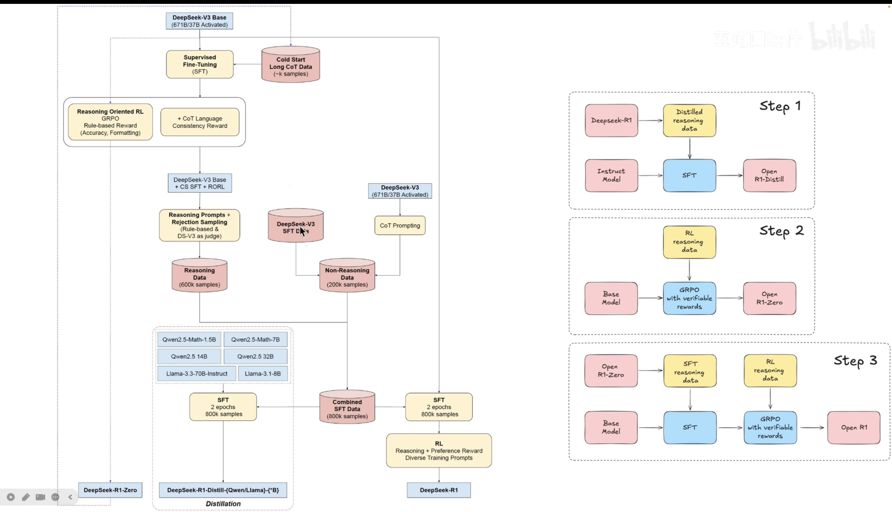
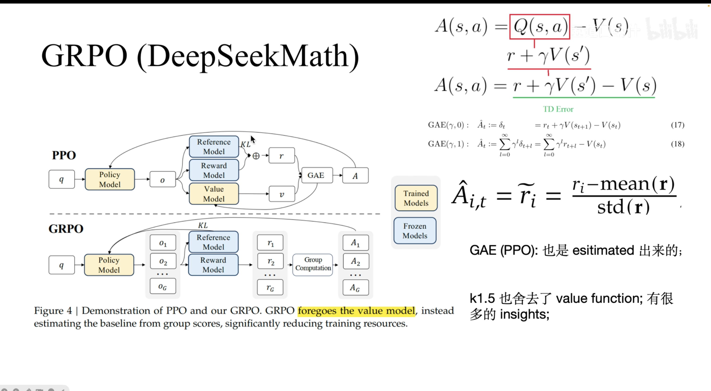
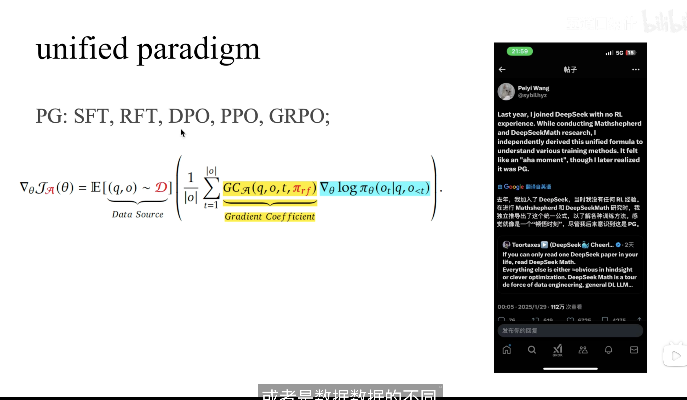
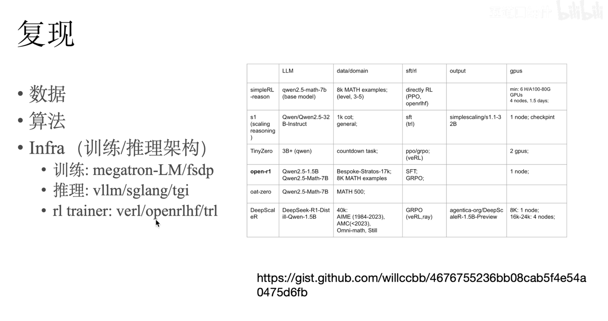

 

## 参考链接

## 参考视频

[[LLM+RL] R1 论文导读，SFT vs. RL，RL 基础以及 GRPO 细节，以及一系列复现工作讨论](https://www.bilibili.com/video/BV15yA3eWE5b/?spm_id_from=333.788.player.switch&vd_source=e93a4a5bbafd55034ada9970aedf668e)

[DeepSeek R1 Theory Overview | GRPO + RL + SFT](https://www.youtube.com/watch?v=QdEuh2UVbu0)