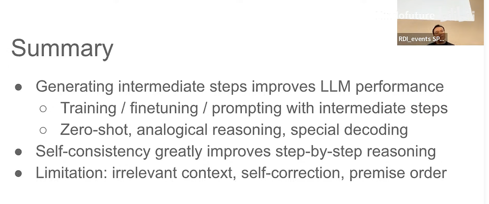
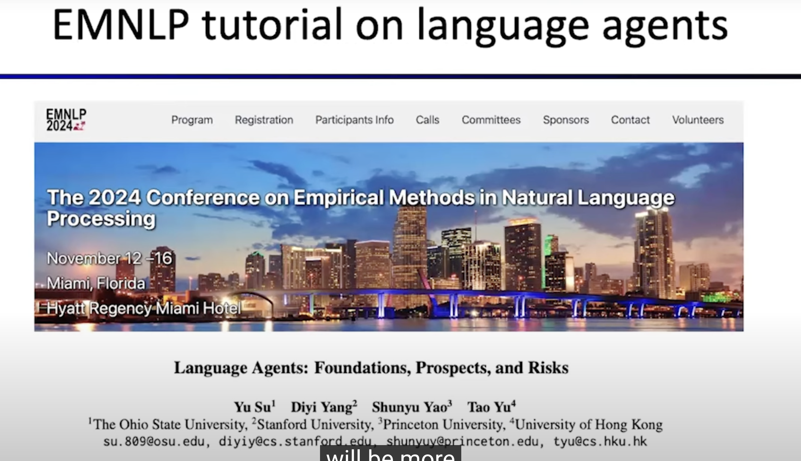

# CS294/194-196 Large Language Model Agents

> [https://rdi.berkeley.edu/llm-agents/f24](https://rdi.berkeley.edu/llm-agents/f24)

> [course-youtube](https://www.youtube.com/watch?v=QL-FS_Zcmyo&list=PLS01nW3RtgopsNLeM936V4TNSsvvVglLc&index=12)
> [course-bilibili](https://www.bilibili.com/video/BV1wfWFzjEzH/?spm_id_from=333.337.search-card.all.click&vd_source=e93a4a5bbafd55034ada9970aedf668e)

- Foundation of LLMs
- Reasoning
- Planning, tool use
- LLM agent infrastructure
- Retrieval-augmented generation
- Code generation, data science
- Multimodal agents, robotics
- Evaluation and benchmarking on agent applications
- Privacy, safety and ethics
- Human-agent interaction, personalization, alignment
- Multi-agent collaboration

## Syllabus

<html>
<table>
  <thead>
    <tr>
      <th>Date</th>
      <th>Guest Lecture</th>
      <th>Readings   (due Sunday 11:59pm before lecture on Gradescope)</th>
    </tr>
  </thead>
  <tbody>
    <tr>
      <td>Sept 9</td>
      <td><strong>LLM Reasoning</strong>   Denny Zhou, Google DeepMind   <a href="./assets/intro.pdf">Intro</a> <a href="./assets/llm-reasoning.pdf">Slides</a> <a href="https://bcourses.berkeley.edu/courses/1535641/external_tools/90481">Original Recording</a> <a href="https://www.youtube.com/watch?v=QL-FS_Zcmyo">Edited Video</a></td>
      <td>- <a href="https://arxiv.org/abs/2402.10200">Chain-of-Thought Reasoning Without Prompting</a>   - <a href="https://arxiv.org/abs/2310.01798">Large Language Models Cannot Self-Correct Reasoning Yet</a>   - <a href="https://arxiv.org/abs/2402.08939">Premise Order Matters in Reasoning with Large Language Models</a>   - <a href="https://arxiv.org/abs/2402.12875">Chain-of-Thought Empowers Transformers to Solve Inherently Serial Problems</a>   <em>All readings are optional this week.</em></td>
    </tr>
    <tr>
      <td>Sept 16</td>
      <td><strong>LLM agents: brief history and overview</strong>   Shunyu Yao, OpenAI   <a href="./assets/llm_agent_history.pdf">Slides</a> <a href="https://bcourses.berkeley.edu/courses/1535641/external_tools/90481">Original Recording</a> <a href="https://www.youtube.com/watch?v=RM6ZArd2nVc">Edited Video</a></td>
      <td>- <a href="https://arxiv.org/abs/2207.01206">WebShop: Towards Scalable Real-World Web Interaction with Grounded Language Agents</a>   - <a href="https://arxiv.org/abs/2210.03629">ReAct: Synergizing Reasoning and Acting in Language Models</a></td>
    </tr>
    <tr>
      <td>Sept 23</td>
      <td><strong>Agentic AI Frameworks &amp; AutoGen</strong>   Chi Wang, AutoGen-AI   <strong>Building a Multimodal Knowledge Assistant</strong>   Jerry Liu, LlamaIndex   <a href="https://rdi.berkeley.edu/llm-agents-mooc/slides/autogen.pdf">Chi’s Slides</a> <a href="https://rdi.berkeley.edu/llm-agents-mooc/slides/MKA.pdf">Jerry’s Slides</a> <a href="https://bcourses.berkeley.edu/courses/1535641/external_tools/90481">Original Recording</a> <a href="https://www.youtube.com/watch?v=OOdtmCMSOo4">Edited Video</a></td>
      <td>- <a href="https://arxiv.org/abs/2308.08155">AutoGen: Enabling Next-Gen LLM Applications via Multi-Agent Conversation</a>   - <a href="https://arxiv.org/abs/2403.11322">StateFlow: Enhancing LLM Task-Solving through State-Driven Workflows</a></td>
    </tr>
    <tr>
      <td>Sept 30</td>
      <td><strong>Enterprise trends for generative AI, and key components of building successful agents/applications</strong>   Burak Gokturk, Google   <a href="https://rdi.berkeley.edu/llm-agents-mooc/slides/Burak_slides.pdf">Slides</a> <a href="https://bcourses.berkeley.edu/courses/1535641/external_tools/90481">Original Recording</a> <a href="https://www.youtube.com/live/Sy1psHS3w3I">Edited Video</a></td>
      <td>- <a href="https://cloud.google.com/blog/products/ai-machine-learning/rag-and-grounding-on-vertex-ai?e=48754805">Google Cloud expands grounding capabilities on Vertex AI</a>   - <a href="https://towardsdatascience.com/the-needle-in-a-haystack-test-a94974c1ad38">The Needle In a Haystack Test: Evaluating the performance of RAG systems</a>   - <a href="https://cloud.google.com/blog/products/ai-machine-learning/the-needle-in-the-haystack-test-and-how-gemini-pro-solves-it?e=48754805">The AI detective: The Needle in a Haystack test and how Gemini 1.5 Pro solves it</a></td>
    </tr>
    <tr>
      <td>Oct 7</td>
      <td><strong>Compound AI Systems &amp; the DSPy Framework</strong>   Omar Khattab, Databricks   <a href="https://rdi.berkeley.edu/llm-agents-mooc/slides/dspy_lec.pdf">Slides</a> <a href="https://bcourses.berkeley.edu/courses/1535641/external_tools/90481">Original Recording</a> <a href="https://www.youtube.com/live/JEMYuzrKLUw">Edited Video</a></td>
      <td>- <a href="https://arxiv.org/abs/2406.11695">Optimizing Instructions and Demonstrations for Multi-Stage Language Model Programs</a>   - <a href="https://arxiv.org/abs/2407.10930">Fine-Tuning and Prompt Optimization: Two Great Steps that Work Better Together</a></td>
    </tr>
    <tr>
      <td>Oct 14</td>
      <td><strong>Agents for Software Development</strong>   Graham Neubig, Carnegie Mellon University   <a href="https://rdi.berkeley.edu/llm-agents-mooc/slides/neubig24softwareagents.pdf">Slides</a> <a href="https://bcourses.berkeley.edu/courses/1535641/external_tools/90481">Original Recording</a> <a href="https://www.youtube.com/live/f9L9Fkq-8K4">Edited Video</a></td>
      <td>- <a href="https://arxiv.org/abs/2405.15793">SWE-agent: Agent-Computer Interfaces Enable Automated Software Engineering</a>   - <a href="https://arxiv.org/abs/2407.16741">OpenHands: An Open Platform for AI Software Developers as Generalist Agents</a></td>
    </tr>
    <tr>
      <td>Oct 21</td>
      <td><strong>AI Agents for Enterprise Workflows</strong>   Nicolas Chapados, ServiceNow   <a href="https://rdi.berkeley.edu/llm-agents/assets/agentworkflows.pdf">Slides</a> <a href="https://bcourses.berkeley.edu/courses/1535641/external_tools/90481">Original Recording</a> <a href="https://www.youtube.com/live/-yf-e-9FvOc">Edited Video</a></td>
      <td>- <a href="https://arxiv.org/abs/2403.07718">WorkArena: How Capable Are Web Agents at Solving Common Knowledge Work Tasks?</a>   - <a href="https://arxiv.org/abs/2407.05291">WorkArena++: Towards Compositional Planning and Reasoning-based Common Knowledge Work Tasks</a>   - <a href="https://rdi.berkeley.edu/llm-agents-mooc/assets/tapeagents.pdf">TapeAgents: a Holistic Framework for Agent Development and Optimization</a></td>
    </tr>
    <tr>
      <td>Oct 28</td>
      <td><strong>Towards a unified framework of Neural and Symbolic Decision Making</strong>   Yuandong Tian, Meta AI (FAIR)   <a href="https://rdi.berkeley.edu/llm-agents/assets/102824-yuandongtian.pdf">Slides</a> <a href="https://bcourses.berkeley.edu/courses/1535641/external_tools/90481">Original Recording</a> <a href="https://www.youtube.com/live/wm9-7VBpdEo">Edited Video</a></td>
      <td>- <a href="https://arxiv.org/abs/2402.14083">Beyond A*: Better Planning with Transformers via Search Dynamics Bootstrapping</a>   - <a href="https://arxiv.org/abs/2410.09918v1">Dualformer: Controllable Fast and Slow Thinking by Learning with Randomized Reasoning Traces</a>   - <a href="https://arxiv.org/abs/2410.01779">Composing Global Optimizers to Reasoning Tasks via Algebraic Objects in Neural Nets</a>   - <a href="https://arxiv.org/abs/2210.12547">SurCo: Learning Linear Surrogates For Combinatorial Nonlinear Optimization Problems</a></td>
    </tr>
    <tr>
      <td>Nov 4</td>
      <td><strong>Project GR00T: A Blueprint for Generalist Robotics</strong>   Jim Fan, NVIDIA   <a href="https://rdi.berkeley.edu/llm-agents/assets/jimfangr00t.pdf">Slides</a> <a href="https://bcourses.berkeley.edu/courses/1535641/external_tools/90481">Original Recording</a> <a href="https://www.youtube.com/live/Qhxr0uVT2zs">Edited Video</a></td>
      <td>- <a href="https://voyager.minedojo.org/">Voyager: An Open-Ended Embodied Agent with Large Language Models</a>   - <a href="https://eureka-research.github.io/">Eureka: Human-Level Reward Design via Coding Large Language Models</a>   - <a href="https://eureka-research.github.io/dr-eureka/">DrEureka: Language Model Guided Sim-To-Real Transfer</a></td>
    </tr>
    <tr>
      <td>Nov 11</td>
      <td><strong>No Class - Veterans Day</strong></td>
      <td>&nbsp;</td>
    </tr>
    <tr>
      <td>Nov 18</td>
      <td><strong>Open-Source and Science in the Era of Foundation Models</strong>   Percy Liang, Stanford University   <a href="https://rdi.berkeley.edu/llm-agents/assets/percyliang.pdf">Slides</a> <a href="https://bcourses.berkeley.edu/courses/1535641/external_tools/90481">Original Recording</a> <a href="https://www.youtube.com/live/f3KKx9LWntQ">Edited Video</a></td>
      <td>- <a href="https://arxiv.org/abs/2408.08926">Cybench: A Framework for Evaluating Cybersecurity Capabilities and Risks of Language Models</a></td>
    </tr>
    <tr>
      <td>Nov 25</td>
      <td><strong>Measuring Agent capabilities and Anthropic’s RSP</strong>   Ben Mann, Anthropic   <a href="https://rdi.berkeley.edu/llm-agents/assets/antrsp.pdf">Slides</a> <a href="https://bcourses.berkeley.edu/courses/1535641/external_tools/90481">Original Recording</a> <a href="https://www.youtube.com/live/6y2AnWol7oo">Edited Video</a></td>
      <td>- <a href="https://www.anthropic.com/news/announcing-our-updated-responsible-scaling-policy">Announcing our updated Responsible Scaling Policy</a>   - <a href="https://www.anthropic.com/news/developing-computer-use">Developing a computer use model</a></td>
    </tr>
    <tr>
      <td>Dec 2</td>
      <td><strong>Towards Building Safe &amp; Trustworthy AI Agents and A Path for Science‑ and Evidence‑based AI Policy</strong>   Dawn Song, UC Berkeley   <a href="https://rdi.berkeley.edu/llm-agents/assets/dawn-agent-safety.pdf">Slides</a> <a href="https://www.youtube.com/live/QAgR4uQ15rc">Edited Video</a></td>
      <td>- <a href="https://understanding-ai-safety.org/">A Path for Science‑ and Evidence‑based AI Policy</a>   - <a href="https://arxiv.org/abs//2306.11698">DecodingTrust: A Comprehensive Assessment of Trustworthiness in GPT Models</a>   - <a href="https://arxiv.org/abs/2310.01405">Representation Engineering: A Top-Down Approach to AI Transparency</a>   - <a href="https://www.usenix.org/system/files/sec21-carlini-extracting.pdf">Extracting Training Data from Large Language Models</a>   - <a href="https://www.usenix.org/system/files/sec19-carlini.pdf">The Secret Sharer: Evaluating and Testing Unintended Memorization in Neural Networks</a>   <em>All readings are optional this week.</em></td>
    </tr>
  </tbody>
</table>
</html>

## Reasoning

# CS294/194-280 Advanced Large Language Model Agents

> [https://rdi.berkeley.edu/adv-llm-agents/sp25](https://rdi.berkeley.edu/adv-llm-agents/sp25)

> [course-youtube](https://www.youtube.com/playlist?list=PLS01nW3RtgorL3AW8REU9nGkzhvtn6Egn)

- Inference-time techniques for reasoning
- Post-training methods for reasoning
- Search and planning
- Agentic workflow, tool use, and functional calling
- LLMs for code generation and verification
- LLMs for mathematics: data curation, continual pretraining, and finetuning
- LLM agents for theorem proving and autoformalization

## Syllabus

<html>
<table>
  <thead>
    <tr>
      <th>Date</th>
      <th>Guest Lecture   (4:00PM-6:00PM PT)</th>
      <th>Supplemental Readings</th>
    </tr>
  </thead>
  <tbody>
    <tr>
      <td>Jan 27th</td>
      <td><strong>Inference-Time Techniques for LLM Reasoning</strong>   Xinyun Chen, Google DeepMind   <a href="https://www.youtube.com/live/g0Dwtf3BH-0">Recording</a> <a href="https://rdi.berkeley.edu/adv-llm-agents/slides/llm-agents-berkeley-intro-sp25.pdf">Intro</a> <a href="https://rdi.berkeley.edu/adv-llm-agents/slides/inference_time_techniques_lecture_sp25.pdf">Slides</a></td>
      <td>- <a href="https://arxiv.org/abs/2309.03409">Large Language Models as Optimizers</a>   - <a href="https://arxiv.org/abs/2310.01798">Large Language Models Cannot Self-Correct Reasoning Yet</a>   - <a href="https://arxiv.org/abs/2304.05128">Teaching Large Language Models to Self-Debug</a>   <em>All readings are optional this week.</em></td>
    </tr>
    <tr>
      <td>Feb 3rd</td>
      <td><strong>Learning to reason with LLMs</strong>   Jason Weston, Meta   <a href="https://www.youtube.com/live/_MNlLhU33H0">Recording</a> <a href="https://rdi.berkeley.edu/adv-llm-agents/slides/Jason-Weston-Reasoning-Alignment-Berkeley-Talk.pdf">Slides</a></td>
      <td>- <a href="https://arxiv.org/abs/2305.18290">Direct Preference Optimization: Your Language Model is Secretly a Reward Model</a>   - <a href="https://arxiv.org/abs/2404.19733">Iterative Reasoning Preference Optimization</a>   - <a href="https://arxiv.org/abs/2309.11495">Chain-of-Verification Reduces Hallucination in Large Language Models</a></td>
    </tr>
    <tr>
      <td>Feb 10th</td>
      <td><strong>On Reasoning, Memory, and Planning of Language Agents</strong>   Yu Su, Ohio State University   <a href="https://www.youtube.com/live/zvI4UN2_i-w">Recording</a> <a href="https://rdi.berkeley.edu/adv-llm-agents/slides/language_agents_YuSu_Berkeley.pdf">Slides</a></td>
      <td>- <a href="https://arxiv.org/abs/2405.15071">Grokked Transformers are Implicit Reasoners: A Mechanistic Journey to the Edge of Generalization</a>   - <a href="https://arxiv.org/abs/2405.14831">HippoRAG: Neurobiologically Inspired Long-Term Memory for Large Language Models</a>   - <a href="https://arxiv.org/abs/2411.06559">Is Your LLM Secretly a World Model of the Internet? Model-Based Planning for Web Agents</a></td>
    </tr>
    <tr>
      <td>Feb 17th</td>
      <td><em>No Class - Presidents’ Day</em></td>
      <td>&nbsp;</td>
    </tr>
    <tr>
      <td>Feb 24th</td>
      <td><strong>Open Training Recipes for Reasoning in Language Models</strong>   Hanna Hajishirzi, University of Washington   <a href="https://www.youtube.com/live/cMiu3A7YBks">Recording</a> <a href="https://rdi.berkeley.edu/adv-llm-agents/slides/OLMo-Tulu-Reasoning-Hanna.pdf">Slides</a></td>
      <td>- <a href="https://arxiv.org/abs/2411.15124">Tulu 3: Pushing Frontiers in Open Language Model Post-Training</a>   - <a href="https://arxiv.org/abs/2406.09279">Unpacking DPO and PPO: Disentangling Best Practices for Learning from Preference Feedback</a>   - <a href="https://arxiv.org/abs/2411.14199">OpenScholar: Synthesizing Scientific Literature with Retrieval-augmented LMs</a></td>
    </tr>
    <tr>
      <td>Mar 3rd</td>
      <td><strong>Coding Agents and AI for Vulnerability Detection</strong>   Charles Sutton, Google DeepMind   <a href="https://www.youtube.com/live/JCk6qJtaCSU">Recording</a> <a href="https://rdi.berkeley.edu/adv-llm-agents/slides/Code Agents and AI for Vulnerability Detection.pdf">Slides</a></td>
      <td>- <a href="https://arxiv.org/abs/2409.16165">Interactive Tools Substantially Assist LM Agents in Finding Security Vulnerabilities</a>   - <a href="https://googleprojectzero.blogspot.com/2024/10/from-naptime-to-big-sleep.html">From Naptime to Big Sleep: Using Large Language Models To Catch Vulnerabilities In Real-World Code</a></td>
    </tr>
    <tr>
      <td>Mar 10th</td>
      <td><strong>Multimodal Autonomous AI Agents</strong>   Ruslan Salakhutdinov, CMU/Meta   <a href="https://www.youtube.com/live/RPINOYM12RU">Recording</a> <a href="https://rdi.berkeley.edu/adv-llm-agents/slides/ruslan-multimodal.pdf">Slides</a></td>
      <td>- <a href="https://arxiv.org/abs/2306.06070">Mind2Web: Towards a Generalist Agent for the Web</a>   - <a href="https://arxiv.org/abs/2307.13854">WebArena: A Realistic Web Environment for Building Autonomous Agents</a>   - <a href="https://jykoh.com/vwa">VisualWebArena: Evaluating Multimodal Agents on Realistic Visual Web Tasks</a>   - <a href="https://jykoh.com/search-agents">Tree Search for Language Model Agents</a></td>
    </tr>
    <tr>
      <td>Mar 17th</td>
      <td><strong>Multimodal Agents – From Perception to Action</strong>   Caiming Xiong, Salesforce AI Research   <a href="https://www.youtube.com/live/n__Tim8K2IY">Recording</a> <a href="https://rdi.berkeley.edu/adv-llm-agents/slides/Multimodal_Agent_caiming.pdf">Slides</a></td>
      <td>- <a href="https://arxiv.org/pdf/2404.07972">OSWORLD: Benchmarking Multimodal Agents for Open-Ended Tasks in Real Computer Environments</a>   - <a href="https://arxiv.org/pdf/2412.04454">AGUVIS: Unified Pure Vision Agents For Autonomous GUI Interaction</a></td>
    </tr>
    <tr>
      <td>Mar 24th</td>
      <td><em>No Class - Spring Recess</em></td>
      <td>&nbsp;</td>
    </tr>
    <tr>
      <td>Mar 31st</td>
      <td><strong>AlphaProof: when reinforcement learning meets formal mathematics</strong>   Thomas Hubert, Google DeepMind   10am-noon PT   <a href="https://www.youtube.com/live/3gaEMscOMAU">Recording</a> <a href="https://rdi.berkeley.edu/adv-llm-agents/slides/alphaproof.pdf">Slides</a></td>
      <td>- <a href="https://deepmind.google/discover/blog/ai-solves-imo-problems-at-silver-medal-level/">AI achieves silver-medal standard solving International Mathematical Olympiad problems</a>   - <a href="https://arxiv.org/pdf/1712.01815">Mastering Chess and Shogi by Self-Play with a General Reinforcement Learning Algorithm</a>   - <a href="https://www.youtube.com/watch?v=Dp-mQ3HxgDE">The Future of Mathematics?</a>   - <a href="https://www.quantamagazine.org/building-the-mathematical-library-of-the-future-20201001/">Building the Mathematical Library of the Future</a></td>
    </tr>
    <tr>
      <td>Apr 7th</td>
      <td><strong>Language models for autoformalization and theorem proving</strong>   Kaiyu Yang, Meta FAIR   <a href="https://www.youtube.com/live/cLhWEyMQ4mQ">Recording</a> <a href="https://rdi.berkeley.edu/adv-llm-agents/slides/mathverification.pdf">Slides</a></td>
      <td>- <a href="https://arxiv.org/abs/2306.15626">LeanDojo: Theorem Proving with Retrieval-Augmented Language Models</a>   - <a href="https://arxiv.org/abs/2205.12615">Autoformalization with Large Language Models</a>   - <a href="https://arxiv.org/abs/2405.17216">Autoformalizing Euclidean Geometry</a></td>
    </tr>
    <tr>
      <td>Apr 14th</td>
      <td><strong>Advanced topics in theorem proving</strong>   Sean Welleck, CMU   <a href="https://www.youtube.com/live/Gy5Nm17l9oo">Recording</a> <a href="https://rdi.berkeley.edu/adv-llm-agents/slides/welleck2025_berkeley_bridging.pdf">Slides</a></td>
      <td>- <a href="https://arxiv.org/abs/2210.12283">Draft, Sketch, and Prove: Guiding Formal Theorem Provers with Informal Proofs</a>   - <a href="https://www.arxiv.org/pdf/2408.03350">miniCTX: Neural Theorem Proving with Long-Contexts</a>   - <a href="https://arxiv.org/abs/2407.10040">Lean-STaR: Learning to Interleave Thinking and Proving</a>   - <a href="https://arxiv.org/abs/2410.04753">ImProver: Agent-Based Automated Proof Optimization</a></td>
    </tr>
    <tr>
      <td>Apr 21st</td>
      <td><strong>Abstraction and Discovery with Large Language Model Agents</strong>   Swarat Chaudhuri, UT Austin   10am-noon PT   <a href="https://www.youtube.com/live/IHc0TEMrEdY">Recording</a> <a href="https://rdi.berkeley.edu/adv-llm-agents/slides/swarat.pdf">Slides</a></td>
      <td>- <a href="https://arxiv.org/abs/2310.04353">An In-Context Learning Agent for Formal Theorem-Proving</a>   - <a href="https://arxiv.org/abs/2409.09359">Symbolic Regression with a Learned Concept Library</a></td>
    </tr>
    <tr>
      <td>Apr 28th</td>
      <td><strong>Towards building safe and secure agentic AI</strong>   Dawn Song, UC Berkeley   <a href="https://www.youtube.com/live/ti6yPE2VPZc">Recording</a> <a href="https://rdi.berkeley.edu/adv-llm-agents/slides/dawn-agentic-ai.pdf">Slides</a></td>
      <td>- <a href="https://dawnsong.io/papers/privtrans.pdf">Privtrans: Automatically Partitioning Programs for Privilege Separation</a>   - <a href="https://arxiv.org/abs/2504.11358">DataSentinel: A Game-Theoretic Detection of Prompt Injection Attacks</a>   - <a href="https://arxiv.org/abs/2407.12784">AgentPoison: Red-teaming LLM Agents via Poisoning Memory or Knowledge Bases</a>   - <a href="https://arxiv.org/html/2504.11703v1">Progent: Programmable Privilege Control for LLM Agents</a></td>
    </tr>
  </tbody>
</table>
</html>